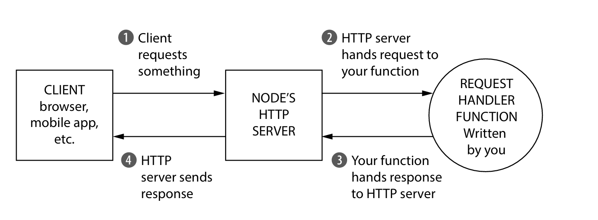
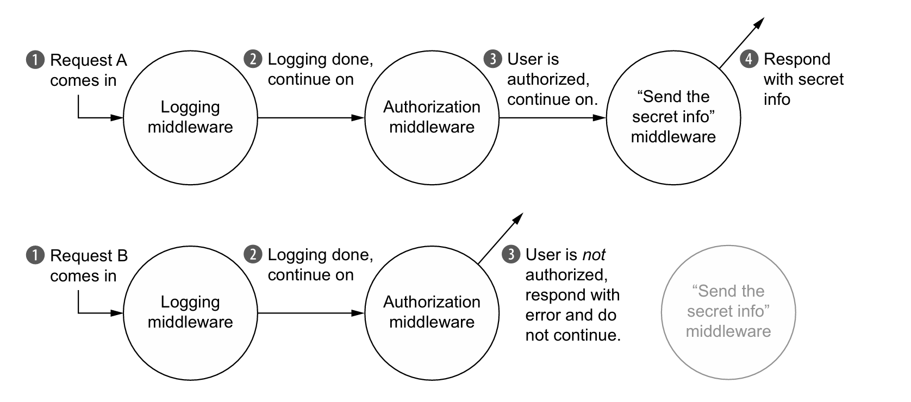
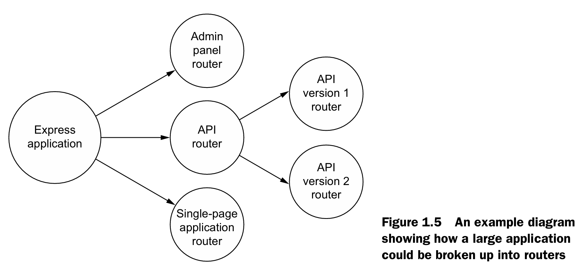
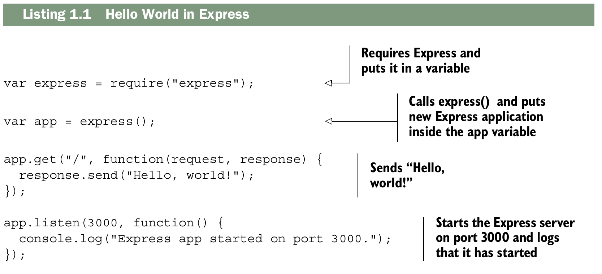

# What is express?
Este capítulo abarca:

- __Node.js, una plataforma JavaScript que se utiliza habitualmente para ejecutar JavaScript en servidores.__
- __Express, un framework que se ejecuta sobre el servidor web de Node.js y facilita su uso.__
- __Middleware y enrutamiento, dos características de Express.__
- __Funciones de manejo de solicitudes.__
  
Node.js surgió en 2009 con una idea revolucionaria: tomar el motor V8 de Google Chrome —conocido por su velocidad— y llevarlo fuera del navegador para ejecutar JavaScript en servidores. Hasta ese momento, JavaScript vivía exclusivamente en el navegador, donde los desarrolladores no tenían otra opción que usarlo. Con Node.js, JavaScript se convirtió en una alternativa real frente a lenguajes como Ruby, Python, Java o C# para el desarrollo del lado del servidor.

Las ventajas de Node.js son varias: el motor V8 es muy rápido, fomenta un estilo de programación asíncrono que evita los problemas del multihilo, cuenta con una gran cantidad de librerías gracias a la popularidad previa de JavaScript, y sobre todo, permite compartir código entre el cliente y el servidor, eliminando el cambio de contexto mental que antes sufrían los desarrolladores al pasar de uno a otro.

Sin embargo, aunque Node.js ofrece todo lo necesario para construir aplicaciones, sus APIs nativas son de bajo nivel: verbosas, complejas y limitadas. Los desarrolladores se veían obligados a escribir mucho código repetitivo solo para tareas básicas.

Para resolver esto nació Express, un framework que actúa como una capa ligera sobre Node.js. Su filosofía es muy similar a la de jQuery en el navegador: así como jQuery simplificó las APIs del DOM y redujo el código boilerplate en el frontend, Express hace exactamente lo mismo para el desarrollo web con Node.js. Simplifica sus APIs, agrega funcionalidades útiles y permite construir aplicaciones web de forma más cómoda y eficiente.
Finalmente, Express no es rígido ni impone decisiones sobre la arquitectura de las aplicaciones. Es extensible por diseño, pensado para integrarse fácilmente con librerías y módulos de terceros, dando al desarrollador la libertad de construir sus proyectos como mejor le convenga.

## What is this Node.js business?
Node.js es una plataforma que permite ejecutar JavaScript fuera del navegador. Durante la mayor parte de su historia, JavaScript estuvo confinado a los navegadores web, pero en realidad no hay nada en el lenguaje que lo obligue a vivir ahí. Es un lenguaje de programación como cualquier otro, como Ruby, Python o Java, y por lo tanto puede ejecutarse en otros entornos. Node.js hace exactamente eso: toma JavaScript y lo ejecuta en servidores. El texto lo explica con una analogía simple: así como ejecutas un archivo de Python escribiendo python myfile.py, con Node.js simplemente escribes node myfile.js. Sus creadores tomaron el motor de JavaScript del navegador y lo convirtieron en una herramienta independiente.
Una vez que puedes correr JavaScript en el servidor, puedes hacer prácticamente todo lo que cualquier otro lenguaje de programación permite. Sin embargo, su uso principal sigue siendo el desarrollo web del lado del servidor.

En cuanto a su velocidad, el texto explica que Node.js es rápido por dos razones. La primera es el motor V8 de Google Chrome, famoso por ser extremadamente veloz y capaz de procesar miles de instrucciones por segundo. La segunda razón es su naturaleza asíncrona, que le permite manejar múltiples tareas de forma eficiente sin bloquearse. El autor usa una analogía muy ilustrativa para explicarlo: cuando horneas muffins, no tienes que quedarte parado frente al horno esperando a que terminen. Mientras se hornean, puedes preparar más masa, leer un libro o hacer cualquier otra cosa. Node.js funciona igual: mientras espera la respuesta de una base de datos para atender una solicitud, puede comenzar a procesar otra solicitud al mismo tiempo. El código no hace dos cosas en paralelo, pero tampoco se queda bloqueado esperando.

El autor también aclara una limitación importante: Node.js es muy eficiente con un solo núcleo de CPU, pero no sobresale cuando se trata de aprovechar múltiples núcleos al mismo tiempo. Otros lenguajes sí permiten hacer verdaderamente dos cosas a la vez, como tener varios hornos para hornear más muffins simultáneamente. Node.js está comenzando a soportar esa funcionalidad, pero no es su punto fuerte.

Sin embargo, el autor deja claro que el rendimiento no es la razón más importante para elegir Node.js. Aunque suele ser más rápido que lenguajes como Ruby o Python, su ventaja más poderosa es que permite usar un único lenguaje de programación tanto en el frontend como en el backend. Antes de Node.js, un desarrollador web tenía que dominar JavaScript para el navegador y otro lenguaje completamente distinto para el servidor, con sus propias tecnologías, paradigmas y librerías. Con Node.js, esa barrera desaparece: un desarrollador de backend puede entender y trabajar en el código del frontend y viceversa, sin necesidad de cambiar de mentalidad ni de herramientas.

Esta filosofía de JavaScript en todas partes fue tan influyente que llevó a la creación del stack `MEAN`, una combinación de tecnologías completamente basadas en JavaScript: `MongoDB` como base de datos, `Express` como framework de servidor, `Angular`.js como framework de frontend y `Node.js` como entorno de ejecución. Este stack es un ejemplo claro de cómo se puede construir una aplicación web completa sin salir nunca del ecosistema JavaScript.

Finalmente, el texto refuerza la credibilidad de Node.js mencionando que grandes empresas como Walmart, BBC, LinkedIn y PayPal lo han adoptado en sus sistemas, demostrando que no se trata de una tecnología experimental o de juguete, sino de una herramienta robusta y confiable para aplicaciones a escala empresarial.

## The functionality in Node.js
Cuando creas una aplicación web (más precisamente, un servidor web) en Node.js, escribes una única función JavaScript para toda la aplicación. Esta función escucha las solicitudes de un navegador web, de una aplicación móvil que consume tu API o de cualquier otro cliente que se comunique con tu servidor. Cuando llega una solicitud,
esta función la analiza y determina cómo responder. Si, por ejemplo,
visitas la página de inicio en un navegador web, esta función podría determinar que deseas la página de inicio y devolver un código HTML. Si envías un mensaje a un punto final de la API, esta función podría determinar qué deseas y responder con JSON (por ejemplo).

Imagina que estás creando una aplicación web que informa a los usuarios la hora y la zona horaria del
servidor. Funcionaría así:

- Si el cliente solicita la página de inicio, tu aplicación devolverá una página HTML que muestra la hora.
- Si el cliente solicita algo más, su aplicación devolverá un error HTTP 404 ("No encontrado") y un texto explicativo.
Si estuviera desarrollando su aplicación con Node.js sin Express, una solicitud del cliente a su servidor podría verse como en la figura.

La función JavaScript que procesa las solicitudes del navegador en tu aplicación se llama controlador de solicitudes. No tiene nada de especial; es una función JavaScript que recibe la solicitud, determina qué hacer y responde. El servidor HTTP de Node.js gestiona
la conexión entre el cliente y tu función JavaScript para que no tengas que
manejar protocolos de red complejos.

En código, es una función que recibe dos argumentos: un objeto que representa la request y un objeto que representa la response. En tu aplicación de hora/zona horaria, la función controladora de solicitudes podría verificar la URL que el cliente está solicitando.
Si solicita la página de inicio, la función controladora de solicitudes debería responder con la hora actual en una página HTML. De lo contrario, debería responder con un error 404.

Todas las aplicaciones Node.js funcionan así: con una única función controladora de solicitudes que responde a las solicitudes. Conceptualmente, es bastante simple.

El problema es que las API de Node.js pueden ser complejas. ¿Quieres enviar un solo archivo JPEG? Eso requerirá unas 45 líneas de código. ¿Quieres crear plantillas HTML reutilizables? Averigua cómo hacerlo tú mismo. El servidor HTTP de Node.js es potente, pero le faltan muchas
funciones que podrías necesitar si estuvieras desarrollando una aplicación real. Express nació para facilitar la creación de aplicaciones web con Node.js.

## Express’s minimal philosophy
Express es un framework minimalista y poco opinado, lo que quiere decir que no te impone una estructura rígida ni te obliga a hacer las cosas de una única manera. Esta característica lo hace extremadamente flexible y versátil: puedes usarlo para construir desde una API sencilla hasta una aplicación de videochat, un blog, una tienda en línea o prácticamente cualquier otro tipo de proyecto web. Esa libertad es uno de sus mayores atractivos.

Una consecuencia directa de ese minimalismo es que Express rara vez se usa solo. En aplicaciones de cualquier tamaño, casi siempre terminas integrando una gran cantidad de librerías de terceros para cubrir funcionalidades que Express no incluye por defecto. Esto no es un defecto del framework, sino parte de su filosofía: en lugar de darte todo empaquetado, te deja elegir exactamente las herramientas que necesitas, sin agregar peso innecesario a tu aplicación. El resultado es un proyecto más limpio, donde el desarrollador entiende cada parte de lo que está construyendo. Esta filosofía está muy alineada con el principio clásico del mundo Unix de __hacer una sola cosa y hacerla bien.__

Sin embargo, la flexibilidad que Express ofrece viene acompañada de una mayor responsabilidad para el desarrollador. Al no haber convenciones estrictas, cada desarrollador puede tomar decisiones distintas sobre la arquitectura de su aplicación. Dos programadores trabajando con Express en proyectos similares pueden terminar con estructuras completamente diferentes, lo cual puede generar inconsistencias, especialmente en equipos grandes.

Además, al no incluir muchas funcionalidades de forma nativa, el desarrollador debe invertir tiempo buscando los módulos de terceros adecuados para cada necesidad. A veces esa búsqueda es sencilla porque hay una librería claramente superior que toda la comunidad usa. Pero otras veces es frustrante, porque existen varias opciones mediocres o ninguna que destaque claramente, y elegir mal puede traer problemas más adelante. Un framework más grande y completo simplemente te da esas herramientas desde el principio, ahorrándote ese tiempo y esa incertidumbre.

El caso de PayPal es un ejemplo muy ilustrativo de esta limitación. A PayPal le gusta Express y lo usa como base, pero al tener muchos desarrolladores trabajando en sus proyectos, la falta de convenciones se volvió un problema. Por eso construyeron su propio framework encima de Express, uno que impone reglas más estrictas y garantiza que todos los desarrolladores sigan las mismas prácticas. Esto demuestra que para ciertos contextos, especialmente equipos grandes o empresas con muchos proyectos en paralelo, la rigidez que Express no ofrece puede ser necesaria y hasta deseable.

A veces, reviso mis aplicaciones de Express (cuando aún estaba aprendiendo) y pienso: "¿Por qué hice las cosas de esta manera?".
Para escribir menos código, terminas buscando los paquetes de terceros adecuados. A veces es fácil: hay un módulo que a todos les encanta, y a ti también, y 0es la combinación perfecta. Otras veces es más difícil elegir, porque hay muchos que son aceptables o pocos que son realmente buenos. Un framework más grande puede ahorrarte tiempo y quebraderos de cabeza, y simplemente usarás lo que te ofrecen.
No hay una respuesta correcta, y este libro no pretende debatir quién es el mejor framework en la batalla entre frameworks grandes y pequeños. Pero lo cierto es que Express es un framework minimalista, ¡para bien o para mal!

## The core parts of Express
Bien, entonces Express es minimalista y simplifica Node.js para que sea más fácil de usar. ¿Cómo lo hace?
En esencia Express tiene cuatro caracteristicas principales:  middleware,
routing, subapplications, and conveniences.

### Middleware
Como viste anteriormente, Node.js puro te proporciona una función de manejo de solicitudes con la que trabajar. La solicitud llega a tu función y la respuesta sale de tu funcion.

El término _Middleware_ no es el más adecuado, pero no es exclusivo de Express y lleva tiempo utilizándose. La idea es bastante simple, en vez de usar una funcion de manejo de solicitudes monolitica _(una función que hace demasiadas cosas a la vez)_, puedes llamar a __varias__ funciones manejadoras de solicitud, donde cada una se encarga de un pedazo pequeño del trabajo. Estas funciones manejadoras de solicitudes mas pequeñas, se llaman _middleware functions_, o _middleware_. 

La primera funcion middleware que podrias usar en una aplicacion es un rgistrador, que registra las solicitudes entrantes en el servidor. Cuando el registrador a terminado de registrar, continuara con el siguiente middleware en la cadena. El siguienre middleware podria autenticar usuarios y si estan visitando una URL prohibida podria responder con un "pagina no autorizada". Si ellos tiene permitido visitarla entonces pueden continuar a la siguiente funcion en la cadena. the next function might send the home page. An illustration of two possible options shows below.

One of the biggest features of middleware is that it's relatively standardized which mean that lots of people have develop middlewares for Express. That mean that if you can dream up middleware, someone has probably already made it. 

### Routing
El enrutamiento, al igual que el middleware, divide la función de manejo de solicutudes monolitica en partes más pequeñas. A diferencia del middleware, estas funciones de gestión de solicitudes __se ejecutan de forma condicional__, dependiendo de la URL y el método HTTP que envíe el cliente.
El Routing te permite segmentar el comportamiento de tu aplicacion segun la ruta. El comportamiento de estas rutas, al igual que el middleware, se define en las funciones de manejo de solicitud.

### Subapplications
Las aplicaciones en express pueden frecuentemente ser muy pequeñas, incluso caber en un solo archivo. A medida que tu aplicacion crece necesitaras dividirla en multiples carpetas y archivos. Express no te impone una estructura de como escalar una aplicacion, pero te provee una caracteristica importante super util: __subapplications__ En la jerga de express estas miniaplicaciones de llaman __enrutadores (routers)__

Express te permite usar routers que pueden ser usados en aplicaciones grandes. Escribir estas subaplicaciones es casi idéntico a escribir aplicaciones de tamaño normal, pero te permite dividir aun mas la aplicacion en partes mas pequeñas.

Esta función no destaca realmente hasta que tus aplicaciones crecen, pero cuando lo hacen, resulta extraordinariamente útil.

### Conveniences
Las aplicaciones Express se componen de middleware y routes, en ambos casos tendrás que escribir funciones manejadoras de solicitudes, ¡así que tendrás que hacerlo mucho!

Para facilitar la escritura de estas funciones de manejo de solicitudes, Express ha añadido una serie de ventajas. En Node.js puro, si quieres escribir una función de manejo de solicitudes que envíe un archivo JPEG desde una carpeta, eso requiere bastante código. En Express, solo se necesita una llamada al método sendFile. Express cuenta con numerosas funcionalidades para renderizar HTML con mayor facilidad; Node.js no ofrece ninguna. También incluye multitud de funciones que facilitan el análisis de las solicitudes entrantes, como la obtención de la dirección IP del cliente. A diferencia de las características anteriores, estas ventajas no cambian conceptualmente la forma en que organizas tu aplicación, pero pueden ser de gran ayuda.

## The ecosystem surrounding Express
Express, como cualquier herramienta, no existe en un vacío. Se integra en el ecosistema de Node.js, por lo que dispones de una gran cantidad de módulos de terceros que pueden ayudarte, como interfaces con bases de datos. Gracias a la extensibilidad de Express, muchos desarrolladores han creado módulos de terceros que funcionan bien con Express (en lugar de con Node.js en general), como middleware especializado o métodos para generar HTML dinámico.

### Express vs. other web application frameworks
Express no es el primer framework web ni será el último en el mundo de Node.js. Su principal competidor es Hapi.js, un framework maduro y relativamente pequeño que ofrece routing y funcionalidades similares a middleware, pero con una arquitectura distinta. Hapi.js es usado por empresas como Mozilla, OpenTable y el registro de npm. Por otro lado, frameworks más grandes como Meteor son full-stack y tienen una estructura estricta, a diferencia de Express, que solo se enfoca en la capa HTTP y es completamente no opinionado.

Algunos desarrolladores han creado frameworks sobre Express para agregar funcionalidades adicionales. Por ejemplo, Kraken, desarrollado por PayPal, configura seguridad, middleware y otros ajustes predeterminados de la aplicación. Otro ejemplo es Sails.js, que añade bases de datos, integración con WebSockets, generadores de API y pipelines de assets. Estos frameworks son más opinionados por diseño, a diferencia de la flexibilidad que ofrece Express.

Express también se destaca por su sistema de middleware, compatible con Connect, lo que permite usar una gran cantidad de módulos de terceros. Esto amplía significativamente las capacidades de cualquier aplicación construida con Express sin sacrificar la ligereza y la simplicidad del framework.

En cuanto a su inspiración, Express sigue la línea de frameworks minimalistas como Sinatra en Ruby, así como Bottle y Flask en Python. No se parece a frameworks más grandes y estructurados como Django, Rails, ASP.NET o Play, ni está tan ligado al HTML como PHP. En resumen, Express no es “mejor” ni “peor” que otros frameworks; es una opción ligera, flexible y rápida gracias a Node.js, dejando al desarrollador la responsabilidad de tomar decisiones sobre la estructura y funcionalidades de la aplicación.

### What Express is used for

En teoría, Express puede usarse para construir cualquier aplicación web, ya que puede procesar solicitudes entrantes y generar respuestas, al igual que otros frameworks mencionados. Una de sus principales ventajas es que permite compartir código JavaScript entre el cliente y el servidor. Esto no solo simplifica el desarrollo al poder ejecutar el mismo código en ambos lados, sino que también facilita la transición mental entre tareas de front-end y back-end. Un desarrollador de front-end puede escribir código de back-end sin aprender un lenguaje completamente nuevo, y viceversa, haciendo que la curva de aprendizaje sea más amigable para quienes ya manejan JavaScript.

Este enfoque de usar JavaScript en toda la pila ha dado origen al conocido MEAN stack, compuesto por MongoDB, Express, Angular y Node.js. Al igual que LAMP representa Linux, Apache, MySQL y PHP, MEAN se aprecia por permitir un desarrollo full-stack en JavaScript, aprovechando sus beneficios de consistencia y eficiencia. Express es clave en este stack, ya que permite manejar tanto la parte de servidor como la construcción de APIs, lo que lo hace ideal para aplicaciones de una sola página (SPAs), que dependen en gran medida de JavaScript en el front-end y usualmente requieren un servidor para servir archivos y APIs REST.

Express es flexible y no impone restricciones sobre la elección de otras tecnologías: puedes usar Backbone.js en lugar de Angular, SQL en lugar de MongoDB, creando variaciones del stack según tus necesidades (por ejemplo, MEBN o SEAN). En el contexto de este libro, se utilizará MongoDB junto con Express y Node.js, formando el MEN stack. Además, Express se integra bien con características en tiempo real, como WebSocket y WebRTC, aprovechando las capacidades de Node.js para soportar aplicaciones que requieren interacción en tiempo real de manera eficiente.

### Third-party modules for Node.js and Express
Los primeros capítulos del libro se enfocan en el núcleo de Express, principalmente en rutas y middleware, que son las funciones básicas del framework. Sin embargo, más de la mitad del contenido se dedica a mostrar cómo integrar Express con módulos de terceros, aprovechando su flexibilidad. Algunos módulos están diseñados específicamente para Express y se integran fácilmente con sus rutas y middleware, mientras que otros, aunque no sean específicos de Express, funcionan perfectamente en Node.js y por ende también con Express.

Express incluye algunas funciones básicas para renderizar HTML, aunque no trae ningún motor de plantillas incorporado. Funciona bien con casi todos los motores de plantillas basados en Node.js. En el libro se exploran dos ejemplos: EJS, que se asemeja al HTML tradicional, y Pug, que propone una sintaxis más radical. Esto permite que los desarrolladores puedan elegir la herramienta que más les convenga sin estar limitados por el framework.

En cuanto al almacenamiento de datos, Express no impone ningún sistema de base de datos; puedes usar archivos, bases SQL o cualquier otro mecanismo. El libro se centra en MongoDB, pero Express permite sustituirlo por cualquier otra opción según las necesidades del proyecto. Además, existen múltiples librerías y módulos para reforzar la seguridad de las aplicaciones Express, y se dedica un capítulo a cómo probar y asegurar que el código sea robusto y confiable.

Es importante recordar que no existen “módulos de Express” como tal; todos son simplemente módulos de Node.js. Algunos se integran bien con Express, otros pueden coexistir sin problemas. En esencia, Express es un módulo de Node.js más, con la ventaja de ofrecer rutas y middleware listos para construir aplicaciones web de manera flexible y extensible.

## The obligatory Hello World
Veamos una de las aplicaciones Express más sencillas que puedes crear: «Hola Mundo». Profundizaremos en este tema con mucho más detalle a lo largo del libro, así que no te preocupes si no lo entiendes todo ahora mismo. Aquí tienes «Hola Mundo» en Express.

Una vez más, si no lo entiendes todo, no te preocupes. Pero quizás puedas ver que estás creando una aplicación Express, definiendo una ruta que responde con «¡Hola, mundo!» e iniciando tu aplicación en el puerto 3000. Hay algunos pasos que debes seguir para ejecutarla; todo esto quedará claro en los próximos capítulos. Pronto descubrirás todos los secretos de Express.

## Summary

- Node.js es una herramienta potente para desarrollar aplicaciones web, pero puede resultar engorroso. 
- Express se creó para simplificar este proceso. Express es un framework minimalista, flexible y sin restricciones.
- Express cuenta con algunas características clave:
  - Middleware, que permite dividir la aplicación en partes más pequeñas. Generalmente, el middleware se ejecuta secuencialmente. 
  - El enrutamiento divide la aplicación en funciones más pequeñas que se ejecutan cuando el usuario visita un recurso específico; por ejemplo, mostrar la página de inicio cuando el usuario solicita la URL de la página de inicio. 
  - Los enrutadores pueden dividir aún más las aplicaciones grandes en subaplicaciones más pequeñas y componibles.
- La mayor parte del código Express consiste en escribir funciones de manejo de solicitudes, y Express ofrece varias ventajas al escribirlas.