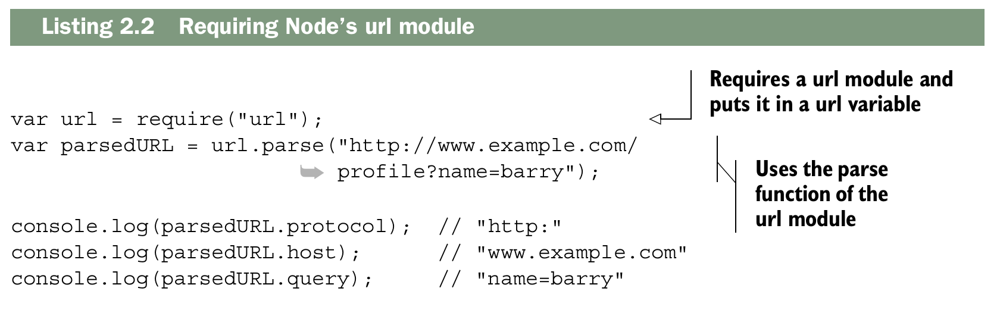
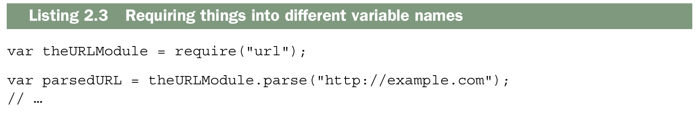
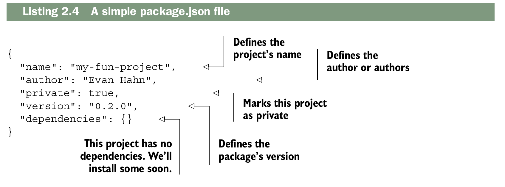
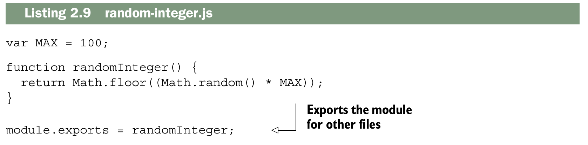
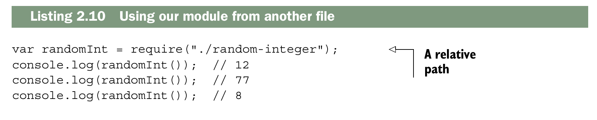
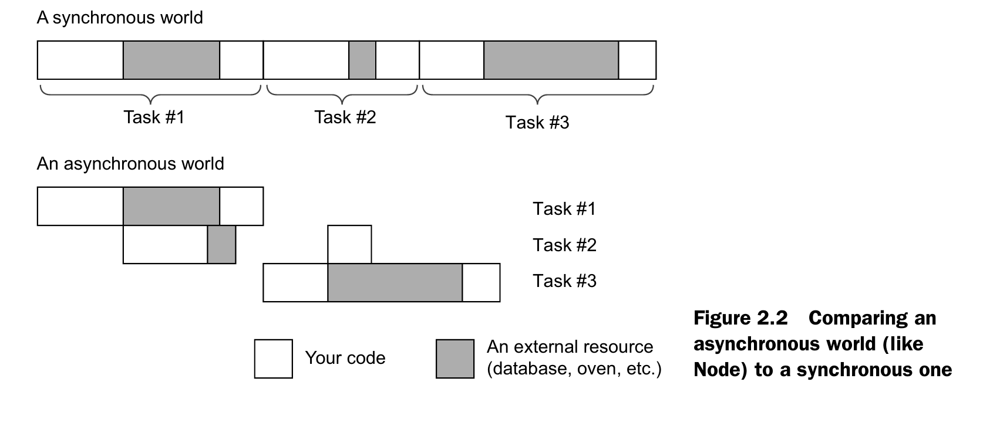
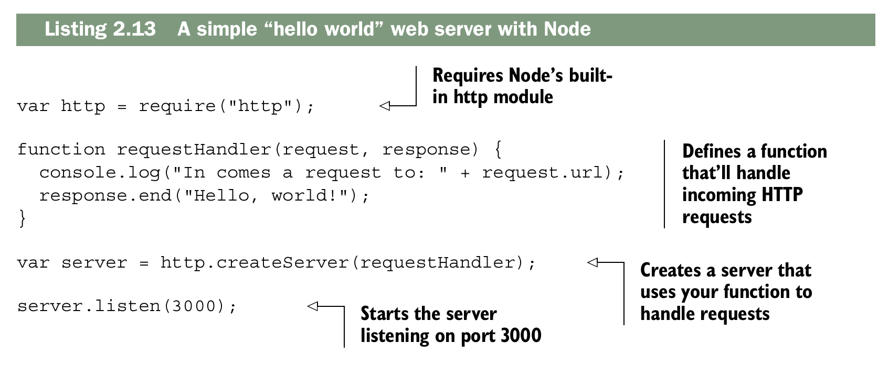

# The basics of Node.js
Este capítulo abarca:

- [x] __Instalación de Node.js y uso de su sistema de módulos__
- [x] __Uso de package.json para describir los metadatos de tu proyecto__
- [x] __Uso de npm para instalar paquetes con npm install__
- [x] __Realizar dos tareas simultáneamente con Node__
- [x] __Uso del módulo http integrado de Node para crear un servidor web sencillo__

En el capítulo 1, se presenta Node.js, destacando que es JavaScript, funciona de manera asíncrona y cuenta con un amplio conjunto de módulos de terceros. El objetivo es ofrecer una introducción breve y clara a Node, especialmente para quienes no lo entendieron del todo al comenzar.

Se asume que el lector ya tiene un conocimiento sólido de JavaScript y que maneja la línea de comandos, por lo que el capítulo no profundiza en todos los detalles de Node, sino que ofrece una visión general rápida para empezar a trabajar con él. Para quienes quieran una guía más extensa, se recomienda el libro Node.js in Action de Mike Cantelon y otros.

El capítulo busca preparar al lector para empezar a instalar y usar Node de manera práctica, sin abrumarlo con demasiada teoría.

## Using modules
La mayoría de los lenguajes de programación tienen una forma de
incluir el código del archivo A desde el archivo
B para que puedas dividir tu código en varios archivos. C y C++ tienen `#include`; Python tiene `import`; Ruby y PHP tienen `require`. Algunos lenguajes, como C#, realizan este tipo de comunicación entre archivos de forma implícita en tiempo de compilación.
Durante la mayor parte de su existencia, JavaScript no tuvo una forma oficial de hacerlo.

Para solucionar este problema, se crearon herramientas que concatenaban archivos JavaScript en un solo archivo,
o se crearon gestores de dependencias como RequireJS. Muchos desarrolladores web simplemente llenan sus páginas web con etiquetas `<script>`.

Node buscaba solucionar este problema de forma elegante, y sus desarrolladores implementaron un sistema de módulos estándar llamado `CommonJS`. En esencia, CommonJS permite incluir código de un archivo en otro.
Este sistema de módulos consta de tres componentes principales: __requerir módulos integrados__, __requerir módulos de terceros__ y __crear módulos propios__. Veamos cómo funcionan.

### Requiring built-in modules
Node cuenta con varios módulos integrados, desde el acceso al sistema de archivos en un módulo llamado `fs` hasta funciones de utilidad en otro módulo integrado llamado `util`.

Una tarea común al crear aplicaciones web con Node es analizar la URL.
Cuando un navegador envía una solicitud a tu servidor, pide una URL específica, como la página de inicio o la página "Acerca de". Estas URL se reciben como cadenas de texto, pero a menudo querrás analizarlas para obtener más información. Node tiene un módulo analizador de URL integrado; vamos a usarlo para ver cómo importar paquetes.

El módulo `url` integrado de Node expone algunas funciones, pero la más importante es la llamada `parse`. Esta función toma la cadena de texto de la URL y extrae información útil, como el dominio o la ruta.

Utilizarás la función `require` de Node para usar el módulo url. `require` es similar a palabras clave como `import` o `include` en otros lenguajes. `require` toma el nombre de un paquete como argumento de cadena de texto y devuelve el paquete. 

El objeto que se devuelve no tiene nada de especial; suele ser un objeto, pero también podría ser una función, una cadena de texto o un número. El siguiente ejemplo muestra cómo usar el módulo `url`.



En este ejemplo, `require("url")` devuelve un objeto que tiene la función `parse` incorporada. Luego puedes usarlo como cualquier otro objeto.

Generalmente, al requerir un módulo, se usa una variable con el mismo nombre que el módulo que se esta requiriendo. Pero no es necesario. Podrías haberlo guardado en una variable con un nombre diferente, si lo hubieras deseado. 



Es una convención informal dar a las variables el mismo nombre que a la variable que se está utilizando para evitar confusiones, pero no hay nada que lo imponga en el código.

### Requiring third-party modules with package.json and npm

Node incluye varios módulos integrados, pero generalmente no son suficientes para crear aplicaciones completas, por lo que los paquetes de terceros son indispensables. Cada proyecto de Node se organiza en una carpeta que contiene un archivo llamado package.json, donde se define la metadata del proyecto (nombre, autor, versión) y sus dependencias. Este archivo es esencial, ya que permite gestionar los módulos que tu proyecto necesita.



Para instalar dependencias se utiliza npm (Node Package Manager), que se instala junto con Node. npm gestiona la descarga y organización de módulos dentro de la carpeta node_modules, y con la opción `--save` actualiza automáticamente el package.json con las dependencias instaladas. Esto permite que otros desarrolladores puedan instalar fácilmente todas las dependencias de un proyecto con solo ejecutar `npm install.`

!!! note

    En npm 5 y posteriores, __--save__ ya no es estrictamente necesario, porque npm guarda las dependencias automáticamente en package.json cuando instalas un módulo. Pero todavía se usa en ejemplos por claridad histórica.

Por ejemplo, si queremos usar el módulo Mustache para plantillas, se ejecuta `npm install mustache --save` desde la raíz del proyecto. Esto crea la carpeta node_modules con la ultima version de Mustache dentro y agrega la dependencia en package.json. Luego, en el código podemos usarlo como cualquier módulo interno, mediante `require("mustache")`, y aprovechar sus funciones, como convertir plantillas en cadenas de texto dinámicas.

Además, npm permite instalar versiones específicas de módulos, modificar manualmente package.json o incluso instalar desde fuentes distintas al registro oficial. Esto da mucha flexibilidad para gestionar dependencias y mantener la portabilidad del proyecto.

### Defining your own modules
En Node.js no solo puedes usar módulos de terceros, sino también crear tus propios módulos. Por ejemplo, si quieres una función que devuelva un número entero aleatorio entre 0 y 100, la escribirías como en un navegador, pero en Node necesitas exportarla para que otros archivos puedan usarla. Esto se hace con module.exports.

Un ejemplo sería guardar la función en un archivo llamado random-integer.js y terminarlo con:


Esto indica que el módulo exporta la función `randomInteger`, mientras que variables internas como MAX permanecen privadas al módulo. Cabe destacar que`module.exports` puede ser cualquier tipo de dato que puedas agregarle a una variable: función, objeto, string, número o array.

Para usar tu módulo desde otro archivo, basta con hacer un require con la ruta relativa:



Puedes ejecutar este código como cualquier otro, ejecutando `node print-three-random integers.js`. Si todo se hizo correctamente, imprimirá tres números aleatorios entre 0 y 100.

Si intentas ejecutar `node random-integer.js`, notarás que no
parece hacer nada. Exporta un módulo, pero definir una función no significa que la función se ejecutará e imprimirá algo en la pantalla.

!!! note

    Esto cubre solo módulos locales dentro de un proyecto. Para publicar paquetes abiertos en npm, hay guías específicas en línea.

## Node: an asynchronous world

Node.js funciona de manera asíncrona, lo que significa que puede iniciar tareas y, mientras espera que recursos externos terminen, continuar con otras operaciones. El libro usa la analogía de hornear muffins: mientras los muffins están en el horno, no estás ocupado directamente con ellos y puedes hacer otras cosas, como salir a correr. De manera similar, cuando Node solicita un archivo grande o procesa una petición de red, no se bloquea, sino que sigue ejecutando otras tareas mientras espera la respuesta de ese recurso externo.



Los recursos externos más comunes con los que tranajaras en Node y Express son:

- Sistema de archivos: leer y escribir archivos en disco.
- Red: recibir solicitudes, enviar respuestas o hacer peticiones HTTP.

## Building a web server with Node: the http module
Para entender Express, es importante comprender el módulo http de Node.js, porque Express se construye sobre él. Este módulo permite crear servidores web en Node y también tiene funciones para hacer solicitudes a otros servidores.

El componente principal que se usa para servidores es http.createServer. Esta función recibe un callback que se ejecuta cada vez que llega una solicitud al servidor y devuelve un objeto servidor.



El código de ejemplo del servidor se divide en cuatro partes principales. La primera parte requiere el módulo http y lo almacena en una variable llamada http. Esto es igual a cómo se requieren otros módulos como url o fs.

Luego, se define una función manejadora de solicitudes (request handler). Estas funciones son clave en Node y Express. Siempre reciben dos argumentos:

- req (request), que representa la solicitud y contiene información como la URL pedida, el tipo de navegador (user-agent), etc.
- res (response), que representa la respuesta que vamos a enviar; sobre este objeto llamamos métodos para enviar los datos al cliente.

El resto del código apunta el servidor HTTP incorporado de Node hacia la función manejadora y lo inicia en el puerto 3000. Esto hace que cada solicitud que llegue sea procesada por esa función, enviando la respuesta adecuada.

> Si quieres usar HTTPS, Node también incluye un módulo llamado https, muy parecido a http. Crear un servidor HTTPS es casi idéntico, y cambiarlo después es rápido si ya conoces cómo funciona. Para un inicio básico, no es necesario preocuparse demasiado por HTTPS.

Si quisieras diferenciar respuestas según la URL, podrías analizar req.url en tu función manejadora de solicitudes. Por ejemplo:

```js title="Function Handler" linenums="1"
function requestHandler(req, res) {
  if (req.url === "/") {
    res.end("Welcome to the homepage!");
  } else if (req.url === "/about") {
    res.end("Welcome to the about page!");
  } else {
    res.end("Error! File not found.");
  }
}
```
Con este código, el servidor respondería distinto según la ruta solicitada: la raíz `(/)` muestra la página de inicio, `/about` muestra la página “about” y cualquier otra URL genera un mensaje de error.

Podrías imaginarte construir todo un sitio web con esta única función de gestión de solicitudes. Para sitios muy pequeños, esto podría ser fácil, pero esta función podría volverse enorme y difícil de manejar rápidamente. Quizás necesites un framework que te ayude a limpiar este servidor HTTP; ¡Las cosas podrían complicarse! Ahí es donde entra Express.

## Summary

- Hay varias maneras de instalar Node. Recomiendo usar un gestor de versiones para poder cambiar de versión y actualizar fácilmente según sea necesario.
- El sistema de módulos de Node utiliza una función global llamada `require` y un objeto global llamado `module.exports`. Ambos conforman un sistema de módulos sencillo.
- Puedes usar npm para instalar paquetes de terceros desde el registro de npm.
- Node.js tiene E/S basada en eventos. Esto significa que cuando ocurre un evento (como una solicitud web entrante), se llama a una función (o un conjunto de funciones).
- Node tiene un módulo integrado llamado `http`. Es útil para crear aplicaciones web.