# Foundations of Express
Este capítulo abarca:

__Las cuatro características principales de Express:__ 

  - __Middleware para permitir que una solicitud fluya a través de múltiples encabezados__
  - __Enrutamiento para gestionar una solicitud en un punto específico__
  - __Métodos y propiedades de conveniencia__ 
  - __Vistas para la representación dinámica de HTML__

Aunque puedes crear servidores web completos solo con el módulo http integrado de Node, quizás no te convenga. Como comentamos en el capítulo 1 y como viste en el capítulo 2, la API que expone el módulo http es bastante básica y no te facilita mucho el trabajo.
Aquí es donde entra Express: es un útil módulo de terceros (es decir, no viene incluido con Node). En esencia, Express es una capa de abstracción sobre el servidor HTTP integrado de Node. En teoría, podrías escribir todo con Node puro y sin usar Express. Pero como verás, Express simplifica mucho las partes difíciles y dice: «No te preocupes; no tienes que lidiar con esta parte complicada. ¡Yo me encargo!». En otras palabras, ¡es magia!

A grandes rasgos, Express ofrece cuatro características principales, que aprenderás en este capítulo:

__Middleware__: A diferencia de Node estándar, donde las requests pasan a través de una sola función, Express cuenta con una pila de middleware, que es básicamente un conjunto de funciones.

__Enrutamiento__: El enrutamiento es muy similar al middleware, pero las funciones se ejecutan solo cuando se visita una URL específica con un método HTTP determinado. Por ejemplo, se podría ejecutar un controlador de solicitudes solo cuando el navegador visita yourwebsite.com/about.

__Extensiones para objetos de solicitud y respuesta__: Express amplía los objetos de solicitud y respuesta con métodos y propiedades adicionales para mayor comodidad del desarrollador.

__Vistas__: Las vistas permiten renderizar HTML dinámicamente. Esto permite modificar el HTML sobre la marcha y escribirlo en otros lenguajes.

## Middleware
Una de las caracteristica mas importates de Express se llama middlewares. El middleware es muy similar a las _request handler function_ (es decir, aceptan una request y enviar una response), pero tiene una diferencia importante: en lugar de tener una sola _request handler function_, Express permite que se ejecuten/encadenen  _varias_ request handler functions en secuencia que permita manejar la misma solicitud. 

### Hello World with Express
Vamos a configurar un nuevo proyecto Express. Crea un nuevo directorio y coloca dentro un archivo llamado package.json. Recuerda que package.json es donde se almacena la información sobre un proyecto Node. Contiene datos básicos como el nombre y el autor del proyecto, y también información sobre sus dependencias. Comienza con un archivo package.json básico, como se muestra en el siguiente listado.

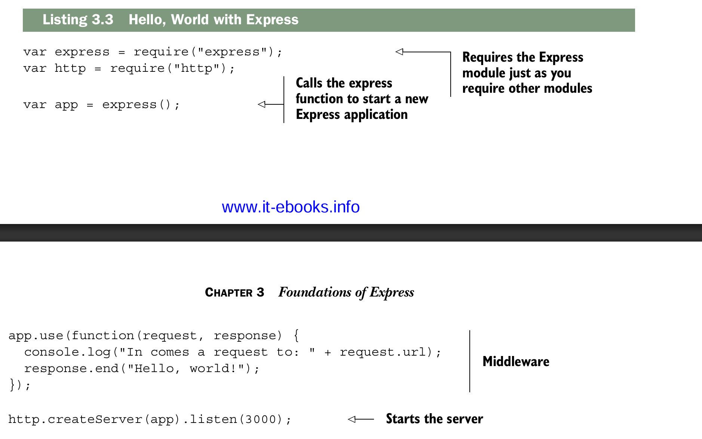

Ahora vamos a analizar esto paso a paso. 

- Primero, necesitas Express. 
- Luego, necesitas el módulo http de Node.
- Después, creas una variable llamada `app`, como antes, pero en lugar de crear el servidor, llamas a `express()`, que devuelve una función de manejo de solicitudes. Esto es importante: significa que puedes pasar el resultado a `http.createServer` como antes.

¿Recuerdas el manejador de solicitudes que teníamos en el capítulo anterior, con Node básico? Se veía así

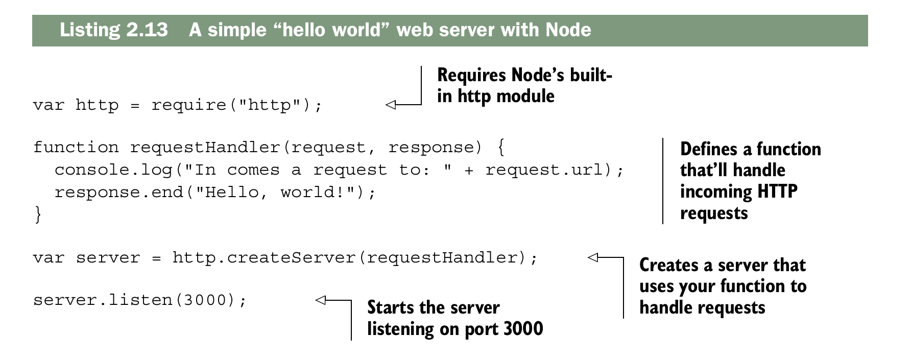

En este ejemplo tenemos una función similar (de hecho, la copié y pegué). También se le pasan un objeto de solicitud y un objeto de respuesta, y se interactúa con ellos de la misma manera.

A continuación, creas el servidor y comienzas a escuchar. Recuerda que `http.createServer` tomaba una función antes, así que adivina qué: `app` es simplemente una función. Es un manejador de solicitudes creado por Express que comienza a recorrer todo el middleware hasta el final. Al final del día, es simplemente una función de manejador de solicitudes como antes.

### Otra explicacion breve del middleware
1️⃣ Qué es Express y de dónde viene app

Primero, debes entender que Express es un framework de Node.js que sirve para crear servidores web y APIs de forma más sencilla que usando solo Node.
Cuando instalas Express y lo importas:
```js
import miExpress from "express"
```
- `miExpress` es una función nombrada.
- Si la ejecutas, creas un objeto servidor, que representa tu servidor Express:
```js
const servidor = miExpress();
```
Este `servidor` es un objeto con muchos métodos que te permiten manejar rutas, middleware, configuraciones, etc.
Uno de esos métodos es `app.use()`.

2️⃣ Qué es `app.use()`

`app.use()` sirve para registrar middleware en tu aplicación.

__Middleware__

Un middleware es una función que recibe tres parámetros:
```js
function(req, res, next) {
  // código que hace algo
  next(); // pasa al siguiente middleware o ruta
}
```
- `req`: la solicitud del cliente (request).
- `res`: la respuesta que vas a enviar (response).
- `next`: una función que debes llamar si quieres que Express siga con el siguiente middleware o ruta.

__En pocas palabras:__ middleware = “intermediario” que procesa la solicitud antes de que llegue a su destino final.

3️⃣ Cómo se usa __app.use()__

__a) Middleware global__

Se ejecuta en todas las rutas:
```js
app.use((req, res, next) => {
  console.log(`${req.method} ${req.url}`);
  next(); // muy importante
});
```

Si alguien hace GET /about o POST /login, este middleware siempre correrá primero.

__b) Middleware para parsear JSON__

Express incluye middleware listo para usar:
```js
app.use(express.json());
```
Esto permite que tu app pueda leer cuerpos de peticiones en JSON. Por ejemplo, si alguien hace un POST con:
```js
{
  "name": "Alex"
}
```
Puedes acceder a esto en tu código:
```js
app.post("/user", (req, res) => {
  console.log(req.body.name); // imprime "Alex"
  res.send("Datos recibidos");
});
```

__c) Middleware por ruta__

Puedes limitar el middleware a ciertas rutas:
```js
app.use("/api", (req, res, next) => {
  console.log("Middleware para /api");
  next();
});
```

- Solo se ejecuta si la URL empieza con /api.
- Por ejemplo, /api/users activará el middleware, pero /about no.

4️⃣ Cómo se ejecuta el middleware

Express mantiene una pila de middleware:

- Llega una solicitud.
- Express recorre la pila de middleware en el orden en que fueron registrados.
- Cada middleware puede:
  - Hacer algo con req o res.
  - Detener la ejecución (por ejemplo, enviar una respuesta y no llamar next()).
  - Pasar al siguiente middleware con next().

Si no llamas `next()`, Express se detiene ahí.

## How middleware works at a high level
En un servidor HTTP de Node cada solicitud viaja por una gran funcion 
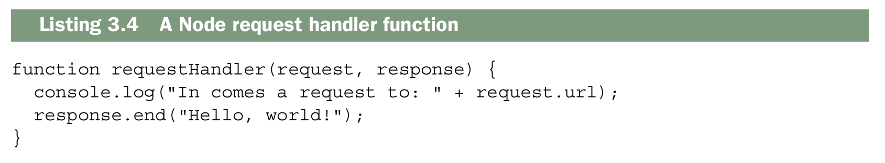

En un mundo sin middleware tendrias una unica handler request function que se encargaria de todo. Si tuvieras que dibujar el flujo se viera asi:


Cada solicitud pasa por una sola __request handler function__, que finalmente genera la respuesta. Esto no quiere decir que esta funcion no pueda llamar a otras funciones, pero, en definitiva, es la función principal la que responde a cada solicitud.

Con el middleware, en lugar de que la request pase por una sola funcion, pasa por una serie de funciones, lo que se conoce como pila de midleware (stack middleware)

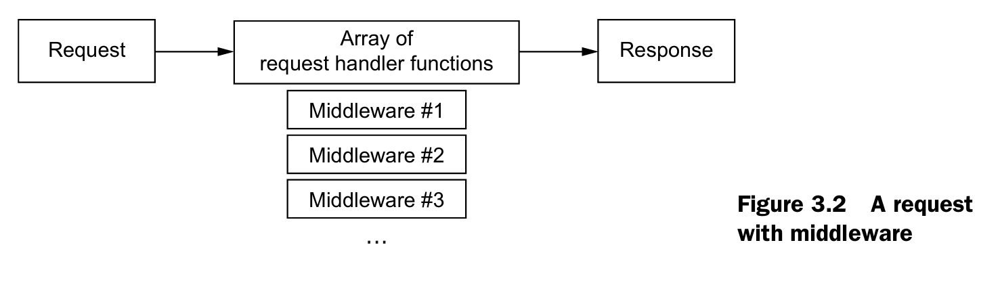

Cada middleware pude modificar la request o la response, pero no siempre tiene que hacerlo. Eventualmente, alguno middleware podria responder a la solicitud. Si ninguno responde, entonces el servidor podria bloquearse y el navegador se quedaria esperando una respuesta.

1️⃣ __Cada middleware puede modificar `request` y `response`__

Cuando haces:

```js
app.use((req, res, next) => {
  req.user = { id: 1 };  // modificando la request
  res.setHeader("X-Powered-By", "Express"); // modificando la response
  next(); // pasa al siguiente middleware
});
```
- `req` y `res` son __objetos que pasan por referencia.__
- Cualquier cambio que hagas en `req` o `res` __persiste para el siguiente middleware o ruta.__
- Por eso se dice que cada middleware __puede modificar la request o la response.__
  
2️⃣ No siempre tiene que modificar `request` o `response`

Algunos middlewares solo __leen información__ o hacen __logging__:

```js
app.use((req, res, next) => {
  console.log("Llegó una request a: " + req.url);
  next(); // no modificamos nada, solo pasamos al siguiente
});
```
Otros pueden __responder directamente__, terminando la request:
```js
app.use((req, res, next) => {
  if (req.url === "/health") {
    res.end("OK");  // aquí ya respondimos
  } else {
    next(); // sigue al siguiente middleware o ruta
  }
});
```
3️⃣ Qué pasa si ningún middleware responde
Express espera que algún middleware o ruta envíe una respuesta usando res.send(), res.end(), etc.
Si ninguno lo hace, la request queda abierta, y el navegador sigue esperando.

Ejemplo peligroso:
```js
app.use((req, res, next) => {
  console.log("Middleware que no hace nada");
  next();
});

// No hay rutas ni middlewares que respondan
```
Si un navegador hace request a este servidor, se quedará cargando para siempre, porque nadie cerró la conexión ni envió respuesta.

Esto es util porque te permite dividir la aplicacion en partes mas pequeñas, en ligar de tener una aplicacion gigante. Estos componentes son mas faciles de componer y reordenar, y tambien es mas facil agregar modulos de terceros.

## Middleware code that’s passive

### Vision Conceptual (mini express) 
Este codigo muestra lo que sucede en la superficie de express cuando estamos creando una aplicacion normal
```js
import express from "express";

const app = express(); // creas la app (función + objeto)

// Middleware global
app.use((req, res, next) => {
  console.log(`${req.method} ${req.url}`);
  next(); // pasa al siguiente middleware o ruta
});

// Ruta GET
app.get("/", (req, res) => {
  res.send("Hola mundo desde Express");
});

// Ruta GET con path específico
app.get("/usuarios", (req, res) => {
  res.json([
    { id: 1, nombre: "Alex" },
    { id: 2, nombre: "Juan" }
  ]);
});

// Ruta POST
app.post("/usuarios", (req, res) => {
  res.send("Usuario creado");
});

// Levantar servidor
app.listen(3000, () => {
  console.log("Servidor corriendo en http://localhost:3000");
});
```
Este codigo de aqui muestra lo que sucede internamente en express
```js
function express() {
  const middlewares = []; // Regitra todos los middlewares
  const routes = []; // Registra todas la rutas

  function app(req, res) {
   /* 
  app.handle es la que recorre todos los middlewares y rutas registradas y decide qué ejecutar según la request:

  - Ejecuta los middlewares (app.use(...)) en orden.
  - Revisa la colección de rutas (app.get(...), app.post(...), etc.).
  - Llama al handler correspondiente si encuentra coincidencia.
  - Envía la respuesta con res.send() o res.end().
*/
    app.handle(req, res);
  }
// Guarda funciones que se ejecutan antes de las rutas (middlewares)
  app.use = function(fn) {
    middlewares.push(fn);
  };
// Registra rutas GET
  app.get = function(path, handler) {
    routes.push({ method: "GET", path, handler });
  };
// Registra rutas POST
  app.post = function(path, handler) {
    routes.push({ method: "POST", path, handler });
  };

  app.handle = function(req, res) {
    let i = 0;

    function next() {
      if (i < middlewares.length) {
        const middleware = middlewares[i++];
        return middleware(req, res, next);
      }

      // después de middlewares → rutas
      for (let route of routes) {
        if (req.method === route.method && req.url === route.path) {
          return route.handler(req, res);
        }
      }

      // si no encuentra nada
      res.end("404 Not Found");
    }

    next();
  };

  return app;
}
```

### Vision real
El comportamiento real es un __solo array (stack) que respeta estrictamente el orden en que defines las cosas:__

__Si defines así:__
```js
app.use(express.json())        // posición 1
app.get("/about", funcion)     // posición 2
app.use(express.static(path))  // posición 3
app.use(funcion404)            // posición 4
```
__El stack queda así:__

```js
stack = [
    { metodo: "ALL", ruta: null,     funcion: express.json() },
    { metodo: "GET", ruta: "/about", funcion: funcionAbout },
    { metodo: "ALL", ruta: null,     funcion: express.static() },
    { metodo: "ALL", ruta: null,     funcion: funcion404 },
]
```

### Y cuando llega una petición recorre el stack en orden:
```sh
petición GET /about
        ↓
posición 1 → express.json()   → coincide → ejecuta → next()
        ↓
posición 2 → GET /about       → coincide → ejecuta → next()
        ↓
posición 3 → express.static() → coincide → ejecuta → next()
        ↓
posición 4 → funcion404       → coincide → ejecuta
```
En resumen:
Express no distingue entre middlewares y rutas, solo recorre el stack en el orden exacto que tú definiste y ejecuta todo lo que coincida con la petición.

__Real por dentro Express guarda algo más como:__
```js
// Stack no simplificado como el de arriba
{
    method: "GET",
    path: "/about",
    handle: funcion,        // la función a ejecutar
    regexp: /^\/about\/?$/i // la ruta convertida a expresión regular
    keys: [],               // parámetros de la ruta como :id
    strict: false,          // si la ruta es estricta
    end: true               // si debe coincidir hasta el final
}
```
__En resumen:__

Para entender el concepto, los tres parámetros que usamos son suficientes. El resto son detalles internos que Express usa para hacer comparaciones más complejas.
##
Middleware puede afectar la respuesta pero no tiene que hacerlo. Por ejemplo el Middleware Loging de la seccion anterior no necesita enviar informacion diferente, solo necesita registrar la solicitud y pasar al siguiente middleware.

Empecemos creando una funcion de middleware completamente inutil y entonces seguimos apartit de ahi, el siguiente fragmento muestra como seria una funcion de middleware vacia.

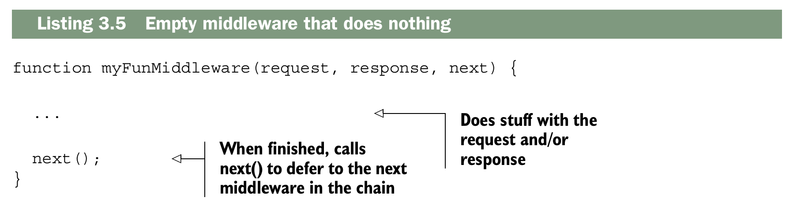

Cuando inicias el servidor empiezas desde el middleware de nivel superior y vas bajando hasta el inferior. Entonces si quisieras agregarle un simple registro a nuestra aplicacion tu podrias hacerlo como se muestra acontinuacion.

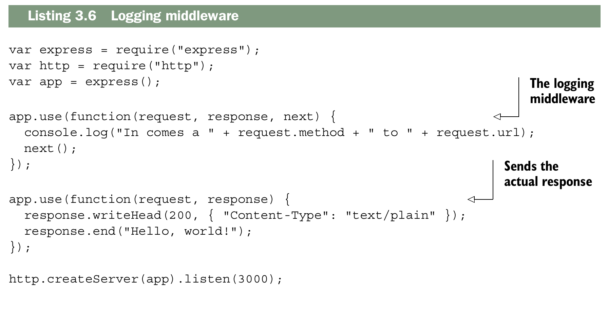

Ejecuta la app y visita http://localhost:300 en la consola podras ver que tu servidor esta registrando las solicitudes (request) y tambien podras el "Hellow Word" en el navegador.

Ten encuenta que todo lo que trabaja en Node basico tambien trabaja en el middleware.
Por ejemplo, puedes consultar `request.method` en un servidor web Node básico, sin
Express. Express no lo elimina; sigue estando ahí tal y como estaba antes. Si quieres establecer el `statusCode` de la respuesta, también puedes hacerlo. Express añade algunas cosas más a estos objetos, pero no elimina nada.

El ejemplo anterior muestra un middleware que no cambia la solicitud ni la
respuesta: registra la solicitud y siempre continúa. Aunque este tipo de middleware
puede ser útil, el middleware también puede cambiar los objetos de solicitud o respuesta

```js
import expresss from "express"
import {createServer} from "node:http"

const app = expresss()
app.use(function(req,resp,next){ 
    console.log("Path: " + req.url + "Metohod: "+req.method)
    next()
})

app.use(function(req,resp){
    resp.writeHead(200,{"content-type":"text/plain"})
    resp.end("Hellow Word!")
})

createServer(app).listen(3000,"localhost",()=>{console.log("Servidor Activado ...")})
```

## Middleware code that changes the request and response
No todo el middleware deben ser pasivo, el resto del middleware de nuesta ejemplo no funciona de esta manera, actualmente necesita modificar la respuesta (response).

Vamos a tratar de escribir el middleware de autenticacion que mecionamos antes. Para simplificar usaremos un esquema de autenticacion un poco peculiar: solo te podras autenticar si visitas la pagina en el minuto par de una hora en especifico (que seria: 12:00, 12:02, 12:04, 12:06, y asi sucesivamente..). Recurda que puedes usar el operador modulo (%) para verificar si un numeor es divisible por otro.

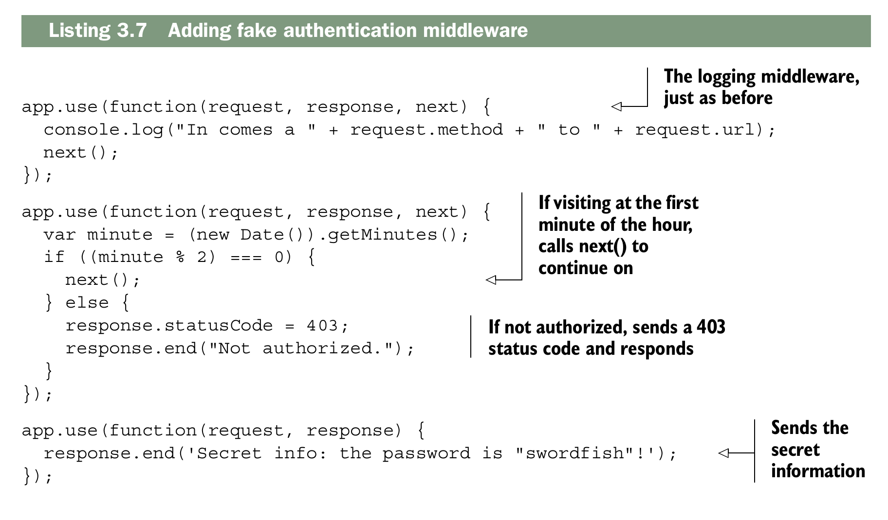

Cuando una solitud (request) entra, esta siempre pasara a traves del middleware en el mismo orden de `use()`. Primero empezamos con el middleware de registro, entonces si tu estas visitando la pagina en un minuto par, podras continuar al siguiente middleware y mirar la indormacion secreta. Pero si visitas la pagina en cualquier otro minuto de la hora, el sistema de detendra y nunca podras continuar.

```js
import express from "express"
import {createServer} from "node:http"

const app = express()

app.use(function(req,res,next){
    console.log("Path:"+ req.url + " Method: " + req.method )
    next()
})
app.use(function(req,res,next){
      
    let minute = (new Date()).getMinutes()
    if((minute % 2) === 0){
        next()
    } else{
        res.statusCode = 403
        res.end("No Autorizado")
    }
})
app.use(function(req,res){
    res.end("El secreto revelado es: Una CangreBurger!")
})

createServer(app)
.listen(3000,"localhost",()=>{console.log("Servidor Activo ....")})
```
## Third-party middleware libraries
Como en muchos aspectos de la programación, suele ocurrir que alguien más ya haya hecho lo que tú intentas hacer. Puedes escribir tu propio middleware, pero es común encontrar que la funcionalidad que buscas ya está disponible en el middleware de otra persona. Veamos un par de ejemplos de middleware de terceros que pueden ser útiles.
### MORGAN: LOGGING MIDDLEWARE
Vamos a eliminar nuestro middleware logger funtion y usar Morgan, un genial Logger para Express que tiene mas caracteristicas. Los Loggers son muy utiles por varias razones. Primero, son una mejor forma de mirar lo que estan haciendo tus usuarios. Esta no es la mejor manera para hacer cosas como marketing de analiticas, pero esto es realmente util cuando tu aplicacion se bloquea para un usuario y no estas seguro del porque. Tambien lo encuentro util cuando desarrollamos, porque puedes ver cuando una solicitud entra al servidor. Si algo sale mal puedes utilizar los registro de Morgan como una comprobacion de coherencia. Tambien puedes ver cuanto tarda tu servidor en responder para realizar un analisis de rendimiento. 

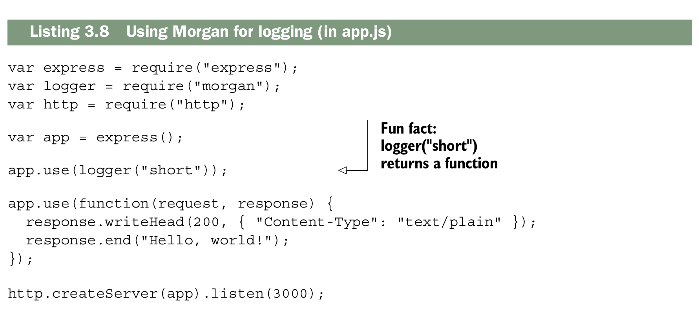

¡Entra en http://localhost:3000 y verás cómo se registran los datos! Gracias, Morgan

```js
import express from "express"
import logger from "morgan"
import {createServer} from "node:http"

const app = express()

app.use(logger("short"))

app.use(function(request,response){
    response.writeHead(200, { "Content-Type": "text/plain" });
    response.end("Hello, world!");
})

createServer(app).listen(3000,"localhost",()=>{console.log("Servidor Activo")})
```

### EXPRESS’S STATIC MIDDLEWARE
Existen más middlewares además de Morgan. Es común que las aplicaciones web
necesiten enviar archivos estáticos a través de la red. Estos incluyen elementos como imágenes, CSS o HTML: contenido que no es dinámico.

 `express.static` viene incluido con Express y te ayuda a servir archivos estáticos. El simple hecho de enviar archivos resulta ser un proceso complejo, ya que existen muchos casos especiales y consideraciones de rendimiento que tener en cuenta. ¡Express al rescate!

Supongamos que quieres servir archivos desde un directorio llamado public. El siguiente ejemplo muestra cómo podrías hacerlo con el middleware estático de Express.

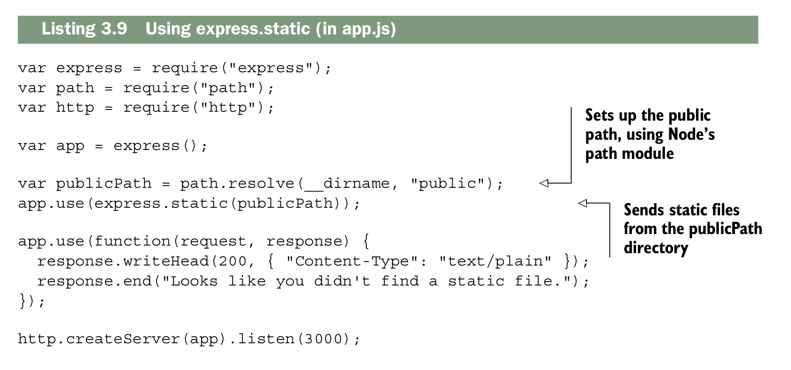


Ahoram cualquier archivo qne la carpeta public se mostrara, Puedes poner cualquier cosa y el servidor te lo enviara. Si el archivo no existe en la carpeta, pasara el siguiente middleware y te mostrara un mensaje "No se encontro el archivo". `express.static` lo enviará y detendrá la cadena de middleware.
```js
import express from "express"
import path from "path"
import { fileURLToPath } from 'url';
import {createServer} from "node:http"

// Obtienes el nombre del archivo actual
const __filename = fileURLToPath(import.meta.url);
// Obtienes el directorio actual
const __dirname = path.dirname(__filename);

let publicPath = path.resolve(__dirname,"public")

const app = express()

app.use(express.static(publicPath))

app.use(function(req,response){
    response.writeHead(200, { "Content-Type": "text/plain" });
    response.end("Looks like you didn't find a static file.");
})

createServer(app).listen(3000,"localhost",()=>{console.log("Servidor Activo..")})
```

### FINDING MORE MIDDLEWARE
Ya vimos el middleware estático de Morgan y Express, pero hay más. Aquí hay
otros cuantos que pueden ser útiles:

- `connect-ratelimit:` te permite limitar las conexiones a un número determinado de solicitudes por hora. Si alguien está enviando muchas solicitudes a tu servidor, puedes empezar a devolverle errores para evitar que colapse tu sitio.
- `Helmet:` te ayuda a añadir encabezados HTTP para que tu aplicación sea más segura frente a ciertos tipos de ataques. Lo exploraremos en capítulos posteriores. (Soy colaborador de Helmet, ¡así que definitivamente lo recomiendo!)
- `cookie-parser:` analiza las cookies del navegador.
- `response-time:` envía el encabezado X-Response-Time para que puedas depurar el rendimiento de tu aplicación.

## Routing
El enrutamiento es una forma de asignar cada solicitud a un manejador específico según su URL y el verbo HTTP.  Podrias imaginarte una homepage, about page y 404 page. El enrutamiento puede encargarse de todo esto.

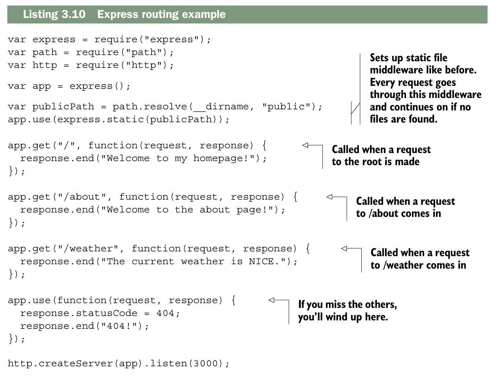

Una vez cubiertos los requisitos básicos, agrega tu middleware de archivos estáticos (tal como lo has visto anteriormente). Esto servirá cualquier archivo que se encuentre en una carpeta llamada «public».

Las tres llamadas a `app.get` constituyen el sistema de enrutamiento mágico de Express. También podrían
ser `app.post`, que responde a las solicitudes POST, o `PUT`, o cualquiera de los verbos HTTP.

El primer argumento es la ruta, como `/about` o `/weather` o simplemente la raiz `/`.  El segundo argumento es una función de manejo de solicitudes similar a las que viste anteriormente en la sección sobre middleware. Son las mismas funciones de manejo de solicitudes que ya conoces. Funcionan exactamente igual que el middleware; la diferencia está en cuándo se invocan.

Estas rutas pueden ser aún más inteligentes. Además de coincidir con rutas fijas, pueden coincidir con otras más complejas (imagina una expresión regular o un análisis sintáctico más complicado), como se muestra en el siguiente fragmento de código.

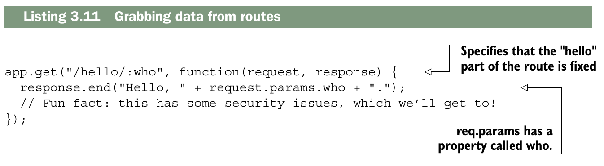

No es coincidencia que este `who` sea el segmento especificado en la primera ruta. Express tomará el valor de la URL entrante y lo asignará al nombre que especifiques.

Usando Express, en lugar de definir una ruta para cada nombre de usuario posible (o artículo, foto o lo que sea), defines una sola ruta que coincide con todos ellos. La documentación también muestra un ejemplo que usa expresiones regulares para hacer coincidencias aún más complejas, y puedes hacer muchas otras cosas con este enrutamiento. Para una comprensión conceptual, he dicho suficiente. Lo exploraremos con mucho más detalle en el capítulo 5. Pero se pone aún más genial.

## Extending request and response

Express amplía los objetos de solicitud y respuesta que recibes en cada manejador de rutas. Lo anterior sigue ahí, pero Express también añade cosas nuevas. La documentación de la API explica todo, pero veamos un par de ejemplos. 

Una ventaja que ofrece Express es el método `redirect`. La siguiente lista muestra cómo podría funcionar.

```js
// Using Redirect

app.get("/redirect", function(resquest,response){
    response.redirect("/hellow/world")
})
app.get("/hellow/world", function(request,response){
    response.end("LLegaste al destino")
})
app.get("/express",function(request,response){
    response.redirect("http://expressjs.com")
})
```
Si solo estuvieras usando Node, `response` no podria llamar al metodo `redirect`; Express se lo añade al objeto response por ti. Puedes hacerlo en Node “puro”, pero implica mucho más código.

Express agrega metodos como `sendFile` que te permite enviar un archivo completo.

```js
app.get("/music",function(request,response){
    response.sendFile(resolve(pathPublic,"dg.mp3"))
})
```
Una vez más, el método sendFile no está disponible en Node puro; Express lo añade por ti. Y, al igual que en el ejemplo de redirect mostrado antes, puedes hacerlo en Node puro, pero requiere mucho más código.

No solo el objeto `response` recibe comodidades: el objeto `request` también obtiene varias propiedades y métodos interesantes, como `request.ip` para obtener la dirección IP o el método `request.get` para leer encabezados HTTP entrantes. Vamos a usar algunas de estas cosas para crear un middleware que bloquee una dirección IP maliciosa. Express hace esto bastante fácil, como se muestra aquí.

```js
const EVIL_IP = "123.45.67.89";

app.use(function(request,response,next){
    if(request.ip === EVIL_IP){
        response.status(401).send("Not Allowed")
    } else {
        next()
    }
})
```

Observa que estás usando `req.ip`, una función llamada `res.status()` y `res.send()`. Ninguna de estas cosas viene incorporada en Node puro; todas son extensiones añadidas por Express. En teoría, no hay mucho más que saber aquí, aparte del hecho de que Express amplía los objetos de solicitud y respuesta. Hemos visto algunas de esas ventajas en este capítulo, pero no quiero darte aquí la lista completa. Para cada función útil que te ofrece Express, puedes consultar su documentación de la API en http://expressjs.com/4x/api.html.

## Views

Los sitios web se construyen con HTML, y aunque las aplicaciones de página única (SPA) son muy populares, a menudo es necesario que el servidor genere HTML de forma dinámica, por ejemplo para saludar a un usuario autenticado o mostrar una tabla de datos. Para esto existen los motores de vistas, entre los más conocidos están EJS (JavaScript Embebido), Handlebars, Pug, y otros provenientes de lenguajes como Swig y HAML. Todos tienen algo en común: al final producen HTML. En los ejemplos de este material se utiliza EJS, una opción popular creada por el mismo equipo de Express, aunque existen diversas alternativas que se exploran en el capítulo 7.

El siguiente listado muestra cómo configurar las vistas.

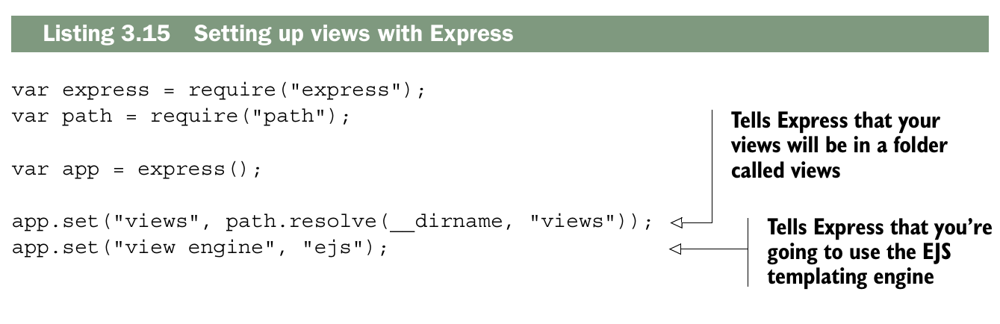

El primer bloque es lo mismo de siempre; importamos lo que necesitamos. Entonces dices, "Mis vistas estan la carpeta llamada _views_". Despues dices, "Usa EJS". EJS  (documentation at https://github.com/tj/ejs) es un leguaje de plantillas compiladas oara HTML. Asegurate de instalarlo con `npm install ejs`. 

Ahora que has configurado estas vistas en Express, ¿cómo se usan? ¿Qué es esto de EJS? Empecemos creando un archivo llamado `index.ejs` y colocándolo en un directorio llamado _views_. 

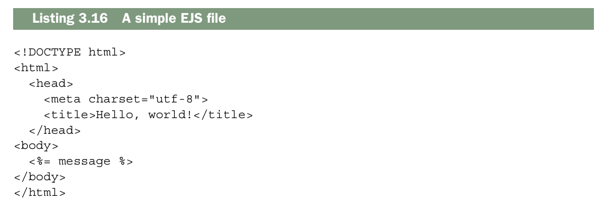

Esto debería verse exactamente como HTML para ti, salvo por ese detalle extraño dentro de la etiqueta body. EJS es un superconjunto de HTML, así que todo lo que sea HTML válido también es EJS válido. Pero EJS además agrega algunas funciones nuevas, como la interpolación de variables. `<%= message %>` interpolará una variable llamada message, que pasarás cuando renderices la vista desde Express. 

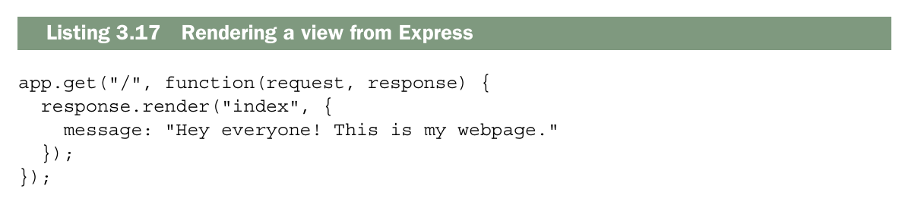

Express agrega un metodo al objeto `response` llamadao `render`. Basicamente examina el motor de vistas y el directorio de vistas que definiste antes, y renderiza `index.ejs` con las variables que le pasas.

EJS is a popular solution to views, but there are a number of other options, which we’ll
explore in later chapters. Now let’s work through an example.

## Example: putting it all together in a guestbook

Si eres como yo, viste internet en sus primeros días: GIFs animados incómodos, código anticuado y Times New Roman en todas las páginas. En este capítulo, resucitaremos un componente de esa época ya pasada: el libro de visitas. Un libro de visitas es bastante simple: los usuarios pueden escribir nuevas entradas en el libro de visitas en línea y pueden leer las entradas de los demás. ■ Usemos todo lo que has aprendido para construir una aplicación más real para este libro de visitas.

Resulta que todo esto será muy útil. Tu sitio tendrá dos páginas:

- Una homepage que lista las entradas publicadas
- Una pagina con un fomulario para "agregar nuevas entradas"

¡Eso es todo! Antes de empezar, tienes que prepararlo todo. ¿Listo?

### Getting set up
Start a new project. Make a new folder, and inside, make a file called package.json. It
should look something like this next listing.

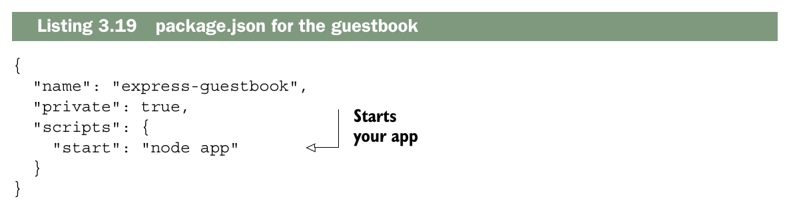

Now, install your dependencies as you did before and save them into
package.json: `npm install express morgan body-parser ejs --save`

Estos módulos te deberían resultar familiares, excepto `body-parser`. Tu aplicación necesitará publicar nuevas entradas del libro de visitas mediante solicitudes `HTTP POST`, así que tendrás que analizar el cuerpo del `POST`; ahí es donde entrará body-parser. 

### The main app code

Now that you’ve installed all of your dependencies, create app.js and put the following
app inside.

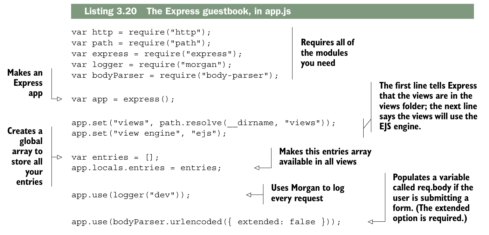

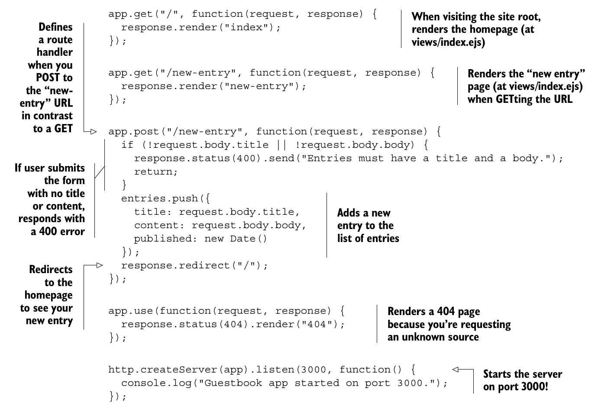

### Creating the views
Hemos hecho referencia a varias vistas aquí, así que vamos a completarlas. Crea una carpeta llamada `views` y luego crea el encabezado en `views/header.ejs`, como se muestra en la siguiente lista.
```html
Listing 3.21 header.ejs

<!DOCTYPE html>
<html>
<head>
<meta charset="utf-8">
<title>Express Guestbook</title> 
<link rel="stylesheet" href="//maxcdn.bootstrapcdn.com/bootstrap/3.3.6/css/
bootstrap.min.css">  <!-- ← Loads Twitter’s Bootstrap CSS from the Bootstrap CDN-->
</head>
<body class="container">
  <h1>
    Express Guestbook
    <a href="/new-entry" class="btn btn-primary pull-right">
      Write in the guestbook
    </a>
  </h1>
```
Nota que usas Twitter Bootstrap para dar estilo, pero fácilmente podrías reemplazarlo por tu propio CSS. Lo más importante es que este es el encabezado; este HTML aparecerá en la parte superior de todas las páginas.

Después, crea el pie de página simple en `views/footer.ejs`, que aparecerá en la parte inferior de cada página, como sigue.
```js
</body>
</html>
```
Ahora que ya definiste el encabezado y el pie de página comunes, puedes crear las tres vistas: la página principal, la página de “agregar una nueva entrada” y la página 404. Guarda el código de la siguiente lista en views/index.ejs.

```html
Listing 3.23 index.ejs

<%- include('header') %>
<% if (entries.length) { %>
  <% entries.forEach(function(entry) { %>
    <div class="panel panel-default">
      <div class="panel-heading">
        <div class="text-muted pull-right">
          <%= entry.published %>
        </div>
        <%= entry.title %>
      </div>
      <div class="panel-body">
        <%= entry.body %>
      </div>
    </div>
  <% }) %>
<% } else { %>
  No entries! <a href="/new-entry">Add one!</a>
<% } %>
<%- include('footer') %> 
```
Guarda el siguiente listado en views/new-entry.ejs.

```html
Listing 3.24 new-entry.ejs

<%- include('header') %>
<h2>Write a new entry</h2>
<form method="post" role="form">
  <div class="form-group">
    <label for="title">Title</label>
     <input type="text" class="form-control" id="title"
   name="title" placeholder="Entry title" required>
  </div>
  <div class="form-group">
    <label for="content">Entry text</label>
    <textarea class="form-control" id="body" name="body"
   placeholder="Love Express! It’s a great tool for
   building websites." rows="3" required></textarea>
  </div>
  <div class="form-group">
    <input type="submit" value="Post entry" class="btn btn-primary">
  </div>
</form>
<%- include('footer') %>
```
Guarda el siguiente listado en views/404.ejs.
```html
Listing 3.25 404.ejs

<% include('header') %>
<h2>404! Page not found.</h2>
<% include('footer') %>
```
### Start it up

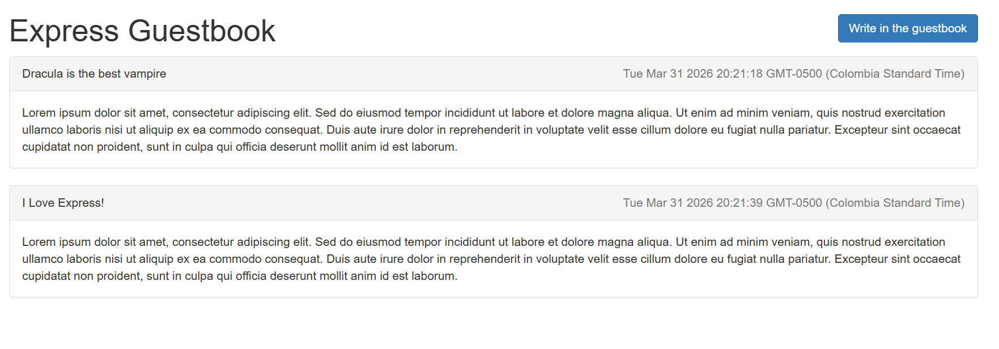

Now, npm start your app, and visit http://localhost:3000 to see your guestbook, shows the page to write a new entry in the guestbook

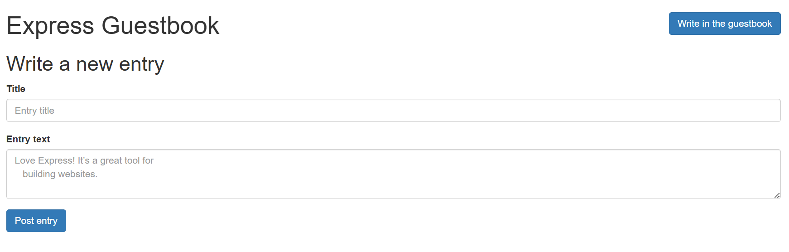

¡Mira eso! Qué librito de visitas tan bonito. Me recuerda a los años 90. Repasemos las partes de este pequeño proyecto:

- Usas una función de middleware para registrar todas las solicitudes, lo que te ayuda a depurar.
- También usas un middleware al final para servir la página 404.
- Usas el enrutamiento de Express para dirigir a los usuarios a la página principal, a la vista de “agregar una nueva entrada” y al POST para añadir una nueva entrada.
- Usas Express y EJS para renderizar páginas. EJS te permite crear HTML de forma dinámica; lo usas para mostrar el contenido dinámicamente.

### Formas de enviar repuestas HTTP

Mostrando tres formas de enviar una respuesta HTTP, del nivel más bajo (Node puro) al nivel Express friendly

__1️⃣ Node.js puro: `writeHead()` + `end()`__
```js
const http = require('http');

http.createServer((req, res) => {
  res.writeHead(200, { 'Content-Type': 'text/plain' }); // define código y headers
  res.end('Hola mundo'); // envía la respuesta y termina
}).listen(3000);
```
- Nivel: Node.js puro
- Define código + headers de una vez
- `.end()` siempre es necesario para enviar la respuesta
  
__2️⃣ Node.js / Express intermedio: `statusCode` + `setHeader()` + `end()`__
```js
app.get('/', (req, res) => {
  res.statusCode = 200;                  // define el código
  res.setHeader('Content-Type', 'text/html'); // define headers
  res.end('<h1>Hola mundo</h1>');        // envía respuesta
});
```
- Nivel: Node.js core o Express
- Se puede usar en Express, pero no es tan “bonito”
- Más control manual, menos automatización

__3️⃣ Express friendly: `status()` + `send()`__

```js
app.get('/', (req, res) => {
  res.status(200).send('<h1>Hola mundo</h1>'); 
});
```
- Nivel: Express
- Define código HTTP con .status()
- Envía la respuesta automáticamente con .send()
- Detecta y ajusta el Content-Type automáticamente según el contenido
- Permite encadenamiento (method chaining)

__🔹Comparación resumida__

| Forma                                  | Código | Headers       | Envía respuesta | Nivel                   |
| -------------------------------------- | ------ | ------------- | --------------- | ----------------------- |
| `writeHead()` + `end()`                | ✔️     | ✔️            | ✔️              | Node.js puro            |
| `statusCode` + `setHeader()` + `end()` | ✔️     | ✔️            | ✔️              | Node/Express intermedio |
| `status()` + `send()`                  | ✔️     | ✔️ automático | ✔️              | Express friendly        |

## Summary
- Express se sitúa sobre la funcionalidad HTTP de Node. Abstrae muchos de sus bordes ásperos. 
- Express tiene una característica de middleware que te permite canalizar una sola solicitud a través de una serie de funciones descompuestas. 
- La función de enrutamiento de Express te permite asignar ciertas solicitudes HTTP a cierta funcionalidad. Por ejemplo, al visitar la página principal, debería ejecutarse cierto código. 
- Las funciones de renderizado de vistas de Express te permiten generar páginas HTML de forma dinámica. 
- Muchos motores de plantillas han sido adaptados para funcionar con Express. Uno popular se llama EJS, que es el más sencillo para quienes ya conocen HTML.