# Middleware
Este capítulo cubre:

- __Escribir funciones de middleware: una función con tres argumentos.__
- __Escribir y usar middleware para manejo de errores: una función con cuatro argumentos.__
- __Usar middleware de código abierto, como Morgan para registrar solicitudes y `express.static` para servir archivos estáticos.__

Sin ningún framework como Express, Node te ofrece una API bastante simple. Creas una función que maneje las solicitudes, la pasas a `http.createServer` y listo. Aunque esta API es sencilla, tu función manejadora de solicitudes puede volverse difícil de manejar a medida que tu aplicación crece. 

Express ayuda a mitigar algunos de estos problemas. Una de las formas en que lo hace es mediante el uso de algo llamado middleware. Node sin framework te obliga a escribir una sola función grande para manejar solicitudes en toda tu aplicación. El middleware te permite dividir esta funcion manejadora de solicitudes en partes más pequeñas. Estas funciones más pequeñas suelen encargarse de una sola cosa a la vez. Una podría registrar todas las solicitudes que llegan a tu servidor; otra podría analizar valores especiales de las solicitudes entrantes; otra podría autenticar usuarios.

Conceptualmente, el middleware es la parte más importante de Express. La mayor parte del código de Express que escribes es middleware de una forma u otra. Con suerte, después de este capítulo, verás por qué.

## Middleware and the middleware stack
Al final del día, los servidores web escuchan solicitudes, analizan esas solicitudes y envían respuestas. El runtime de Node recibe primero esas solicitudes y las convierte de bytes en bruto en dos objetos de JavaScript que puedes manejar: un objeto para la solicitud `(req)` y otro para la respuesta `(res)`. Cuando trabajas solo con Node.js, el flujo se ve como en la figura.

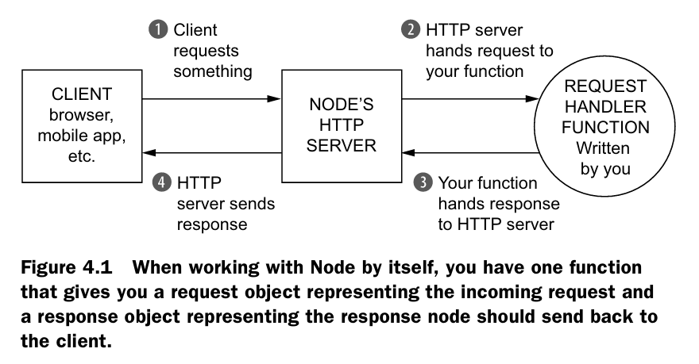

Estos dos objetos se enviarán a una función de JavaScript que tú escribirás. Analizarás `req` para ver qué quiere el usuario y manipularás `res` para preparar tu respuesta. Después de un rato, habrás terminado de escribir la respuesta. Cuando eso ocurra, llamarás a `res.end`. Esto le indica a Node que la respuesta ya está completa y lista para enviarse por la red. El runtime de Node verá lo que hiciste con el objeto de respuesta, lo convertirá en otro paquete de bytes y lo enviará por internet a quien lo haya solicitado.

En Node, estos dos objetos pasan por una sola función. Pero en Express, estos objetos pasan por un arreglo de funciones llamado la _pila de middleware_. Express comienza en la primera función de la pila y continúa en orden hacia abajo, como se muestra en la figura. 

Cada función de esta pila toma tres argumentos. Los dos primeros son `req` y `res` de antes. Node te los entrega, aunque Express los complementa con algunas funciones de conveniencia que comentamos en el capítulo anterior.

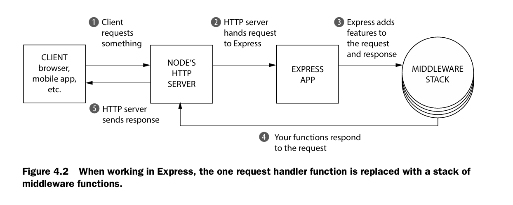

Cuando trabajas con Express, la única función manejadora de solicitudes se reemplaza por una pila de funciones de middleware.

El tercer argumento de cada una de estas funciones es, a su vez, otra función, llamada convencionalmente `next`. Cuando se llama a `next`, Express pasa a la siguiente función de la pila. La figura 4.3 muestra la firma de una función de middleware.

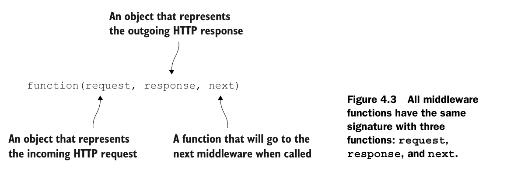

Eventualmente, una de estas funciones en la pila debe llamar a `res.end`, lo que terminara la slicitud. (En Express, tambien puedes llamar a otros metodos como `res.send` o `res.sendFile`, que llaman internamente a `res,end`). Puedes llamar a `res.end` en cualquiera de las funciones de la pila del middleware, pero debes hacerlo solo una vez o tendras un error. Esto puede parecer un poco abstracto y confuso. Veamos un ejemplo de como funciona esto construyendo un servidor de archivos estaticos.

## Example app: a static file server
Vamos a construri una pequeña aplicacion que sirva archivos desde una carpeta. Puedes poner cualquier cosa en esta carpeta y servira: Archivos HTML, imagenes o un MP3  de ti cantando “My Heart Will Go On” de Celine Dion.

Esta carpeta la llamaremos `static` y vivira en el directorio de tu proyecto. Si hay un archivo llamado celine.mp3 y un usuario visita `/celine.mp3`, tu servidor debe enviar el MP3 a travez de internet. Si el usuario solicita `/burrito.html`, dicho archivo no existe en la carpeta, entonces el servidor deberia enviar un 404 erorr.

Otro requerimiento es que el servidor debe registar cada solicitud, si tiene exito o no. Debe registrar la URL que el usuario solicito con la hora que se realizo la solicitud.

Esta aplicación de Express estará compuesta por tres funciones en la pila de middleware:

- _The logger:_ mostrara en la consola la URL solicitada y la hora en que se solicito. Siempre continuara hacia el siguiente middleware. (En terminos de codigo, siempre llamara a `next`)
- _The static file sender_: Comprobara si el archivo existe en la carpeta. Si existe, enviara el archivo por internet, Si no existe, continuara hacia el middleware final (de nuevo, llamando a `next`)
- _The 404 handler_ :si este middleware se ejecuta, significa que el anterior no encontro ningun archivo, y debes devolver un mensaje 404 y terminal la solicitud.

Podrías visualizar esta pila de middleware como la que se muestra en la figura.

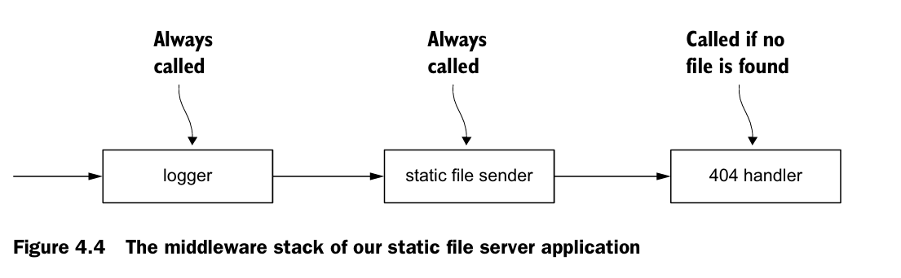

Enough talking. Let’s build this thing

### Getting set up

Comienza creando un nuevo directorio. Puedes llemarlo como quieras, vamos a elegir `static-file-fun`. Dentro de este directorio, crea un archivo llamado `pakage.json`. Este archivo esta presente en todos los proyectos de Node.js y describe metadatos sobre tu paquete, desde su titulo hasta dependencia de terceros.

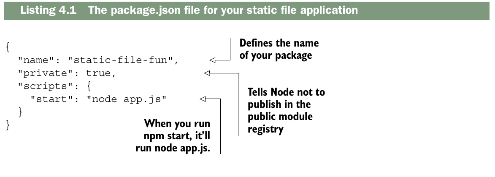

Una vez guardaste el `pakage.json`, querras instalar las ultimas versiones de Express. Desde dentro de este directorio, corre `npm install express`. Esto instalará Express en un directorio llamado `node_modules`. También añadirá Express como dependencia en package.json. Ahora `package.json`.

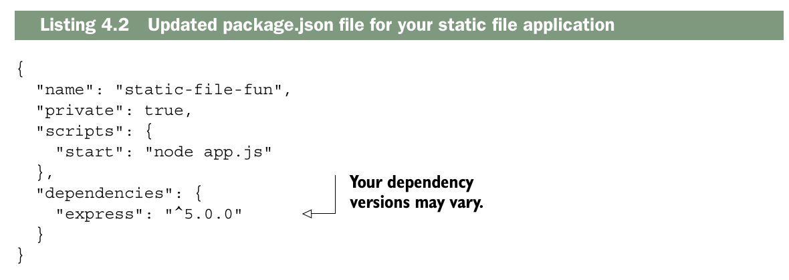

Ahora crea una carpeta llamada _static_ dentro del nuevo proeycto. Pon algunos archivos dentro: quiza un archivo HTML una imagen o dos, realmente no importa lo que pongas ahi.

Como último paso, crea `app.js` en la raíz de tu proyecto, que contendrá todo el código de tu aplicación. La estructura de tu carpeta se verá algo así como en la figura 4.5. Cuando quieras ejecutar esta aplicación, usarás `npm start`. Este comando revisará tu archivo `package.json`, verá que agregaste un script llamado `start` y ejecutará ese comando. En este caso, ejecutará `node app.js`. Ejecutar `npm start` aún no hará nada: todavía no has escrito tu aplicación, pero lo usarás cada vez que quieras correrla. Bien. ¡Vamos a escribir la aplicación!

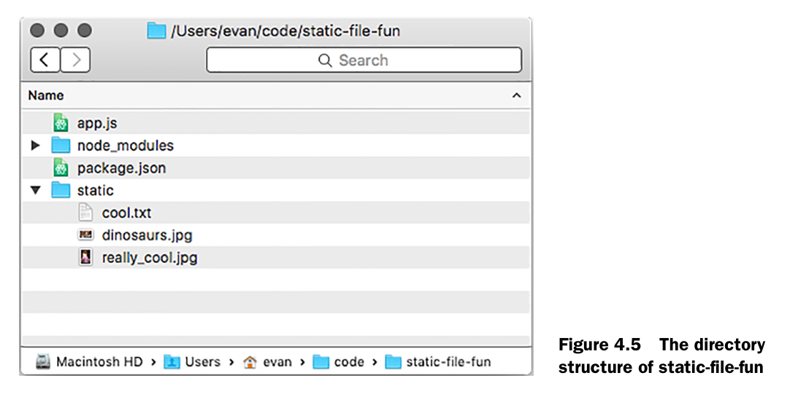

> ¿Por qué usar npm start?

¿Por qué usar npm start en absoluto? ¿Por qué no ejecutar simplemente node app.js? Hay tres razones por las que podrías hacerlo.

Es una convención. La mayoría de los servidores web en Node pueden iniciarse con `npm start`, sin importar la estructura del proyecto. Si en lugar de `app.js` alguien hubiera elegido `application.js`, tendrías que saber sobre ese cambio. La comunidad de Node parece haberse establecido en una convención común aquí.

Te permite ejecutar un comando más complejo (o un conjunto de comandos) con uno relativamente simple. Tu aplicación es bastante simple ahora, pero iniciarla podría ser más complejo en el futuro. Quizás necesites iniciar un servidor de base de datos o limpiar un archivo de logs enorme. Mantener esta complejidad bajo un comando simple ayuda a que todo sea más consistente y agradable.

La tercera razón es un poco más matizada. npm te permite instalar paquetes globalmente, de modo que puedas ejecutarlos como cualquier otro comando en la terminal. Bower es uno común, permitiéndote instalar dependencias de front-end desde la línea de comandos con el comando `bower`. Instalabas cosas como Bower globalmente en tu sistema. Los scripts de npm te permiten agregar nuevos comandos a tu proyecto sin instalarlos globalmente, de modo que puedas mantener todas tus dependencias dentro de tu proyecto, permitiéndote tener versiones únicas por proyecto. Esto resulta útil para cosas como pruebas y scripts de construcción, como verás más adelante.

Al final del día, podrías ejecutar `node app.js` y nunca escribir `npm start`, pero encuentro que las razones mencionadas son lo suficientemente convincentes como para hacerlo.


### Writing your first middleware function: the logger
Para empezar, configura tu aplicación para que registre las solicitudes.

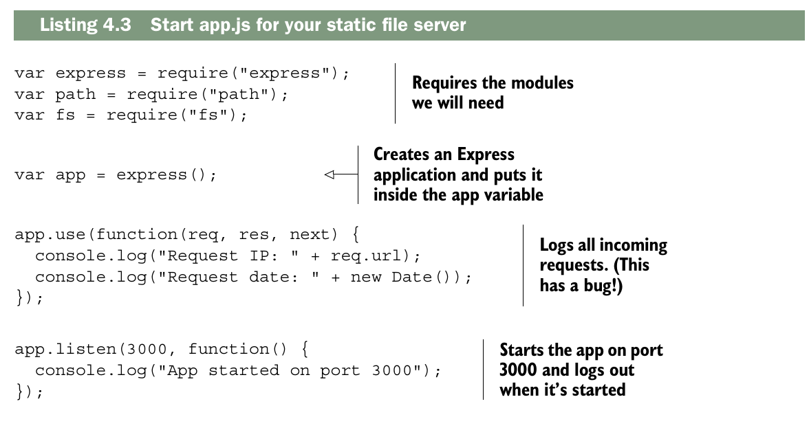

Por ahora, solo tienes una aplicación que registra cada solicitud que llega al servidor. Una vez hayas configurado tu aplicación (las primeras líneas), llamamos a `app.use` para agregar una función a la pila del middleware de tu aplicación. Cuando solicitud llegue a la aplicación, esta funcion sera llamada.

Lamentablemente, incluso esta sencilla aplicación tiene un error crítico. 

Ejecuta `npm start` y visita `localhost:3000` en tu navegador para comprobarlo.

Verás que la solicitud se registra en la consola, lo cual es una buena noticia. Pero
tu navegador se bloqueará: el indicador de carga girará sin parar hasta que
la solicitud finalmente caduque y aparezca un error en tu navegador. ¡Esto no es bueno!

Esto sucede porque no has llamado a `next`. Cuando tu función de middleware
termina, __debe hacer una de las dos cosas:__

- __Debe  finalizar la respuesta a la solicitud__ (con `res.end` o algunos de los metodos de conveniencia de Express, como `res.send` o `res.sendFile`)
- __Debe llamar a__ `next` para continuar con la siguiente funcion en la __pila de middleware.__

Si haces __cualquiera__ de esas dos cosas, tu aplicación funcionará perfectamente. Si no haces ninguna, las solicitudes entrantes nunca recibirán respuesta; el indicador  de carga nunca dejara de girar (esto es lo que sucedía antes). 

Si haces ambas en el mismo flujo (es decir, __responder__ al cliente y luego llamas a `next()`), la primera función que envía la respuesta al cliente es la única que llega, porque en ese momento la respuesta ya se cierra y cualquier intento posterior de responder no tendrá efecto o generará un error. ¡lo cual es casi seguro que no es intencional!

> Respondes o continúas, pero no ambas; si respondes, no deberías continuar (es una mala pratica y puede romper el codigo), y si continúas, es porque aún no has respondido.
> 
Estos errores suelen ser bastante fáciles de capturar una vez que sabes cómo identificarlos. Si no respondes a la solicitud y no llamar a `next`, parecerá que tu servidor es extremadamente lento. Puedes corregir tu middleware llamando a `next`, como se muestra en el siguiente listado.

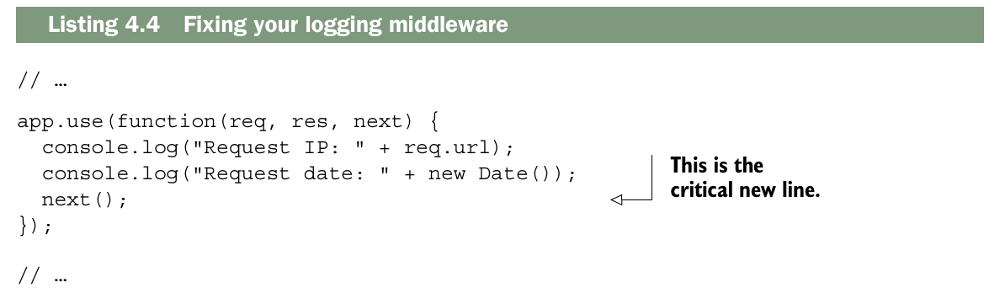

Ahora, si detienes la aplicacion y vuelves a aejecutarla, deberas ver que el servidor registra todas las solicitudes e imediatamente falla con un mesaje de error (algo como "Cannot GET/"). Como nunca respondes a la solicitud, Express le mostrará un error al usuario, y esto sucederá de inmediato.

Ahora que ya has escrito tu registrador _(logger)_, vamos a escribir la siguiente parte: el middleware del servidor de archivos estáticos.

> __¿Cansado de reiniciar tu servidor?__

Hasta ahora, cada vez que modificas el código, tienes que detener el servidor y volver a iniciarlo. ¡Esto puede volverse repetitivo! 

Para solucionar este problema, puedes instalar una herramienta llamada Node.js.mon, que monitoriza todos tus archivos en busca de cambios y reinicia el servidor si detecta alguno.

Puedes instalar nodemon ejecutando `npm install nodemon --global`.
Una vez instalado, puedes iniciar un archivo en modo de vigilancia reemplazando `node` por `nodemon` en tu comando. Si antes escribiste `node app.js`, simplemente cámbialo a `nodemon app.js`, y tu aplicación se recargará continuamente cuando cambie.

### The static file server middleware

A grandes rasgos, esto es lo que debería hacer el middleware del servidor de archivos estáticos:

- Revisar si los archivos solicitados existen en el directorio estatico
- Si existe, respondemos con el archivo y listo. En terminos de codigo, es llamar a `res.sendFile`
- Si el archivo no existe, continuamos al siguiente middleware en la pila, En terminos de codigo, es llamar a `next`
  
Vamos a convertir ese requerimiento en codigo. Empezaras construyento tu propio conocimiento de como trabaja, y luego lo simplificaras con algunnos codigos utiles de terceros.

Utilizarás el módulo «path» integrado en Node, que te permitirá determinar la ruta que solicita el usuario. Para comprobar si el archivo existe, utilizarás otro módulo integrado en Node: el módulo «fs».

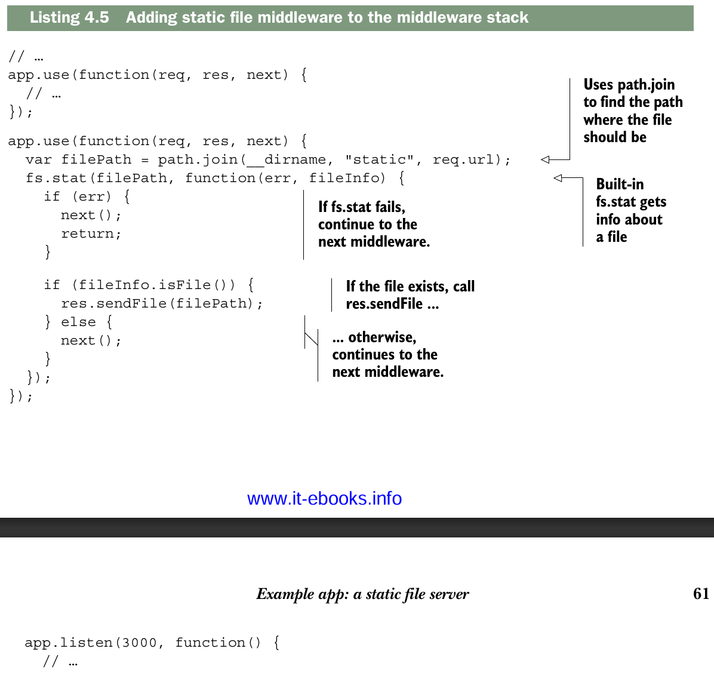

Lo primero que debes hacer en esta función es usar `path.join` para determinar la ruta del archivo. Si el usuario visita `/celine.mp3`, `req.url` será la cadena "/celine.mp3". Por lo tanto, `filePath` será algo como "/ruta/a/tu/proyecto/estático/celine.mp3". La ruta variará considerablemente según dónde hayas almacenado tu proyecto y tu sistema operativo, pero será la ruta al archivo solicitado.

A continuación, llamas a `fs.exists`, que recibe dos argumentos. El primero es la ruta a comprobar (la ruta del archivo que acabas de calcular) y el segundo es una función. Cuando Node haya obtenido información sobre el archivo, llamará a esta función de devolución de llamada con dos argumentos. El primer argumento es un error, por si algo sale mal. El segundo argumento es un objeto con métodos para el archivo, como `isDirectory()` o `isFile()`. Usamos el método `isFile()` para determinar si el archivo existe.

Las aplicaciones Express presentan este tipo de comportamiento asíncrono constantemente. Por eso,
¡debemos usar `next` desde el principio! Si todo fuera síncrono, Express
sabría exactamente dónde termina cada middleware: cuando finaliza la función (ya sea
llamando a `return` o al llegar al final). No sería necesario usar `next` en ningún momento. Pero, como todo es asíncrono, es necesario indicarle manualmente a Express cuándo continuar con el siguiente middleware en la pila.

Una vez que la función de devolución de llamada haya finalizado, se ejecuta una condición simple. Si el archivo existe, se envía. De lo contrario, se continúa con el siguiente middleware. Ahora, al ejecutar la aplicación con `npm start`, intente acceder a los recursos que ha colocado en el directorio de archivos estáticos. Si tiene un archivo llamado `secret_plans.txt` en la carpeta de archivos estáticos, visite `localhost:3000/secret_plans.txt` para verlo. También debería seguir viendo el registro, igual que antes.

Si visitas una URL que no tiene un archivo correspondiente, seguirás viendo el mismo mensaje de error. Esto se debe a que estás llamando a `next` y ya no hay más middleware en la pila. Añadamos el último: el manejador de errores 404.

### 404 handler middleware

El manejador de errores 404 que se muestra en el siguiente listado es la última función de tu pila de middleware. Siempre enviará un error 404, sin importar qué. Agrégalo después del middleware anterior.

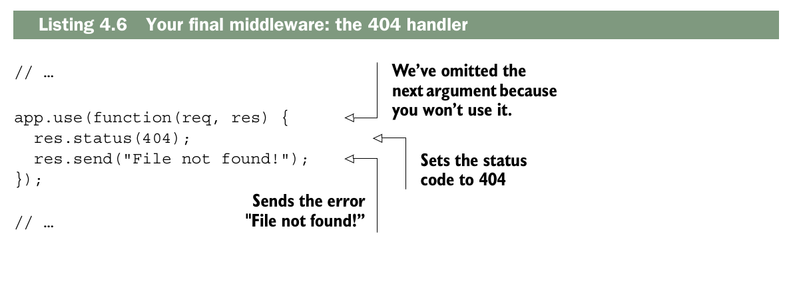

Esta es la última pieza del rompecabezas. Ahora, al iniciar el servidor, verás todo en funcionamiento. Si accedes a un archivo de la carpeta, aparecerá. De lo contrario, verás el error 404. Además, verás los registros en la consola.

Ahora, intenta mover el manejador de errores 404. Colócalo como el primer middleware en la pila, en lugar del último. Si vuelves a ejecutar la aplicación, verás que siempre obtienes un error 404, sin importar qué. La aplicación llega al primer middleware y no continúa. El orden de la pila de middleware es importante: asegúrate de que las solicitudes fluyan en el orden correcto.
Así es como debería verse la aplicación.

### Switching your logger to an open source one: Morgan

Un consejo habitual en el desarrollo de software es «no reinventes la rueda». Si alguien ya ha resuelto tu problema, suele ser una buena idea aprovechar su solución y pasar a cosas más importantes.

Eso es lo que harás con tu middleware de registro. Eliminarás el trabajo arduo que realizaste (las cinco líneas) y usarás un middleware llamado Morgan (https://github.com/expressjs/morgan). No está integrado en el núcleo de Express, pero el equipo de Express se encarga de su mantenimiento.

Morgan se describe a sí mismo como un "middleware de registro de solicitudes", que es justo lo que necesitas. Ejecuta `npm install morgan --save` para instalar la última versión del paquete Morgan.
Lo encontrarás en una nueva carpeta dentro de `node_modules` y también aparecerá en `package.json`.

Ahora, modifiquemos `app.js` para usar Morgan en lugar de tu middleware de registro.

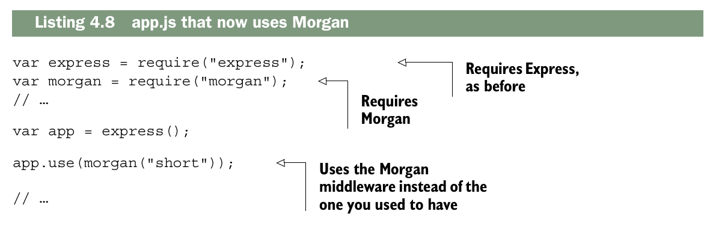

Ahora, al ejecutar esta aplicación, verá una salida similar a la que se muestra en la figura 4.6, con la dirección IP y otra información útil.

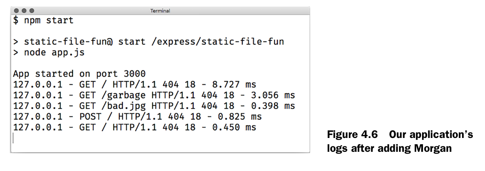

¿Qué está pasando aquí? `morgan` es una función que devuelve una __función de middleware__. Cuando la llamas, devuelve una función similar a la que escribiste anteriormente; recibe tres argumentos y ejecuta `console.log`.

La mayoria del middleware de terceros se funciona asi: se llama una funcion que devuelve el middleware, el cual luego se utiliza, Podrias haber escrito lo anterior de la siguiente manera

```js
var morganMiddleware = morgan("short");
app.use(morganMiddleware);
```

Observa que estás llamando a Morgan con un argumento: una cadena de texto, __"short"__. Esta es una opción de configuración específica de Morgan que determina el formato de la salida.

Existen otras cadenas de formato con más o menos información: __"combined"__ proporciona mucha información; __"tiny"__ proporciona una salida mínima. Al llamar a Morgan con diferentes opciones de configuración, en realidad estás haciendo que devuelva una función de middleware diferente.

Morgan es el primer ejemplo de middleware de código abierto que usarás, pero lo usarás mucho a lo largo de este libro. Usarás otro para reemplazar tu segunda función de middleware: el servidor de archivos estáticos.

Hay una pieza de middleware que viene a compañada con Express, y remplaza tu segundo middleware.

Se llama `express.static`. Funciona de forma muy parecida al middleware que escribimos, pero tiene muchas otras características. Realiza varios trucos complejos para lograr una mayor seguridad y rendimiento, como la adición de un mecanismo de almacenamiento en caché.

Si te interesa conocer más sobre sus beneficios, puedes leer mi entrada de blog en http://evanhahn.com/express-dot-static-deep-dive/.

Al igual que Morgan, `express.static` es una función que devuelve una función de middleware. Recibe un argumento: la ruta a la carpeta que usarás para los archivos estáticos. Para obtener esta ruta, usarás `path.join`, como antes. Luego, la pasarás al middleware estático.

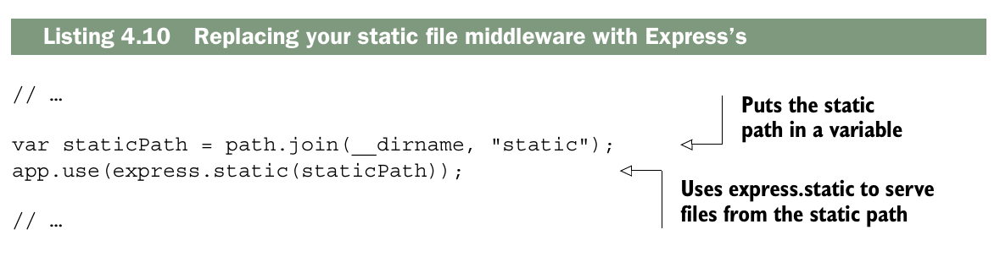

Esto es un poco más complicado porque tiene más funciones, pero `express.static` funciona de manera bastante similar a lo que tenía antes. Si el archivo existe en la ruta, lo enviará. De lo contrario, llamará a `next` y continuará con el siguiente middleware de la pila.

Si reinicia su aplicación, no notará mucha diferencia en la funcionalidad, pero su código será mucho más corto. Debido a que está utilizando middleware probado en batalla en lugar del suyo propio, también obtendrá un conjunto de funciones mucho más confiable.

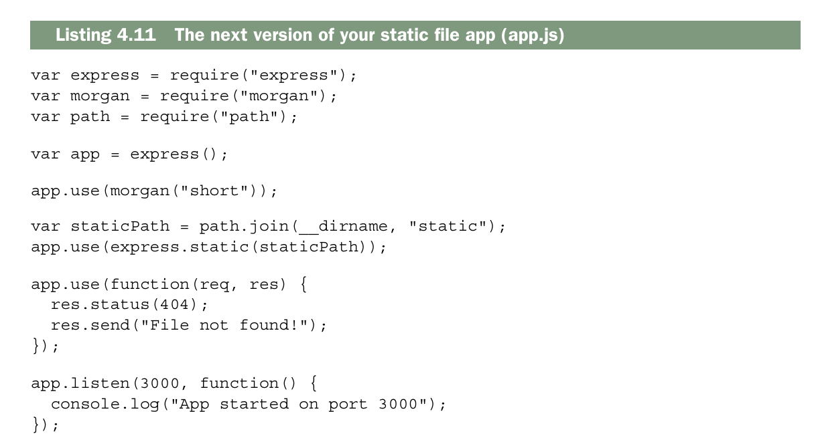

Creo que puede considerar que su servidor de archivos estáticos con tecnología Express está completo por ahora. Bien hecho, héroe.

## Error-handling middleware

¿Recuerda cuando dije que la siguiente llamada continuaría con el siguiente middleware? Mentí. Era mayoritariamente cierto, pero no quería confundirte. 
Hay dos tipos de middleware. Hasta ahora ha estado lidiando con el primer tipo: funciones de middleware regulares que toman tres argumentos (a veces dos cuando se descarta `next`). La mayor parte del tiempo, su aplicación está en modo normal, que solo analiza estas funciones de middleware y omite las demás.

Hay un segundo tipo que se usa mucho menos: el __middleware de manejo de errores__. Cuando su aplicación está en __modo de error__, se ignoran todos los middlewares normalres y Express ejecutará solo funciones del __middleware de manejo de errores__.

Para ingresar al modo de error, simplemente llame a `next` con un argumento. Es una convencion llamarlo con un objeto de error `next(new Error ("Something bad happened!"))`. 

Estas funciones de _middleware de manejo de errores_ toman cuatro argumetos. El primero es el error (el argumento pasado dentro de `next`), y restos son los tres mismos de antes: `request`, `response` y `next`. Puedes hacer cualquier cosa en este middleware.

Cuando hayas terminado, es exactamente como cualquier otro middleware: puedes llamar a `response.end` o `next`. Llamar al `next` sin argumentos saldra del modo error y pasara al siguiente middleware normal; llamarlo con un argumento continuara con __siguiente middleware de manejo de errores__, si existe.

Vamos a decir que tienes cuatro funciones de middleware seguidas. Las dos primeras son normales, la tercera maneja errores y la cuarta es normal. Si no hay errores, el flujo se mostrara como la siguiente figura.

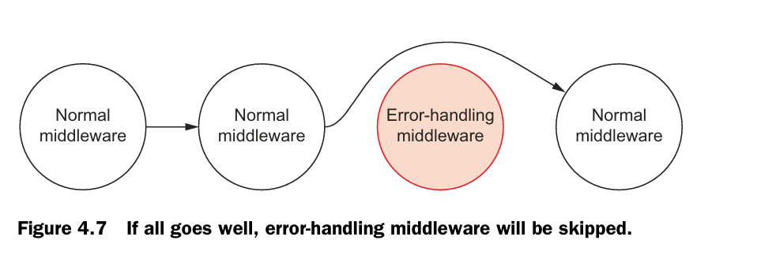

Si no ocurren errores, sera como si el _middleware de manejo de erroes_ nunca hubiera existido. Para ser mas preciso, «sin errores» significa que «nunca se llamó a `next` con ningún argumento». Si _sucede_ un error, entonces Express omitira todos los otros middlewares hasta llegar al primer middleware manejador de errores en la pila. Esto podria verse como en la siguiente figura.

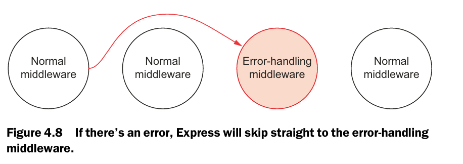

Auque no es obligatorio, el middleware de manejo de errores, se coloca convencionalmente al final de tu pila de middleware, despues de que se haya agregado todo el middleware normal. Esto de debe a que quiere copturar cualquier error que venga en cascada desde los middlewares anteriores. Este ultimo es asi, porque, Express funciona como una cadena: `→ → → → →`. No retrocede, nuca hace esto: `← ← ←`

> Aquí no se capturan errores.
El middleware de manejo de errores de Express no maneja errores que se lanzan con la palabra clave _throw_, solo cuando llamas a `next` con un argumento.

Express tiene algunas protecciones para este tipo de excepciones.La aplicación devolverá un error 500 y esa petición fallará, pero la aplicación seguirá funcionando. Sin embargo, algunos errores como los errores de sintaxis harán que tu servidor se caiga.

Vamos decir que estas escribiendo una apicacion simple en Express, que envia un imagen al usuario, no importa que. Usaremos `response.sendFile` igual que antes.

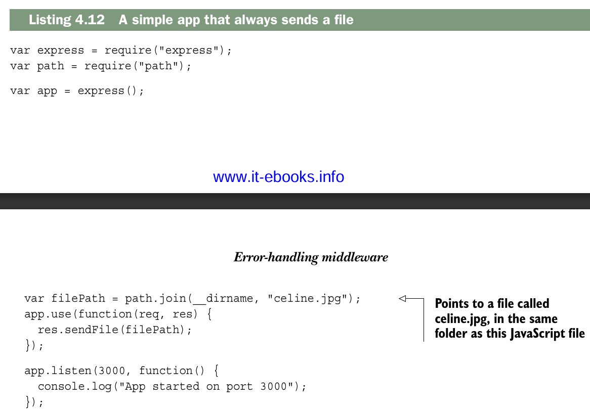

Este codigo deberia verse como una version simplicada de un servidor estatico de archivos que construites anteriormente. Enviara incondicionamente celine.jpg.

Pero que pasa si el archivo no existe en tu computadora ? Que pasaria si se presenta un error al leer el archivo ?. Necesitaras una forma de manejar ese error. Middleware manejador de errores al rescate!.

Para entrar en modo de error, usarás una característica útil de `res.sendFile`: puede recibir un argumento adicional, que es una __callback__. Esta callback se ejecuta cuando el proceso de envío del archivo termina, ya sea porque se completó correctamente o porque ocurrió un error durante el envío.
Si ocurre un error, este se pasa como argumento a la callback; si no ocurre ninguno, el argumento será `null` o `undefined`.


En lugar de imprimir la historia de éxito en la consola, puedes entrar en modo de error llamando a next con un argumento si hay un error. Puedes hacer algo como lo que se muestra en el siguiente listado.


Ahora que estas en el modo error, puedes manejarlo.

Es comun tener un registro de todos los errores que suceden en tu aplicacion, pero usualmente esto no le muestras a los usuarios. Un rastreo de pila de JavaScript extenso puede resultar bastante confuso para un usuario no técnico. Esto tambien podria exponer tu codigo a hakers — Si un hacker logra ver cómo funciona tu sitio, podrá encontrar vulnerabilidades que explotar.

Vamos a escribir un middleware simple que registre los errores, pero que no responda al error. Se verá muy parecido al middleware que escribiste antes, pero en lugar de registrar información de la petición, registrará el error. Puedes añadir lo siguiente a tu archivo después de todo el middleware normal.


Ahora cuando se produzca un error,lo registraras en la consola y podras investigarlo mas tarde. Pero hay mas cosas que deben hacerse para manejar este error. Esto es similar a lo anterior: el logger hizo algo, pero no respondió a la solicitud. Vamos a escribir esa parte. Puedes agregar este código después del middleware anterior. Esto simplemente responderá al error con un código de estado 500.


Ten en cuenta que, independientemente de dónde se coloque este middleware en tu pila, no se ejecutará a menos que estés en modo de error —en el código, esto significa llamar a `next` con un argumento. 

Puede que notes que este middleware de manejo de errores tiene cuatro argumentos, pero no los usamos todos. Express usa el numero de argumentos de una funcion para determinar cuales son los middlewares menjadores de errores y cuales no.

Para aplicaciones simples, no hay montones y montones de lugares donde las cosas puedan salir mal. Pero a medida que tus aplicaciones crecen, querrás recordar probar el comportamiento erróneo. Si una petición falla y esta no debería, asegúrate de manejarlo de forma elegante en vez de que la app se cuelgue. Si una acción debería ejecutarse correctamente pero falla, asegúrese de que su servidor no colapse. El middleware de manejo de errores puede ayudar a prevenir esto.

## Other useful middleware
Dos aplicaciones Express diferentes pueden tener pilas de middleware bastante distintas. La pila de la aplicación de ejemplo es solo una entre muchas configuraciones posibles, y hay muchas otras que puedes usar. Hay solo una pieza de middleware que viene incluida por defecto con Express: `express.static`. A lo largo de este libro vas a instalar y usar muchos otros middlewares. Aunque estos módulos no vienen empaquetados con Express, el equipo de Express mantiene varios de ellos, por ejemplo:

- `body-parser`, para analizar el cuerpo de las solicitudes (por ejemplo, cuando un usuario envía un formulario).  
- `cookie-parser`, para analizar las cookies de los usuarios; suele usarse junto con un middleware como `express-session` para mantener sesiones y gestionar cuentas de usuario.  
- `compression`, para comprimir las respuestas y ahorrar bytes en la transferencia.

Además hay una gran cantidad de módulos de terceros, como:

- `helmet`, que ayuda a hacer más seguras tus aplicaciones (protegiendo de muchos tipos de ataques comunes).  
- `connect-assets`, que compila y minifica tus archivos CSS y JavaScript, y también funciona con preprocesadores como SASS, SCSS, LESS o Stylus.

Esta lista no es exhaustiva; en el apéndice A se recomiendan otros módulos útiles si quieres más herramientas de ayuda.

## Summary
- Las aplicaciones Express tienen una pila de middleware. Cuando una solicitud entra en tu aplicación, va pasando por esa pila de middleware de arriba hacia abajo, a menos que se interrumpa al enviar una respuesta o al producirse un error. 
- El middleware se escribe usando funciones manejo de la solicitud, que reciben al menos dos argumentos: primero, un objeto que representa la petición entrante, y segundo, un objeto que representa la respuesta saliente. Muchas veces también reciben una función adicional que les indica cómo continuar con el siguiente middleware en la pila.
- Existe una gran cantidad de middleware de terceros que puedes usar, y muchos de ellos están mantenidos por los desarrolladores de Express.