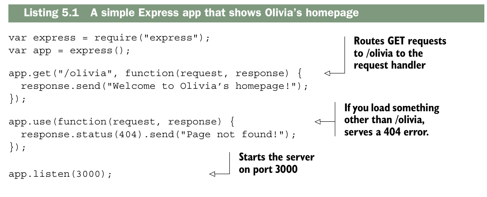
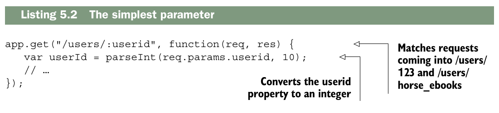
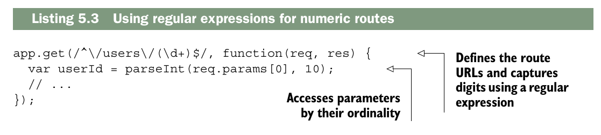
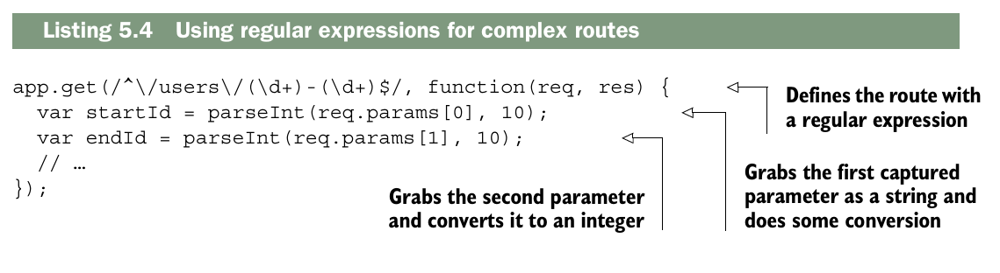
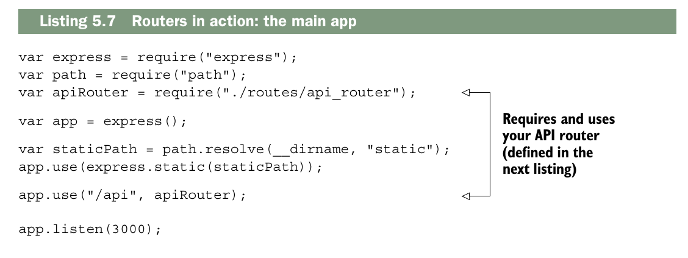
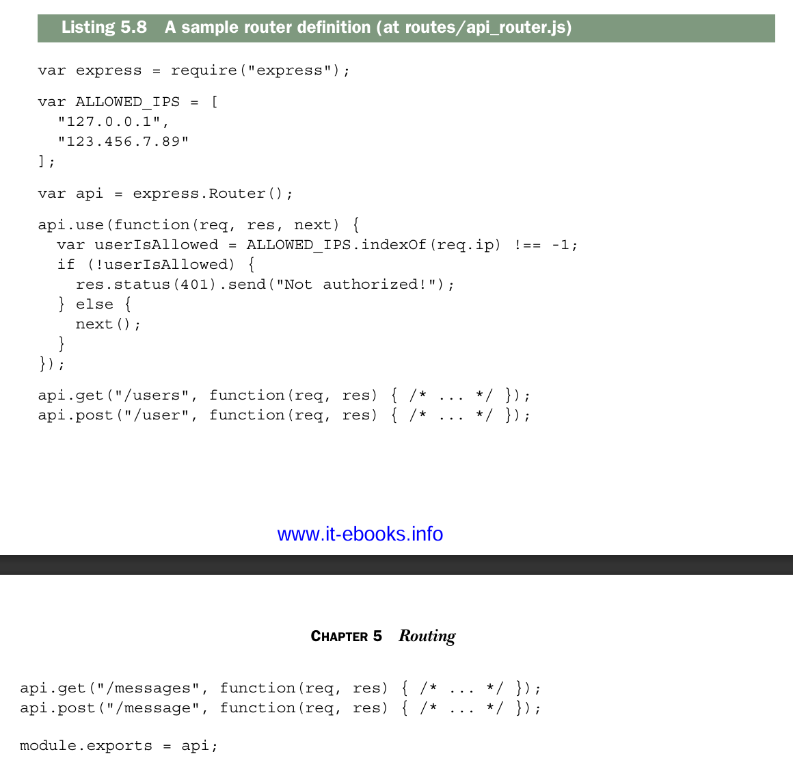
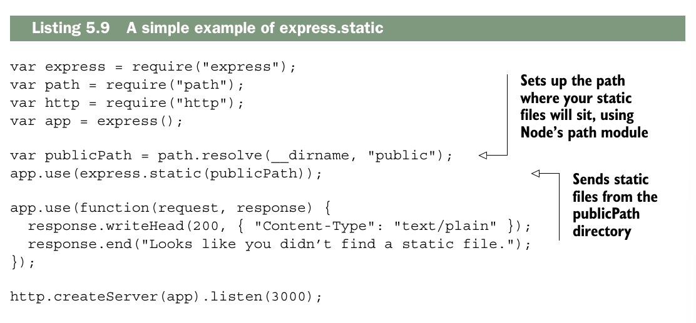

# Routing
Este capitulo cubre:

- __Enrutamiento simple y basado en coincidencia de patrones__
- __Uso de middleware con enrutamiento__
- __Servir archivos estáticos con express.static, el middleware integrado de archivos estáticos de Express__
- __Uso de Express con el módulo HTTPS integrado de Node.js__
  
Como ya has visto, el enrutamiento es una de las grandes caracteristicas de Express, te permite mapear diferentes solicitudes para diferentes manejadores de solicitud. En este capitulo produndizaremos mas. Analizaremos el enrutamiento en datalle, veremos como usat Express con HTTP, exploraremos nuevas caractersticas de Express 4 y mas. Tambien construiremos un par de aplicaciones centradas en el enrutamiento, uno de ellos servira como  ejemplo recurrente a lo  largo del resto del libro.

En este capitulo, te contare todo lo que necesitas saber sobre enrutamiento en Express.

## What is routing?
Vamos a imaginar que estas contruyendo una pagina de inicio para Olivia Ejemplo. Ella es una gran chica y es un honor para ti crear su sitio web.

Si estas usando un navegador para visitar `example.com/olivia`, así es como podría verse la primera parte de la solicitud HTTP.

`GET` /olivia http/1.1`

Esa solicitud HTTP tiene un __verbo (`GET`)__, una __URI (`/olivia`)__ y la version __HTTP(`1.1`)__. Cuando haces enrutamiento, tomas la combinacion del verbo + URI y la asocias a un manejador de solicitud. Basicamente dices, "Hey, Express! Cuando veas una solicitud `GET` a `/about_me`, ejecuta este codigo. Y cuando veas una solicitud `POST` a `/new_user`, ejecuta este otro codigo."

Eso es básicamente todo: el enrutamiento asigna verbos y URI a código específico. Veamos un ejemplo sencillo.

### A simple routing example
Supongamos que quieres escribir una aplicación Express sencilla que responda a la solicitud HTTP anterior (una solicitud HTTP GET a /olivia). Llamarás a los métodos de tu aplicación Express, como se muestra en el siguiente listado.



La parte central de este ejemplo está en la tercera línea: cuando recibes solicitudes HTTP GET a `/olivia`, se ejecuta el manejador de solicitudes especificado. Para **hacer énfasis** en esto: lo ignorarás si ves una solicitud GET a algún otro URI, y también lo ignorarás si ves una solicitud que no sea GET a `/olivia`.

Cuando digo **“hacer énfasis”** me refiero a subrayar o recalcar la idea principal: que el manejador de solicitudes solo se ejecuta en casos muy específicos. Es decir:

1. Solo responde a **GET requests**. Si llega cualquier otro tipo de solicitud (POST, PUT, DELETE, etc.) a `/olivia`, **no hará nada**.
2. Solo responde a la ruta `/olivia`. Si alguien pide, por ejemplo, `/juan` o `/index`, **no hará nada** tampoco.

En otras palabras, el servidor “ignora” todo lo que no cumpla estas dos condiciones y solo actúa cuando se cumplen ambas. Es una forma de enfatizar que este manejador no es genérico, sino muy específico.

Este es un ejemplo bastante simple (de ahí el título de esta sección). Echemos un vistazo a características de enrutamiento más complejas.

## The features of routing

Hasta ahora hemos visto un ejemplo sencillo de enrutamiento. Conceptualmente no es nada loco: simplemente mapea una combinación de verbo HTTP y URI a un manejador de solicitud. Esto te permite asociar cosas como `GET /about` o `POST /user/log_in` a un fragmento específico de código. ¡Está muy bien! Pero somos ambiciosos. Si Express fuera un recipiente de helado, no nos conformaríamos con una sola bola; queremos más bolas, queremos chispas, queremos salsa de chocolate, queremos más características de enrutamiento.

> NOTA: Algunos otros frameworks (como Ruby on Rails, por ejemplo) tienen un archivo de enrutamiento centralizado donde todas las rutas se definen en un solo lugar. Express no funciona así: las rutas pueden definirse en muchos lugares diferentes.

### Grabbing parameters to routes

Las rutas que acabas de ver podrían expresarse en código usando el operador de igualdad estricta (`===`): ¿está el usuario visitando `/olivia`? Eso es muy útil, pero no te da todo el poder expresivo que quizá necesitas. Imagina que te encargan hacer un sitio web con perfiles de usuario, y que cada usuario tiene un identificador numérico. Quieres que la URL del usuario número 1 sea `/users/1`, el usuario número 2 esté en `/users/2`, y así sucesivamente. En lugar de definir en código una ruta nueva para cada usuario (lo cual sería una locura), puedes definir una sola ruta para todo lo que empiece por `/users/` y luego tenga un ID.

__THE SIMPLEST WAY__

La forma mas sencilla de capturar un parametro es poniendolo en la ruta con dos puntos delante. Para obtener su valor debes consultar la propiedad `params` de objeto `request`.



En este ejemplo se ve cómo capturar parámetros de una ruta más dinámica. El código coincidirá con lo que quieres, como `/users/123` y `/users/8`. Pero aunque no coincidirá con una ruta sin parámetro como `/users/` ni con `/users/123/posts`, probablemente aún coincida con más cosas de las que deseas. También coincidirá con `/users/cake` y `/users/horse_ebooks`. Si quieres ser más específico, tienes varias opciones.

__¿Por qué coincide con /users/cake?__
La razón es que `:userid` es simplemente un__ nombre de parámetro__, no una validación de tipo. Express solo dice:

> _"Captura cualquier cosa que venga después de `/users/`"_

Entonces `:userid` __acepta cualquier string__, no solo números enteros. Por eso:


| Ruta | ¿Coincide? | Valor de `req.params.userid` |
|------|-----------|------------------------------|
| `/users/123` | ✅ | `"123"` |
| `/users/8` | ✅ | `"8"` |
| `/users/cake` | ✅ | `"cake"` |
| `/users/horse_ebooks` | ✅ | `"horse_ebooks"` |
| `/users/` | ❌ | — |
| `/users/123/posts` | ❌ | — |

El `parseInt()` que aparece en el código convierte el valor a número **después** de que la ruta ya coincidió, no antes. Si le pasas `"cake"`, `parseInt("cake", 10)` devuelve `NaN`, pero Express ya aceptó la solicitud.

> NOTA: Aunque a menudo querrás ser más específico al definir tus parámetros, puede que esto sea perfectamente válido para tu caso de uso. Quizá quieras permitir tanto `/users/123` como `/users/count_dracula`. Incluso si solo quieres permitir parámetros numéricos, quizá prefieras tener la lógica de validación directamente en la ruta. Como verás más adelante, hay otras formas de hacerlo, pero esto podría bastarte perfectamente.

### Using regular expressions to match routes

Express te permite especificar tus rutas como cadenas y como expresiones regulares. Esto teda mas control sobre las rutas que especificas. Tambien puedes usar expresiones regulares para coincidir parametros, como veras.

Vamos a imaginar que quieres hacer coincidir cosas como `user/123` o `users/456` pero no `users/olivia`, puedes codificar esto en una expresion regular, y de paso extraer el numero.



Esta es una forma de aplicar la restricción de que el ID de usuario debe ser un número entero. Al igual que en el ejemplo anterior, se pasa como una cadena de texto, por lo que hay que convertirlo a un número (y probablemente a un objeto de usuario más adelante). Las expresiones regulares pueden ser algo difíciles de leer, pero permiten definir rutas mucho más complejas. Por ejemplo, se podría definir una ruta que busque rangos; es decir, si se visita /users/100-500, se puede ver una lista de usuarios con IDs del 100 al 500. Las expresiones regulares facilitan bastante la expresión de esto, como se muestra aquí.



### Grabbing query arguments

Otra forma habitual de pasar información de forma dinámica en las URLs es usando cadenas de consulta (*query strings*). Seguramente hayas visto cadenas de consulta cada vez que has hecho una búsqueda en internet. Por ejemplo, si buscas “javascript-themed burrito” en Google, verás una URL parecida a esta:  
`https://www.google.com/search?q=javascript-themed%20burrito`.  
Esto es pasar una consulta (*query*). Si Google estuviera escrito en Express (que no lo está), podría manejar una consulta de la forma que se muestra en el siguiente listado.


Esto es bastante similar a cómo manejas los parámetros, pero te permite usar este estilo de consulta.

> NOTA: Desafortunadamente, existe un error de seguridad bastante común con los parámetros de consulta. Si visitas `?arg=something`, entonces `req.query.arg` será una cadena. Pero si vas a `?arg=something&arg=somethingelse`, entonces `req.query.arg` será un arreglo. En el capítulo 8 veremos con detalle cómo manejar este tipo de problemas. En general, querrás asegurarte de no asumir ciegamente que algo es una cadena o un arreglo.

## Using routers to split up your app

Es probable que, a medida que tu aplicación crezca, también lo haga el número de rutas. Tu sitio web colaborativo de montajes fotográficos de gatos podría comenzar con rutas para archivos estáticos e imágenes, pero más adelante podrías añadir cuentas de usuario, chat, foros, etc. El número de rutas puede volverse inmanejable.

Express 4 incorporó _routers_, una función que ayuda a aliviar estos problemas de crecimiento. Según la documentación de Express:

> Un enrutador es una instancia independiente de middleware y enrutamiento. Los enrutadores pueden considerarse como «mini» aplicaciones capaces únicamente de realizar funciones de middleware y enrutamiento. Toda aplicación Express cuenta con un enrutador de aplicaciones integrado por defecto.

Los enrutadores funcionan como middleware y pueden ser utilizados por la aplicación mediante la función `.use()` en otros enrutadores. En otras palabras, los enrutadores permiten dividir una aplicación grande en numerosas miniaplicaciones que luego se pueden combinar. Para aplicaciones pequeñas, esto podría ser excesivo, pero en cuanto pienses: «Este archivo `app.js` se está volviendo demasiado grande», es momento de considerar dividir la aplicación con enrutadores.

La figura muestra cómo usar enrutadores desde el archivo principal de la aplicación.



Como puedes ver, el enrutador de la API se utiliza igual que el middleware, ya que los enrutadores son, básicamente, middleware. En este caso, cualquier URL que comience por `/api` se enviará directamente a tu enrutador. Eso significa que `/api/users` y `/api/message` utilizarán el código de tu enrutador, pero algo como `/about/celinedion` no lo hará.

Ahora, define tu enrutador de la siguiente manera. Piensa en él como una subaplicación.



Esto se parece mucho a una miniaplicación; admite middleware y rutas. La principal diferencia es que no puede funcionar de forma independiente; debe integrarse en una aplicación principal. Los enrutadores pueden realizar el mismo enrutamiento que las aplicaciones grandes y pueden usar middleware.

Podrías imaginarte creando un enrutador con muchos subenrutadores. Quizás quieras
crear un enrutador de API que, a su vez, delegue en un enrutador de usuarios y un enrutador de mensajes, o tal vez algo más.

### Estos son temas complementatios 
### La propiedad Router
```js
function createRouter() {
  const router = function(req, res, next) {
    router.handle(req, res, next);
  };

  router.stack = [];

  router.use = function(path, handler) {
    router.stack.push({ path, handler });
  };

  router.get = function(path, handler) {
    router.stack.push({ path, method: "GET", handler });
  };

  router.post = function(path, handler) {
    router.stack.push({ path, method: "POST", handler });
  };

  router.handle = function(req, res, next) {
    for (let layer of router.stack) {
      if (req.url.startsWith(layer.path)) {
        return layer.handler(req, res, next);
      }
    }
    next && next();
  };

  return router;
}
```
```js
express.Router = function() {
  return createRouter();
};
```
Cuando llega la request, Ahí es donde nace `next`. Mira esto:
```js
function handle(req, res) {
  let i = 0;

  function next() {
    let layer = stack[i++];
    if (!layer) return;

    if (!req.url.startsWith(layer.path)) return next();
    if (layer.method && layer.method !== req.method) return next();

    layer.handler(req, res, next); // 💥 AQUÍ aparece next
  }

  next();
}
```
Esta podria ser otra vision implementando el manejador `middleware de error`
```js
function next(err) {
    let layer = stack[i++];
    if (!layer) return;

    // ⬅ Aquí simplemente pasamos el err como viene, sin modificarlo
    if (!req.url.startsWith(layer.path)) return next(err);
    if (layer.method && layer.method !== req.method) return next(err);

    if (err) {
      if (layer.handler.length === 4) {
        layer.handler(err, req, res, next); // ✅ Aquí sí pasas err
      } else {
        next(err); // ⬅ Sigue buscando un handler de error
      }
    } else {
      if (layer.handler.length < 4) {
        layer.handler(req, res, next);
      } else {
        next(); // Sin error, salta handlers de error
      }
    }
}
```
La clave está en que err viaja a través de todos los next(err) hasta encontrar un handler con 4 argumentos que lo atrape. Es como una cadena donde el error se va pasando de layer en layer hasta que alguien lo maneja.

Un protocolo es como un reglamento completo de comunicación:
```sh
Protocolo
    ├── Acciones disponibles
    ├── Formato de mensajes
    ├── Cómo conectarse
    ├── Cómo manejar errores
    ├── Seguridad
    └── Cómo desconectarse
```
Es como las reglas de un idioma: no solo son las palabras (acciones), sino también la gramática, puntuación, y normas de conversación.

Un ejmplo con HTTP:

1. Cómo establecer la conexión (Handshake)
Antes de enviar cualquier cosa, cliente y servidor se saluda
```sh
Cliente  →  "Quiero conectarme"          (SYN)
Servidor →  "Acepto, estás conectado"    (SYN-ACK)
Cliente  →  "Perfecto, empecemos"        (ACK)
```
2. Acción + Formato del mensaje (Request)
```sh
GET /users/123 HTTP/1.1        ← Acción + Ruta + Versión
Host: www.ejemplo.com          ← Headers
Accept: application/json       ← Headers
                               ← Línea en blanco obligatoria
(sin body)                     ← Body vacío
```
3. Respuesta del servidor (Response)
```sh
HTTP/1.1 200 OK                ← Versión + Código + Texto
Content-Type: application/json ← Headers
Content-Length: 27             ← Headers
                               ← Línea en blanco obligatoria
{"id": 123, "name": "Juan"}    ← Body con los datos
```
4. Manejo de errores
```sh
HTTP/1.1 404 Not Found         ← El recurso no existe
HTTP/1.1 500 Internal Error    ← Algo falló en el servidor
HTTP/1.1 401 Unauthorized      ← No tienes permiso
```
5. Seguridad (HTTPS)
```sh
Cliente  →  "Quiero conexión segura"
Servidor →  "Aquí está mi certificado"
Cliente  →  "Verificado, encriptemos"
           🔒 Todo lo de arriba ahora viaja encriptado
```
6. Cerrar la conexión
```sh
Cliente  →  "Ya terminé"         (FIN)
Servidor →  "Entendido"          (ACK)
Servidor →  "Yo también terminé" (FIN)
Cliente  →  "Hasta luego"        (ACK)
```
Todo el flujo junto:
```sh
1. Handshake     → Se conectan
2. Request       → Cliente pide GET /users/123
3. Response      → Servidor responde con los datos
4. Error (si hay)→ Servidor responde 404, 500...
5. Seguridad     → Todo encriptado si es HTTPS
6. Desconexión   → Se despiden y cierran la conexión
```
## Sí, ambos tienen cuerpo

Pero con una diferencia importante:

---

### Request
El body **no siempre se usa**, depende del verbo:

| Verbo | ¿Tiene body? |
|-------|-------------|
| `GET` | ❌ No |
| `DELETE` | ❌ No |
| `POST` | ✅ Sí |
| `PUT` | ✅ Sí |
| `PATCH` | ✅ Sí |

Porque `GET` y `DELETE` solo dicen **"dame esto"** o **"borra esto"**, no necesitan enviar datos extra.

---

### Response
El body **casi siempre tiene algo**, pero tampoco siempre:

| Código | ¿Tiene body? |
|--------|-------------|
| `200 OK` | ✅ Sí, los datos pedidos |
| `201 Created` | ✅ Sí, el recurso creado |
| `404 Not Found` | ✅ Sí, mensaje de error |
| `204 No Content` | ❌ No, intencionalmente vacío |

---

Entonces la estructura completa de ambos sería:

```
Request  = Línea de inicio + Headers + Línea en blanco + Body (opcional)
Response = Línea de inicio + Headers + Línea en blanco + Body (casi siempre)
```

## Serving static files
A menos que estés creando un servidor web que sea 100% API (y me refiero al 100%), probablemente enviarás uno o dos archivos estáticos.

Quizás tengas que enviar archivos CSS, quizás tengas una aplicación de una sola página que necesite enviar archivos estáticos, o quizás seas un entusiasta de las donas y tengas gigabytes de fotos de donas para deleitar a tus hambrientos espectadores.

Ya has visto cómo enviar archivos estáticos, pero vamos a explorarlo con más detalle.

## Static files with middleware

Ya hemos enviado archivos estáticos con middleware antes, pero no se preocupen, vamos a profundizar un poco más. Ya lo vimos en el capítulo 2, así que no voy a extenderme sobre las ventajas de esto. El siguiente listado es un resumen del ejemplo de código que usamos en el capítulo 2.



Recuerda que `path.resolve` ayuda a mantener la resolución de rutas multiplataforma (las cosas son diferentes en Windows, Mac y Linux). Recuerda también que esto es mucho mejor que hacerlo todo manualmente. Si algo no te queda claro, consulta el capítulo 2.

Ahora profundicemos.

### CHANGING THE PATHS FOR CLIENTS
Es común que quieras servir archivos en la raíz de tu sitio. Por ejemplo, si tu URL es http://jokes.edu y sirves jokes.txt, la ruta será http://jokes.edu/jokes.txt. Pero quizas tambien quieras alojar archivos estáticos en una URL diferente para los clientes. Por ejemplo, podrías querer que una carpeta llena de fotos ofensivo-pero-divertidísimo parezca estar en una carpeta llamada "offensive", de modo que un usuario pueda visitar http://jokes.edu/offensive/photo123.jpg. 

¿Cómo podrías hacer esto?

Al grano, con sentido técnico claro:

> **¡Express al rescate!** El middleware puede montarse en un prefijo determinado. En otras palabras, puedes hacer que un middleware responda solo si la ruta comienza con `/offensive`. El siguiente ejemplo muestra cómo se hace.


Ahora los navegadores web y otros clientes pueden acceder a tus fotos ofensivas desde una ruta distinta a la raíz. Ten en cuenta que esto se puede hacer con cualquier middleware, no solo con el de archivos estáticos. Quizás el ejemplo más claro sea el que acabas de ver: montar los enrutadores de Express en un prefijo.

### ROUTING WITH MULTIPLE STATIC FILE DIRECTORIES

Con frecuencia me encuentro con archivos estáticos en varios directorios. Por ejemplo, a veces tengo archivos estáticos en una carpeta llamada "public" y otros en una carpeta llamada "user_uploads". ¿Cómo puedo hacer esto con Express?

Express resuelve este problema con su función de middleware integrada, y como `express.static` es un middleware, puedes aplicarlo varias veces. Aquí te mostramos cómo podrías hacerlo.


Ahora, imaginemos cuatro escenarios y veamos cómo los maneja este código:

- _El usuario solicita un recurso que no se encuentra en la carpeta pública ni en la carpeta user-uploads_. Ambas funciones de middleware estático continuarán con las siguientes rutas y middleware.
- _El usuario solicita un recurso que se encuentra en la carpeta pública_. El primer middleware enviará el archivo y no se llamará a ninguna ruta ni función de middleware posterior.
- _El usuario solicita un recurso que se encuentra en la carpeta user-uploads, pero no en la carpeta pública._ El primer middleware continuará su ejecución (el recurso no está en la carpeta pública), por lo que el segundo middleware lo procesará.
Después de esto, no se ejecutará ningún otro middleware ni ruta.
- _El usuario solicita un recurso que se encuentra tanto en la carpeta pública como en la carpeta user-uploads_. Dado que el middleware que sirve el recurso público tiene prioridad, los usuarios obtendrán el archivo en la carpeta pública y nunca podrán acceder al archivo correspondiente en la carpeta user_uploads.

Como siempre, puedes montar el middleware en diferentes rutas para evitar el problema que se plantea en la cuarta opción. El siguiente fragmento de código muestra cómo puedes hacerlo


Ahora bien, si image.jpg se encuentra en ambas carpetas, podrá obtenerla tanto de la carpeta pública en `/public/image.jpg` como de la carpeta user_uploads en `/uploads/image.jpg.`

### Routing to static files

Es posible que desee enviar archivos estáticos con una ruta. Por ejemplo, podría querer enviar la foto de perfil de un usuario si visita /users/123/profile_photo. El middleware estático no tiene forma de saber esto, pero Express ofrece una manera práctica de hacerlo, que utiliza muchos de los mismos mecanismos internos que el middleware estático.

Supongamos que desea enviar fotos de perfil cuando alguien visita /users/:userid/profile_photo. Supongamos también que tiene una función mágica llamada getProfilePhotoPath que recibe un ID de usuario y devuelve la ruta a su foto de perfil. El siguiente código muestra cómo hacerlo.


En el capítulo 2, viste que esto sería un gran problema sin Express. Tendrías que abrir el archivo, averiguar su tipo de contenido (HTML, texto plano, imagen, etc.), su tamaño, etc. La función sendFile de Express hace todo esto por ti y te permite enviar archivos fácilmente. Puedes usarla para enviar cualquier archivo que quieras.

## Using Express with HTTPS

Como lo dicutimos en el capitulo anterior, HTTPS agrega una capa de seguridad a HTTP (Aunque nada es invulnerable). Esta capa de seguridad se llama TLS (Trasnport Layer Segurity) o SSL (Secure Sockets Layer). Los nombres se usan indistantamente,  pero TLS es tecnicamente el sucessor de SSL.

No entrare en los complejos calculos matematicos, pero TLS utiliza criptografia de clave publica, que funciona asi: cada participante tiene una clave publica que comparte con todos y una clave privada que no comparte con nadie. Si quiero enviarte algo, encripta el mensaje con __mi clave privada__ _(probablemente en algun lugar en mi ordenador)_ __y tu clave publica__ _(disponible para cualquiera)_. De esta forma, puedo enviarte mensajes que, para cualquier intruso, parecera ilegibles, y tu los descifras con tu clave privada y mi clave publica. Gracias a una lógica matemática asombrosa, podemos mantener una conversación segura incluso si todos nos escuchan, sin necesidad de acordar previamente ningún código secreto.

Si esto resulta un poco confuso, recuerde que ambos interlocutores tiene una clave publica y una clave provada. En TSL, la clave publica tambien tiene una propiedad especial llamada certiicado. Si estoy hablando con usted, me mostrara su certificado (tambien conocido como su clave publica)y yo me asegurare de que sea usted verificando que una autoridad de certificacion confirme su autoridad. Su navegador tiene una lista de autoridades de certificacionde  confianza; empresas como VeriSing y Google gestionan estas autoridades de ceritificacion, conocidas como CA.

Me imagino a las autoridades de certificacion como un guardaespaldas. Cuando hablo con alguien, miro a mi guardaespaldas y le pregunto: «Oye, ¿esta persona es quien dice ser?». Mi guardaespaldas me mira y asiente levemente o niega con la cabeza.

> NOTA: Algunos proveedores de alojamiento como Heroku se encargan de todo lo relacionado con HTTPS, así que no tienes que preocuparte por ello. Esta sección solo es útil si tienes que configurar HTTPS tú mismo.

Primero, deberá generar sus claves pública y privada con OpenSSL. Si usa Windows, descargue el binario desde https://www.openssl.org/related/binaries.html. Debería venir preinstalado en Mac OS X. Si usa Linux con un gestor de paquetes (como Arch, Gentoo, Ubuntu o Debian) y si no está instalado, instálelo con el gestor de paquetes de su sistema operativo. Puede comprobar si OpenSSL está instalado escribiendo `openssl version` en la línea de comandos. A continuación, ejecute los siguientes dos comandos:

```sh
openssl genrsa -out privatekey.pem 1024
openssl req -new -key privatekey.pem -out request.pem
```
El primer comando genera tu clave privada en privatekey.pem; cualquiera puede hacerlo.

El siguiente comando genera una solicitud de firma de certificado. Te pedirá diversa información y luego generará un archivo llamado request.pem. A partir de aquí, debes solicitar un certificado a una CA (Autoridad de Certificación). Varios grupos en internet trabajan en Let's Encrypt, una CA gratuita y automatizada. Puedes consultar el servicio en https://letsencrypt.org/. Si prefieres otra autoridad de certificación, puedes buscar en línea.

Una vez que tengas un certificado, puedes usar el módulo HTTPS integrado de Node con Express, como se muestra en el siguiente listado. Es muy similar al módulo HTTP, pero tendrás que proporcionar tu certificado y tu clave privada.


Aparte de que debes pasar la clave privada y el certificado como argumentos,
esto es muy similar a http.createServer que ya has visto. Si quieres ejecutar tanto un servidor HTTP como un servidor HTTPS, inicia ambos, como se muestra a continuación.


Lo único que tienes que hacer es ejecutar ambos servidores en puertos diferentes, y listo. Eso es HTTPS.

## Putting it all together: a simple routing demo 

Let’s take what you’ve learned and build a simple web application that returns the
temperature by your United States ZIP Code.

> NOTA: Soy estadounidense, así que este ejemplo utilizará el código postal de EE. UU.,
llamado código ZIP. Los códigos ZIP tienen cinco dígitos y pueden darte una ubicación aproximada bastante buena. Hay 42 522 códigos ZIP, y Estados Unidos abarca
3,7 millones de millas cuadradas, por lo que cada código ZIP cubre aproximadamente 87 millas cuadradas
en promedio. Dado que vamos a usar códigos ZIP, este ejemplo solo funcionará
en Estados Unidos. No debería ser muy difícil crear una aplicación similar que funcione en otros lugares (si te inspiras, puedes probar con la
API de geolocalización HTML5).

Esta aplicación constará de dos partes: una página de inicio que solicita al usuario su código postal y una ruta que envía la temperatura en formato JSON.
¡Comencemos!

### Setting up
Para esta aplicación, usarás cuatro paquetes de Node: Express (obviamente), ForecastIO (para obtener datos meteorológicos de la API gratuita Forecast.io), Zippity-do-dah (para convertir códigos postales en coordenadas de latitud y longitud) y EJS (para renderizar vistas HTML).

(¡Qué buenos nombres, ¿verdad? Especialmente Zippity-do-dah!).
Crea una nueva aplicación Express. Asegúrate de que el archivo package.json se vea similar al siguiente listado cuando llegue el momento de empezar.

Asegúrate de tener todas estas dependencias instaladas ejecutando `npm install` en
el directorio de tu aplicación.

En el cliente, necesitarás jQuery y un framework CSS minimalista llamado Pure
(http://purecss.io/). Probablemente ya conozcas jQuery, pero Pure es un poco menos conocido. Pure te ofrece un poco de estilo para texto y formularios, similar a Bootstrap de Twitter. La diferencia con Pure es que es mucho más ligero, lo que se adapta mejor a este tipo de aplicación.

Crea dos directorios: uno llamado `public` y otro llamado `views`. A continuación, obtén una clave API de Forecast.io en https://developer.forecast.io. Regístrate para obtener una cuenta. En la parte inferior de la página del panel de control encontrarás tu clave API, que es una cadena de 32 caracteres. Tendrás que copiar esta clave API en tu código en breve, así que
asegúrate de tenerla a mano. Ya puedes empezar.

### The main app code

Ahora que ya tienes todo listo, es hora de programar. Empecemos con la aplicación principal. JavaScript. Si seguiste el ejemplo del final del capítulo 2, esto te resultará familiar. Crea el archivo app.js e inserta el código del siguiente listado.

```js
import express from "express"
import {resolve,dirname,join} from "node:path"
import { json } from "node:stream/consumers"
import {fileURLToPath} from "node:url"

const __filename = fileURLToPath(import.meta.url)
const __dirname =  dirname(__filename)
const app = express();

app.use(express.static(resolve(__dirname,"public")))
app.set("views", resolve(__dirname,"views"))
app.set("view engine","ejs")

app.get("/",function(request,response){
    response.render("index")
})

app.get("/clima/:cuidad", async function(request,response){

    const ciudad = request.params.cuidad
    const apiKey = "f52f0a90a7874705e925e5e2ab7de4ca"
    const url = `https://api.openweathermap.org/data/2.5/weather?q=${ciudad}&appid=${apiKey}&units=metric`;

    try {
       
        const respuesta = await  fetch(url)
        const data = await respuesta.json()
        response.json(data)
        console.log(data)

    }catch(e){
        response.status(500).send("Error al obtener el clima.")
    }
    
})

app.use(function(request,response){
    response.status(404).send("404")
})

app.listen(3000,"localhost",()=>{console.log("servidor activado...")})
```
Ahora debes completar el cliente. Esto significa crear algunas vistas con EJS y, como verás, añadirás un poco de CSS y algo de JavaScript del lado del cliente.

### The two views
Esta aplicación tiene dos vistas: la página de error 404 y la página de inicio.
Para que tu sitio web tenga un aspecto uniforme en todas las páginas, crea una plantilla. Necesitarás un encabezado y un pie de página.

Comencemos con el encabezado. Guarda el siguiente código en un archivo llamado `header.ejs.`

```html
<!DOCTYPE html>
<html lang="en">
<head>
    <meta charset="UTF-8">
    <meta name="viewport" content="width=device-width, initial-scale=1.0">
    <title>Document</title>
    <link rel="stylesheet" href="https://cdn.jsdelivr.net/npm/purecss@3.0.0/build/pure-min.css">
    <link rel="stylesheet" href="/main.css">
</head>
<body>
```
A continuación, cierra la página en `footer.ejs`, como se muestra en el siguiente listado.

```html
</body>
</html>
```
Ahora que ya tienes tu plantilla, puedes completar la página de error 404 (como 404.ejs), tal como se muestra en el siguiente listado. Guárdala como `404.ejs`

```js
<%- include("header")%>
 <h1>404 error! File not found.</h1>
<%- include("footer") %>
```
La página de inicio tampoco es demasiado compleja. Guárdala como `index.ejs`.
```js
<%- include("header") %>
<div class="contenedor">
<h1>What is your cyte?</h1>
  <form class="pure-form pure-form-stacked" action="/clima" method="GET">
    <fieldset>
      <legend>Consulta el clima</legend>

      <input 
        type="text" 
        name="ciudad" 
        placeholder="Ej: Cuenca"
        required
      >

      <button class="pure-button pure-button-primary">
        Buscar
      </button>
    </fieldset>
  </form>
</div>

<%- include("footer") %>

```
La página de clima tampoco es demasiado compleja. Guárdala como `clima.ejs`.
```js
<%- include("header") %>

<% if (error) { %>
    <h1>Error</h1>
    <p><%= error %></p>
  <% } else { %>
    <div class="contenedor">
    <h1>Clima en <%= ciudad %></h1> 
    <p>Temperatura: <%= temperatura %> °C</p>
    <p>Descripción: <%= descripcion %></p>
    </div>
  <% } %>

  <a href="/">Volver</a>

<%- include("footer") %>

```
En el código del índice hay un par de referencias al framework Pure CSS; simplemente aplican estilos para que la página se vea mejor. Hablando de estilos, tendrás que completar el archivo main.css que especificaste en la plantilla. Guarda el código del siguiente listado en `public/main.css`.

```css

  body {
    display: flex;
    justify-content: center;
    align-items: center;
    height: 100vh;
    margin: 0;
  }

  .contenedor {
    text-align: center;
  }
```
Este CSS centra eficazmente el contenido de la página, tanto horizontal como verticalmente. Esto no es un libro de CSS, así que no te preocupes si no entiendes exactamente lo que está pasando.
Ahora tienes todo excepto el JavaScript del lado del cliente. Puedes intentar ejecutar la aplicación con npm. Deberías poder ver la página de inicio en http://localhost:3000 y la página de error 404 en http://localhost:3000/alguna/url/basura.

### The application in action


Esta es tu aplicación sencilla. Aprovecha las útiles funciones de enrutamiento de Express y sirve vistas HTML, JSON y archivos estáticos.

## Summary
- El enrutamiento es una asociación entre un verbo HTTP (como GET o POST) y una URI (por ejemplo, /users/123). 
- El enrutamiento puede asociarse a una cadena simple. También puede hacer coincidir patrones o expresiones regulares.
- Express tiene la capacidad de analizar cadenas de consulta. 
- Como una comodidad, Express tiene un middleware integrado para servir archivos estáticos. 
- Los enrutadores pueden utilizarse para dividir su aplicación en muchas aplicaciones más pequeñas, lo cual es útil para la organización del código. 
- Puede utilizar Express con HTTPS iniciando el servidor con sus certificados.
