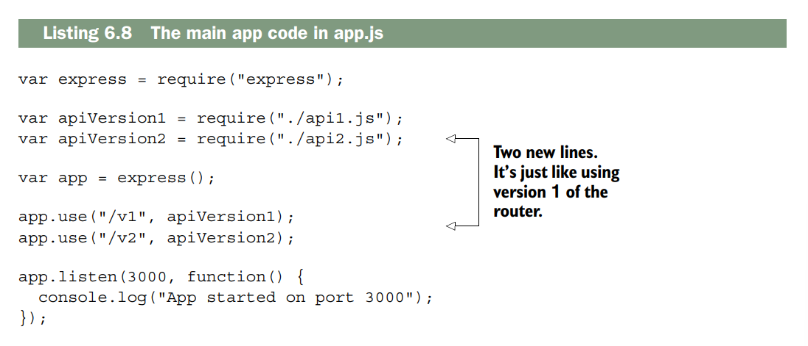

# Building APIs
__Este capítulo abarca:__

- [x] __Cómo usar Express para crear una API__
- [x] __Métodos HTTP y cómo responden a las operaciones CRUD comunes__
- [x] __Control de versiones de la API con los enrutadores de Express__
- [x] __Comprensión de los códigos de estado HTTP__

Amigos, acérquense. Este capítulo marca un nuevo comienzo. Hoy dejamos atrás el
núcleo abstracto pero fundamental de Express y entramos en el mundo real. Durante el resto de este libro, construiremos sistemas mucho más reales sobre Express. Comenzaremos con las API.

API es un término bastante amplio. Significa interfaz de programación de aplicaciones, lo cual no aclara mucho el concepto. Si dependiera de mí (obviamente no es el caso), lo renombraría como interfaz de software. Una interfaz de usuario (UI) está diseñada para ser utilizada por usuarios humanos, mientras que una interfaz de software está diseñada para ser utilizada por código. En cierto modo, todas las interfaces de usuario se basan en interfaces de software, es decir, en API.

En términos generales, las API son formas en que un fragmento de código se comunica con otro. Esto puede significar que una computadora se comunique consigo misma o que se comunique con otra computadora a través de una red. Por ejemplo, un videojuego podría consumir una API que le permita al código dibujar gráficos en la pantalla. Ya has visto algunos métodos disponibles en la API de Express, como `app.use` o `app.get`. Estas son interfaces que tú, como programador, puedes usar para comunicarte con otro código.

También existen API de comunicación entre ordenadores. Estas se realizan a través de una red y, generalmente, por internet. Estos ordenadores pueden ejecutar diferentes lenguajes de programación y/o sistemas operativos, por lo que se han desarrollado métodos comunes para que se comuniquen. Algunos envían texto plano, otros optan por JSON o XML. Pueden enviar datos mediante HTTP o mediante otro protocolo como FTP. En cualquier caso, ambas partes deben acordar cómo enviarán los datos. En este capítulo, las API que crees utilizarán JSON.

Hablaremos de las API interactivas que puedes crear con Express. Estas API
recibirán solicitudes HTTP y responderán con datos JSON.

Al final de este capítulo, otros programadores podrán crear aplicaciones
que utilicen tus API JSON. También hablaremos sobre cómo diseñar buenas API. El principio fundamental de un buen diseño de API es satisfacer las expectativas de los desarrolladores que la consumen. Puedes cumplir con la mayoría de estas expectativas siguiendo la especificación HTTP. En lugar de pedirte que leas un documento de especificación largo y tedioso (pero muy interesante), te explicaré lo que necesitas saber para escribir una buena API.

Al igual que con los conceptos abstractos de código bueno y código malo, aquí no hay límites claros. Gran parte de esto queda a tu interpretación. Podrías encontrar muchos ejemplos en los que te convendría desviarte de estas buenas prácticas establecidas, pero recuerda: el objetivo es hacer lo que otros desarrolladores esperan. Empecemos.

## A basic JSON API example

Hablemos de una API JSON sencilla y cómo se podría usar para que veas un ejemplo concreto del tipo de aplicación que vas a crear.
Imagina una API sencilla que reciba una cadena de texto con una zona horaria, como "America/Los_Angeles" o "Europe/London", y devuelva una cadena que represente la hora actual en esa zona horaria (por ejemplo, "2015-04-07T20:09:58-07:00"). Ten en cuenta que estas cadenas no son algo que una persona escribiría o leería fácilmente; están diseñadas para que un ordenador las entienda.
Tu API podría aceptar una solicitud HTTP a esta URL: `/timezone?tz=America+Los_Angeles`

and your API server might respond with JSON, like this:

```json title="Estructura JSON"
{
 "time": "2015-06-09T16:20:00+01:00",
 "zone": "America/Los_Angeles"
}
```
Podrías imaginarte escribiendo aplicaciones sencillas que usaran esta API. Estas aplicaciones podrían ejecutarse en diversas plataformas y, siempre que se comunicaran con esta API y pudieran analizar JSON (algo que la mayoría de las plataformas pueden hacer), podrían crear lo que quisieran.

Podrías crear una página web sencilla que consuma
esta API, como se muestra en la figura 6.1. Podría enviar solicitudes AJAX
a tu servidor, analizar el JSON y mostrarlo
en HTML.

También podrías crear una aplicación móvil, como se muestra
en la figura 6.2. Esta realizaría una solicitud a tu servidor API,
analizaría el JSON y mostraría los resultados en la
pantalla.

Incluso podrías crear una herramienta de línea de comandos que se ejecute
en la terminal, como en la figura 6.3. De nuevo,realizaría una solicitud al servidor API, analizaría el JSON ymostraría los resultados para los usuarios en la terminal.

La clave es esta: si creas una API que recibe solicitudes de ordenadores y genera respuestas para ordenadores (no para humanos), puedes crear interfaces de usuario sobre esa API. Ya lo hiciste en el capítulo anterior con la aplicación del tiempo: utilizaba una API para obtener datos meteorológicos y mostrarlos al usuario.

## A simple Express-powered JSON API

Ahora que ya sabes qué es una API, vamos a crear una sencilla con Express. Los fundamentos de una API de Express son bastante simples: recibe una solicitud, la analiza y responde con un objeto JSON y un código de estado HTTP. Usarás middleware y enrutamiento para recibir y analizar las solicitudes, y aprovecharás las funcionalidades de Express para responder a ellas.

> __NOTA:__ Técnicamente, las API no tienen por qué usar JSON; pueden usar otros formatos de intercambio de datos como XML o texto plano. JSON ofrece la mejor integración con Express, funciona bien con JavaScript en el navegador y es una de las opciones más populares para las API, por lo que lo usaremos aquí. Si lo desea, puede usar otros formatos.

Vamos a crear una API sencilla que genere números enteros aleatorios. Puede parecer un ejemplo un tanto rebuscado, pero es posible que necesites un generador de números aleatorios consistente en múltiples plataformas (iOS, Android, web, etc.) y no quieras escribir el mismo código. La API tendrá estas características:

- Quien solicite la API deberá enviar un valor mínimo y un valor máximo.
-Tu servicio analizará esos valores, calculará el número aleatorio y lo enviará de vuelta en formato JSON.

Quizás pienses que JSON es excesivo para esta situación —¿por qué no usar texto plano?—, pero enviar JSON es una habilidad que necesitaremos y queremos facilitar la ampliación de la funcionalidad en el futuro.
Para crear este proyecto, sigue estos pasos:

1. Crea un archivo package.json para describir los metadatos de tu aplicación.
2. Crea un archivo llamado app.js, que contendrá todo tu código.
3. Crea una aplicación Express en app.js y añade una ruta que genere un número aleatorio.

Comencemos. Como siempre, para iniciar un proyecto, crea una nueva carpeta y un archivo `package.json`. Puedes crearlo ejecutando `npm init` o escribiendo el contenido manualmente. En cualquier caso, deberás crearlo e instalar Express. 

A continuación, deberás crear el archivo app.js. Créalo en la raíz de tu proyecto e inserta el siguiente código.


Si inicias esta aplicación y visitas http://localhost:3000/random/10/100, verás una respuesta JSON con un número aleatorio entre 10 y 100. Tendrá un aspecto similar a la figura 6.4.


Analicemos este código paso a paso. Las dos primeras líneas requieren Express y crean una nueva aplicación Express, como ya has visto.

A continuación, creas un manejador de rutas para las solicitudes GET. Este manejará solicitudes como `/random/10/100` o `/random/50/52`, pero también solicitudes como /`random/foo/bar`. Debes asegurarte de que ambos campos sean números, y lo harás pronto.

Luego, analizas los números usando la función integrada `parseInt` de JavaScript.
Esta función devuelve un número o NaN. Si alguno de los valores es NaN, se muestra un error.
```js

if(isNaN(max) || isNaN(min)) {
    response.status(400)
    response.json({error:"Bad Reponse"})
    return
}
```
La primera línea comprueba si alguno de los números es `NaN`, lo que significa que tiene un formato incorrecto. Si es así, se realizan tres acciones:

1. _Se establece el código de estado HTTP en 400_. Si alguna vez ha visto un error 404, este es solo una variante: indica que algo en la solicitud del usuario fue incorrecto. Hablaremos más sobre esto más adelante en este capítulo.
2. _Se envía un objeto_ JSON. En este caso, se envía un objeto que contiene el error.
3. _Return_. Si no se devuelve un valor, se continúa con el resto de la función y __se envía la solicitud dos veces, lo que provoca que Express genere errores graves.__

Como paso final, calculas el resultado y lo envías en formato JSON.

Esta es una API bastante básica, pero muestra los fundamentos para crear una API con Express: __parsea solicitudes, establecer códigos de estado HTTP y enviar JSON.__
Ahora que conoces los fundamentos, puedes empezar a aprender más sobre cómo crear API más complejas y sofisticadas.

## Create, read, update, delete APIs
Hay un patrón de aplicación muy común: crear, leer, actualizar y eliminar. Se abrevia como CRUD, que es una palabra divertida.

Muchas aplicaciones utilizan CRUD. Por ejemplo, imagina una aplicación para compartir fotos que no tenga cuentas de usuario; cualquiera puede subir fotos. Así es como podrías planteártelo siguiendo el modelo CRUD:

- Los usuarios pueden subir fotos; este es el paso de _creación_.
- Los usuarios pueden ver fotos; esta es la parte de _lectura_.
- Los usuarios pueden modificar las fotos, por ejemplo, aplicándoles diferentes filtros o cambiando los pies de foto; esto sería una _actualización_.
- Los usuarios pueden eliminar fotos del sitio web. Esto sería, bueno, una _eliminación_

Podrías imaginarte muchas de tus aplicaciones favoritas encajando en este modelo, desde compartir fotos en redes sociales y almacenamiento de archivos.

Antes de hablar de cómo las operaciones CRUD se integran en las API, necesitamos hablar de algo llamado métodos HTTP, también conocidos como __verbos HTTP__.

### HTTP verbs (also known as HTTP methods)

La especificación HTTP define los métodos de la siguiente manera:

!!! note

    El token «Method» indica el método que se aplicará al recurso identificado por la URI de la solicitud. El método distingue entre mayúsculas y minúsculas.

Uf, eso es difícil de leer.

Un humano podría entenderlo así: un cliente envía una solicitud HTTP al
servidor con un método. El cliente puede elegir el método que quiera, pero hay
unos pocos que se utilizan. El servidor ve ese método y responde en consecuencia.
No hay nada en HTTP que impida definir cualquier método que se desee,
pero las aplicaciones web suelen usar los siguientes cuatro:

- _GET_: El método HTTP más común. Como su nombre indica, obtiene recursos. Cuando cargas la página de inicio de alguien, usas GET. Cuando cargas una imagen, usas GET. Los métodos GET no deben modificar el estado de tu aplicación;
para eso están los demás métodos.

    La idempotencia es importante en las solicitudes GET. «Idempotente» es un término técnico que significa que hacerlo una vez no debería suponer ninguna diferencia con respecto a hacerlo muchas veces. Si solicitas una imagen una vez y actualizas la página 500 veces, la imagen nunca debería cambiar. La respuesta puede cambiar —una página podría cambiar en función de la evolución del precio de las acciones o de la hora del día—, pero las solicitudes GET no deberían provocar ese cambio. Eso es lo que significa «idempotente».

- _POST_: Generalmente se usa para solicitar un cambio en el estado del servidor. Se usa POST para publicar una entrada de blog, una foto en la red social favorita o cuando se crea una cuenta en un sitio web. POST se usa para crear registros en los servidores, no para modificar los existentes.

    POST también se utiliza para acciones como «comprar este artículo». A diferencia de GET, POST no es idempotente. Esto significa que el estado cambiará la primera vez que se envíe un POST, y la segunda vez, y la tercera vez, y así sucesivamente.
    ??? note

        El autor está explicando **qué significa que el método POST se usa para “cambios de estado” en un servidor**. Aquí te lo aclaro en pasos sencillos:

        !!!note "¿Qué es un “cambio de estado”?"
        
            Un **cambio de estado** es cuando algo en el servidor cambia: se crea una nueva cuenta, se publica una entrada, se sube una foto, etc.  
            Antes no había esa entrada/foto/cuenta; **después sí existe**, es decir, el estado del servidor ha cambiado. [es.wikipedia](https://es.wikipedia.org/wiki/Cambio_de_estado)
        
        !!! note "Qué hace exactamente POST"
            **POST = crear algo nuevo → cambia el estado del servidor.**  
            No se usa para editar lo que ya existe; para eso normalmente se usa **PUT** o **PATCH**. [es.wikipedia](https://es.wikipedia.org/wiki/Cambio_de_estado)

            Cuando se dice que POST cambia el estado del servidor, no se refiere solo al servidor como máquina (CPU, memoria), sino al estado lógico del sistema: qué datos existen, qué usuarios hay, qué entradas de blog, etc. 
        
            La base de datos forma parte del servidor (o del sistema del servidor), así que cuando creas un usuario ahí, estás cambiando el estado del sistema/servidor, no solo de un archivo aislado. 
    
            Por qué se dice que es “cambio de estado” 
            Antes del POST: no hay ese usuario en la base de datos → el estado del sistema es “sin ese usuario”. 
            Después del POST: el usuario existe → el estado del sistema es “con ese usuario
            Ese cambio (de “no existe” a “existe”) es el cambio de estado al que se refiere la frase. 
   
            Diferencia con métodos que no cambian estado  Un GET normalmente solo lee el estado, no lo modifica. 
            Un POST (para crear) modifica el estado porque añade algo nuevo. 

            - POST se usa para crear cosas nuevas** en el servidor, no para cambiar algo que ya existe.  
            - Publicar una entrada de blog → se crea una entrada nueva.  
            - Subir una foto a una red social → se crea un registro de esa foto.  
            - Crear una cuenta en un sitio web → se crea un nuevo usuario en la base de datos.  
            - El verbo clave es **“crear”**, no “modificar”. [es.wikipedia](https://es.wikipedia.org/wiki/Cambio_de_estado)
    
        !!! note "Por qué se dice que es para “cambios de estado”"
            Cada vez que haces un POST, el servidor **pasa de un estado sin ese recurso** a **un estado con ese recurso**. Por ejemplo, antes de POST /users, no existía tu cuenta; después de POST /users, ya existe → el estado del sistema ha cambiado.  

    ??? success "En resumen"  
        
        Sí, estás cambiando el estado en la base de datos, pero esa base de datos es parte del estado del servidor/sistema, así que decir que POST cambia el estado del servidor es correcto y coherente.

- _PUT_: Un nombre más apropiado podría ser actualizar o cambiar. Si he publicado (POST) un perfil de trabajo en línea y luego quiero actualizarlo, usaría PUT para esos cambios. Podría usar PUT para modificar un documento, una entrada de blog o cualquier otra cosa. (Sin embargo, no se usa PUT para eliminar entradas; para eso está DELETE, como verás).

    El método PUT tiene otra particularidad interesante: si intentas modificar un registro que no existe, el servidor puede (pero no está obligado a) crearlo. Probablemente no querrías actualizar un perfil inexistente, pero sí podrías querer actualizar una página de un sitio web personal, exista o no.

    PUT es idempotente. Digamos que soy “Evan Hahn” en un sitio web, pero quiero cambiarlo a Max Fightmaster. No hago PUT “cambiar nombre de Evan Hahn a Max Fightmaster”; hago PUT “cambiar mi nombre a Max Fightmaster”; no me importa qué era antes. Esto lo hace idempotente. Podría hacerlo una vez o 500 veces, y mi nombre seguiría siendo Max Fightmaster. Es idempotente de esta manera.

    Vamos a dejarlo muy claro, paso a paso, usando solo PUT y el ejemplo que ya viste.

    ??? note "¿Qué significa idempotente?"

        Una operación es **idempotente** si la haces **1 vez o 100 veces**, el resultado final es el **mismo**.  
        No importa cuántas veces la repitas, después de la primera vez el estado **no cambia más**. [richardpalacios](https://www.richardpalacios.dev/posts/2022/10/idempotencia-en-verbos-http/)

        PUT es de “reemplazar”, no de “sumar”. <br>

        Imagina estos escenarios:

        | Paso | Lo que haces                           | Estado del nombre     |
        | ---- | -------------------------------------- | --------------------- |
        | 0    | El nombre era “Evan Hahn”              | `Evan Hahn`             |
        | 1    | `PUT /user/1` → `Max Fightmaster `         | `Max Fightmaster `      |
        | 2    | `PUT /user/1` → `Max Fightmaster otra vez` | sigue `Max Fightmaster` |
        | 500  | repetir `PUT` con el mismo valor         | sigue `Max Fightmaster` |
   
        Después de la **primera vez**, el nombre ya es `Max Fightmaster`, y cualquier PUT adicional con el mismo valor **no lo cambia más**. Eso es idempotencia.

        - En contraste con algo no idempotente <br>
        Un ejemplo de **no idempotente** sería: __Añadir un ítem a la cesta__:  
        Cada vez que haces POST a `/cart/items`, se **añade uno más**.  
        5 veces = 5 elementos nuevos (el estado cambia cada vez).  <br><br>
     
        - Con PUT no pasa eso:  
        Pones algo en un sitio y ya está; lo repites, y sigue siendo lo mismo.

        - ¿Cómo lo aplicas en tu mente? <br>
        Cuando pienses en PUT, piensa en:

        **Sobrescribir todo el contenido de este recurso con este valor**.  
        No es:  
        - “añade 1”  
        - “cambia de X a Y dependiendo de X”  
        - sino: “este recurso ahora es este valor”.

- _DELETE_: Probablemente sea la más fácil de describir porque su nombre es obvio. Al igual que con PUT, básicamente especificas ELIMINAR registro 123. Puedes ELIMINAR una entrada de blog, o ELIMINAR una foto, o ELIMINAR un comentario.
ELIMINAR es idempotente de la misma manera que PUT. Digamos que accidentalmente
publiqué (PUBLIQUÉ) una foto vergonzosa mía con una pantalla de lámpara en la cabeza. Si no quiero que esté ahí, puedo ELIMINARLA. ¡Ahora ya no está!
Da igual que pida que la elimine una vez o 500 veces; desaparecerá. (¡Uf!)

No existe ninguna norma que imponga estrictamente estas restricciones; teóricamente, se podrían usar solicitudes GET para realizar las funciones que deberían tener las solicitudes POST, pero es una mala práctica y va en contra de la especificación HTTP. No es lo que la gente espera. Muchos navegadores también se comportan de forma diferente según el tipo de solicitud HTTP, por lo que siempre conviene usar las correctas. HTTP especifica otros verbos, pero nunca he tenido la necesidad de alejarme mucho de esos cuatro.

>__¿VERBOS O MÉTODOS?__ <br>
La especificación HTTP 1.0 y 1.1 utiliza la palabra «método» para describir este concepto, así que supongo que técnicamente es correcto.
También se usa «verbo». Para nuestros propósitos, los llamaré verbos principalmente porque así lo indica la documentación de Express. Ten en cuenta que puedes usar ambos términos (y que los más puristas deberían llamarlos métodos).


Todo esto debería ser un repaso de los capítulos anteriores: puedes manejar diferentes métodos HTTP con diferentes manejadores.

###  CRUD applications with HTTP methods

Recordando nuestra aplicación para compartir fotos, así es como podrías visualizarla al estilo CRUD:

- Los usuarios pueden subir fotos; este es el paso de creación.
- Los usuarios pueden explorar las fotos; este es el paso de lectura.
- Los usuarios pueden actualizar las fotos, por ejemplo, aplicándoles diferentes filtros o cambiando los pies de foto; esto es una actualización.
- Los usuarios pueden eliminar fotos del sitio web; este es el paso de eliminación.

Si eres como yo, no viste de inmediato la conexión entre CRUD y los
cuatro verbos HTTP principales que mencioné anteriormente. Pero si GET es para leer recursos y POST es para crear recursos... ¡vaya! Te das cuenta de lo siguiente:

- Crear corresponde a POST
- Leer corresponde a GET
- Actualizar corresponde a PUT
- Eliminar corresponde a DELETE

Los cuatro métodos HTTP principales se adaptan bastante bien a las aplicaciones de estilo CRUD,
que son muy comunes en la web.

!!! note "POST vs. PUT"

    Existe cierto debate sobre qué verbos HTTP corresponden a qué operaciones CRUD. La mayoría coincide en que `read` corresponde a `GET` y `delete` a `DELETE`, pero la correspondencia entre `create` y `update` es más compleja.

    Dado que `PUT` puede crear registros al igual que `POST`, se podría decir que `PUT` se corresponde mejor con `create`. `PUT` puede crear y actualizar registros, así que ¿por qué no incluirlo en ambas funciones?

    De forma similar, el método `PATCH` (que aún no hemos mencionado) a veces cumple la función de actualizar. Según la especificación, «el método `PUT` ya está definido para sobrescribir un recurso con un cuerpo completamente nuevo y no puede reutilizarse para realizar cambios parciales». `PATCH` permite sobrescribir parcialmente un recurso. `PATCH` se definió formalmente en 2010, por lo que es relativamente nuevo en el entorno HTTP, razón por la cual se utiliza menos.

    En cualquier caso, algunos opinan que `PATCH` es más adecuado para actualizar que `PUT`. Dado que HTTP no especifica estos aspectos con demasiada rigidez, depende de ti decidir qué quieres hacer. En este libro, utilizaremos la convención mostrada anteriormente, pero ten en cuenta que las expectativas son un tanto ambiguas en este caso.

## API versioning
Permítanme explicarles un escenario. Diseñan una API pública para su aplicación de zonas horarias y se convierte en un gran éxito. Personas de todo el mundo la usan para encontrar la hora en todo el planeta. Funciona de maravilla.

Pero, después de unos años, quieren actualizar su API. Quieren cambiar algo,
pero hay un problema: si hacen cambios, todos los usuarios de su API tendrán que
actualizar su código. ¿Qué hacen? ¿Realizan los cambios que desean,
y dejan inoperativos a los usuarios antiguos, o su API se estanca y nunca se actualiza?

Hay una solución para todo esto: versionar su API. Solo tienen que agregar información de versión a su API. Así, una solicitud que llegue a esta URL podría ser para la versión 1 de su API.

```sh
/v1/timezone
```
y una solicitud que llegue a la versión 2 de su API podría visitar esta URL.

```sh
/v2/timezone
```
Esto te permite modificar tu API simplemente creando una nueva versión. Ahora, si alguien quiere actualizar a la versión 2, lo hará modificando conscientemente su código, sin que se le imponga una nueva versión sin previo aviso.

Express facilita este tipo de separación mediante el uso de enrutadores _(Routers)_, que ya vimos en el capítulo anterior. Para crear la versión 1 de tu API, puedes crear un enrutador que gestione exclusivamente esa versión. El archivo podría llamarse api1.js y tener un aspecto similar al del siguiente listado.


Observa que v1 no aparece en ninguna parte de las rutas. Para usar este enrutador en tu aplicación, deberás crear una aplicación completa y usar el enrutador desde el código principal de tu aplicación. Podría verse como en el siguiente listado.


Mucho tiempo después, decides implementar la versión 2 de tu API. Podría estar en
api2.js. También sería un enrutador, al igual que api1.js, y podría tener el siguiente aspecto:


Now, to add version 2 of your API to the app, simply require and use it just like version 1, as shown in this listing.



Puedes probar a visitar estas nuevas URL en tu navegador para asegurarte de que la API versionada funciona correctamente.

Como viste en el capítulo anterior, los enrutadores permiten segmentar diferentes rutas en archivos distintos. Las API versionadas son un excelente ejemplo de la utilidad de los enrutadores.

##  Setting HTTP status codes

Cada respuesta HTTP incluye un código de estado HTTP. El más conocido es el 404, que significa "recurso no encontrado". Probablemente hayas visto errores 404 al visitar una URL que el servidor no puede encontrar; tal vez hiciste clic en un enlace caducado o escribiste la URL incorrectamente.

Aunque el error 404 es el más conocido, el 200, que significa "OK", es quizás el más común. A diferencia del 404, normalmente no se ve el texto "200" en la página web al navegar. Cada vez que se carga correctamente una página web, una imagen o una respuesta JSON, probablemente se recibe un código de estado 200.

Existen muchos más códigos de estado HTTP que el 404 y el 200, cada uno con un significado diferente. Hay algunos códigos que comienzan con 100 (como el 100 y el 101) y varios en las series 200, 300, 400 y 500. Los rangos no están completos; es decir, los primeros cuatro códigos son 100, 101 y 102, saltando hasta llegar al 200.

Cada rango tiene una temática específica. Steve Losh publicó un excelente tuit que los resume (que tuve que parafrasear un poco), desde la perspectiva del servidor:
Rangos de estado HTTP en pocas palabras:

- `1xx`: espera
- `2xx`: aquí tienes
- `3xx`: vete
- `4xx`: te equivocaste
- `5xx`: me equivoqué

!!! note "¿Y HTTP 2?"

    La mayoría de las solicitudes HTTP son HTTP 1.1, aunque algunas todavía usan la versión 1.0. HTTP 2, la siguiente versión del estándar, se está implementando y extendiendo gradualmente por toda la web. Por suerte, la mayoría de los cambios ocurren a bajo nivel y no tendrás que lidiar con ellos. HTTP 2 define un nuevo código de estado —el 421—, pero esto no debería afectarte demasiado.

Pero antes, ¿cómo se configuran los códigos de estado HTTP en Express?

### Setting HTTP status codes
En Express, el código de estado predeterminado es 200. Si un usuario visita una URL donde no se encuentra ningún recurso y su servidor no tiene un controlador de solicitud para ello, Express enviará un error 404. Si hay algún otro error en su servidor, Express enviará un error 500.

Pero usted desea tener control sobre el código de estado que recibe, así que Express se lo proporciona.

Express agrega un método llamado `status` al objeto de respuesta HTTP. Solo tiene que llamarlo con el número de su código de estado y listo.
Este método se puede llamar dentro de un controlador de solicitud, como se muestra en el siguiente listado.


Este método es encadenable, por lo que puedes combinarlo con elementos como el JSON para establecer el código de estado y enviar JSON en una sola línea, como se muestra en el siguiente listado.


La API no es demasiado complicada.

Express extiende el objeto de respuesta HTTP sin procesar que proporciona Node. Si bien es recomendable seguir la forma de trabajar de Express, es posible que te encuentres con código que establece el código de estado, como se muestra en el siguiente ejemplo.


A veces se ve este código al revisar el middleware o cuando alguien usa las API de Node directamente en lugar de las de Express.

### The 100 range
Solo existen dos códigos de estado oficiales en el rango 100: 100 (Continuar) y 101 (Cambio de protocolos). Probablemente nunca los necesites. Si te encuentras con alguno, consulta la especificación o la lista en Wikipedia.

¡Mira! Ya has visto una quinta parte de los códigos de estado.

### The 200 range
Steve Losh resumió el rango 200 como "aquí lo tienes". La especificación HTTP define varios códigos de estado en el rango 200, pero cuatro de ellos son, con diferencia, los más comunes.

__200: OK__<br>
El código 200 es, con diferencia, el código de estado HTTP más común en la web. Las llamadas HTTP devuelven el código de estado 200 OK, y eso es básicamente lo que significa: todo lo relacionado con esta solicitud y respuesta se ha procesado correctamente. Generalmente, si la respuesta completa se envía correctamente y no hay errores ni redirecciones (que verás en la sección de códigos 300), enviarás un código 200.

__201: CREADO__ <br>
El código 201 es muy similar al 200, pero se utiliza en un caso ligeramente diferente. Es común que una solicitud cree un recurso (generalmente mediante una solicitud POST o PUT). Esto podría ser crear una entrada de blog, enviar un mensaje o subir una foto. Si la creación se realiza correctamente, se debe enviar un código 201. Si bien tiene algunos matices, suele ser el código de estado correcto para esta situación.

__202: ACEPTADO__ <br>
Al igual que el 201 es una variante del 200, el 202 es una variante del 201.
Espero que a estas alturas ya te haya quedado claro: la asincronía es una parte fundamental de Node y Express. A veces pondrás en cola de forma asíncrona un recurso para su creación, pero aún no se habrá creado.

Si estás bastante seguro de que la solicitud quiere crear un recurso válido (quizás
hayas comprobado que los datos son válidos) pero aún no lo has creado, puedes enviar un código de estado 202. En esencia, le dice al cliente: «Oye, todo está bien, pero aún no he creado el recurso».

A veces querrás enviar códigos 201 y otras veces querrás enviar 202;
depende de la situación.

__204: SIN CONTENIDO__ <br>
El código 204 es la versión de eliminación del código 201. Al crear un recurso, normalmente se envía un mensaje 201 o un 202. Al eliminar algo, a menudo no hay nada más que responder que «Sí, se eliminó». En esos casos, normalmente se envía un código 204.

Hay otras ocasiones en las que no es necesario enviar ningún tipo de respuesta, pero la eliminación es el caso de uso más común.

### The 300 range
Existen varios códigos de estado en el rango 300, pero en realidad solo configurarás tres de ellos, y todos implican redirecciones.

__301: REUBICADO PERMANENTEMENTE__ <br>

El código de estado HTTP 301 significa: «No visites más esta URL; consulta otra URL». Las respuestas 301 vienen acompañadas de un encabezado HTTP llamado «Location», para que sepas a dónde debes dirigirte a continuación.

Probablemente hayas estado navegando por la web y te hayan redirigido; esto seguramente se debió a un código 301. Esto suele ocurrir porque la página se ha trasladado.

__303: VER OTRO__ <br>
El código de estado HTTP 303 también es una redirección, pero es un poco diferente. Al igual que el código 200 es para solicitudes normales y el 201 para solicitudes donde se crea un recurso, el 301 es para solicitudes normales y el 303 es para solicitudes donde se crea un recurso y se desea redirigir a una nueva página.

__307: REDIRECCIÓN TEMPORAL__<br>
Existe un último código de estado de redirección: el 307. Al igual que con el código 301, probablemente hayas estado navegando por internet y te hayan redirigido debido a un código 307. Son similares, pero tienen una diferencia importante. El código 301 indica: No vuelvas a visitar esta URL; consulta otra.

El código 307 indica: Consulta otra URL temporalmente. Esto puede usarse para realizar tareas de mantenimiento en una URL.

### The 400 range
El rango 400 es el más amplio y generalmente significa que hubo algún problema con la solicitud. En otras palabras, el cliente cometió un error y no es culpa del servidor. Aquí hay muchos tipos de errores diferentes.

__401 Y 403: ERRORES DE ACCESO NO AUTORIZADO Y PROHIBIDO__<br>
Existen dos errores diferentes para la autenticación de cliente fallida: 401 (Acceso no autorizado) y 403 (Acceso prohibido). Los términos _"acceso no autorizado"_ y _"acceso prohibido"_ suenan bastante parecidos, ¿cuál es la diferencia?

En resumen, un error 401 ocurre cuando el usuario no ha iniciado sesión. Un error 403 ocurre cuando el usuario ha iniciado sesión como usuario válido, pero no tiene permisos para realizar la acción que intenta realizar.

Imagina un sitio web al que no puedes acceder a menos que inicies sesión. Este sitio web también tiene un panel de administración, pero no todos los usuarios pueden administrarlo. Hasta que iniciese sesión, verá errores 401. Una vez que inicie sesión, dejará de ver errores 401. Si intenta acceder al panel de administración como un usuario sin privilegios de administrador, verá errores 403.

Envía estos códigos de respuesta cuando el usuario no esté autorizado para realizar la acción que está llevando a cabo.

__404: NO ENCONTRADO__<br>
Creo que no hace falta explicarte mucho sobre el error 404; probablemente te lo hayas encontrado al navegar por internet. Algo que me sorprendió un poco de los errores 404 es que puedes visitar una ruta válida y aun así recibir un error 404.

Por ejemplo, supongamos que quieres visitar la página de un usuario. La página de inicio del usuario n.° 123 está en /users/123. Pero si te equivocas al escribir y visitas /users/1234 y no existe ningún usuario con el ID 1234, recibirás un error 404.

__OTROS ERRORES__ <br>

Existen muchos otros errores del cliente que puede encontrar; demasiados para enumerarlos aquí. Consulte la lista de códigos de estado en https://en.wikipedia.org/wiki/List_of_HTTP_status_codes para encontrar el código de estado adecuado.

Si tiene dudas sobre qué código de error del cliente usar, envíe un error 400 Bad Request. Es una respuesta genérica a cualquier tipo de solicitud incorrecta. Normalmente, significa que la solicitud tiene una entrada mal formada, por ejemplo, un parámetro faltante. Aunque podría haber un código de estado que describa mejor el error del cliente, el 400 servirá.

### The 500 range
El último rango en la especificación HTTP es el rango 500, y aunque existen varios errores en este rango, el más importante es el 500: Error Interno del Servidor. A diferencia de los errores 400, que son culpa del cliente, los errores 500 son culpa del servidor. Pueden deberse a diversas razones, desde una excepción hasta una conexión interrumpida o un error de base de datos. Lo ideal es que nunca se pueda provocar un error 500 desde el cliente, ya que esto implicaría que el cliente podría causar errores en el servidor.

Si detectas un error y realmente parece ser tu culpa, puedes responder con un error 500. A diferencia de los demás códigos de estado, donde conviene ser lo más descriptivo posible, a menudo es mejor ser vago y decir "Error interno del servidor"; de esta forma, los hackers no podrán saber dónde se encuentran las vulnerabilidades de tu sistema. Hablaremos mucho más sobre esto en el capítulo 10, cuando abordemos la seguridad.

## Summary

- En el contexto de Express, una API es un servicio web que acepta solicitudes y
devuelve datos estructurados (JSON en muchos casos).
- Los fundamentos para crear una API con Express implican el uso intensivo de sus funciones de JSON y enrutamiento.
- Métodos HTTP y su relación con las acciones comunes de una aplicación. GET generalmente corresponde a la lectura, POST a la creación, PUT a la modificación y DELETE a la eliminación.
- El versionado de la API es útil para la compatibilidad. La función de enrutamiento de Express permite crear diferentes versiones de la API.
- Existen muchos códigos de estado HTTP (el código 404 es quizás el más conocido). Una buena API utiliza estos códigos de estado correctamente.