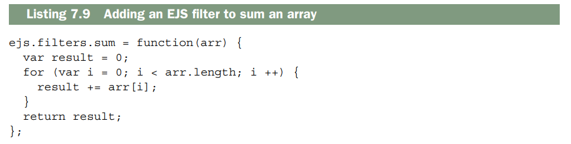
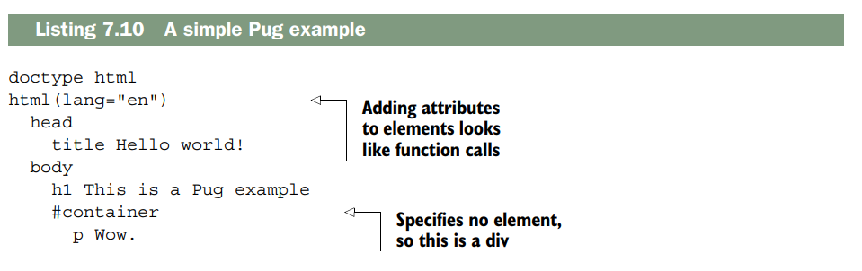
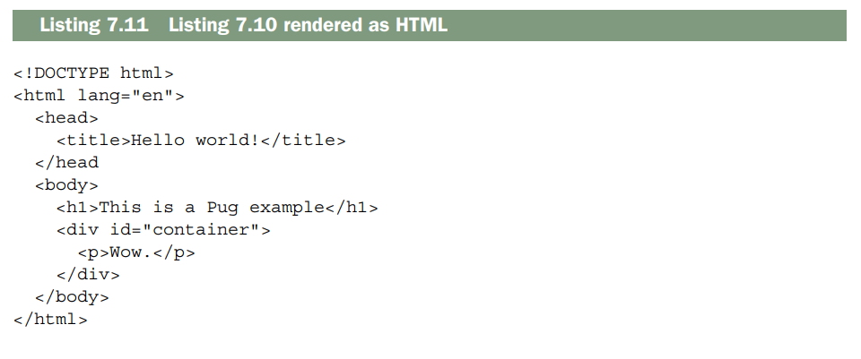
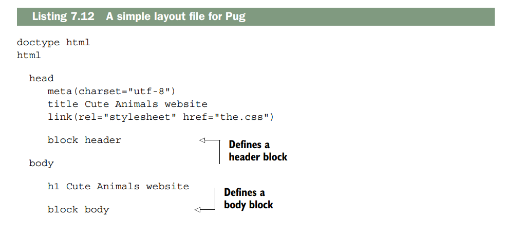
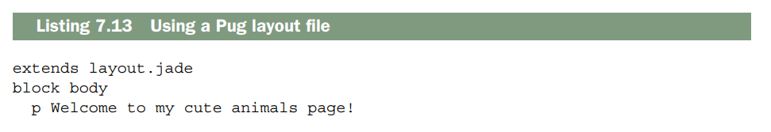
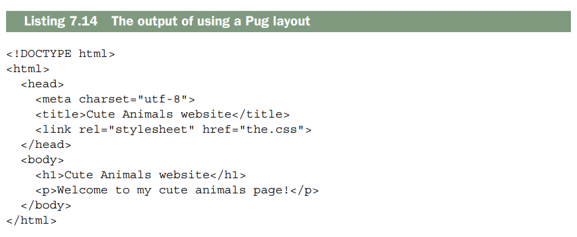
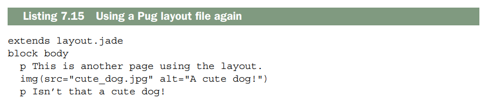
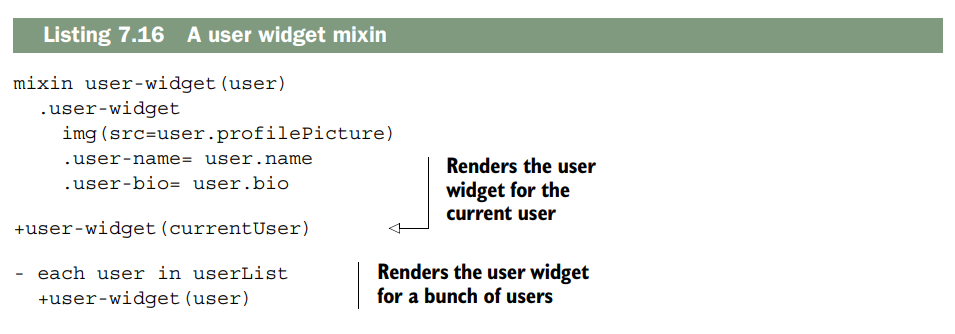

# Views and templates: Pug and EJS
Este capítulo abarca:

- __El sistema de vistas de Express__
- __El lenguaje de plantillas EJS__
- __El lenguaje de plantillas Pug__

En los capítulos anteriores, aprendiste qué es Express, cómo funciona y cómo
utilizar su función de enrutamiento. A partir de este capítulo, dejarás de aprender
sobre Express.

Bueno, no exactamente. Seguirás usando Express para potenciar tus aplicaciones,
pero como hemos comentado hasta ahora, Express no impone una filosofía y requiere muchos complementos de terceros para crear una aplicación completa. En este capítulo y en los siguientes, empezarás a explorar algunos de estos módulos, aprendiendo cómo funcionan y cómo pueden mejorar tus aplicaciones.

En este capítulo hablaremos de las vistas, que te ofrecen una forma práctica de generar contenido dinámicamente (normalmente HTML). Ya has visto un motor de vistas; EJS te ha ayudado a inyectar variables especiales en HTML. Pero aunque EJS proporcionó una comprensión conceptual de las vistas, nunca exploramos realmente todo lo que Express (y los demás motores de vistas) tenían para ofrecer. Aprenderás las diversas formas de inyectar valores en las plantillas; verás las características de EJS, Pug y otros motores de vistas compatibles con Express; y exploremos las sutilezas del mundo de las perspectivas. ¡Comencemos!

> __JADE AHORA PUG.__ Pug se llamaba originalmente Jade, pero se cambió por motivos legales. El proyecto ha sido renombrado, pero Jade todavía se usa en gran parte del código. Durante el período de transición, tendrás que recordar ambos nombres.

## Express’s view features
Antes de empezar, permítanme definir un término que usaré mucho: motor de vistas. Cuando digo motor de vistas, me refiero básicamente al módulo que realiza la renderización de las vistas. Pug y EJS son motores de vistas, y hay muchos otros.

La cantautora estadounidense India Arie tiene una excelente canción titulada “Brown Skin”. Sobre la piel morena, canta: “No puedo distinguir dónde empieza la tuya, no puedo distinguir dónde termina la mía”. De manera similar, cuando empecé a usar las vistas de Express, me confundía dónde terminaba Express y dónde empezaban los motores de vistas. Por suerte, no es demasiado difícil.

Express no impone restricciones sobre el motor de vistas que utilices. Siempre que el motor de vistas exponga una API que Express espera, no tendrás problemas. Express ofrece una función práctica para ayudarte a renderizar tus vistas; veamos cómo funciona.

### A simple view rendering

Ya has visto ejemplos simples de cómo renderizar vistas antes, pero en caso de que necesites un repaso, la siguiente lista proporciona una aplicación que renderiza una vista EJS simple.


Una vez que haya realizado una instalación npm de EJS (y Express, por supuesto), esto debería funcionar. Cuando visite la raíz, encontrará views/index.ejs y lo renderizará con EJS. Harás algo como esto el 99% del tiempo: un motor de visualización todo el tiempo. Pero las cosas pueden complicarse más si decides mezclar las cosas.

### A complicated view rendering

El siguiente listado es un ejemplo complejo de cómo representar una vista a partir de una respuesta, utilizando dos motores de visualización: Pug y EJS. Esto debería ilustrar cuán locas pueden llegar a ser las cosas.


Esto es lo que pasa cuando llamas a `render` en estos tres casos. Aunque a alto nivel parezca complicado, en realidad solo se trata de una serie de pasos sencillos:

1. **Express crea el objeto de contexto cada vez que llamas a `render`.**  
   Estos objetos de contexto se pasan a los motores de vistas cuando llega el momento de renderizar. Son, efectivamente, las variables disponibles para las vistas.  

   - Primero, Express añade todas las propiedades de `app.locals`, un objeto disponible para todas las peticiones.  
   - Luego añade todas las propiedades de `res.locals`, sobrescribiendo cualquier valor que ya se haya añadido desde `app.locals` si ya existía.  
   - Finalmente, añade las propiedades del objeto que hayas pasado a `render` (una vez más, sobrescribiendo cualquier propiedad previa).  
   Al final, si visitas `/about`, crearás un objeto de contexto con tres propiedades: `appName`, `userAgent` y `currentUser`.  
   `/contact` solo tendrá `appName` y `userAgent` en su contexto; el manejador de 404 tendrá `appName`, `userAgent` y `urlAttempted`.

2. **Decides si el caché de vistas está habilitado.**  
   El “caché de vistas” puede sonar como si Express cacheara todo el proceso de renderizado de la vista, pero no es así; solo se guarda en caché la búsqueda del archivo de vista y su asignación al motor de vistas correspondiente.  
   Por ejemplo, se guarda en caché la búsqueda de `views/my_view.ejs` y se determina que esa vista usa EJS, pero **no** se guarda en caché la renderización real de la vista.  

   Es un poco engañoso.  

   Express decide si el caché de vistas está habilitado de dos formas, solo una de las cuales está documentada.  

   - **La forma documentada:** existe una opción que puedes configurar en la aplicación. Si `app.enabled("view cache")` es verdadero, Express cacheará la búsqueda de la vista.  
     Por defecto está deshabilitado en modo desarrollo y habilitado en producción, pero puedes cambiarlo tú mismo con `app.enable("view cache")` o `app.disable("view cache")`.  
   - **La forma no documentada:** si el objeto de contexto generado en el paso anterior tiene una propiedad `cache` con valor verdadero, el caché se habilitará para esa vista concreta.  
     Esto anula cualquier configuración a nivel de aplicación.  
     Esto permite cachear vistas vista por vista, pero en mi opinión es más importante saber que existe para poder evitar usarlo sin querer.

3. **Buscas dónde reside el archivo de la vista y qué motor de vistas usar.**  
   En este caso, quieres convertir `about` en `/path/to/my/app/views/about.jade` + Pug, y `contact.ejs` en `/path/to/my/app/views/contact.ejs` + EJS.  

   El manejador de 404 debería asociar `404.html` con EJS mirando tu llamada anterior a `app.engine`.  

   Si ya has hecho esta búsqueda y el caché de vistas está habilitado, se usará la caché y se saltará al último paso.  

   Si no, se continúa adelante.

4. **Si no proporcionas una extensión de archivo (como con `about` en el paso anterior), Express añade la extensión por defecto que especifiques.**  
   En este caso, `about` se convierte en `about.jade`, pero `contact.ejs` y `404.html` se mantienen igual.  

   Si no proporcionas una extensión y no has definido un motor de vistas por defecto, Express lanzará un error.  

   De lo contrario, continúa.

5. **Express usa la extensión del archivo para determinar qué motor usar.**  
6. 
   Si coincide con alguno de los motores que ya hayas especificado, lo usará.  

   - En este caso, `about.jade` coincidirá con Pug porque Pug es el motor por defecto.  
   - `contact.ejs` intentará hacer `require("ejs")` basándose en la extensión del archivo.  
   - Asignaste explícitamente `404.html` a la función `renderFile` de EJS, así que se usará esa.

7. **Express busca el archivo en tu directorio de vistas.**  
   Si no lo encuentra, lanza un error, pero si encuentra algo continúa.

8. **Express guarda en caché toda la lógica de búsqueda si debe.**  
   Si el caché de vistas está habilitado, se guarda en caché toda esta lógica de búsqueda para la próxima vez.

9. **Renderizas la vista.**  
   Esto invoca al motor de vistas y, en el código fuente de Express, es literalmente una sola línea.  
   Aquí es donde el motor de vistas toma el control y genera el HTML real (o cualquier otro formato que quieras).  

Al final resulta un poco complicado, pero en el 99% de los casos basta con elegir un motor de vistas y ceñirse a él, así que probablemente estarás protegido de la mayoría de esta complejidad.


> **Renderizar vistas no HTML**

El tipo de contenido por defecto de Express es HTML, por lo tanto, si no haces nada especial, `res.render` renderizará tus respuestas y las enviará al cliente como HTML.  
En la mayoría de los casos, esto es suficiente.  
Pero no tiene por qué ser así.  
Puedes renderizar texto plano, XML, JSON o cualquier otro formato que desees.  
Solo tienes que cambiar el `content-type` modificando el parámetro de `res.type`:

```js
app.get("/", function(req, res) {
  res.type("text");
  res.render("myview", { currentUser: "Gilligan" });
});
```

Existen a menudo formas mejores de renderizar algunos de estos formatos; por ejemplo, `res.json` debería usarse en lugar de una vista que renderiza JSON, pero esto es otra manera de hacerlo.

###  Making all view engines compatible with Express: Consolidate.js

Hemos hablado de motores de visualización como EJS y Pug, pero hay muchos más entre los que quizás quieras elegir. Es posible que haya oído hablar de las plantillas de Moustache, Manillars o Underscore.js. Es posible que también desee utilizar un puerto de nodo de otros lenguajes de plantillas como Jinja2 o HAML. 
Muchos de estos motores de visualización, como EJS y Pug, funcionarán con Express desde el primer momento. Otros no tienen una API compatible con Express y deben incluirse en algo que Express pueda entender. 

Ingrese a Consolidate.js (https://github.com/tj/consolidate.js), una biblioteca que incluye una gran cantidad de motores de visualización para que sea compatible con Express. Tiene soporte para clásicos como EJS, Pug, Moustache, Manillars y Hogan. También es compatible con muchos otros, en caso de que estés usando un motor de visualización más oscuro/hipster. Puede ver la lista completa de motores compatibles en la página del proyecto. 

Supongamos que está utilizando Walrus, un motor de visualización de JavaScript que no es compatible con Express de fábrica. Deberá utilizar Consolidate para que sea compatible con Express. 

Después de instalar Walrus y Consolidate (con npm install walrus consolidate),
Podrás usar Walrus con Express, como se muestra en el siguiente listado.


## Everything you need to know about EJS
Uno de los motores de visualización más simples y populares que existen se llama EJS (JavaScript integrado). Puede crear plantillas para cadenas simples, HTML, texto sin formato, lo que sea. Se integra ligeramente con cualquier herramienta que utilices. Funciona en el navegador y en Node. Si alguna vez ha utilizado ERB del mundo Ruby, encontrará que EJS es muy similar. En cualquier caso, es bastante sencillo.

> __DOS VERSIONES DE EJS__ Hay dos versiones de EJS mantenidas por dos grupos diferentes de personas. Son similares pero no idénticos. El que usaremos es de TJ Holowaychuck, el creador de Express. Si busca un paquete llamado ejs en npm, este es el que encontrará. Pero si visita http://embeddedjs.com/, encontrará una biblioteca muy similar con el mismo nombre. Gran parte de la funcionalidad es la misma, pero es una biblioteca diferente, actualizada por última vez en 2009. No funciona en Node y tiene algunas frases discutiblemente sexistas en su documentación.
¡Evítalo!

###  The syntax of EJS

EJS se puede utilizar para crear plantillas HTML, pero se puede utilizar para cualquier cosa. Mire un poco de EJS en la siguiente lista y vea cómo se ve cuando lo renderiza.


Si pasa el siguiente contexto a EJS
```json
{
 name: "Tony Hawk",
 birthyear: 1968,
 career: "skateboarding",
 bio: "<b>Tony Hawk</b> is the coolest skateboarder around."
}
```
entonces obtendrás el siguiente resultado (al menos a partir de 2015):

```
Hi Tony Hawk!
You were born in 1968, so that means you’re 47 years old.
Skateboarding is a cool career!
Oh, let’s read your bio: Tony Hawk is the coolest skateboarder around. See
you later!
```
Este pequeño ejemplo muestra cuatro características principales de EJS: 

- JavaScript es evaluado se escapa y se imprime; 
- JavaScript es evaluado pero no se imprime; 
- JavaScript es evaluado y se imprime (pero no se escapa para HTML); 
- y filtros.

Puedes imprimir los resultados de las expresiones JavaScript de dos maneras: `<% expression %>` imprime el resultado de la expresión; `<%- expression %>` imprime el resultado de la expresión y escapa cualquier entidad HTML que pueda contener. En general, recomiendo usar la segunda opción siempre que sea posible, ya que es más segura.

También puedes ejecutar código JavaScript arbitrario y evitar que se imprima. Esto es útil para bucles y condicionales, como viste en el ejemplo anterior. Esto se logra con `<% expresión %>`. Como puedes ver, puedes usar corchetes para agrupar bucles y condicionales en varias líneas. También puedes evitar añadir saltos de línea innecesarios con `<% expresión -%>` (observa el guion al final).

Agregar dos puntos (:) a la salida permitirá aplicar filtros. Los filtros toman la salida de una expresión y la modifican. El ejemplo anterior usó el filtro de mayúsculas, pero existen muchos otros, y puedes definir el tuyo propio (como verás en breve).

> __NOTA__: Si quieres experimentar con EJS, he creado Try EJS (https://evanhahn.github.io/try-EJS/), una sencilla aplicación para navegador. Admito que no está muy pulida, pero es suficiente para trastear con EJS en tu navegador y ver el resultado.

Veamos dos ejemplos. Primero, imaginemos que tienes páginas que comparten el mismo encabezado y pie de página. En lugar de duplicar todo una y otra vez, podrías crear un archivo EJS para el encabezado, un archivo EJS para el pie de página y las páginas que se encuentran entre el encabezado y el pie de página. El siguiente listado muestra cómo podría verse un archivo de encabezado (guardado como header.ejs).


Luego, definirías un pie de página en footer.ejs, como se muestra en el siguiente listado.


Ahora que has definido el encabezado y el pie de página, puedes incluirlos en las subpáginas con bastante facilidad, como se muestra en el siguiente ejemplo.


Se utiliza `include` para, incluir otros archivos EJS. Fíjese que no se usan `<%= ... %>` ni `<%- ... %>`; todo lo imprime EJS, no usted.

También podras imaginarte usar esto para construir un widget. Digamos que tiene un widget que muestra perfiles de usuario. Dado un objeto llamado `user`, esta plantilla generaría HTML para ese usuario. El siguiente listado muestra cómo podría verse `userwidget.ejs`.


Ahora puedes usar esa plantilla cuando renderices al usuario actual.

```
<% user = currentUser %>
<% include userwidget %>
```
O puedes usarlo cuando renderices una lista de usuarios

```ejs
<% userList.forEach(function(user) { %>
 <% include userwidget %>
<% } %>
```

La función «include» de EJS es muy versátil; se puede utilizar para crear plantillas o para renderizar subvistas en múltiples ocasiones.

#### ADDING YOUR OWN FILTERS
Hay 22 filtros integrados, que van desde operaciones matemáticas hasta inversión de matrices/cadenas y clasificación. A menudo son suficientes para tus necesidades, pero a veces querrás agregar los tuyos propios. 

Suponiendo que hayas importado EJS a una variable llamada ejs, solo tienes que añadir una propiedad a `ejs.filters.` Si sueles sumar matrices con frecuencia, te resultará útil crear tu propio filtro personalizado para sumar matrices. El siguiente fragmento de código muestra cómo se puede añadir dicho filtro



Ahora puedes usarlo como cualquier otro filtro.

```
<%=: myarray | sum %>
```
Es muy sencillo. Se te pueden ocurrir un montón de filtros: programalos según los necesites.

##  Everything you need to know about Pug

Los motores de visualización como Manillar, Moustache y EJS no reemplazan completamente el HTML, sino que lo aumentan con nuevas caracteristicas. Esto es realmente bueno si tienes diseñadores, por ejemplo, que ya han aprendido HTML y no quieren aprender un lenguaje completamente nuevo. También es útil para soluciones de plantillas que no sean HTML. Si te encuentras en este tipo de situación, Pug probablemente sea la elección equivocada.

Pero Pug ofrece otras características. Le permite escribir muchas menos líneas de código y las líneas que escribe son mucho más bonitas. Los tipos de documentos son fáciles; Las etiquetas se anidan por sangría, no por etiquetas cerradas. Tiene una serie de características de estilo EJS integradas en el lenguaje, como condicionales y bucles. Es más para aprender pero más poderoso.

### The syntax of Pug
Los lenguajes como HTML están anidados. Hay un elemento raíz (<html>) y luego varios subelementos (como <head> y <body>), cada uno de los cuales tiene sus propios subelementos, y así sucesivamente. HTML y XML eligen tener una apertura (<a>) y una cierre (</a>) para cada elemento.

Pug adopta un enfoque diferente al utilizar sangría y una sintaxis diferente para HTML. El siguiente listado muestra una página web sencilla que utiliza Pug.



Este listado se convierte en el siguiente HTML.



###  Layouts in Pug
Los diseños (Layouts ) son una característica importante de cualquier lenguaje de plantillas. Le permiten incluir, de una forma u otra, otro HTML. Esto le permite definir su encabezado y pie de página una vez y luego incluirlos en las páginas donde los necesite.

Un caso muy habitual es definir un archivo de diseño (layout) para tus páginas. De esta forma, todas ellas pueden tener un encabezado y un pie de página uniformes, al tiempo que se permite que el contenido cambie en cada página.

Como primer paso, defines el layout maestro. Este es el código Pug común a todas las páginas, como el encabezado y el pie de página. El layout maestro define bloques vacíos que se rellenan con el contenido de cualquier página que use este layout maestro. El siguiente listado es un ejemplo. Este archivo de layout simple será compartido por todas tus páginas.



Observa cómo has definido dos bloques con `block header` y `block body`. Estos bloques serán rellenados por otros archivos Pug que usen este layout. Guarda ese archivo como `layout.jade`. Puedes usarlos en páginas reales que empleen este layout, como se muestra en el siguiente listado.



Eso generará el siguiente HTML



Observa que cuando extiendes un layout y pones contenido dentro de un bloque, ese contenido se inserta “mágicamente” en el lugar correspondiente del layout. También fíjate en que no estás obligado a usar un bloque solo porque esté definido: nunca tocas el bloque `header` porque no lo necesitas. Si quisieras, podrías definir otra página que use este layout de forma muy sencilla, como se muestra en el siguiente listado.



Los layouts te permiten separar componentes comunes, lo que significa que no tienes que escribir el mismo código una y otra vez.

### Mixins in Pug
Pug tiene otra característica muy útil llamada *mixins*, que son funciones que defines en tu archivo Pug para reducir tareas repetitivas. Reimplementemos el ejemplo del widget de usuario que vimos en la sección de EJS. Crearás un widget que recibe un objeto llamado `user` y devuelve un widget HTML para ese usuario. El siguiente listado muestra cómo podrías hacerlo.



Esto renderizaría el widget de usuario para `currentUser` y para cada uno de los demás usuarios en `userList`. ¡Sin código duplicado para ti! Eso es todo lo que veremos sobre Pug por ahora. Para más información sobre la sintaxis de Pug, consulta la documentación de referencia en [http://jade-lang.com/reference/](http://jade-lang.com/reference/).

## Summary
- Express tiene un sistema de vistas que puede renderizar páginas HTML de forma dinámica. Llamas a `res.render` para renderizar dinámicamente una vista con ciertas variables. Antes de hacer esto, debes configurar Express para usar el motor de vistas adecuado en la carpeta correcta.  
- El lenguaje de plantillas EJS es una capa ligera sobre HTML que añade la posibilidad de generar HTML de forma dinámica usando fragmentos de JavaScript.  
- El lenguaje de plantillas Pug es una reinterpretación de HTML que te permite renderizar HTML de forma dinámica con un lenguaje completamente nuevo. Intenta eliminar la verbosidad y reducir la cantidad de teclas que tienes que escribir.