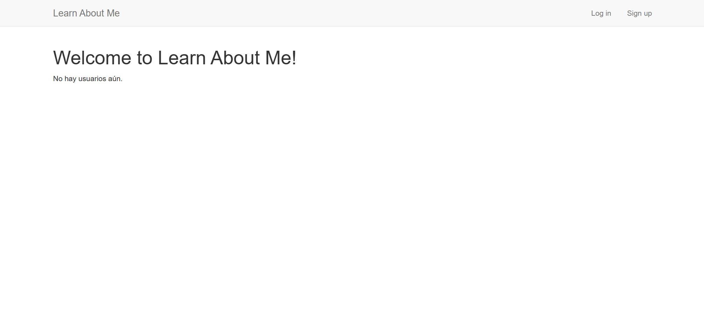

# Persisting your data with MongoDB
Este capítulo trata de:  

- __Usar **Mongoose**, una librería oficial de MongoDB para controlar la base de datos con Node.__  
- __Crear cuentas de usuario de forma **segura** usando **bcrypt**.__  
- __Usar **Passport** para la autenticación de usuarios.__

Tengo tres capítulos favoritos en este libro.

Mi favorito es el capítulo 3, donde hablamos de los fundamentos de Express. Me gusta porque su objetivo es explicar Express a fondo. En mi opinión, es el capítulo más importante del libro, ya que explica el framework conceptualmente.

El capítulo 10 es mi segundo favorito. Como verán, trata sobre seguridad, y me encanta ponerme en la piel de un hacker e intentar vulnerar las aplicaciones de Express. Es muy divertido (y, por cierto, tremendamente importante).

Este capítulo es mi último favorito. ¿Por qué? Porque después de leerlo, sus aplicaciones se sentirán reales. Se acabaron las aplicaciones de ejemplo insignificantes. Se acabaron los datos que desaparecen rápidamente. Sus aplicaciones de Express tendrán cuentas de usuario, entradas de blog, solicitudes de amistad, citas del calendario, todo ello con la potencia de la persistencia de datos.

Casi todas las aplicaciones tienen algún tipo de datos, ya sean entradas de blog, cuentas de usuario o fotos de gatos. Como ya hemos comentado, Express es, en general, un framework sin opiniones preconcebidas.

Siguiendo esta filosofía, Express no impone cómo almacenar los datos. Entonces, ¿cómo deberíamos abordarlo?

Podrías almacenar los datos de tu aplicación en memoria, definiendo variables. El ejemplo del libro de visitas del Capítulo 3, por ejemplo, almacenaba las entradas en un array. Si bien esto es útil en casos muy sencillos, tiene varias desventajas. Para empezar, si el servidor se detiene (ya sea manualmente o por un fallo del sistema), los datos se pierden. Y si alcanzas cientos de millones de puntos de datos, te quedarás sin memoria. Este método también presenta problemas cuando tienes varios servidores ejecutando la aplicación, ya que los datos pueden estar en una máquina pero no en la otra.

Podrías intentar almacenar los datos de tu aplicación en archivos, escribiendo en uno o varios de archivos. Al fin y al cabo, así es como funcionan internamente muchas bases de datos. Pero eso te deja con la tarea de averiguar cómo estructurar y consultar esos datos. ¿Cómo guardas tus datos? ¿Cómo extraes de forma eficiente los datos de esos archivos cuando los necesitas? Podrías acabar creando una base de datos por tu cuenta, lo cual es un auténtico quebradero de cabeza. Y, una vez más, esto no funciona por arte de magia con varios servidores.

Necesitaremos otro plan. Y por eso elegimos un software diseñado para este propósito: una base de datos. Nuestra base de datos elegida es MongoDB.

## Why MongoDB?

MongoDB (a menudo abreviado como Mongo) es una base de datos popular que se ha ganado un lugar en el corazón de muchos desarrolladores de Node. Su combinación con Express es tan apreciada que ha dado origen al acrónimo MEAN, por Mongo, Express, Angular (un framework de JavaScript para el front-end) y Node. En este libro, hablaremos de todo excepto de la A de ese acrónimo: la pila MEN, por así decirlo.

Llegados a este punto, quizás te preguntes: «Hay muchas opciones de bases de datos, como SQL, Apache Cassandra o Couchbase. ¿Por qué elegir Mongo?». ¡Es una buena pregunta! En general, las aplicaciones web almacenan sus datos en dos tipos de bases de datos: relacionales y no relacionales.

Por lo general, las _bases de datos relacionales_ se parecen mucho a las hojas de cálculo. Sus datos están estructurados y cada entrada suele ser una fila en una tabla. Se asemejan un poco a los lenguajes fuertemente tipados, como Java, donde cada entrada debe ajustarse a requisitos rígidos (denominados esquema). La mayoría de las bases de datos relacionales se pueden controlar con alguna variante de SQL (Lenguaje de Consulta Estructurada); probablemente haya oído hablar de MySQL, SQL Server o PostgreSQL. Los términos bases de datos relacionales y bases de datos SQL se suelen usar indistintamente.

Las _bases de datos no relacionales_ suelen denominarse bases de datos NoSQL. (NoSQL se refiere a cualquier cosa que no sea SQL, pero tiende a referirse una clase de base de datos). Me gusta imaginar NoSQL como una tecnología diferente y un grito de rebeldía contra el statu quo. Quizás NoSQL esté tatuado en el brazo de un manifestante. En cualquier caso, las bases de datos NoSQL se diferencian de las relacionales en que, por lo general, no están estructuradas como una hoja de cálculo.
Suelen ser un poco menos rígidas que las bases de datos SQL. En este sentido, se parecen mucho a JavaScript; JavaScript es, por lo general, menos rígido. En general, las bases de datos NoSQL se parecen un poco más a JavaScript que a las bases de datos SQL.

Por este motivo, utilizaremos una base de datos NoSQL. La base de datos NoSQL que utilizaremos es MongoDB. ¿Pero por qué elegirla?
Para empezar, MongoDB es popular. Si bien esto no es una ventaja en sí misma, tiene varias ventajas.

No tendrás problemas para encontrar ayuda en línea. Además, es útil saber que se utiliza en muchos lugares y por mucha gente. MongoDB también es un proyecto consolidado. Existe desde 2007 y confía en empresas como eBay, Craigslist y Orange. No utilizarás software defectuoso ni sin soporte.

MongoDB es popular en parte porque es maduro, completo y fiable. Está escrito en C++ de alto rendimiento y cuenta con la confianza de muchísimos usuarios.
Aunque MongoDB no está escrito en JavaScript, su intérprete de comandos nativo utiliza JavaScript. Esto significa que, al abrir MongoDB para explorar la línea de comandos, se envían comandos en JavaScript. Es muy práctico poder interactuar con la base de datos usando un lenguaje que ya se utiliza.

También elegí MongoDB para este capítulo porque creo que es más fácil de aprender que SQL para un desarrollador de JavaScript. SQL es un lenguaje de programación potente en sí mismo, ¡pero ya conoces JavaScript!

No creo que Mongo sea la opción adecuada para todas las aplicaciones Express. Las bases de datos relacionales son sumamente importantes y se pueden utilizar perfectamente con Express, y otras bases de datos NoSQL, como CouchDB, también son muy potentes. Sin embargo, Mongo encaja bien en el ecosistema de Express y es relativamente fácil de aprender (en comparación con SQL), por lo que lo he elegido para este capítulo.

> __NOTA__: Si eres como yo, conoces SQL y quieres usarlo para tus proyectos de Express.
Este capítulo se centrará en MongoDB, pero si buscas una herramienta SQL útil,
echa un vistazo a Sequelize en http://sequelizejs.com/. Se integra con
muchas bases de datos SQL y cuenta con varias funciones útiles. En este capítulo,
trabajaremos intensamente con un módulo llamado Mongoose; para que lo tengas en cuenta mientras lees,
Mongoose es a MongoDB lo que Sequelize es a SQL. ¡Recuerda esto si
quieres usar SQL!

### How Mongo works
Antes de empezar, hablaremos de como funcion a Mongo DB, Lamayoria de las aplicaciones tiene una base de datos, como MongoDB, estas bases de datos estan alojan en servidores. Un servidor de MongoDb puede tener varias bases de datos dentro, pero generalmente hay una base de datos por aplicacion. Si solo estas desarollando una aplicacion en tu ordenador solo tendras una base de datos MongoDb. (Estas bases de datos pueden ser replicadas en varios servidores, y tratarlas como si fueran una sola). 

Para acceder a estas bases de datos, debera ejecutaras un servidor MongoDb. Los clientes se comunican con estos servidores, para ver y manipular la base de datos. Existen bibliotecas cliente para la mayoria de los lenguajes de programacion; estas bibliotecas se denominan _drivers_ y permiten comunicarte con la base de datos en tu lenguaje de programacion preferido. En este libro utiliaremos el controlador de Node.js para Mongo.

Cada base de datos tendrá una o más colecciones. Me gusta pensar en las colecciones como matrices sofisticadas. Una aplicación de blog podría tener una colección para las entradas del blog, o una red social podría tener una colección para los perfiles de usuario. Son como matrices en el sentido de que son listas gigantes, pero también se pueden consultar (por ejemplo, «Dame todos los usuarios de esta colección mayores de 18 años») mucho más fácilmente que las matrices.

Cada colección tendrá cualquier número de documentos. Técnicamente, los documentos no se almacenan como JSON, pero puedes pensar en ellos así; básicamente son objetos con varias propiedades. Los documentos son cosas como usuarios y entradas de blog; hay un documento por cada cosa. Los documentos no tienen por qué tener las mismas propiedades, aunque estén en la misma colección: podrías teoricamente tener una colección llena de objetos completamente diferentes (aunque rara vez haces eso en la práctica).

Los documentos se parecen mucho a JSON, pero técnicamente son Binary JSON, o BSON. Casi nunca trabajas directamente con BSON; más bien, traduces de y a objetos de JavaScript. Los detalles de la codificación y descodificación de BSON son un poco diferentes de los de JSON. BSON también soporta algunos tipos que JSON no incluye, como fechas, marcas de tiempo y valores `undefined`. La figura 8.1 muestra cómo se combinan estas piezas.


Un último punto importante: Mongo añade una propiedad `_id` única para cada documento. Como estos IDs son únicos, dos documentos son iguales si tienen el mismo `_id`, y no puedes almacenar dos documentos con el mismo ID en la misma colección. Es un detalle secundario, pero importante, al que volveremos más adelante.

### For you SQL users out there

Si vienes de un entorno relacional/SQL, muchas de las estructuras de Mongo se corresponden uno a uno con estructuras del mundo SQL. (Si no conoces SQL, puedes saltarte esta sección.) __Los documentos en Mongo equivalen a filas o registros__ en SQL. En una aplicación con usuarios, cada usuario se correspondería con un documento en Mongo o una fila en SQL.  

En contraste con SQL, Mongo no impone ningún esquema en la capa de la base de datos, por lo que no es inválido en Mongo tener un usuario sin apellido o una dirección de correo que sea un número.

__Las colecciones en Mongo se corresponden con las tablas de SQL__. Las colecciones de Mongo contienen muchos documentos, mientras que las tablas de SQL contienen muchas filas. Una vez más, las colecciones de Mongo no imponen un esquema, a diferencia de SQL. Además, _estos documentos pueden embeber otros documentos_, a diferencia de SQL, donde, por ejemplo, las entradas de blog y los comentarios normalmente se representarían en dos tablas distintas.

En una aplicación de blog, habría una colección de Mongo para las entradas de blog, o bien una tabla SQL equivalente. Cada colección de Mongo contiene muchos documentos, al igual que cada tabla de SQL contiene muchas filas o registros.

### Setting up Mongo
Querrás instalar Mongo localmente para poder usarlo mientras estás desarrollando. Si estás en macOS y no estás seguro de si quieres usar la línea de comandos, soy un gran fan de **Mongo.app**. En lugar de lidiar con la terminal, simplemente lanzas una aplicación que se ejecuta en la barra de menú, en la parte superior derecha de tu pantalla. Puedes ver fácilmente cuándo está corriendo y cuándo no, iniciar una consola sin problemas y cerrarlo de forma sencilla. Puedes descargarlo en [http://mongoapp.com/](http://mongoapp.com/).

Si estás en macOS y prefieres usar la línea de comandos, puedes usar el gestor de paquetes **Homebrew** para instalar Mongo con un simple `brew install mongodb`.  
Si usas **MacPorts**, el comando `sudo port install mongodb` hará el trabajo.  
Si no estás usando ningún gestor de paquetes y no quieres usar Mongo.app, puedes descargar Mongo desde la página de descargas de Mongo en [https://www.mongodb.org/downloads](https://www.mongodb.org/downloads).
 
Si estás en Ubuntu Linux, el sitio web de Mongo ofrece instrucciones útiles en [http://docs.mongodb.org/manual/tutorial/install-mongodb-on-ubuntu/](http://docs.mongodb.org/manual/tutorial/install-mongodb-on-ubuntu/).  
Si usas una distribución Debian como Mint (o Debian mismo), consulta la documentación oficial en [http://docs.mongodb.org/manual/tutorial/install-mongodb-on-debian/](http://docs.mongodb.org/manual/tutorial/install-mongodb-on-debian/).  
Los demás usuarios de Linux pueden consultar [http://docs.mongodb.org/manual/tutorial/install-mongodb-on-linux/](http://docs.mongodb.org/manual/tutorial/install-mongodb-on-linux/) para ver varias formas de instalación según su distribución.

Si usas Windows o cualquiera de los sistemas operativos que no he mencionado, la página de descargas de Mongo te ayudará. Puedes descargarlo directamente desde su sitio web o desplazarte hasta la parte inferior de esa página para ver otros gestores de paquetes que incluyen Mongo. Échale un vistazo a [www.mongodb.org/downloads](https://www.mongodb.org/downloads). Si es posible, asegúrate de descargar la versión de 64 bits; la versión de 32 bits tiene un límite en el espacio de almacenamiento.  

A lo largo de este libro, daremos por hecho que tu base de datos Mongo está en `localhost:27017/test`. El puerto 27017 es el puerto por defecto y la base de datos por defecto se llama `test`, pero tus resultados pueden variar. Si no puedes conectarte a tu base de datos, revisa la documentación específica de tu instalación para obtener ayuda.

## Talking to Mongo from Node with Mongoose
Necesitarás una librería que te permita comunicarte con Mongo desde Node, y por tanto desde Express. Existen varios módulos de bajo nivel, pero tú quieres algo fácil de usar y con muchas funcionalidades. ¿Qué deberías usar? No busques más: **Mongoose** (`http://mongoosejs.com/`), una librería oficialmente soportada para comunicarse con Mongo desde Node. Para citar su documentación:

> Mongoose proporciona una solución sencilla basada en esquemas para modelar los datos de tu aplicación, e incluye, listas de fábrica, conversión de tipos, validación, construcción de consultas, ganchos de lógica de negocio y más.

En otras palabras, Mongoose te ofrece mucho más que simplemente comunicarte con la base de datos. Aprenderás cómo funciona creando un sitio web sencillo con cuentas de usuario.

### Setting up your project
Para aprender los temas de este capítulo, desarrollarás una aplicación de red social muy sencilla. Esta aplicación permitirá a los usuarios registrarse con un nuevo perfil, editar ese perfil y navegar por los perfiles de los demás. La llamarás **Learn About Me** (por falta de un nombre más creativo), o **LAM** para abreviar.  

Tu sitio tendrá algunas páginas:  

- **La página de inicio**, que listará todos los usuarios. Al hacer clic en un usuario de la lista, se accederá a su página de perfil.  
- **La página de perfil**, que mostrará el nombre de visualización del usuario (o el nombre de usuario si no se ha definido un nombre de visualización), la fecha en que se unió al sitio y su biografía. Un usuario podrá editar su propio perfil, pero solo cuando haya iniciado sesión.  
- **Una página para registrarse en una nueva cuenta** y **una página para iniciar sesión en una cuenta existente**.  
- Una vez que se hayan registrado, los usuarios podrán editar su nombre de visualización y su biografía, pero solo cuando estén conectados.

Como siempre, crea un nuevo directorio para este proyecto. Necesitarás crear un archivo de paquete con los metadatos sobre nuestro proyecto y sus dependencias. Crea un archivo `package.json` y coloca el código del siguiente listado dentro de él.

```json
{
  "name": "a_appnetwork",
  "version": "1.0.0",
  "description": "",
  "license": "ISC",
  "author": "",
  "type": "module",
  "main": "app.js",
  "scripts": {
    "start": "node --watch app.js",
    "test": "echo \"Error: no test specified\" && exit 1"
  },
  "dependencies": {
    "bcrypt": "^6.0.0",
    "connect-flash": "^0.1.1",
    "cookie-parser": "^1.4.7",
    "ejs": "^5.0.2",
    "express": "^4.22.1",
    "express-session": "^1.19.0",
    "mongoose": "^7.8.9",
    "passport": "^0.7.0",
    "passport-local": "^1.0.0"
  }
}
```
Después de haber creado este archivo, ejecuta `npm install` para instalar nuestra lista de dependencias. Verás qué hace cada dependencia conforme avances por el resto del capítulo, así que si alguna te parece poco clara, no te preocupes. Como siempre, lo hemos configurado para que `npm start` inicie nuestra aplicación (que guardarás en `app.js`).

**EL MÓDULO BCRYPT-NODE** Usa un módulo llamado `bcrypt-node`. Este módulo está escrito en JavaScript puro, al igual que la mayoría de otros módulos, por lo que es fácil de instalar. Hay otro módulo en el registro de npm llamado `bcrypt`, que requiere que se compile algo de código C. El código C compilado será más rápido que el JavaScript puro, pero puede causar problemas si tu ordenador no está configurado correctamente para compilar código C. Usamos `bcrypt-node` en este ejemplo para evitar esos problemas aquí.  

Cuando llegue el momento de obtener más velocidad, deberías cambiar al módulo `bcrypt`. Afortunadamente, una vez instalado, el módulo más rápido es casi idéntico, por lo que debería ser rápido cambiarlo.

Ahora es el momento de empezar a introducir datos en las bases de datos.

### Creating a user model
Como ya hemos comentado, Mongo almacena todo en formato BSON, que es un formato binario. Un documento BSON simple de "Hola Mundo" podría tener este aspecto internamente:

```
\x16\x00\x00\x00\x02hello\x00\x06\x00\x00\x00world\x00\x00
```
Un ordenador puede manejar todo ese rollo difícil, pero eso es complicado de leer para personas como nosotros. Queremos algo que podamos entender fácilmente, y por eso los desarrolladores han creado el concepto de **modelo de base de datos**.  

Un **modelo** es una representación de un registro de la base de datos _(y que actúa como interfaz para interactuar con los datos registrados en la misma_) como un objeto en el lenguaje de programación que uses. En este caso, nuestros modelos serán **objetos de JavaScript**.

Los modelos pueden servir como objetos que almacenan valores de la base de datos, pero frecuentemente incluyen cosas como validación de datos, métodos extra y más funcionalidades. Como verás, Mongoose ofrece muchas de esas características.

En este ejemplo, construirás un modelo para usuarios. Estas son las propiedades que deberían tener los objetos de usuario:

- **Nombre de usuario (username):** Un nombre único. Será obligatorio.  
- **Contraseña (password):** También será obligatoria.  
- **Fecha de registro (time joined):** Una marca de cuándo el usuario se unió al sitio.  
- **Nombre de visualización (display name):** Un nombre que se mostrará en lugar del nombre de usuario. Será opcional.  
- **Biografía (biography):** Un bloque opcional de texto que se mostrará en la página de perfil del usuario.  

En otras palabras, tu modelo de usuario representará cada registro de usuario en la base de datos como un objeto de JavaScript con estos campos, algunos obligatorios y otros opcionales.

Para especificar esto en Mongoose, debes definir un **esquema**, que contiene información sobre las propiedades, métodos y demás. (Personalmente, no creo que “esquema” sea la palabra más adecuada; se parece más a una clase o a un prototipo.) Es bastante fácil traducir estos términos en inglés a código de Mongoose.

Crea una carpeta llamada `models` en la raíz de tu proyecto y, dentro de esa carpeta, crea un nuevo archivo llamado `user.js`. Para empezar, coloca el contenido del siguiente listado en ese archivo.
```js
//Listing 8.2 Defining the user schema (in models/user.js)
import mongoose from "mongoose"
let userSchema = mongoose.Schema({
    username:{type:String, required:true, unique:true},
    password:{type:String, required:true},
    createdAt:{type:Date, default:Date.now},
    displayName: String,
    bio: String
})
```
Después de que importas Mongoose, es bastante sencillo definir tus campos. Como puedes ver, defines el nombre de usuario como `username`, la contraseña como `password`, la fecha de registro como `createdAt`, el nombre de visualización como `displayName` y la biografía como `bio`. Observa que algunos campos se marcan como obligatorios (`required`), algunos como únicos (`unique`), otros tienen valores por defecto (`default`), y otros simplemente declaran su tipo de dato.

Una vez que has creado el esquema con las propiedades, puedes añadir métodos. El primero que añadirás es sencillo: obtener el nombre del usuario. Si el usuario ha definido un nombre de visualización (`displayName`), se devuelve ese; en caso contrario, se devuelve su nombre de usuario (`username`). El siguiente listado muestra cómo añadir ese método.

```js
// Adding a simple method to the user model (in models/user.js)
userSchema.methods.getName = function() {
    return this.name || this.displayName
}
```
También querrás asegurarte de almacenar la contraseña de forma segura. Podrías guardar la contraseña como texto plano en tu base de datos, pero eso supone varios problemas de seguridad. ¿Qué pasaría si alguien hackeaba tu base de datos? ¡Obtendría todas las contraseñas! Además, como administradores responsables, no deberías poder ver las contraseñas de tus usuarios en texto claro. Para garantizar que nunca almacenas la contraseña real, aplicarás un hash unidireccional a la contraseña usando el algoritmo `bcrypt`.

Para empezar a usar bcrypt, añade la instrucción `require` en la parte superior de tu archivo. Bcrypt funciona ejecutando una parte del algoritmo muchas veces para darte un hash seguro, pero ese número de veces es configurable.  
Cuanto más alto sea el número, más seguro será el hash, pero también tardará más tiempo en calcularse. Por ahora usarás un valor de 10, como se muestra en el siguiente listado, aunque podrías aumentar ese número para mayor seguridad (pero, una vez más, con una velocidad más lenta).

```js
// Requiring bcrypt (in models/user.js)
import bcrypt from "bcrypt"
const SALT_FACTOR = 10
```
Después de que hayas definido tu esquema, definirás una acción `pre-save`.  
Antes de guardar tu modelo en la base de datos, se ejecutará un código que hará el hash de la contraseña. El siguiente listado muestra cómo se ve eso.

```js
// Pre-save action to hash the password (in models/user.js)
userSchema.methods.getName = function() {
    return this.displayName || this.username
}

userSchema.pre("save", async function(next) {
  const user = this;

  if (!user.isModified("password")) {
    return next();
  }

  try {
    const salt = await bcrypt.genSalt(SALT_FACTOR);
    const hashedPassword = await bcrypt.hash(user.password, salt);

    user.password = hashedPassword;
    next();
  } catch (error) {
    next(error);
  }
});
```
Ahora, ya no tienes que llamar a ninguna lógica compleja para hacer el hash de la contraseña para la base de datos; esto ocurrirá cada vez que guardes el modelo en Mongo.  

Necesitarás escribir código para comparar la contraseña real con una supuesta contraseña (la que el usuario ingresa).  

Cuando un usuario inicie sesión, tendrás que asegurarte de que la contraseña que escribió sea correcta. El siguiente listado define otro método en el modelo para hacer esto.

```js
 // Checking the user’s password (in models/user.js)
userSchema.methods.checkPassword = async function(guess) {
  return await bcrypt.compare(guess, this.password);
};
```
Ahora almacenarás las contraseñas de tus usuarios de forma segura

Observa que usamos `bcrypt.compare` en lugar de una simple comparación de igualdad (con algo como `===`). Esto es por razones de seguridad, ya que nos ayuda a protegernos de un truco complicado de los hackers llamado **ataque de tiempo** (*timing attack*). [stackoverflow](https://stackoverflow.com/questions/43253392/how-many-rounds-is-the-recommended-for-bcrypt-password-hasing)

Una vez que hayas definido tu esquema con sus propiedades y métodos, tendrás que asociar ese esquema a un modelo real. Solo te tomará una línea hacerlo, y como estás definiendo este modelo de usuario en un archivo, te asegurarás de exportarlo en `module.exports` para que otros archivos puedan importarlo con `require`. Así es como se hace:

```js
//Creating and exporting the user model (in models/user.js)
const User =  mongoose.model("User",userSchema)
export {User}
```
Así es como defines un modelo de usuario. El siguiente listado muestra cómo se verá el archivo completo cuando termines.

```js
import mongoose from "mongoose"
import bcrypt from "bcrypt"

const SALT_FACTOR = 10

const userSchema = mongoose.Schema({
    username:{type:String, required:true, unique:true},
    password:{type:String, required:true},
    createdAt:{type:Date, default:Date.now},
    displayName: String,
    bio: String
})

userSchema.methods.getName = function() {
    return this.displayName || this.username
}

userSchema.pre("save", async function(next) {
  const user = this;

  if (!user.isModified("password")) {
    return next();
  }

  try {
    const salt = await bcrypt.genSalt(SALT_FACTOR);
    const hashedPassword = await bcrypt.hash(user.password, salt);

    user.password = hashedPassword;
    next();
  } catch (error) {
    next(error);
  }
});

userSchema.methods.checkPassword = async function(guess) {
  return await bcrypt.compare(guess, this.password);
};

const User =  mongoose.model("User",userSchema)
export {User}
```

### Using your model
Ahora que ya has definido tu modelo, querrás… bueno, ¡usarlo!  
Querrás hacer cosas como listar usuarios, editar perfiles y registrar nuevas cuentas. Aunque definir el modelo y su esquema puede resultar un poco complicado, usarlo casi no podría ser más sencillo; veamos cómo hacerlo. 

Para empezar a usarlo, primero crea un archivo `app.js` sencillo en la raíz de tu proyecto que configurará tu aplicación. Este archivo estará incompleto y más adelante volverás a él para completarlo, pero por ahora el siguiente listado muestra lo que harás. 

```js
// app.js, to start

//------- Requires everything you need, including Mongoose
import express  from "express"
import mongoose from "mongoose" 
import {join,dirname} from "node:path"
import {fileURLToPath} from "node:url"
import cookieParser from "cookie-parser"    
import session from "express-session"   
import flash from "connect-flash"

//------ Puts all of your routes in another file
import router from "./routes.js" 

const __filename = fileURLToPath(import.meta.url)
const __dirname = dirname(__filename)
const app =  express()

// ------- Connects to your MongoDB server in the test database
mongoose.connect("mongodb://localhost:27017/test")
                                                 
app.set("port", process.env.PORT ||3000)
app.set("views",join(__dirname,"views"))
app.set("view engine","ejs")

//-------- Uses four middlewares
app.use(express.urlencoded({extended:false}))                 
app.use(cookieParser())
app.use(session({
    secret: "TKRv0IJs=HYqrvagQ#&!F!%V]Ww/4KiVs$s,<<MX",
    resave:false,
    saveUninitialized:false
}))

app.use(flash())

app.listen(app.get("port"), function() {
 console.log("Server started on port " + app.get("port"));
})

```
En el codigo anterior, especificaste que vas a usar un archivo de rutas externo. También necesitas definirlo. Crea routes.js en la raíz de tu proyecto, como se muestra en la siguiente lista.


```js
import {Router} from "express"
import {User} from "./models/user.js"
//------ Establece variables útiles para tus plantillas. 
const router = Router()
router.use(function(req,res,next){
    res.locals.currentUser = req.user
    res.locals.error = req.flash("error")
    res.locals.info = req.flash("info")
    next()
})
 
// ---------- Realiza consultas a la colección de usuarios, devolviendo los usuarios más nuevos primero.
router.get("/", async function(req, res, next){
    try {
        const users =  await User.find().sort({createdAt:-1})
        res.render("index",{users})
    } catch(err){
        next(err)
    }
})

export {router}
```
Estos dos archivos tienen algunas cosas que no has visto antes. Primero, te estás conectando a tu base de datos Mongo con Mongoose, usando `mongoose.connect()`. Simplemente pasas una dirección y Mongoose se encarga del resto. Dependiendo de cómo hayas instalado Mongo, esta URL podría ser diferente; por ejemplo, el servidor podría estar en `localhost:12345/learn_about_me_db`. Sin esta línea, no podrás interactuar con la base de datos.

Segundo, estás obteniendo una lista de usuarios con `User.find()`. Luego ordenas estos resultados por la propiedad `createdAt`, y después ejecutas la consulta con `exec()`. En realidad no ejecutas la consulta hasta que se llama a `exec()`.

Como verás, también puedes especificar un callback en `find()` para evitar usar `exec()`, pero entonces no podrás hacer cosas como ordenar.

Vamos a crear la vista de la página principal. Crea el directorio `views`, donde pondrás tres archivos dentro. El primero será `_header.ejs`, que es el HTML que aparecerá al principio de cada página, como se muestra en la siguiente lista. 

```html
<!--views/_header.ejs-->
<!DOCTYPE html>
<html>
<head>
  <meta charset="utf-8">
  <title>Learn About Me</title>
  <link rel="stylesheet" href="//maxcdn.bootstrapcdn.com/bootstrap/3.3.6/css/bootstrap.min.css">
</head>
<body>

<div class="navbar navbar-default navbar-static-top" role="navigation">
  <div class="container"> 
    <div class="navbar-header">
      <a class="navbar-brand" href="/">Learn About Me</a>
    </div>

<!--Cambia la barra de navegación si el usuario está logueado. Todavía no tienes este código, por lo que el usuario siempre parecerá estar deslogueado.-->

    <ul class="nav navbar-nav navbar-right">
      <% if (currentUser) { %>
        <li>
          <a href="/edit">
            Hello, <%= currentUser.getName() %>
          </a>
        </li>
        <li><a href="/logout">Log out</a></li>
      <% } else { %>
        <li><a href="/login">Log in</a></li>
        <li><a href="/signup">Sign up</a></li>
      <% } %>
    </ul>
  </div>
</div>

<div class="container">

  <% if (errors && errors.length) { %>
    <% errors.forEach(function(error) { %>
      <div class="alert alert-danger" role="alert">
        <%= error %>
      </div>
    <% }) %>
  <% } %>

  <% if (infos && infos.length) { %>
    <% infos.forEach(function(info) { %>
      <div class="alert alert-info" role="alert">
        <%= info %>
      </div>
    <% }) %>
  <% } %>
```
Puede que notes que este archivo comienza con un guion bajo. No es `header.ejs`; es `_header.ejs`. Esta es una convención común: las vistas que no se renderizan directamente comienzan con guiones bajos. Nunca renderizarías el header directamente—otra vista incluiría el header. A continuación, crearás el footer en `_footer.ejs`, como se muestra aquí.

```html
<!--views/_footer.ejs-->
</div>
</body>
</html>
```
Finalmente, crea `index.ejs`, que es la página principal real, como se muestra en la siguiente lista. Esta usará la variable `users` que le pasas cuando renderizas esta vista.

```html
<!--views/index.ejs-->
<%- include("_header") %>

<h1>Welcome to Learn About Me!</h1>

<% if (users && users.length) { %>
  <% users.forEach(function(user) { %>
    <div class="panel panel-default">
      
      <div class="panel-heading">
        <a href="/users/<%= user.username %>">
          <%= user.getName() %>
        </a>
      </div>

      <% if (user.bio) { %>
        <div class="panel-body">
          <%= user.bio %>
        </div>
      <% } %>

    </div>
  <% }) %>
<% } else { %>
  <p>No hay usuarios aún.</p>
<% } %>

<%- include("_footer") %>
```

Si guardas todo, inicias tu servidor Mongo, ejecutas `npm start` y visitas `localhost:3000` en tu navegador, no verás mucho, pero verás una página principal que se parece algo a la de la figura 8.2.



¡Si no estás recibiendo ningún error, genial! Eso significa que estás consultando tu base de datos Mongo y obteniendo todos los usuarios de ahí—solo que casualmente no hay usuarios en este momento. 

Ahora agrega dos rutas más a tu página: una para la página de registro y otra para realizar el registro real. 

```js
// Adding sign-up routes (in routes.js)

router.get("/signup",function(req,res){
    res.render("signup")
})

router.post("/signup", async function(req,res,next){
    try{

        const {username, password} = req.body

        // 1. Verificar si ya existe
        const existingUser = await User.findOne({username})
        
        if(existingUser){
            req.flash("error","User already exists")
            return res.redirect("/signup")
        }

        // 2. Crear usuario
        const newUser = new User ({username,password})
        await newUser.save()

        // 3. Login automático
        await new Promise((resolve,reject)=>{
            req.login(newUser,(err)=>{
                if(err) return reject(err)
                resolve()
            })
        })
        req.flash("info","Welcome")
        res.redirect("/")

    }catch(e){
        next(e)
    }
})

export default router
```
El código anterior guarda efectivamente nuevos usuarios en tu base de datos. A continuación, agrega una interfaz de usuario para esto creando `views/signup.ejs`, como se muestra en la siguiente lista.

```html
<!-- views/signup.ejs-->

<%- include("_header") %>

<h1>Sign up</h1>

<form action="/signup" method="post">
  <input 
    name="username" 
    type="text" 
    class="form-control"
    placeholder="Username" 
    required 
    autofocus
  >

  <input 
    name="password" 
    type="password" 
    class="form-control"
    placeholder="Password" 
    required
  >

  <input 
    type="submit" 
    value="Sign up" 
    class="btn btn-primary btn-block"
  >
</form>

<%- include("_footer") %>
```
Ahora, cuando envíes este formulario, hablará con el código del servidor y registrará un nuevo usuario. Inicia el servidor con `npm start` y ve a la página de registro (en `localhost:3000/signup`). Crea unas cuantas cuentas y verás que aparecen en la página principal. 

El último detalle antes de que tengas que codificar el inicio de sesión y cierre de sesión es la visualización de perfiles. Agregarás solo una ruta más para eso.


')

```js
// The profiles route (in routes.js)
router.get("/users/:username", async function(req,res,next) {
    try{
        const {username} = req.params
        const user = await User.findOne({username})
        if(!user) {
            const err = new Error("User not found")
            err.status = 404
            return next(err)
        }
        return res.render("profile",{user})

    }catch(err) {
        next(err)
    }
        
})

```
Una vez más, usarás `findOne`, pero en este caso pasarás el usuario que encuentres a la vista. Hablando de eso, `profile.ejs` se verá algo así en la siguiente lista.

```js
//Hace referencia a `currentUser`, una variable que aparecerá una vez que agregues login y logout. Por ahora, esto siempre evaluará a `false`.

<%- include("_header") %>

<% if (currentUser && currentUser._id.toString() === user._id.toString()) { %>
  <a href="/edit" class="pull-right">Edit your profile</a>
<% } %>

<h1><%= user.getName() %></h1>
<h2>Joined on <%= user.createdAt %></h2>

<% if (user.bio) { %>
  <p><%= user.bio %></p>
<% } %>

<%- include("_footer") %>
```


Ahora puedes crear y ver perfiles de usuarios. A continuación, necesitarás agregar login y logout para que los usuarios puedan editar sus perfiles existentes. Veamos cómo funciona eso.


## Authenticating users with Passport

En este capítulo, has estado creando Learn About Me, un sitio web que permite a los usuarios crear y navegar por perfiles. Has implementado la página principal, la página de visualización de perfiles y la página de registro.

Pero ahora mismo, tu app no sabe nada especial sobre tus modelos User. No tienen autenticación, así que podrían ser modelos Cake o Burrito—no hay diferencia; puedes verlos y crearlos igual que cualquier otro objeto. Querrás implementar autenticación de usuarios. Para esto necesitarás una página de login, la noción de un usuario actualmente logueado (que has visto como `currentUser` en varios lugares) y la verificación real de contraseñas.

Para esto, elegirás Passport. Para citar su documentación, "Passport es un middleware de autenticación para Node. Está diseñado para cumplir un propósito singular: autenticar solicitudes". Insertarás este middleware en tu aplicación y escribirás un poco de código para conectar tus usuarios, y listo. Passport elimina muchos de los dolores de cabeza. [passportjs](https://www.passportjs.org)

Recuerda que Passport no dicta cómo autenticas a tus usuarios; solo proporciona código boilerplate útil. Es como Express en ese sentido. En este capítulo, veremos cómo usar Passport para autenticar usuarios almacenados en una base de datos Mongo, pero Passport también soporta autenticación con proveedores como Facebook, Google, Twitter y más de 100 otros. ¡Es extremadamente modular y potente! [passportjs](https://www.passportjs.org)

### Setting up Passport
Al configurar Passport, necesitarás hacer tres cosas:

1. **Configurar el middleware de Passport**. Esto es bastante fácil.
2. **Decirle a Passport cómo serializar y deserializar usuarios**. Es un código corto que traduce efectivamente la sesión del usuario en un objeto usuario real.
3. **Decirle a Passport cómo autenticar usuarios**. En este caso, esta es la mayor parte de tu código, que le indicará a Passport cómo comunicarse con tu base de datos Mongo.

Let’s get started

__SETTING UP THE PASSPORT MIDDLEWARE__

Para inicializar Passport, necesitarás configurar **tres middlewares oficiales de Express**, **un middleware de terceros** y **dos middlewares de Passport**. Para tu referencia, aquí están listados:

- **body-parser** — Parsea formularios HTML
- **cookie-parser** — Maneja el parseo de cookies de los navegadores y es requerido para sesiones de usuario
- **express-session** — Almacena sesiones de usuario entre diferentes navegadores
- **connect-flash** — Muestra mensajes de error
- **passport.initialize** — Inicializa el módulo Passport (como aprenderás)
- **passport.session** — Maneja las sesiones de Passport (como aprenderás) [passportjs](https://www.passportjs.org)

Ya has incluido algunos de estos middlewares: `body-parser`, `cookie-parser`, `express-session` y `connect-flash`. Después de esos, asegúrate de requerir Passport, y luego usarás dos funciones middleware que proporciona. Colócalos al principio de tu aplicación (y asegúrate de requerirlos también), como se muestra en la siguiente lista.

')

Hay **tres opciones** que pasamos a `express-session`:

- **`secret`** _permite que cada sesión se cifre desde los clientes_. Esto disuade a los hackers de hackear las cookies de los usuarios. Como se nota, necesita ser un montón de caracteres aleatorios.
- **`resave`** _es una opción requerida por el middleware._ Cuando está en `true`, la sesión se actualizará incluso cuando no se haya modificado.
- **`saveUninitialized`** _es otra opción requerida_. Esto reinicia sesiones que no están inicializadas. [passportjs](https://www.passportjs.org)

Una vez que hayas configurado eso, estarás listo para pasar al siguiente paso: indicarle a Passport cómo extraer los usuarios de la sesión.

__SERIALIZING AND DESERIALIZING USERS__

Passport necesita saber cómo serializar y deserializar usuarios. En otras palabras, deberás traducir la sesión de un usuario a un objeto de usuario real y viceversa. La
documentación de Passport lo explica mejor que yo:

    En una aplicación web típica, las credenciales utilizadas para autenticar a un usuario solo se transmiten durante la solicitud de inicio de sesión. Si la autenticación es exitosa, se establece y mantiene una sesión mediante una cookie almacenada en el navegador del usuario.
    
    Cada solicitud posterior no contendrá credenciales, sino la cookie única que identifica la sesión. Para admitir las sesiones de inicio de sesión, Passport serializa y deserializa las instancias de usuario desde y hacia
    la sesión.

Para mantener tu código separado, definirás un nuevo archivo llamado setuppassport.js. Este archivo exportará una única función que, como su nombre indica, configurará Passport.

Crea setuppassport.js e inclúyelo desde app.js, como se muestra en el siguiente listado.

' )

Ahora, puedes configurar Passport.

Como todos tus modelos de usuario tienen una propiedad `_id` única, la usarás para la traducción. Primero, asegúrate de _importar_ tu modelo _user_. Despues, indica a Passport cómo serializar y deserializar usuarios a partir de su ID, como se muestra en el siguiente ejemplo. Este código puede colocarse antes o después del middleware de Passport; puedes ubicarlo donde prefieras.

')

Ahora, una vez manejada la sesión, es hora de hacer la parte difícil: la autenticación real.

__THE REAL AUTHENTICATION__

La parte final de Passport es configurar una **estrategia**. Algunas estrategias incluyen autenticación con sitios como Facebook o Google; la estrategia que usarás es una **estrategia local**. En resumen, eso significa que la autenticación depende de ti, lo que implica que tendrás que escribir un poco de código Mongoose. [passportjs](https://www.passportjs.org/concepts/authentication/strategies/)

Primero, importa la estrategia local de Passport en una variable llamada `LocalStrategy`, como en la siguiente lista.

')

A continuación, indica a Passport cómo usar esa estrategia local. Tu código de autenticación seguirá los siguientes pasos:
1. Busca un usuario con el nombre de usuario proporcionado.

2. Si no existe ningún usuario, significa que no está autenticado; indica que has terminado con el mensaje:
“¡Ningún usuario tiene ese nombre de usuario!”.

3. Si el usuario existe, compara su contraseña real con la que proporcionaste. Si coinciden, devuelve el usuario actual. Si no coinciden, devuelve:
“Contraseña incorrecta”.

Ahora, traduzcamos ese código en inglés a código Passport, como se muestra aquí.

')

Como puedes ver, instancias una `LocalStrategy`. ¡Una vez que hayas hecho eso, llamas al callback `done` cuando termines! Devolverás el objeto usuario si se encuentra y `false` en caso contrario.

__THE ROUTES AND THE VIEWS__

Finalmente, necesitas configurar el resto de las vistas. Todavía necesitas estas:

1. **Iniciar sesión**
2. **Cerrar sesión**
3. **Edición de perfil** (cuando estás logueado)

Empecemos con **iniciar sesión**. La ruta GET será realmente sencilla; solo renderiza la vista, como sigue.

```js
// GET /login (in routes.js)

router.get("/login", function(req, res) {
 res.render("login");
});
```
Y así se verá la vista, en `login.ejs`. Será solo un formulario simple que acepta un nombre de usuario y contraseña y luego envía una solicitud POST a `/login`, como se muestra en la siguiente lista.

```js
//views/login.ejs

<%- include('_header') %>

<h1>Log in</h1>

<form action="/login" method="post">
  <input
    name="username"
    type="text"
    class="form-control"
    placeholder="Username"
    required
    autofocus
  >

  <input
    name="password"
    type="password"
    class="form-control"
    placeholder="Password"
    required
  >

  <button type="submit" class="btn btn-primary btn-block">
    Log in
  </button>
</form>

<%- include('_footer') %>
```
A continuación, definirás el manejador para un POST a `/login`. Esto se encargará de la autenticación de Passport. Asegúrate de importarlo al principio de tu archivo, como se muestra aquí.

')

`passport.authenticate` devuelve una **función manejadora de solicitudes** que pasas en lugar de escribirla tú mismo. Esto te permite redirigir al lugar correcto, dependiendo de si el usuario inició sesión exitosamente. Cerrar sesión también es trivial con Passport. Solo tienes que llamar a `req.logout()`, una nueva función agregada por Passport, como se muestra en la siguiente lista.

')

Passport poblará `req.user` y `connect-flash` poblará algunos valores flash. Agregaste este código hace un rato, pero míralo ahora, porque probablemente lo entenderás mejor; mira la siguiente lista.


Ahora puedes iniciar y cerrar sesión. Todo lo que te queda por hacer es la página de edición. A continuación, hagamos algo de middleware utilitario que asegure que los usuarios estén autenticados. No usarás este middleware todavía; solo lo definirás para que otras rutas más adelante puedan usarlo. Lo llamarás `ensureAuthenticated`, y redirigirás a la página de login si el usuario no está autenticado, como se muestra en la siguiente lista.

' )

Ahora usarás este middleware para crear la página **Editar perfil**. 

Cuando hagas GET a la página de editar, solo renderizarás la vista, pero necesitaras asegurarte de que el usuario esté autenticado antes de hacerlo. Solo tienes que pasar `ensureAuthenticated` a tu ruta, y luego es negocio como siempre. Así es como lo harías.


Como puedes ver, todo es como lo has visto antes, excepto que colocas tu middleware justo antes del manejador de solicitudes.

Vamos a definir ahora la vista de edición. Esta se ubicará en edit.ejs y será un formulario sencillo que permitirá a los usuarios cambiar su nombre de usuario y biografía.
```js
<%- include('_header') %>

<h1>Edit your profile</h1>

<form action="/edit" method="post">
  <input
    name="displayName"
    type="text"
    class="form-control"
    placeholder="Display name"
    value="<%= currentUser.displayName || '' %>"
  >

  <textarea
    name="bio"
    class="form-control"
    placeholder="Tell us about yourself!"
  ><%= currentUser.bio || '' %></textarea>

  <button type="submit" class="btn btn-primary btn-block">
    Update
  </button>
</form>

<%- include('_footer') %>
```
Ahora, procesa ese formulario con un controlador POST. Esto también garantizará la autenticación con
ensureAuthenticated y, además, actualizará tu modelo y lo guardará en tu
base de datos Mongo, como se muestra en el siguiente listado.


No hay nada complicado aquí; lo único que tienes que hacer es actualizar el usuario en tu base de datos Mongo.

Recuerda que Passport rellena req.user por ti.

De repente, ya tienes tu editor de perfiles. Ahora que puedes editar perfiles, crea algunos usuarios ficticios y edita sus perfiles. Echa un vistazo a «Learn About Me», tu aplicación casi terminada.Y ahora ya tienes una aplicación de verdad.

## Resumen

- **Mongo** es una base de datos que te permite almacenar documentos arbitrarios.
- **Mongoose** es una librería oficial de Mongo para Node. Funciona muy bien con Express.
- **Para crear cuentas de usuario de forma segura**, debes asegurarte de nunca almacenar contraseñas directamente. Usarás el módulo **bcrypt** para ayudarte con esto.
- **Usarás Passport** para autenticar usuarios, asegurándote de que estén logueados antes de que puedan realizar ciertas operaciones.


## (Tema Aparte) Como funcionan las session y cookies
Aqui hay un enlace para que vayas y revises un pco mas es un chat con la IA 

[Revisa aqui!](https://chat.deepseek.com/share/udfhaplcfyk7tvek9e)

Perfecto. Vamos a crear un flujo **desde cero absoluto**, sin cookies, sin sesiones, sin nada. Así entenderás cómo se construye todo paso a paso.

### Estado inicial: Nada existe

```
CLIENTE (Navegador)                    SERVIDOR (Express)
─────────────────                      ─────────────────
No hay cookies                         No hay store de sesiones
No hay SID                             No hay datos de usuarios
```

### Paso 1: Primera petición del usuario

```javascript
// El usuario escribe: http://localhost:3000/perfil
// El navegador hace:
GET /perfil
Headers: {
  // ❌ No hay Cookie header porque nunca has visitado el sitio
  Host: "localhost:3000"
}
```

**El servidor recibe la petición:**

```javascript
const express = require('express');
const app = express();

app.get('/perfil', (req, res) => {
  console.log('Headers recibidos:', req.headers);
  // console.log: { host: 'localhost:3000' }
  // No hay "cookie" en los headers
  
  console.log('req.cookies:', req.cookies);
  // undefined - no hay cookie-parser aún
  
  console.log('req.session:', req.session);
  // undefined - no hay session middleware aún
  
  res.send('Hola mundo');
});
```

### Paso 2: Agregamos cookie-parser (para poder leer cookies)

```javascript
const cookieParser = require('cookie-parser');
app.use(cookieParser());

app.get('/perfil', (req, res) => {
  // Ahora podemos leer cookies, pero aún no hay ninguna
  console.log('Cookies:', req.cookies); 
  // {} - objeto vacío, no hay cookies
  
  res.send('Hola mundo');
});
```

### Paso 3: Agregamos express-session (para manejar sesiones)

```javascript
const session = require('express-session');

// Creamos el store (almacenamiento de sesiones en memoria)
const sessionStore = {}; // ESTO ES LO QUE CREA EXPRESS-SESSION INTERNAMENTE

app.use(session({
  secret: 'mi-secreto',
  resave: false,
  saveUninitialized: false, // No crear sesión hasta que se guarde algo
}));

app.get('/perfil', (req, res) => {
  // En la PRIMERA visita:
  console.log('req.sessionID:', req.sessionID);
  // ✅ Express crea un nuevo SID: "abc123xyz789"
  
  console.log('req.session:', req.session);
  // ✅ Express crea un objeto vacío: {}
  
  console.log('Cookie recibida:', req.headers.cookie);
  // ❌ undefined - el navegador aún no ha recibido ninguna cookie
  
  // Pero Express YA preparó una cookie para enviar
  // En los headers de respuesta se añadirá:
  // Set-Cookie: connect.sid=abc123xyz789; Path=/; HttpOnly
  
  res.send('Primera visita');
});

// Lo que Express hizo INTERNAMENTE:
// 1. Generó un nuevo SID: "abc123xyz789"
// 2. sessionStore["abc123xyz789"] = { cookie: { ... } }
// 3. Preparó la cookie de respuesta
```

### Paso 4: El servidor responde con la cookie

```javascript
// El servidor responde:
HTTP/1.1 200 OK
Content-Type: text/html
Set-Cookie: connect.sid=abc123xyz789; Path=/; HttpOnly  // ← NUEVA COOKIE

<html>...
```

### Paso 5: El navegador recibe y guarda la cookie

```javascript
// El navegador ahora guarda:
Cookies = {
  "connect.sid": "abc123xyz789"
}

// El store del servidor ahora tiene:
sessionStore = {
  "abc123xyz789": {
    cookie: {
      path: "/",
      httpOnly: true,
      originalMaxAge: null
    }
    // Aún vacío - no hay datos personalizados
  }
}
```

### Paso 6: Segunda petición (el navegador ENVÍA la cookie)

```javascript
// El usuario navega a: http://localhost:3000/login
GET /login
Headers: {
  Cookie: "connect.sid=abc123xyz789"  // ← El navegador envía la cookie automáticamente
}

app.get('/login', (req, res) => {
  console.log('Cookie recibida:', req.headers.cookie);
  // "connect.sid=abc123xyz789"
  
  console.log('req.sessionID:', req.sessionID);
  // "abc123xyz789" - Extraído de la cookie
  
  console.log('req.session:', req.session);
  // {} - El objeto vacío del store para este SID
  
  // Ahora guardamos datos en la sesión
  req.session.usuarioId = 123;
  req.session.nombre = "Juan";
  req.session.email = "juan@email.com";
  
  // Internamente, Express hace:
  // sessionStore["abc123xyz789"].usuarioId = 123
  // sessionStore["abc123xyz789"].nombre = "Juan"
  // sessionStore["abc123xyz789"].email = "juan@email.com"
  
  res.send('Login exitoso');
});

// Después de esta petición, el store queda:
sessionStore = {
  "abc123xyz789": {
    cookie: { path: "/", httpOnly: true },
    usuarioId: 123,      // ← DATOS GUARDADOS
    nombre: "Juan",       // ← DATOS GUARDADOS
    email: "juan@email.com" // ← DATOS GUARDADOS
  }
}
```

### Paso 7: Tercera petición (accediendo a los datos guardados)

```javascript
// El usuario navega a: http://localhost:3000/perfil
GET /perfil
Headers: {
  Cookie: "connect.sid=abc123xyz789"  // ← Misma cookie
}

app.get('/perfil', (req, res) => {
  // Express:
  // 1. Lee la cookie: "abc123xyz789"
  // 2. Busca sessionStore["abc123xyz789"]
  // 3. Asigna ese objeto a req.session
  
  console.log('Tus datos:', {
    id: req.session.usuarioId,    // 123
    nombre: req.session.nombre,   // "Juan"
    email: req.session.email      // "juan@email.com"
  });
  
  res.json({
    mensaje: `Bienvenido ${req.session.nombre}`,
    usuarioId: req.session.usuarioId
  });
});
```

## (Tema Aparte) Como funciona passport.serializeUser y desa
Primero que contiene el `objeto passport`

### Tabla de Passport Internals

| Propiedad/Método | Tipo | Descripción | Uso |
|-----------------|------|-------------|-----|
| `_serializers []` | `Array` | Almacena funciones de serialización registradas | Interno - colección de funciones `serializeUser` |
| `_deserializers []` | `Array` | Almacena funciones de deserialización registradas | Interno - colección de funciones `deserializeUser` |
| `use(strategy)` | `Function` | Registra una estrategia de autenticación | `passport.use(new LocalStrategy(...))` |
| `initialize()` | `Function` | Middleware que inicia Passport | `app.use(passport.initialize())` |
| `session()` | `Function` | Middleware que maneja sesiones persistentes | `app.use(passport.session())` |
| `serializeUser(fn)` | `Function` | Registra función para serializar usuario | `passport.serializeUser((user, done) => {...})` |
| `deserializeUser(fn)` | `Function` | Registra función para deserializar usuario | `passport.deserializeUser((id, done) => {...})` |

### Flujo de datos interno:

```javascript
// Estado inicial
passport._serializers = []  // Vacío
passport._deserializers = []  // Vacío

// Después de registrar
passport.serializeUser(fn1)
// passport._serializers = [fn1]

passport.deserializeUser(fn2)
// passport._deserializers = [fn2]
```

### Métodos internos adicionales (no expuestos directamente):

| Método Interno | Función |
|---------------|---------|
| `_serializeUser(user, done)` | Ejecuta todas las funciones en `_serializers` |
| `_deserializeUser(id, done)` | Ejecuta todas las funciones en `_deserializers` |
| `authenticate(strategy, options, callback)` | Lógica principal de autenticación |

### Orden de ejecución:

```javascript
1. passport.use(strategy)     → Registra estrategia
2. passport.serializeUser()   → Llena _serializers[]
3. passport.deserializeUser() → Llena _deserializers[]
4. app.use(passport.initialize()) → Agrega req.login()
5. app.use(passport.session()) → Maneja sesiones
```
---
Segundo como funciona el `passport.serializeUser`

### 📝 Registro de la función de serialización

```javascript
passport.serializeUser((user, done) => {
    done(null, user.id)
})
```

**¿Qué pasa aquí?**

`serializeUser` es un método que **registra** funciones en un array interno `_serializers`. No ejecuta la función, solo la guarda.

```javascript
// Implementación interna de serializeUser
passport.serializeUser = function(fn) {
    this._serializers.push(fn)  // Guarda la función para usarla después
}
```

**Resultado:**
```javascript
passport._serializers = [
    (user, done) => { done(null, user.id) }
]
```

### 🔄 Ejecución durante el login

Cuando llamas a `req.login()`, Passport **ejecuta todas las funciones** que guardó en `_serializers`:

```javascript
req.login = function(user, done) {
    // Ejecuta la PRIMERA función registrada en _serializers
    passport._serializers[0](user, (err, id) => {
        if (err) return done(err)
        
        // Guarda el ID en la sesión del usuario
        req.session.passport = { user: id }
        
        done()  // Todo OK
    })
}
```

---

Tercero como funciona  `passport.deserializeUser`
¡Excelente! Siguiendo exactamente el mismo patrón, así funciona **`deserializeUser`**:


### 📝 Registro de la función de deserialización

```javascript
passport.deserializeUser((id, done) => {
    Usuario.findById(id, (err, user) => {
        done(err, user)
    })
})
```

**¿Qué pasa aquí?**

`deserializeUser` es un método que registra funciones en un array interno `_deserializers`. No ejecuta la función, solo la guarda.

```javascript
// Implementación interna de deserializeUser
passport.deserializeUser = function(fn) {
    this._deserializers.push(fn)  // Guarda la función para usarla después
}
```

**Resultado:**
```javascript
passport._deserializers = [
    (id, done) => { 
        Usuario.findById(id, (err, user) => {
            done(err, user)
        })
    }
]
```


### 🔄 Ejecución durante cada request

En **cada solicitud HTTP**, Passport ejecuta la función que guardaste en `_deserializers`:

```javascript
// Implementación interna de passport.session()
passport.session = function() {
    return function(req, res, next) {
        // 1️⃣ Verifica si hay un ID en la sesión
        if (req.session?.passport?.user) {
            const id = req.session.passport.user
            
            // 2️⃣ ¡AQUÍ se llama a deserializeUser!
            passport._deserializers[0](id, (err, user) => {
                if (err) return next(err)
                
                // 3️⃣ Adjunta el usuario al req
                req.user = user
                next()
            })
        } else {
            next()  // No hay usuario logueado
        }
    }
}
```


### 🔗 El flujo completo

| Paso | ¿Qué pasa? | Dónde se guarda |
|------|------------|-----------------|
| **Login** | `serializeUser` guarda **solo el ID** | `req.session.passport.user = "123"` |
| **Request posterior** | Toma el ID de la sesión | `const id = req.session.passport.user` |
| **Request posterior** | `deserializeUser` convierte ID → objeto usuario | `req.user = { id: "123", nombre: "Juan", ... }` |

---

### 💡 Analogía para recordarlo

- **Serializar** = Empaquetar (el usuario entero → solo ID para guardar en sesión)
- **Deserializar** = Desempaquetar (el ID de la sesión → usuario completo)

**La sesión solo guarda el ID** (liviano), y Passport "reconstruye" el objeto usuario en cada request usando `deserializeUser`.

### ⚠️ Dato importante

Si **no usas** `passport.session()` como middleware, `deserializeUser` **nunca se ejecuta** y `req.user` siempre será `undefined`:

```javascript
// ❌ MAL - No funciona
app.use(passport.initialize())
// Falta passport.session() → deserializeUser nunca se llama

// ✅ BIEN - Funciona
app.use(passport.initialize())
app.use(passport.session())  // ¡Obligatorio para que funcione!
```

