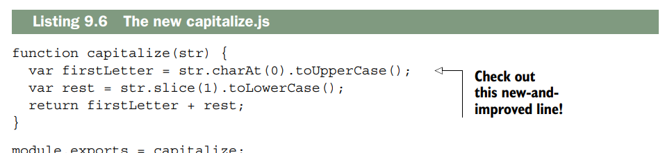
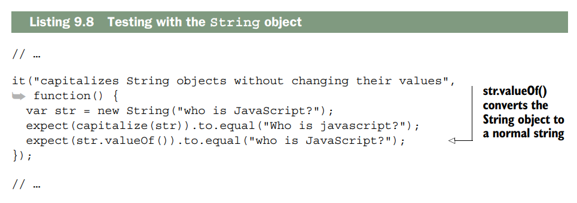
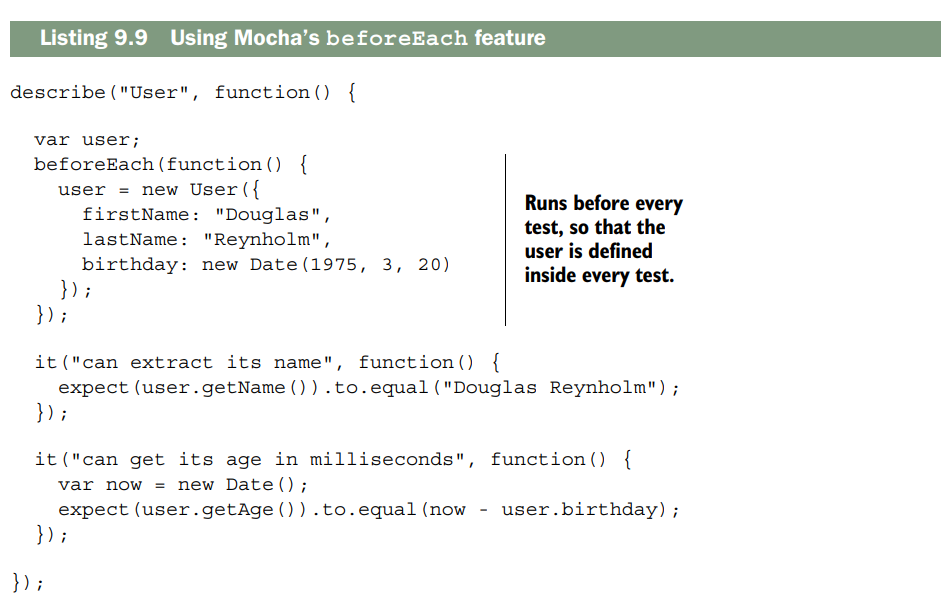
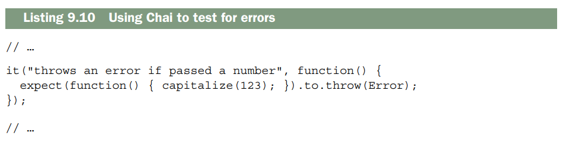

# Testing Express application

Este capítulo cubre:

- [x] **Cómo las pruebas te ayudan a tener más confianza** en el comportamiento de tu código
- [x] **Prácticas comunes de testing**
- [x] **Ejecutar pruebas en Node.js con Mocha y Chai**
- [x] **Usar Mocha con SuperTest y Cheerio**

Escribir código confiable puede ser difícil. Incluso el software pequeño puede ser demasiado complejo para una sola persona, lo que puede crear errores. Los desarrolladores han ideado varios trucos para intentar eliminar estos errores. Los compiladores y verificadores de sintaxis escanean automáticamente tu código en busca de posibles bugs; las revisiones de código entre pares permiten que otras personas miren lo escrito para ver si pueden detectar errores; las guías de estilo mantienen a los equipos de desarrolladores en la misma página. Estos son todos trucos útiles que juegas para mantener tu código más confiable y libre de bugs.

Otra forma poderosa de abordar los bugs es con **pruebas automatizadas**. Las pruebas automatizadas te permiten codificar (¡literalmente!) cómo quieres que se comporte tu software y te permiten decir "¡Mi código funciona!" con mucha más confianza. Te permite refactorizar código sin preocuparte si rompiste algo, y te da retroalimentación fácil sobre dónde falla tu código.

Quieres estos beneficios para tus aplicaciones Express. Al final de este capítulo, podrás:

- **Entender la motivación** para hacer testing a alto nivel
- **Entender los tipos de testing**
- **Hacer desarrollo guiado por pruebas (TDD)**, entendiendo y usando el modelo **rojo-verde-refactor** de desarrollo
- **Escribir, ejecutar y organizar pruebas** para código general de Node.js para asegurarte de que tus funciones y modelos funcionen como se espera (usando herramientas llamadas **Mocha** y **Chai**)
- **Probar tus aplicaciones Express** para asegurarte de que tus servidores se comporten como deben (con un módulo llamado **SuperTest**)
- **Probar respuestas HTML** para asegurarte de que tus vistas generen el HTML correcto (usando un módulo tipo jQuery llamado **Cheerio**)

¡Empecemos a poner estos componentes juntos!

## What is testing and why is it important?

No debería sorprenderte que a menudo hay una desconexión entre cómo imaginas que se comporta tu código y cómo lo hace realmente. Ningún programador ha escrito código libre de bugs el 100% del tiempo; esto es parte de nuestra profesión.

Si estuvieras escribiendo una calculadora simple, por ejemplo, sabrías en tu cabeza que quieres que haga suma, resta, multiplicación y división. Puedes probar esto manualmente cada vez que hagas un cambio —después de este cambio, ¿1 más 1 todavía es igual a 2? ¿12 dividido por 3 todavía es igual a 4?— pero esto puede ser tedioso y propenso a errores.

Puedes escribir **pruebas automatizadas**, que efectivamente ponen estos requisitos en código. Escribes código que dice "asegúrate, con mi calculadora, que 1 + 1 = 2 y que 12 ÷ 3 = 4". Esto es efectivamente una **especificación para tu programa**, pero no está escrita en inglés; está escrita en código para la computadora, lo que significa que puedes verificarla automáticamente.

**Testing** suele ser sinónimo de **pruebas automatizadas**, y simplemente significa ejecutar código de prueba que verifica tu código real. Esta verificación automática tiene varias ventajas. Lo más importante es que puedes tener **mucho más confianza** en la confiabilidad de tu código. Si has escrito una especificación rigurosa que una computadora puede ejecutar automáticamente contra tu programa, puedes estar mucho más seguro de su corrección una vez que la hayas escrito.

También es realmente útil cuando quieres cambiar tu código. Un problema común es que tienes un programa funcional, pero quieres que alguna parte se reescriba (quizás para optimizarla o limpiarla). Sin pruebas, tendrás que verificar manualmente que tu código viejo se comporta como el nuevo. Con **buenas pruebas automatizadas**, puedes confiar en que este **refactoring no rompe nada**.

Las **pruebas automatizadas** también son mucho menos tediosas. Imagina si, cada vez que quisieras probar tu calculadora, tuvieras que asegurarte de que 1 + 1 = 2, 1 – 1 = 0, 1 – 3 = –2 y así sucesivamente. ¡Se volvería aburrido muy rápido!

Las computadoras son fantásticas para manejar tedios como este. En resumen: **escribes pruebas** para poder verificar automáticamente que tu código **(probablemente) funciona**.

###  Test-driven development
Imagina que estás escribiendo un pequeño código JavaScript que redimensiona imágenes a las dimensiones correctas, una tarea común en aplicaciones web. Cuando le pasas una imagen y dimensiones, tu función devuelve la imagen redimensionada a esas medidas. Tal vez tu jefe te asignó esta tarea, o quizás es tu propia iniciativa, pero en cualquier caso, las especificaciones son bastante claras.

Digamos que los párrafos anteriores te han convencido de escribir **pruebas automatizadas** para esto. ¿Cuándo escribes las pruebas? Podrías escribir el redimensionador de imágenes y luego las pruebas, pero también podrías cambiar el orden y **escribir las pruebas primero**. Escribir pruebas primero tiene varias ventajas.

Cuando escribes pruebas primero, estás **codificando literalmente tu especificación**. Al terminar de escribir tus pruebas, le has dicho a la computadora cómo preguntar: "¿Mi código está terminado?". Si tienes pruebas que fallan, tu código no cumple con la especificación. Si todas tus pruebas pasan, sabes que tu código funciona como lo especificaste.

Escribir el código primero podría engañarte y terminarías escribiendo pruebas incompletas. Probablemente has usado una API que es realmente agradable de trabajar. El código es simple e intuitivo. Cuando escribes pruebas primero, te ves forzado a pensar cómo debería funcionar tu código **antes de escribirlo**. Esto te puede ayudar a diseñar lo que algunos llaman **"dream code"**, la interfaz más fácil para tu código.

**TDD** (desarrollo guiado por pruebas) te ayuda a ver el panorama general de cómo debería funcionar tu código y puede resultar en un diseño más elegante. Esta filosofía de "escribir pruebas primero" se llama **test-driven development** (TDD). Se llama así porque tus pruebas dictan cómo se forma tu código.

**TDD puede ayudarte mucho**, pero a veces puede ralentizarte. Si tus especificaciones no están claras, podrías pasar mucho tiempo escribiendo pruebas solo para darte cuenta de que no quieres implementar lo que te propusiste. ¡Ahora tienes todas esas pruebas inútiles y mucho tiempo desperdiciado! TDD puede limitar tu flexibilidad, especialmente si tus especificaciones son un poco vagas. Y si no estás escribiendo pruebas en absoluto, ¡entonces TDD va en contra de tu filosofía!

Algunos usan TDD para todo su desarrollo —pruebas primero o no desarrolles—. Otros están totalmente en contra. No es una bala de plata, ni un veneno mortal; **decide si TDD es adecuado para ti y tu código**. Usaremos TDD en este capítulo, pero no lo tomes como un respaldo incondicional. Es bueno para algunas situaciones y no tan bueno para otras.

__HOW TDD WORKS: RED, GREEN, REFACTOR__

El **ciclo de TDD** usualmente funciona en **tres pasos repetitivos**, llamados **rojo, verde, refactor**, como se muestra en la figura 9.1:

1. **El paso rojo**. Como es TDD, escribes tus **pruebas primero**. Cuando escribes estas pruebas antes de escribir cualquier código real, ninguna de tus pruebas pasará —¿cómo podrían si no hay código real escrito? Durante el paso rojo, escribes todas tus pruebas y las ejecutas para verlas fallar todas. Este paso se llama así por el **color rojo** que usualmente ves cuando tienes una prueba fallida.

2. **El paso verde**. Ahora que has escrito todas tus pruebas, empiezas a llenar el **código real** para satisfacer todas las pruebas. A medida que avanzas, tus pruebas pasarán lentamente de **rojo (fallando)** a **verde (pasando)**. Como el paso anterior, se llama paso verde porque típicamente ves **verde para una prueba aprobada**. Una vez que todo está verde (todas tus pruebas pasan), estás listo para el paso 3.

3. **El paso refactor**. Si todas tus pruebas están verdes, significa que todo tu código funciona, pero podría no ser perfecto. Tal vez una de tus funciones sea lenta o hayas elegido nombres de variables malos. Como un escritor limpiando un borrador de un libro, **vuelves y limpias el código**. Porque tienes todas tus pruebas, puedes **refactorizar sin preocuparte** de que rompas alguna parte imprevista de tu código.

4. **Repite el proceso**. Probablemente no has escrito todo el código para el proyecto, así que **vuelve al paso 1** y escribe pruebas para la siguiente parte.


Así es como podrías usar red-green-refactor para redimensionar tus imágenes:

- **Paso rojo**. Escribes algunas de tus pruebas. Por ejemplo, si le pasas una imagen **JPEG**, tu función debería devolver una imagen **JPEG**; si le pasas una imagen **PNG**, tu función debería devolver una imagen **PNG**. Estas pruebas no son completas, pero es un buen punto de partida.
- **Paso verde**. Ahora que tienes algunas pruebas, llenas el código para hacer que tus pruebas pasen. Nota que **no has escrito pruebas** que digan que debes redimensionar la imagen, solo que debes devolver el mismo tipo de archivo. ¡Así que aún no escribes el redimensionamiento de imagen! Simplemente devuelves la imagen y todas tus pruebas pueden pasar.
- **Paso refactor**. Una vez que todas tus pruebas pasan, puedes volver y **limpiar el código** que has escrito. Tal vez hayas tomado atajos en el paso anterior o puedas hacer tu código más rápido. Esta es tu oportunidad de limpiar las cosas y asegurarte de que las pruebas aún pasen.
- **Repite el proceso**. Vuelve al paso rojo y agrega pruebas que fallen para el **redimensionamiento de imágenes JPEG**, luego implementa el redimensionamiento JPEG para hacer las pruebas verdes, luego refactoriza, y repite.

###  Cardinal rule: when in doubt, test
En resumen, **casi nunca puedes tener demasiadas pruebas**. Como seguramente imaginas, pruebas exitosas no significan necesariamente que tu código funciona, pero es un buen comienzo. Por ejemplo, si estuvieras probando una función, podrías probar que **la función es una función**. Eso es algo muy válido para probar, pero si es tu única prueba, podrías engañarte pensando que tu código funciona cuando todas tus pruebas pasan.

Por eso, quieres **probar tanto de tu código como puedas**. Quieres **explorar cada rincón y recoveco razonable** de tu software para asegurarte de que se comporta como esperas. **Cuantas más pruebas aprobadas tengas**, más te acercas a la certeza de que tu código funciona como esperas.

**Nunca puedes estar 100% seguro** —algo podría romperse en algún momento que no pensaste—, pero si has lanzado todo lo que se te ocurre contra tu código, **probablemente esté funcionando**.

!!! info "Cobertura de código"
    Las **pruebas pueden darte más confianza** en tu código, pero es solo un método. Como discutimos al inicio del capítulo, hay muchos otros métodos como revisiones entre pares y linters de código.<br><br>Una extensión del testing para aumentar aún más tu confianza es la idea de **cobertura de código**. Las herramientas de **cobertura de código** ven **cuánto de tu código está cubierto por tus pruebas**. Podrías imaginar escribir 10 pruebas aprobadas para tu código pero ignorar completamente una de tus funciones, ¡la cual está totalmente rota!<br><br>Estas herramientas te dicen qué partes de tu código **no han sido tocadas por pruebas** y por lo tanto están **sin probar**. En el mundo de Node.js, la herramienta predominante de code coverage parece ser **Istanbul** (https://github.com/gotwarlost/istanbul). No la cubriremos aquí, pero si buscas aún mayor confianza, échale un vistazo a Istanbul.

**El tiempo perdido** es una de las pocas razones para no escribir pruebas. Esto abarca tanto el **tiempo perdido para la computadora** —algunas pruebas pueden ser computacionalmente costosas— como el **tiempo perdido para ti como ser humano** —toma tiempo escribir las pruebas.

## Introducing the Mocha testing framework
Así como es posible escribir servidores web solo con Node, también es posible escribir pruebas solo con Node. Podrías crear un archivo que verificara un montón de condiciones para asegurarte de que todo funcionara normalmente, y luego mostrar los resultados con `console.log`.

Al igual que con Express, podrías encontrar este método crudo bastante **verboso** y tener que escribir mucho **código boilerplate** solo para hacer pruebas. **Mocha** (https://mochajs.org/) es un **framework de testing** que ayuda a reducir este dolor de cabeza. (Por cierto, lo escribió el creador de Express).

Te da una **sintaxis agradable** para organizar tus pruebas y tiene varias características como **soporte para pruebas asíncronas** y **salida fácil de leer**. No está específicamente atado a Express, así que puedes usarlo para probar **aplicaciones Express**, **funciones JavaScript**, **modelos de base de datos** y cualquier otra cosa que se ejecute dentro del runtime de Node.

Antes de empezar a probar aplicaciones Express, probemos una **función simple** para ver cómo se hace. Imagina que quieres escribir una función llamada `capitalize` que **pone la primera letra de un string en mayúscula** y convierte el resto del string a minúsculas. Por ejemplo, `"hello, WORLD"` se convertiría en `"Hello world"`.

### How does Node.js testing work?
**Testing en aplicaciones Node.js** tiene **tres partes principales**: el código real (escrito por ti), el código de pruebas (escrito por ti), y el **test runner** (usualmente un módulo de terceros, probablemente no escrito por ti):

- **El código real** es lo que quieres probar. Puede ser una función, un modelo de base de datos, o un servidor Express. En contexto de Node.js, es cualquier cosa que **asigna algo a `module.exports`**.

- **El código de pruebas** prueba tu código real. **Requiere** lo que quieres probar y luego empieza a hacer preguntas sobre él. ¿La función devuelve lo que debería? ¿Tus objetos se comportan como deberían?

- **El test runner** es un ejecutable que corre en tu computadora. Mira tu código de pruebas y lo ejecuta. Los test runners comúnmente imprimen cosas como "Estas pruebas pasaron, estas fallaron, y así fue como" o "Las pruebas tomaron 100 milisegundos".

Usarás **Mocha** en este capítulo, pero quizás hayas usado **Jasmine** o **QUnit** en tu carrera de JavaScript. Quizás **RSpec** o **JUnit** en otra vida. Tanto el código real como tu código de pruebas viven en el **mismo repositorio**. También definirás **Mocha** (tu test runner) como dependencia e **lo instalarás localmente** en tu repositorio.

### Setting up Mocha and the Chai assertion library
Probemos escribir una **primera versión** de esto. Crea un **nuevo directorio** y crea **un archivo dentro**, `capitalize.js`. Luego pon el código del siguiente listado dentro de él.

```js linenums="1"
//  A first version of the capitalize function (in capitalize.js)

function capitalize(str){
    var firstLetter = str[0].toUpperCase();
    var rest = str.slice(1).toLowerCase();
    return firstLetter + rest
}

export default capitalize
```

Si observas el código de cerca, parece que debería funcionar, pero necesitas **escribir pruebas** para tener más confianza en eso. Crea un archivo **`package.json`** en el mismo directorio, que debería contener el siguiente código.


Estás usando **dos módulos** aquí: **Mocha** (www.mochajs.org) y **Chai** (http://chaijs.com). **Mocha** es un **framework de testing**. Si alguna vez usaste otros frameworks de testing de JavaScript como Jasmine, esto te resultará familiar. Al final del día, es lo que **realmente ejecuta tus pruebas**. Es la sintaxis que usas para decir "Aquí está lo que estoy probando, déjame configurarlo, aquí pruebo la cosa A, aquí la cosa B, y así sucesivamente".

**Chai** es una **librería de aserciones**. Hay varias librerías de aserciones (incluyendo una integrada en Node). Mientras que **Mocha organiza las pruebas**, **Chai** (casi literalmente) dice "Espero que la función `helloWorld` devuelva 'hello, world'". La sintaxis real es `expect(helloWorld()).to.equal("hello, world")`, que se lee mucho como el inglés anterior. Si `helloWorld` funciona y devuelve "hello, world", tus pruebas pasarán. Si no devuelve "hello, world", aparecerá un error diciéndote que las cosas no son como esperabas.

**Mocha espera** que una librería de aserciones **lanze un error**. Si no se lanza error, la prueba pasa. Si se lanza un error, la prueba falla. Por eso usas **Chai** —es una forma agradable de lanzar errores cuando tus pruebas fallan.

La distinción entre **Mocha** y **Chai** es importante. **Mocha** es el **test runner**, así que hay un ejecutable real que corre (nunca escribes `node my_tests.js` ni lo haces `require`). **Mocha inyecta variables globales** en tu código —como verás, estos globals existen para estructurar cada una de tus pruebas. Dentro de cada una de estas pruebas, usas **Chai** para realmente probar tu código.

Cuando pruebes tu librería de capitalización, usarás **Mocha** para dividir tus pruebas en pedazos como "La librería de capitalización capitaliza palabras individuales" y "La librería de capitalización no se rompe si le pasas string vacío". Al nivel de **Chai**, llamarás a tu librería de capitalización y te asegurarás de que la salida de tu módulo coincida con lo que esperas.

###  What happens when you run your tests
Como seguramente esperas, querrás **ejecutar estas pruebas** escritas con Mocha y Chai para asegurarte de que tu código funciona. ¿Cómo lo haces?

Primero, como se muestra en el **listado 9.2**, has definido el **script de prueba** en tu `package.json`. Esto te permite escribir **`npm test`** en la línea de comandos. Esto ejecuta **Mocha**, que a su vez ejecuta tus pruebas, como puedes ver en la **figura 9.2**.

**Ya tienes todo configurado**. Es hora de empezar a **escribir tus pruebas**.


### Writing your first test with Mocha and Chai


Ahora que has escrito una **primera versión** de tu función de capitalización, escribirás una **prueba** para ver si funciona. Crea una carpeta llamada **`test`** en la raíz de tu proyecto; aquí vivirá tu código de pruebas.

Dentro de ese directorio, crea un archivo para probar tu capitalización; yo lo llamé `capitalize.js`. Pon el código del **siguiente listado** dentro.

')

Entonces, ¿qué está pasando aquí? Primero, **requieres tu módulo** para poder probarlo. Luego, **requieres Chai** y usas su propiedad `expect` para poder usarla y hacer **assertions** más adelante.

A continuación, se describe un conjunto de pruebas. Este conjunto es básicamente un componente de la aplicación; podría ser una clase o simplemente un conjunto de funciones. Este conjunto se llama "capitalize"; es inglés, no código. En este caso, describe la función de capitalización.

Dentro de este conjunto, se define una prueba (se añadirán más en breve). Es una función de JavaScript que indica qué debe hacer una parte del programa. Lo indica en lenguaje natural ("Convierte en mayúsculas palabras sueltas") y en código. Para cada conjunto, se pueden tener varias pruebas para las pruebas que se deseen realizar.

Finalmente, dentro de la prueba, se espera que el resultado de `capitalize("express")` sea igual a "Express", y que se aplique la misma capitalización a "cats".
Con respecto al código, la ejecución de `npm test` sigue un flujo similar al que se muestra en la figura 9.3.


Si va a la raíz de su proyecto y escribe npm test, verá algo como
siguiente salida:

```sh
apitalize
 ✓ capitalizes single words
1 passing (9ms)
```

¡Eso significa que has ejecutado **una prueba**, ¡y paso! **¡Felicidades** — has escrito tu **primera prueba**.

No sabes que todo funciona al 100%, pero sabes que **capitaliza correctamente la primera letra de dos palabras diferentes**. **Aún no estás fuera de peligro**; hay más pruebas que escribir para tener más confianza en que tu código funciona.

### Adding more tests

Hasta ahora has escrito **una sola prueba**, y esto te ha mostrado que tu código **no está totalmente roto**. Pero no sabes si funciona con **entradas más complejas**. ¿Qué pasaría si le pasas un string sin letras? ¿Qué tal un **string vacío**? Puedes ver que estás capitalizando la primera letra, pero ¿estás **convirtiendo el resto del string a minúsculas**? **Agreguemos más pruebas** para probar los **caminos infelices**.

 Empieza añadiendo otra prueba relativamente sencilla: ¿convierte el resto de la cadena a minúsculas? Deja todo lo que había antes y añade una nueva prueba a `test/capitalize.js`, tal y como se muestra en el siguiente fragmento de código


')

Puede ejecutar sus pruebas con npm test (npm t para abreviar) y debería ver algo
así:

```sh
  capitalize
    ✔ capitalizes single words
    ✔ makes the rest of the string lowercase
  2 passing (2ms)
```

¡Genial! Ahora estás más seguro de que estás poniendo en mayúscula la primera letra y en minúscula el resto de la string. Pero **aún no estás a salvo**. 

¿Qué pasa con agregar una prueba para el **string vacío**? Capitalizar el string vacío debería **solo devolver el string vacío**, ¿verdad?. Escribe la prueba del **siguiente listado** para ver si eso sucede.

```sh
   capitalize
    ✔ capitalizes single words
    ✔ makes the rest of the string lowercase
    1) leave empty string alone
  2 passing (4ms)
  1 failing

  1) capitalize
       leave empty string alone:
     TypeError: Cannot read properties of undefined (reading 'toUpperCase')
      at capitalize (file:///C:/Users/alexa/OneDrive/Escritorio/createServerExpress/parte3/B_testingExpress/capitalize.js:3:30)
      at Context.<anonymous> (file:///C:/Users/alexa/OneDrive/Escritorio/createServerExpress/parte3/B_testingExpress/test/capitalize.js:16:16)
      at process.processImmediate (node:internal/timers:504:21)

```
¡Oh, oh! Parece que hay una prueba roja/reprobada. Examinémoslo para ver qué está mal.

Primero, puedes ver que el error ocurre cuando ejecutas la prueba **"leaves empty strings alone"** ("deja los strings vacíos intactos"). El error es un **TypeError**, y te dice que **no puedes llamar a `toUpperCase` en `undefined`**. También puedes ver un **stack trace**, que empieza en la **línea 2** de `capitalize.js`.

Aquí está la línea que causa el error:
```javascript
const firstLetter = str[0].toUpperCase();
```

Parece que **`str[0]` es `undefined`** cuando pasas el string vacío, así que necesitas asegurarte de que esté definido. **Reemplaza el uso de corchetes** con el método **`charAt`**. Tu función **nueva y mejorada** debería verse como la del **siguiente listado**.



Vuelva a ejecutar sus pruebas con npm test y debería ver todo en verde.

```sh
 capitalize
    ✔ capitalizes single words
    ✔ makes the rest of the string lowercase
    ✔ leave empty string alone

  3 passing (3ms)
```
Puedes agregar algunas pruebas más para asegurarte de que tu código sea robusto. Agregarás una prueba que no intente capitalizar ninguna letra. También verificarás que capitalice correctamente cadenas de varias palabras. Además, debes asegurarte de que deje una cadena tal como está si ya está correctamente capitalizada. Las nuevas pruebas en la siguiente lista deberían pasar con el código que ya tienes.

```js linenums="1"
import { expect } from "chai";
import capitalize from "../capitalize.js"

describe ("capitalize",function() {

    it("capitalizes single words",function(){
    expect(capitalize("express")).to.equal("Express")
    expect(capitalize("cast")).to.equal("Cast")
    })

     it("makes the rest of the string lowercase",()=>{
        expect(capitalize("javascript")).to.equal("Javascript")
    })

    it("leave empty string alone", ()=>{
        expect(capitalize("")).to.equal("")
    })
    
    it("leaves strings with no words alone",()=>{
        expect(capitalize(" ")).to.equal(" ")
        expect(capitalize("123")).to.equal("123")
    })

    it("capitalizes multiple-word string",()=>{
        expect(capitalize("what is Express?")).to.equal("What is express?")
        expect(capitalize("i love lamp")).to.equal("I love lamp")
    })
    it("leaves already-capitalized words alone",()=>{
        expect(capitalize("Express")).to.equal("Express")
        expect(capitalize("Evan")).to.equal("Evan");
        expect(capitalize("Catman")).to.equal("Catman");
    })

})

```
Ejecuta `npm test` y deberías ver que tus pruebas se superan.

```sh
capitalize
    ✔ capitalizes single words
    ✔ makes the rest of the string lowercase
    ✔ leave empty string alone
    ✔ leaves strings with no words alone
    ✔ capitalizes multiple-word string
    ✔ leaves already-capitalized words alone
  6 passing (4ms)
```


Por último, intentarás ponerle una dificultad más a tu función: el objeto String.
Todas las guías de estilo de JavaScript te advertirán de que no utilices el objeto String: es una mala idea que puede provocar comportamientos inesperados, tal y como se dice de `==` o `eval`. Es posible que ni siquiera conozcas esta característica de JavaScript, lo cual es mejor así, porque nunca deberías usarla

Desafortunadamente, hay **programadores inexpertos** por ahí (y otros que, tristemente, son tontos). Algunos de ellos podrían estar usando tu código. Podrías argumentar que **los bugs son culpa de ellos**, pero también podrías argumentar que **tu código no debería ser el problema**. 

Por eso deberías **probar tu función con el objeto String**, por si acaso. Escribamos **una última prueba** que use el objeto String, como se muestra en el **siguiente listado**.



Tienes siete pruebas para tu pequeña función de capitalización; ejecute la prueba npm por última vez para asegurarnos de que todos pasen.


```sh

  capitalize
    ✔ capitalizes single words
    ✔ makes the rest of the string lowercase
    ✔ leave empty string alone
    ✔ leaves strings with no words alone
    ✔ capitalizes multiple-word string
    ✔ leaves already-capitalized words alone
    ✔ capitalizes String objects without changing their values

  7 passing (4ms)
```
¡Mírate! Ahora estás bastante seguro de que tu función de capitalización funciona, incluso cuando pasó una variedad de cadenas extrañas.

### More features of Mocha and Chai

Hasta ahora, sólo has visto cómo puedes usar Mocha y Chai para probar la igualdad. Efectivamente, ha utilizado un operador de igualdad glorificado. Pero estos dos módulos pueden hacer mucho más que eso. No analizaremos todas las opciones aquí, pero veremos una un par de ejemplos.

Aquí tienes la traducción:

---

**EJECUTAR CÓDIGO ANTES DE CADA PRUEBA**

Es común ejecutar código de configuración antes de ejecutar tus aserciones. Quizás estás definiendo una variable para manipularla o iniciando tu servidor. Si estás haciendo esta configuración en muchos test, puedes usar la función `beforeEach` de Mocha para ayudar a reducir la cantidad de código repetido.

Vamos a decir que has creado un modelo `User` y quieres testearlo. 

En cada test individual, estás creando un objeto `User` y quieres testearlo. El siguiente listado muestra cómo podrías hacerlo.



En el código anterior listamos algunas funcionalidades de un **objeto User imaginario**, pero **no vuelve a redefinir el objeto User dentro de cada prueba** (dentro de cada bloque `it`); los define en un bloque **`beforeEach`**, que **redefine el usuario antes de ejecutar cada prueba**.

**`beforeEach`** es un hook de Mocha que ejecuta código de configuración antes de cada prueba, evitando repetir ese setup en cada bloque `it`.

En el ejemplo, en lugar de crear el objeto `User` dentro de cada test, se crea una sola vez en `beforeEach`, que lo reinicia automáticamente antes de que corra cada prueba.

**PROBANDO PARA ERRORES**

Si le pasas un **string** a tu función de capitalización, todo debería funcionar normalmente. Pero si le pasas algo que **no es un string**, como un número o `undefined`, quieres que tu función **lanze algún tipo de error**. Puedes usar **Chai** para probar esto, como se muestra en el **siguiente listado**.



Esto probará que llamar a `capitalize` con `123` **lanza un error**. Lo único complicado es que **tienes que envolverlo en una función**. Esto es porque **no quieres que tu código de prueba cree un error** —quieres que ese error sea **capturado por Chai**.

**INVIERTIENDO PRUEBAS**

Podrías querer probar que un valor **es igual** a otro valor o que una función **lanza un error**, pero también podrías querer probar que un valor **NO es igual** a otro o que una función **NO lanza un error**. En el espíritu de la sintaxis de Chai que se lee casi como inglés, puedes usar **`.not`** para invertir tu prueba, como se muestra en el siguiente listado.

Digamos que quieres asegurarte de que capitalizar **"foo" no sea igual a "foo"**. Este es un ejemplo un poco forzado, pero podrías querer asegurarte de que tu función de capitalización **realmente haga algo**.

Solo hemos comenzado a arañar la superficie de lo que **Chai** puede hacer. Para más de sus características, consulta la documentación en [http://chaijs.com/api/bdd/](http://chaijs.com/api/bdd/).

## Testing Express servers with SuperTest

Las técnicas anteriores son útiles para probar **lógica de negocio** como el comportamiento de modelos o funciones utilitarias. Estas se llaman comúnmente **pruebas unitarias**; prueban **unidades discretas** de tu aplicación.

Pero también podrías querer probar las **rutas o middleware** de tus aplicaciones Express. Podrías querer asegurarte de que tus **endpoints de API** devuelvan los valores correctos, o que estés sirviendo archivos estáticos, o varias otras cosas. Estas se llaman comúnmente **pruebas de integración** porque prueban el **sistema integrado como un todo**, en lugar de piezas individuales aisladas.

Usarás el módulo **SuperTest** (https://github.com/visionmedia/supertest) para lograr esto. **SuperTest inicia tu servidor Express** y envía peticiones a él. Una vez que las peticiones regresan, puedes hacer **assertions** sobre la respuesta.

Por ejemplo, podrías querer asegurarte de que obtienes un **código de estado HTTP 200** cuando envías una petición **GET** a la página principal. **SuperTest enviará esa petición GET** a la página principal y luego, cuando obtengas la respuesta, se asegurará de que tenga **200 como su código de estado HTTP**.

Puedes usar esto para probar el **middleware o rutas** que definas en tu aplicación.

La mayoría de los navegadores envían al servidor un __header llamado User-Agent__ que identifica el tipo de navegador. Así es como suelen mostrarte las versiones móviles de los sitios web cuando estás en un dispositivo móvil: el servidor detecta que estás en un dispositivo móvil y te envía una versión diferente de la página.

Construyamos **"What's My User Agent?"**, una aplicación simple para obtener el **string User Agent** de tus usuarios. Soporta una **vista HTML clásica** cuando la visitas en un navegador. También podrás obtener el **User Agent del usuario como texto plano**.

Habrá **solo una ruta** para estas dos respuestas. Si un visitante va a la **raíz de tu sitio** (en `/`) y **no pide HTML** (como lo harían la mayoría de los navegadores web), se les mostrará su **User Agent como texto plano**. Si visitan la misma URL pero su **header Accepts menciona HTML** (como hacen los navegadores web), se les dará su **User Agent como una página HTML**.

Crea un **nuevo directorio** para este proyecto, y crea un **archivo package** en la carpeta, como se muestra en el listado que sigue.

```json
{
 "name": "whats-my-user-agent",
 "private": true,
 "scripts": {
 "start": "node app",
 "test": "mocha"
 },
 "dependencies": {
 "ejs": "^1.0.0",
 "express": "^4.10.1"
 },
 "devDependencies": {
 "mocha": "^2.0.1",
 "cheerio": "^0.17.0",
 "supertest": "^0.14.0"
 }
}
```
En los ejemplos anteriores, escribiste tu código y **luego** escribiste las pruebas. En este ejemplo, **lo invertirás** y harás **TDD**. Sabes lo que quieres que haga tu aplicación, así que puedes **escribir las pruebas ahora mismo** sin preocuparte por cómo lo implementarás. 

**Tus pruebas fallarán al principio**, ¡porque no habrás escrito código real! Después de que tus pruebas estén escritas, **volverás y llenarás la aplicación** para hacer que tus pruebas pasen.

El enfoque TDD no siempre es el mejor; A veces no estás muy seguro de cómo debería verse tu código, por lo que sería un desperdicio escribir pruebas. Hay enormes guerras en línea sobre los pros y los contras de TDD; No los reiteraré aquí, pero probarás TDD para este ejemplo. 

Escribirás pruebas para las dos partes principales de esta aplicación:

- La API de texto sin formato
- La vista HTML
- 
Comenzará probando la API de texto sin formato.

###  Testing a simple API

Como es la más simple, comenzarás probando la **API de texto plano**. En inglés simple, esta prueba necesitará **enviar una petición** a tu servidor en la ruta `/`, así el servidor sabe que quieres **texto plano** en primer lugar. Querrás assertar que (1) la respuesta es el **string User Agent correcto** y (2) la respuesta regresa como **texto plano**.

Codifiquemos este inglés en **pruebas Mocha**. Crea una carpeta llamada **`test`** para todas tus pruebas, y crea un archivo para probar la **API plaintext**; yo lo llamé `txt.js`. Dentro, pon el **esqueleto** mostrado en el **siguiente listado**.

' )

Hasta ahora, esto es solo un **esqueleto**, pero no es muy diferente de lo que tenías antes cuando probabas tu módulo de capitalización. Estás **requiriendo tu app** (que aún no has escrito), **describiendo una suite de pruebas** ("plain-text mode", en este caso), y luego **definiendo dos pruebas**: una asegurando que obtienes una respuesta plain-text y otra que obtienes el **string User-Agent correcto**.

Llenemos la **primera prueba**, para asegurarnos de que tu aplicación devuelve una **respuesta de texto plano**. Recuerda: lo que estás probando **aún no existe**. Vas a **escribir las pruebas**, verlas fallar, y **luego llenar el código real** para hacer que pasen.

Tu primera prueba necesitará **hacer una petición al servidor**, asegurándose de establecer el **header Accept a `text/plain`**, y una vez que obtenga una respuesta del servidor, tu prueba debería asegurar que regrese como **`text/plain`**. El modulo SuperTest te ayudara con esto, importalo al principio de tu archivo. Usaras Supertest para enviar solicitudes a tu servidor y comprueba si te da la respuesta que buscas. Todo esto se muestra en el siguiente listado.

' )

Observa cómo usas **SuperTest** para probar tu aplicación. No es exactamente como Chai en que se lee como inglés, pero debería ser bastante directo. Aquí está lo que estás haciendo con **SuperTest**, línea por línea:

- **Envuelves tu app** llamando a `supertest` con `app` como argumento. Esto devuelve un **objeto SuperTest**.

- **Llamas a `get`** en ese objeto SuperTest con la ruta que quieres solicitar; en este caso, quieres la **raíz de la aplicación** (en `"/"`).

- **Estableces opciones** en esta petición; en este caso, estás seteando el **header HTTP Accept a `text/plain`** y el header **User-Agent a "my cool browser"**. Llamas a `set` múltiples veces porque quieres establecer **múltiples headers**.

- En la **primera llamada a `expect`**, dices "Quiero que el **Content-Type coincida** con `'text/plain'`". Nota que esto es una **expresión regular**, no un string. Quieres ser un poco flexible aquí; el Content-Type podría ser `"text/plain"`, o podría ser `"text/plain; charset=utf-8"` o algo así. Quieres probar el **content type de texto plano** pero no el **character set específico** porque es ASCII en este caso, que es el mismo en la mayoría de encodings de caracteres.

- En la **segunda llamada a `expect`**, te aseguras de obtener el **código de estado HTTP de 200**, que significa "OK". Podrías imaginar escribir una prueba para un recurso inexistente, donde esperarías que el código de estado sea **404** o cualquiera de los otros muchos códigos de estado HTTP.

- Finalmente, llamas a **`end` con `done`**. **`done`** es una función callback pasada por **Mocha**, que usas para señalar que las **pruebas asíncronas** (como esta) han terminado.

A continuación, llenarás tu **segunda prueba** para asegurarte de que tu aplicación devuelve el **User Agent correcto**. Se verá bastante similar a la anterior, pero probarás el **body de la respuesta**. Llena tu segunda prueba así.


.')

Las **primeras tres líneas** de esta prueba y la **última línea** deberían verse similares a antes; configuras **SuperTest** para probar tu app, y cuando terminas de probar cosas, llamas a **`done`**.

La parte del medio llama a **`expect`** esta vez, **con una función** . Esta función **lanza un error** si `res.text` (el texto que tu aplicación devuelve) **no es igual** al header User-Agent que pasaste. Si es igual, entonces la función simplemente termina sin problemas.

**Una última cosa**: tienes algo de **código duplicado** aquí(Las **primeras tres líneas** de esta prueba y la **última línea**). En estas pruebas, siempre estás haciendo la **misma petición** a tu servidor: la misma aplicación, la misma ruta, y los mismos headers. ¿Qué tal si no tuvieras que **repetirte**?

Entra la característica **`beforeEach`** de Mocha, como se muestra en el **siguiente listado**.

')

Como puedes ver, estás usando **`beforeEach`** para eliminar **código repetido**. Los beneficios de esto realmente se muestran cuando tienes **muchas pruebas** con la misma configuración cada vez.

Ahora que has escrito tus **dos pruebas**, puedes ejecutarlas con **`npm test`** como verificación de cordura. Como **no has creado el archivo** donde vivirá tu app, deberías obtener un error que contenga algo como **"Cannot find module '../app'"**. 

Esto es **exactamente lo que esperarías** en este punto: has escrito las pruebas pero **no código real**, así que ¿cómo podrían pasar tus pruebas? Este es el **paso rojo** en el ciclo **rojo-verde-refactor**.

Puedes hacer que los errores sean un poco mejores creando **`app.js`** en la **raíz de tu proyecto** y poniendo una **app Express esqueleto** dentro, así.

```sh
> c_testingsimpleapi@1.0.0 test
> mocha

  plain text response
    1) return a plain text response
    2) return your User-Agent

  0 passing (23ms)
  2 failing

  1) plain text response
       return a plain text response:
     Error: expected "Content-Type" matching /text\/plain/, got "text/html; charset=utf-8"
      at Context.<anonymous> (file:///C:/Users/alexa/OneDrive/Escritorio/createServerExpress/parte3/C_TestingSimpleApi/test/txt.js:11:10)
      at process.processImmediate (node:internal/timers:504:21)
      ...

  2) plain text response
       return your User-Agent:
     Error: Response does not contain User Agent
      at Context.<anonymous> (file:///C:/Users/alexa/OneDrive/Escritorio/createServerExpress/parte3/C_TestingSimpleApi/test/txt.js:21:10)
      at process.processImmediate (node:internal/timers:504:21)
      ...
```
Sin duda, estos son **errores**. Pero estos errores ya están **mucho mejor** que "Cannot find module". Puedes ver que **cosas reales están siendo probadas** aquí. 

Escribamos tu aplicación para hacer que estas pruebas pasen de **rojo (fallando)** a **verde (pasando)**.

### Filling in the code for your first tests

Ahora que es momento de escribir código de verdad, inserta el código del siguiente listado dentro de app.js, en la raíz de tu proyecto.


La **última línea** es lo único que podría parecer nuevo: **exportas la app**. Normalmente, cuando ejecutas un archivo (como `node app.js`), no necesitas exportar la app porque **no piensas en ella como un módulo**. Pero cuando **estás probando la aplicación**, necesitarás **exportarla** para que el mundo exterior pueda **pincharla y probarla**.

Si ejecutas **`npm test`** ahora, verás algo como la siguiente salida:

```sh
 plain text response
    1) return a plain text response
    ✔ return your User-Agent


  1 passing (18ms)
  1 failing

  1) plain text response
       return a plain text response:
     Error: expected "Content-Type" matching /text\/plain/, got "text/html; charset=utf-8"
      at Context.<anonymous> (file:///C:/Users/alexa/OneDrive/Escritorio/createServerExpress/parte3/C_TestingSimpleApi/test/txt.js:16:10)
      at process.processImmediate (node:internal/timers:504:21)
```
¡**Esto es bueno**! No estás completamente terminado porque **solo la mitad de tus pruebas pasan**, pero parece que estás devolviendo el **User Agent correcto**. 

Agrega **solo una línea más** para hacer que **todas tus pruebas pasen**, como se muestra en el **siguiente listado**.


Ahora, cuando ejecutes npm test, ¡verás que todas tus pruebas pasan!

```sh
  plain text response
    ✔ return a plain text response
    ✔ return your User-Agent
  2 passing (18ms)
```

¡**Esto es genial**; ahora estás devolviendo las **respuestas de texto plano** que deseas. Ahora has terminado el **paso verde** en el ciclo **rojo-verde-refactor**. 

En este caso el **paso refactor final es simple**: no tienes que hacer nada. Tu código es tan **corto y dulce** que no necesita mucho cleanup aún.

**Pero espera**, ¿no querías también devolver **respuestas HTML**? **Tus pruebas no deberían estar pasando aún**, ¿verdad? Tienes razón, lector sabio. **Escribamos más pruebas** y volvamos al **paso rojo**.

###  Testing HTML responses

Como hemos visto, si el usuario solicita **texto plano**, recibirá **texto plano**. Pero si quieren **HTML**, deberían recibir **HTML**, pero ahora solo están obteniendo **texto plano**.

Para arreglar esto **al estilo TDD**, escribirás **pruebas** para asegurarte de que lo de **HTML funcione**, verás esas pruebas **fallar**, y luego completarás el resto del código.

Crea **`test/html.js`**, que contendrá las **pruebas para la parte HTML** de tu servidor. El **esqueleto** de este archivo se verá bastante similar a lo que has visto en la parte de **texto plano** de tus pruebas, pero el **interior de una de ellas** se verá diferente. El siguiente listado muestra el **esqueleto de las pruebas HTML**.

')

Hasta ahora, todo esto debería parecerse mucho al código que tenías en tus test de texto plano. Estás importando la app y SuperTest; estás haciendo algo de configuración de prueba en un bloque `beforeEach`; te aseguras de que recibes HTML de vuelta y también el User Agent correcto. La primera prueba en este archivo también se parece bastante a la primera que escribiste en el otro archivo. Vamos a completarla ahora, como se muestra en el siguiente listado.

```js linenums="1"
// Prueba de respuesta HTML (en test/html.js)

it("returns an HTML response", function(done) {
 request
 .expect("Content-Type", /html/)
 .expect(200)
 .end(done);
});
```
Esto es muy parecido a lo anterior. Estás comprobando que la respuesta contenga HTML y que el código de estado HTTP sea 200. La siguiente prueba es donde las cosas cambian. Primero, escribirás el código para obtener la respuesta HTML desde el servidor. El siguiente listado debería parecerse bastante a lo que ya has visto antes.

```js linenums="1"
it("return your User-Agent",function(done){
    resquest
    .expect(function(res){
        let htmlResponse = res.text;
        // …
    })
    .end(done)
})
```
Ahora es el momento de hacer algo con ese HTML. No solo quieres que la cadena de User Agent aparezca en algún lugar del HTML; quieres que aparezca dentro de una etiqueta HTML específica. Tu respuesta tendrá una apariencia similar a la del siguiente listado.


No te importa demasiado la mayor parte de este HTML; lo que quieres testear está dentro de un elemento con la clase `user-agent`. ¿Cómo lo extraes?

Aquí entra en juego **Cheerio** (https://cheeriojs.github.io/cheerio/), la última dependencia de tu lista de `devDependencies`. En resumen, **Cheerio es jQuery para Node**. Puede sonar extraño —¿por qué necesitarías manipular el DOM en un entorno sin DOM?—, pero es exactamente lo que necesitas ahora. Debes poder recorrer el HTML y encontrar el User Agent dentro de él. Si estuvieras en el navegador, usarías jQuery para hacerlo; al estar en Node, usarás Cheerio, que será muy familiar para cualquiera que conozca jQuery. Usarás Cheerio para parsear el HTML, localizar dónde debe estar el User Agent y asegurarte de que sea válido. Comienza requiriendo Cheerio en la parte superior de tu archivo de pruebas y luego usa Cheerio para parsear el HTML que obtienes de tu servidor, tal como se muestra aquí.

')


Aquí usas Cheerio para analizar tu HTML y darle sentido, tal como lo haces con jQuery. Una vez que has analizado el HTML y obtenido el valor que deseas, puedes ejecutar tus pruebas igual que antes. Cheerio facilita el análisis del HTML y lo puedes usar para probar respuestas HTML.

Ahora que has escrito tus dos pruebas, puedes ejecutar `npm test`. Verás que tus pruebas de texto plano pasan como antes, pero tus nuevas pruebas de HTML fallarán porque aún no has escrito el código; esto es el paso rojo. Vamos a hacer que esas pruebas pasen.

Si has estado siguiéndome hasta ahora, el código para esto no debería ser nada raro. Harás cambios en tu manejador de solicitudes y renderizarás una vista EJS que contendrá el User Agent tal como lo espera tu prueba. Primero, necesitas modificar tu `app.js`. Configurarás EJS como motor de vistas y luego renderizarás la vista HTML cuando el cliente quiera HTML, como se muestra en el siguiente listado.


Este código no debería ser demasiado complicado si ya has visto vistas antes. Estás configurando EJS como motor de vistas, asignándole una ruta y luego renderizando una vista si el usuario la solicita. Lo último que necesitarás hacer es definir la vista EJS. Crea `views/index.ejs` y coloca el siguiente código dentro.

```js linenums="1"
<!DOCTYPE html>
<html lang="es">
<head>
  <meta charset="utf-8">
  <title>User Agent</title>
  <style>
    html {
      font-family: sans-serif;
      text-align: center;
    }
  </style>
</head>

<body>
  <h2>Your User Agent is:</h2>

  <h1 class="user-agent">
    <%= userAgent %>
  </h1>
</body>
</html>
```

Ha llegado el momento clave. Ejecuta todas tus pruebas con `npm test` y deberías ver un mar de resultados positivos:

```sh
 html response
  html response
    ✔ return HTML response
    ✔ return your User-Agent

  plain text response
    ✔ return a plain text response
    ✔ return your User-Agent
  4 passing (33ms)
```

¡Todas tus pruebas pasan! ¡Está todo en verde! ¡Días felices! Ahora ya sabes cómo probar una aplicación con Mocha, Chai, SuperTest y Cheerio.

La idea más importante de este capítulo no es una lista de herramientas; es el hecho de que, mediante el testing, puedes sentirte mucho más seguro sobre el comportamiento de tu aplicación. Cuando escribes código, quieres que funcione tal como lo has planeado. Eso suele ser difícil de conseguir, pero con pruebas puedes estar un poco más seguros de que las cosas funcionan como pretendías.

## Summary

- Quieres probar tu código porque quieres tener más confianza en cómo funciona.  
- Existen varios tipos de pruebas, desde pruebas unitarias de bajo nivel hasta pruebas de integración de alto nivel.  
- El desarrollo guiado por pruebas (TDD) es un estilo de desarrollo en el que escribes las pruebas *antes* que el código real. Normalmente trabajas en el ciclo rojo‑verde‑refactor:  
  - **Rojo:** cuando tus pruebas fallan.  
  - **Verde:** después de que tus pruebas pasan.  
  - **Refactor:** una vez que todo funciona, limpias y mejoras el código.


## Otro Tema - 📊 FIRMAS + PARÁMETROS (Mocha y Chai)
| Elemento    | Herramienta | Firma                       | Parámetros                             | Qué significa                      |
| ----------- | ----------- | --------------------------- | -------------------------------------- | ---------------------------------- |
| `describe`  | Mocha       | `describe(titulo, funcion)` | `titulo`: string<br>`funcion`: función | Agrupa varias pruebas relacionadas |
| `it`        | Mocha       | `it(titulo, funcion)`       | `titulo`: string<br>`funcion`: función | Define una prueba específica       |
| `expect`    | Chai        | `expect(valor)`             | `valor`: cualquier dato                | Valor que quieres comprobar        |
| `.to.equal` | Chai        | `.to.equal(esperado)`       | `esperado`: cualquier dato             | Valor que debería tener            |

Listo, vamos a lo técnico pero claro: **las firmas** (la forma exacta en que se usan las funciones).


## 🟦 Firmas de Mocha


### 🧩 1. `describe`

```js linenums="1"
describe(titulo, funcion)
```

### ✔️ Parámetros:

* `titulo` → string (nombre del grupo de tests)
* `funcion` → función que contiene los tests

### 🔍 Ejemplo

```js linenums="1"
describe("Usuario", () => {
  // tests aquí
});
```

### 🧩 2. `it`

```js linenums="1"
it(titulo, funcion)
```

### ✔️ Parámetros:

* `titulo` → qué prueba estás haciendo
* `funcion` → la prueba en sí

### 🔍 Ejemplo

```js linenums="1"
it("debería crear un usuario", () => {
  // lógica de prueba
});
```


### 🧩 3. (async opcional)

```js linenums="1"
it("test async", async () => {
  // await algo
});
```

👉 Mocha soporta async/await


## 🟩 Firmas de Chai

Chai es diferente: usa **encadenamiento (chain)**.


### 🧩 1. `expect`

```js linenums="1"
expect(valor)
```

👉 recibe el valor que quieres evaluar


### 🧩 2. `.to.equal`

```js linenums="1"
expect(valor).to.equal(esperado)
```
### ✔️ Parámetro:

* `esperado` → valor que debería tener


### 🔍 Ejemplo

```js linenums="1"
expect(2 + 2).to.equal(4);
```

## 🧩 3. Otras firmas comunes

### Igualdad estricta

```js linenums="1"
expect(valor).to.equal(esperado)
```

### Booleanos

```js linenums="1"
expect(valor).to.be.true
expect(valor).to.be.false
```

### Tipos
 
```js linenums="1"
expect(valor).to.be.a("string")
```


### Includes

```js linenums="1"
expect("hola").to.include("ho")
```


### 🔥 TODO JUNTO (firma completa en acción)

```js linenums="1"
import { expect } from "chai";

describe("Math", () => {              // Mocha
  it("debería sumar bien", () => {   // Mocha
    expect(2 + 2).to.equal(4);       // Chai
  });
});
```

## Otro Tema - 📊 FIRMAS + PARÁMETROS (Supertest y Cheerio)

### Cheerio vs Supertest (resumen operativo)

| Herramienta | Tipo         | Para qué sirve                      | Firma principal      | Qué recibe          | Qué devuelve            | Uso típico                         |
| ----------- | ------------ | ----------------------------------- | -------------------- | ------------------- | ----------------------- | ---------------------------------- |
| Supertest   | Testing HTTP | Simular peticiones a tu API Express | `request(app)`       | `app` (tu servidor) | objeto encadenable      | probar rutas (`GET`, `POST`, etc.) |
| Cheerio     | Parsing HTML | Leer y analizar HTML                | `cheerio.load(html)` | `html` (string)     | función `$` tipo jQuery | validar contenido HTML             |
---
### Firmas clave - Supertest

| Función      | Firma                | Parámetros      |
| ------------ | -------------------- | --------------- |
| iniciar      | `request(app)`       | `app` (Express) |
| GET          | `.get(ruta)`         | `ruta` (string) |
| POST         | `.post(ruta)`        | `ruta`          |
| enviar datos | `.send(data)`        | `data` (objeto) |
| headers      | `.set(clave, valor)` | strings         |
| respuesta    | `await request(...)` | retorna `res`   |

### Firmas clave - Cheerio

| Función     | Firma                | Parámetros      |
| ----------- | -------------------- | --------------- |
| cargar HTML | `cheerio.load(html)` | `html` (string) |
| selector    | `$(selector)`        | CSS selector    |
| texto       | `.text()`            | —               |
| atributo    | `.attr(nombre)`      | string          |
| iterar      | `.each(fn)`          | función         |
---
### Supertest (con qué hace cada cosa)

| Elemento     | Firma                | Qué hace realmente                             |
| ------------ | -------------------- | ---------------------------------------------- |
| iniciar      | `request(app)`       | conecta tu test con tu app Express             |
| GET          | `.get("/ruta")`      | simula una petición GET                        |
| POST         | `.post("/ruta")`     | simula una petición POST                       |
| enviar datos | `.send(data)`        | manda datos como si fuera un formulario o JSON |
| headers      | `.set(clave, valor)` | agrega headers (ej: auth, cookies)             |
| respuesta    | `await request(...)` | ejecuta la petición y devuelve la respuesta    |


**Ejemplos claros de Supertest** en distintos escenarios reales.

#### GET básico

```js linenums="1"
import request from "supertest";
import { expect } from "chai";
import app from "../app.js";

describe("GET /", () => {
  it("debería responder 200", async () => {
    const res = await request(app).get("/");

    expect(res.status).to.equal(200);
  });
});
```

👉 Qué hace: verifica que la ruta `/` funciona

---

#### Ver contenido de respuesta (texto)

```js linenums="1"
it("debería devolver HTML con Hola", async () => {
  const res = await request(app).get("/");
  expect(res.text).to.include("Hola");
});
```

👉 Qué hace: revisa que el HTML contenga texto

---

#### POST con datos (login)

```js linenums="1"
it("debería logear usuario", async () => {
  const res = await request(app)
    .post("/login")
    .send({ username: "alex", password: "123" });

  expect(res.status).to.equal(302); // redirect
});
```

👉 Qué hace:

* envía datos como formulario
* verifica respuesta

---

#### Enviar JSON

```js linenums="1"
it("debería crear usuario", async () => {
  const res = await request(app)
    .post("/users")
    .send({ name: "Alex" });

  expect(res.body.name).to.equal("Alex");
});
```

👉 Qué hace:

* manda JSON
* valida respuesta JSON

---

#### Validar headers

```js linenums="1"
it("debería devolver JSON", async () => {
  const res = await request(app).get("/api");

  expect(res.headers["content-type"]).to.include("application/json");
});
```

---

#### Usar `.expect()` (sin Chai)

```js linenums="1"
it("debería responder 200", async () => {
  await request(app)
    .get("/")
    .expect(200);
});
```

👉 Supertest valida directamente

---

### Validar con función

```js linenums="1"
it("valida contenido", async () => {
  await request(app)
    .get("/")
    .expect(res => {
      if (!res.text.includes("Hola")) {
        throw new Error("No contiene Hola");
      }
    });
});
```

---

#### Con Cheerio (HTML real)

```js linenums="1"
import cheerio from "cheerio";

it("debería tener un h1", async () => {
  const res = await request(app).get("/");

  const $ = cheerio.load(res.text);

  expect($("h1").length).to.equal(1);
});
```

---

#### Autenticación (headers)

```js linenums="1"
it("accede con token", async () => {
  const res = await request(app)
    .get("/profile")
    .set("Authorization", "Bearer token123");

  expect(res.status).to.equal(200);
});
```

---

#### Cadena completa (flujo real)

```js linenums="1"
it("flujo login + acceso", async () => {
  const agent = request.agent(app);

  await agent
    .post("/login")
    .send({ username: "alex", password: "123" });

  const res = await agent.get("/profile");

  expect(res.status).to.equal(200);
});
```

👉 🔥 esto mantiene sesión (cookies)

---
### Cheerio (con qué hace cada cosa)

| Elemento    | Firma                | Qué hace realmente                        |
| ----------- | -------------------- | ----------------------------------------- |
| cargar HTML | `cheerio.load(html)` | convierte el HTML en algo que puedes leer |
| selector    | `$(selector)`        | busca elementos como CSS                  |
| texto       | `.text()`            | obtiene el texto dentro del elemento      |
| atributo    | `.attr("x")`         | obtiene un atributo                       |
| iterar      | `.each(fn)`          | recorre varios elementos                  |

```js linenums="1"
const $ = cheerio.load(res.text);

// Verificar texto
expect($("h1").text()).to.equal("Hola Alex");

// Verificar que existe un elemento
expect($("form").length).to.equal(1);

// Verificar listas
expect($("li").length).to.equal(3);
```

### Un caso Real

👉 Esos inputs:

```html linenums="1"
<input name="username">
<input name="password">
```

**tienen que venir dentro del HTML que cargas en Cheerio**


### 🧠 Flujo correcto (sin saltos)

#### 1️⃣ Tu servidor devuelve HTML

Ejemplo:

```html linenums="1"
<form>
  <input name="username">
  <input name="password">
</form>
```


#### 2️⃣ Supertest obtiene ese HTML

```js linenums="1"
const res = await request(app).get("/login");
```

👉 aquí:

```js linenums="1"
res.text
```

contiene TODO ese HTML

#### 3️⃣ Cheerio lo carga

```js linenums="1"
const $ = cheerio.load(res.text);
```

👉 ahora sí puedes buscar cosas dentro


#### 4️⃣ Validas los inputs

```js linenums="1"
expect($("input[name='username']").length).to.equal(1);
expect($("input[name='password']").length).to.equal(1);
```

#### 🔥 Traducción completa

```text
1. hago request al servidor
2. recibo HTML
3. lo cargo en cheerio
4. busco los inputs
5. verifico que existan
```

### 🧠 Regla de oro

> Cheerio NO crea HTML
> Cheerio SOLO analiza HTML que ya existe


### 💡 Otra forma de verlo

* Supertest = trae la página
* Cheerio = la inspecciona

### 🔥 Ejemplo completo real

```js linenums="1"
const res = await request(app).get("/login");
const $ = cheerio.load(res.text);

expect($("input[name='username']").length).to.equal(1);
expect($("input[name='password']").length).to.equal(1);
```

#### 🧭 Resumen claro

| Paso             | Herramienta |
| ---------------- | ----------- |
| obtener HTML     | Supertest   |
| cargar HTML      | Cheerio     |
| buscar elementos | Cheerio     |
| validar          | Chai        |


### 🔥 Opinión directa

Si no cargas el HTML:

> Cheerio no tiene nada que analizar

## Otro Tema - Propiedades del objeto res en Supertest

Aquí lo tienes, directo y útil:

| Propiedad      | Qué es                  | Cuándo usarla                | Ejemplo                       |
| -------------- | ----------------------- | ---------------------------- | ----------------------------- |
| `res.status`   | Código HTTP             | Validar éxito/error          | `res.status === 200`          |
| `res.body`     | Cuerpo parseado (JSON)  | Cuando esperas JSON          | `res.body.mensaje`            |
| `res.text`     | Cuerpo como texto       | Cuando es texto plano o HTML | `res.text === "ok"`           |
| `res.headers`  | Headers de la respuesta | Validar metadata             | `res.headers["content-type"]` |
| `res.type`     | Tipo de contenido       | Saber formato rápido         | `"application/json"`          |
| `res.error`    | Error si ocurrió        | Manejo de fallos             | `if (res.error)`              |
| `res.redirect` | Si hubo redirección     | Validar redirects            | `res.redirect === true`       |
| `res.cookies`* | Cookies recibidas       | Auth / sesiones              | `res.headers["set-cookie"]`   |

*Nota: cookies vienen dentro de `headers`, no siempre como propiedad directa.

Perfecto, vamos a poner músculo a esa tabla. Un ejemplo corto por propiedad, sin relleno:


### 🧪 Ejemplo base (servidor en Express.js)

```js linenums="1"
app.get("/", (req, res) => {
  res
    .status(200)
    .set("Content-Type", "text/plain")
    .cookie("token", "12345")
    .send("hola mundo")
})
```

### 🔹 Ejemplos por propiedad

#### 1. `res.status`

```js linenums="1"
.expect(res => {
  if (res.status !== 200) throw new Error("Status incorrecto")
})
```

#### 2. `res.body` (cuando es JSON)

```js linenums="1"
app.get("/json", (req, res) => {
  res.json({ mensaje: "hola" })
})
```

```js linenums="1"
.expect(res => {
  if (res.body.mensaje !== "hola") {
    throw new Error("JSON incorrecto")
  }
})
```


#### 3. `res.text`

```js linenums="1"
.expect(res => {
  if (res.text !== "hola mundo") {
    throw new Error("Texto incorrecto")
  }
})
```

#### 4. `res.headers`

```js linenums="1"
.expect(res => {
  if (!res.headers["content-type"].includes("text/plain")) {
    throw new Error("Header incorrecto")
  }
})
```

#### 5. `res.type`

```js linenums="1"
.expect(res => {
  if (res.type !== "text/plain") {
    throw new Error("Tipo incorrecto")
  }
})
```


#### 6. `res.error`

```js linenums="1"
app.get("/error", (req, res) => {
  res.status(500).send("error")
})
```

```js linenums="1"
.expect(res => {
  if (!res.error) {
    throw new Error("Debía haber error")
  }
})
```

#### 7. `res.redirect`

```js linenums="1"
app.get("/redir", (req, res) => {
  res.redirect("/")
})
```

```js linenums="1"
.expect(res => {
  if (!res.redirect) {
    throw new Error("No redirigió")
  }
})
```


#### 8. Cookies (`res.headers["set-cookie"]`)

```js linenums="1"
.expect(res => {
  if (!res.headers["set-cookie"]) {
    throw new Error("No hay cookies")
  }
})
```

### 🔥 Resumen tipo ingeniero

Cada propiedad responde a una pregunta:

* `status` → ¿salió bien o mal?
* `body/text` → ¿qué me devolvió?
* `headers/type` → ¿cómo viene?
* `error` → ¿falló?
* `redirect` → ¿me movieron?
* `cookies` → ¿me autenticaron?

---

### 🔹 Propiedades / métodos más importantes de `res` (Express)

| Propiedad / Método | Qué hace                            | Ejemplo                    |
| ------------------ | ----------------------------------- | -------------------------- |
| `res.send()`       | Envía respuesta (texto, HTML, etc.) | `res.send("hola")`         |
| `res.json()`       | Envía JSON                          | `res.json({ ok: true })`   |
| `res.status()`     | Define código HTTP                  | `res.status(404)`          |
| `res.type()`       | Define `Content-Type`               | `res.type("text")`         |
| `res.set()`        | Define headers                      | `res.set("X-Test", "123")` |
| `res.get()`        | Obtiene header                      | `res.get("Content-Type")`  |
| `res.redirect()`   | Redirige                            | `res.redirect("/")`        |
| `res.sendStatus()` | Envía status directo                | `res.sendStatus(200)`      |
| `res.end()`        | Termina respuesta sin body          | `res.end()`                |
Aquí hay que separar bien los mundos, porque **este `res` no es el mismo de antes**.

👉 Ahora estás en el **lado servidor** (Express.js)

👉 Este `res` es el **objeto de respuesta que tú construyes**


### 🔥 Ejemplo completo

```js linenums="1"
app.get("/", (req, res) => {
  res
    .status(200)
    .type("text")
    .set("X-App", "demo")
    .send("hola mundo")
});
```

👉 Aquí estás:

* definiendo status
* definiendo headers
* enviando contenido

---

## 🔹 Propiedades útiles (lectura)

| Propiedad         | Qué es                          |
| ----------------- | ------------------------------- |
| `res.headersSent` | Si ya se envió la respuesta     |
| `res.locals`      | Datos internos para middlewares |
| `res.statusCode`  | Código actual                   |

---

## 🔥 Diferencia clave con el otro `res`

👉 Este (`Express`) = **construyes la respuesta**

👉 El otro (`Supertest`) = **lees la respuesta**

---

## 🧠 Forma mental definitiva

* Servidor → `res` = herramienta para responder
* Cliente → `res` = resultado recibido

## 💥 Resumen directo

👉 Este `res` es activo (tú decides qué enviar)
👉 El otro `res` es pasivo (tú analizas lo que llegó)

---
Perfecto, aquí está la foto completa sin ruido:

##  Otro Tema - Roles de cada uno (Accept y Content-Type)

| Header         | Quién lo envía     | Rol                             | Traducción humana                  |
| -------------- | ------------------ | ------------------------------- | ---------------------------------- |
| `Accept`       | Cliente            | Define **qué quiere recibir**   | “Respóndeme en este formato”       |
| `Content-Type` | Cliente o Servidor | Define **qué se está enviando** | “Esto que va aquí es de este tipo” |


### 🔹 🧠 Separación mental clara

#### 👉 `Accept`

* Solo lo usa el **cliente**
* Es una **preferencia**
* No describe datos enviados

```js linenums="1"
.set("Accept", "application/json")
```

👉 “Quiero JSON”

---

#### 👉 `Content-Type`

##### 🔵 En cliente:

Describe el **body que envías**

```js linenums="1"
.set("Content-Type", "application/json")
.send({ nombre: "Alex" })
```

👉 “Te estoy enviando JSON”

---

#### 🟢 En servidor (Express.js):

Describe la **respuesta que devuelves**

```js linenums="1"
res.type("text/html")
res.send("<h1>Hola</h1>")
```

👉 “Te respondo en HTML”

---

## 🔁 Flujo completo (esto es lo que importa)

```js linenums="1"
supertest(app)
  .post("/api")
  .set("Accept", "application/json")        // quiero JSON
  .set("Content-Type", "application/json")  // envío JSON
  .send({ nombre: "Alex" })
```

Servidor:

```js linenums="1"
app.post("/api", (req, res) => {
  res.json({ ok: true }) // responde JSON
})
```

---

## 💥 Resumen brutal

👉 `Accept` = lo que **quiero recibir**

👉 `Content-Type` = lo que **estoy enviando / devolviendo**

---

