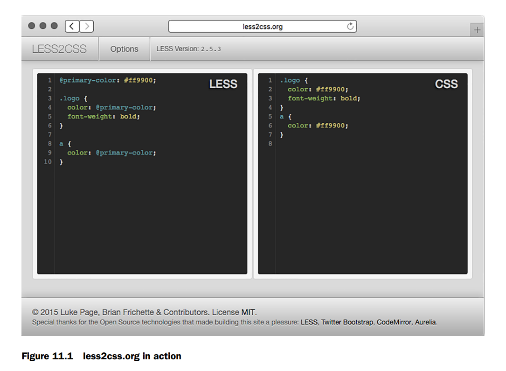
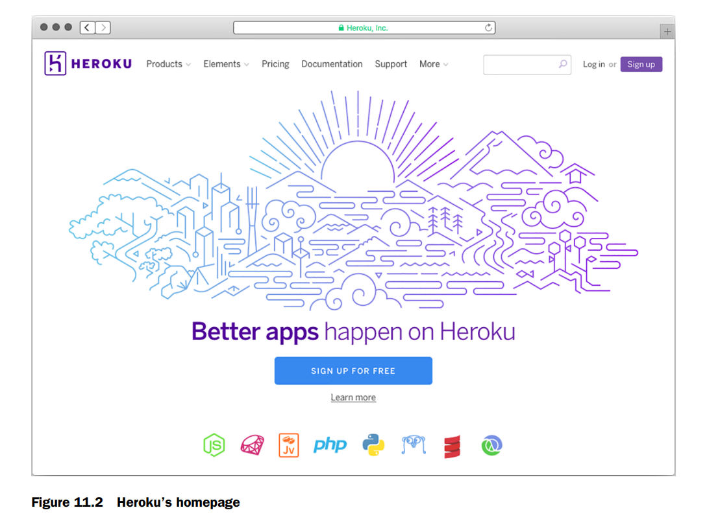
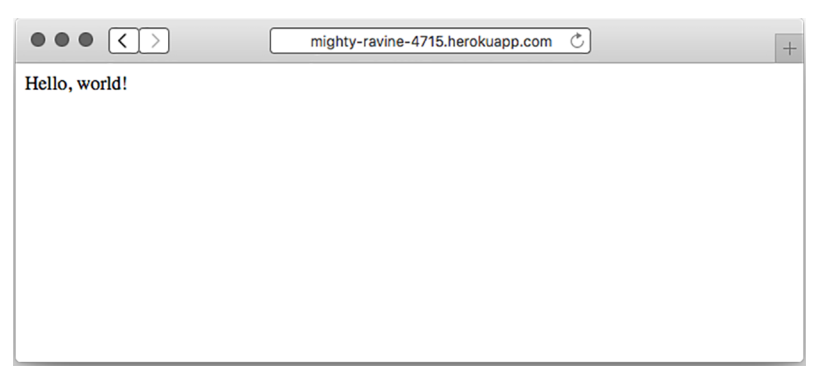

# Deployment: assets and Heroku

Este capítulo cubre 

- [x] __LESS para mejorar tu CSS__ 
- [x] __Browserify para empaquetar JavaScript, permitiéndote compartir código entre   cliente y servidor__ 
- [x] __connect-assets como alternativa a Grunt para compilar y servir CSS y JavaScript__ 
- [x] __Desplegar tus aplicaciones en Heroku para el internet real.__

Es hora de llevar tus aplicaciones al mundo real. La primera parte de este capítulo discutirá los assets. Si estás construyendo cualquier tipo de sitio web, es muy probable que sirvas tanto CSS como JavaScript. Es común concatenar y minificar estos assets por rendimiento. También es común codificar en lenguajes que compilan a CSS (como SASS y LESS), al igual que es común codificar en lenguajes que se transpilan a JavaScript (como CoffeeScript o TypeScript), o concatenar y minificar JavaScript. Los debates se convierten rápidamente en guerras de llamas cuando se habla de cosas como estas; ¿deberías usar LESS o SASS? ¿Es CoffeeScript algo bueno? Whichever elijas, te mostraré cómo usar algunas de estas herramientas para empaquetar tus assets para la web.

El resto de este capítulo te mostrará cómo construir tus aplicaciones Express y luego ponerlas en línea. Hay muchas opciones de despliegue, pero usarás una que es fácil y gratuita para probar: **Heroku**. Agregarás unas pocas cosas pequeñas a tu app y desplegarás una app Express en el mundo real.

Después de este capítulo, sabrás:

- Desarrollar CSS con más facilidad usando el preprocesador **LESS**
- Usar **Browserify** para usar `require` en el navegador, igual que en Node
- Minificar tus assets para hacer los archivos más pequeños posibles
- Usar **Grunt** para ejecutar esta compilación y mucho más
- Usar middleware de Express (**connect-assets**) como alternativa a este flujo de trabajo de Grunt
- Saber cómo desplegar aplicaciones Express en la web con **Heroku**

### LESS, a more pleasant way to write CSS

Recuerda el capítulo 1, donde hablamos de las motivaciones para Express. En resumen, dijimos que Node.js es poderoso pero su sintaxis puede ser un poco engorrosa y limitada. Por eso se creó Express: no cambia fundamentalmente Node, solo lo suaviza un poco.

De esa manera, **LESS** y CSS son como Express y Node. En resumen, CSS es una herramienta poderosa para el diseño de layouts, pero su sintaxis puede ser engorrosa y limitada. Por eso se creó **LESS**: no cambia fundamentalmente CSS, solo lo suaviza un poco.

CSS es una herramienta poderosa para diseñar páginas web, pero le faltan varias características que la gente quería. Por ejemplo, los desarrolladores quieren reducir la repetición en su código con **variables constantes** en lugar de valores hardcodeados; las variables están en LESS pero no en CSS.

**LESS** extiende CSS y agrega varias características poderosas. A diferencia de Express, LESS es en realidad su propio lenguaje. Eso significa que debe compilarse a CSS para ser usado por los navegadores web: los navegadores no hablan LESS, hablan CSS.

Verás dos formas de compilar **LESS** a CSS en aplicaciones Express. Por ahora, mientras pruebas LESS, visita [http://less2css.org/](http://less2css.org/). En el lado izquierdo de la página, podrás escribir código LESS, y el CSS compilado aparecerá en el derecho, como se muestra en la figura 11.1.

Vamos a repasar algunos ejemplos en las siguientes secciones y podrás probarlos en ese sitio web. Cuando sea hora de integrar LESS en tus apps Express, pasaremos a un método mejor y automatizado.

**LESS** está lleno de características, pero tiene **cinco puntos principales**:

- **Variables**. Te permiten definir cosas como colores una vez y usarlas en todas partes.
- **Funciones**. Te permiten manipular variables (por ejemplo, oscurecer un color en un 10%).
- **Nesting de selectores**. Te permiten estructurar tu hoja de estilos más como tu HTML y reducir la repetición.
- **Mixins**. Te permiten definir componentes reutilizables y usarlos en varios selectores.
- **Includes**. Te permiten dividir tus hojas de estilos en múltiples archivos ( como `require` en Node).



Haremos un repaso muy rápido de estas características principales. **LESS** es bastante complicado y no hablaremos de cada detalle.

Si te interesan las características más específicas de LESS, mira su documentación en [http://lesscss.org/](http://lesscss.org/).

### Variables

CSS no tiene variables. Si el color de los enlaces de tu sitio web es #29A1A4, por ejemplo, y decides cambiarlo a #454545, tendrías que buscarlo en todas partes de tu archivo CSS y cambiarlo.

Si quieres experimentar con un color que se usa en muchos lugares diferentes, estarás haciendo buscar-reemplazar, lo que puede llevar a problemas de confiabilidad. También es poco claro para otros desarrolladores cuál color es cuál; ¿dónde se usa ese color en varios lugares?

**LESS** agregó variables a CSS, permitiéndote solucionar este tipo de problema. Supongamos que quieres definir el color primario de tu sitio como #FF9900. En LESS, podrías hacer algo como lo que se muestra en el siguiente listado.


Si ejecutas el código **LESS** del listado 11.1 a través de un compilador LESS (como el que se encuentra en [http://less2css.org/](http://less2css.org/)), se generará el CSS que se muestra en el siguiente listado.


Como puedes ver, la variable se inserta en el CSS resultante. Ahora, si quieres cambiar el color primario de tu sitio, solo tienes que hacerlo en un lugar: la variable en la parte superior.

También podrías notar que **LESS** se parece mucho a CSS, y eso es intencional: es un **superset estricto** del lenguaje. Eso significa que cualquier CSS válido es LESS válido (pero no al revés). Por lo tanto, puedes importar fácilmente tus hojas de estilos CSS existentes a LESS y todo funcionará.

### Functions

**LESS** también tiene **funciones**, que te permiten manipular variables y valores justo como podrías hacerlo en un lenguaje de programación como JavaScript.

Como un lenguaje de programación típico, hay varias funciones integradas que te pueden ayudar. A diferencia de un lenguaje típico, sin embargo, estas funciones **están todas integradas en el lenguaje**. No puedes definir las tuyas propias; tendrás que usar otra característica llamada **mixins**, de la que hablaremos en la siguiente sección.

**LESS** tiene varias funciones que puedes usar para manipular colores. Por ejemplo, imagina que tus enlaces (tus etiquetas `<a>`) tienen un color base. Cuando pasas el mouse sobre ellos, deberían aclararse. Cuando los haces clic, deberían oscurecerse. En **LESS**, las funciones y variables hacen esto fácil, como muestra el siguiente listado.


Después de compilar este LESS a CSS, obtendrás algo como el siguiente listado.


Como puedes ver, **LESS** hace más fácil aclarar y oscurecer colores. Sí, podrías haber escrito ese CSS tú mismo, pero elegir los colores aclarados y oscurecidos habría sido un poco engorroso.

Hay un montón de otras funciones integradas en **LESS**. [http://lesscss.org/functions/](http://lesscss.org/functions/) las lista todas.

### Mixins

Quizás estés leyendo esta sección deseando poder definir tus propias funciones; ¿por qué **LESS** tiene todo el poder? Aquí entran los **mixins**, una forma de definir declaraciones CSS reutilizables que puedes usar a lo largo de tus hojas de estilos.

Quizás el ejemplo más común es con el **prefijo del proveedor**. Si quieres usar la propiedad CSS `border-radius`, tienes que prefilarla para asegurarte de que funcione en Chrome, Firefox, Internet Explorer, Safari y similares. Probablemente hayas visto algo como esto:

```bash
.my-element {
 -webkit-border-radius: 5px;
 -moz-border-radius: 5px;
 -ms-border-radius: 5px;
 border-radius: 5px;
}
```

En **CSS**, si quieres usar `border-radius` y que funcione en todos los navegadores, necesitarás los **prefijos del proveedor**. Tendrás que escribir todos esos cada vez que uses `border-radius`. Esto puede volverse tedioso y propenso a errores.

En **LESS**, en lugar de definir `border-radius` y luego hacer varias copias con prefijos de vendor, puedes definir un **mixin**, o un componente reutilizable que puedes usar en múltiples declaraciones, como se muestra en el siguiente listado. Se parecen mucho a las funciones en otros lenguajes de programación.


Ahora bien, si ejecutas ese código LESS a través de un compilador, se generará el CSS que aparece en el siguiente listado.

```css linenums="1"
.my-element {
 -webkit-border-radius: 5px;
 -moz-border-radius: 5px;
 -ms-border-radius: 5px;
 border-radius: 5px;
}
.my-other-element {
 -webkit-border-radius: 10px;
 -moz-border-radius: 10px;
 -ms-border-radius: 10px;
 border-radius: 10px;
}
```
Como puedes ver, el mixin se expande en las tediosas declaraciones con prefijo de proveedor, para que no tengas que escribirlas cada vez.

### Nesting

En HTML, tus elementos están anidados. Todo va dentro de la etiqueta `<html>`, y luego tu contenido va en la etiqueta `<body>`. Dentro del body, podrías tener un `<header>` con un `<nav>` para navegación. Tu CSS no refleja exactamente esto; si quisieras estilizar tu header y la navegación dentro de tu header, podrías escribir CSS como este próximo listado.

```css linenums="1"
// Listing 11.7 CSS example with no nesting

header {
 background-color: blue;
}
header nav {
 color: yellow;
}
```
En LESS, el listado 11.7 se mejoraría a este listado.


LESS mejora CSS para permitir reglas anidadas. Esto significa que tu código será más corto, más legible y un mejor reflejo de tu HTML.

**ANIDADOS LOS SELECTORES PADRE**

Las reglas anidadas pueden referirse a su elemento padre. Esto es útil en muchos lugares, y un buen ejemplo son los enlaces y sus estados hover. Podrías tener un selector para `a`, `a:visited`, `a:hover` y `a:active`. 

En CSS, lo harías con **cuatro selectores separados**. En LESS, definirás un **selector exterior** y **tres selectores interiores**, uno para cada estado del enlace. Podría verse algo así.


El anidamiento LESS puede hacer cosas sencillas como anidar tus selectores para que coincidan con tu HTML, pero también puede anidar selectores en relación con los selectores padres.

### Includes

**Includes**

A medida que tu sitio se hace más y más grande, empezarás a tener cada vez más estilos. En CSS, puedes dividir tu código en múltiples archivos, pero esto conlleva la penalización de rendimiento de múltiples solicitudes HTTP. 

LESS te permite dividir tus estilos en múltiples archivos, que se concatenan todos en **un solo archivo CSS** en tiempo de compilación, ahorrando rendimiento. 

Esto significa que los desarrolladores pueden dividir sus **variables y mixins** en archivos separados según sea necesario, haciendo un código más modular. También podrías hacer un archivo LESS para la página de inicio, otro para la página de perfiles de usuario, etc. 

**La sintaxis es bastante simple**:


### Alternatives to LESS

En este punto del libro, no debería ser sorpresa: hay más de una manera de hacer preprocesamiento de CSS. El elefante en la habitación es el mayor "rival" de LESS, **Sass**. 

Sass es muy similar a LESS; ambos tienen variables, mixins, selectores anidados, includes e integración con Express. En cuanto a los lenguajes, son bastante similares. 

**Sass no es originalmente un proyecto de Node**, pero es muy popular y ha hecho un buen trabajo integrándose en el mundo de Node. Puedes verlo en [http://sass-lang.com/](http://sass-lang.com/).

La mayoría de los lectores querrán usar **LESS o Sass**. Aunque usaremos LESS en este libro, usualmente puedes sustituir la palabra "LESS" por "Sass" y será lo mismo. 

LESS y Sass varían ligeramente en sintaxis, pero son **en gran medida iguales conceptualmente** y en cómo los integras con Express.

Hay preprocesadores CSS de menor tiempo que buscan cambiar fundamentalmente CSS de una u otra manera. **Stylus** hace la sintaxis de CSS mucho más agradable y **Roole** agrega varias características poderosas, y aunque ambos son geniales, no son tan populares como LESS o Sass.

Otros preprocesadores CSS como **Myth** y **cssnext** toman un ángulo diferente. En lugar de intentar hacer un nuevo lenguaje que compile a CSS, compilan **versiones futuras de CSS a CSS actual**. Por ejemplo, la próxima versión de CSS tiene variables, así que estos preprocesadores compilan esta nueva sintaxis a CSS actual.

##  Using Browserify to require modules in the browser

En resumen, **Browserify** (http://browserify.org/) es una herramienta para empaquetar JavaScript que te permite usar la función `require` tal como lo haces en Node. Y amo Browserify. Quiero aclarar eso de inmediato. **Me encanta esta herramienta**.

Una vez escuché a alguien describir la programación basada en navegador como **hostil**. Me encanta hacer proyectos del lado del cliente, pero debo admitir que hay muchos baches en el camino: inconsistencias del navegador, ningún sistema de módulos confiable, un número abrumador de paquetes de calidad variable, ninguna elección real de lenguaje de programación... la lista continúa.

A veces es genial, ¡pero a veces apesta! **Browserify** resuelve el problema de módulos de manera ingeniosa: te permite usar `require` exactamente como lo harías en Node (en contraste con cosas como RequireJS, que son asíncronas y requieren un callback feo). 

Esto es poderoso por un par de razones:

1. **Te permite definir módulos fácilmente**. Si Browserify ve que `evan.js` requiere `cake.js` y `burrito.js`, empaquetará `cake.js` y `burrito.js` y los concatenará en el archivo de salida compilado.

2. **Es casi completamente consistente con los módulos de Node**. Esto es enorme —tanto el JavaScript basado en Node como el basado en navegador pueden requerir módulos de Node, permitiéndote compartir código entre servidor y cliente sin trabajo extra. 

Incluso puedes requerir la mayoría de módulos nativos de Node en el navegador, y muchos "Node-ismos" como `__dirname` se resuelven.

Podría escribir sonetos sobre Browserify. **Esta herramienta es realmente genial**. Déjame mostrártela.

### Un ejemplo simple de Browserify

Supongamos que quieres escribir una página web que genere un color aleatorio y establezca ese color como fondo. Tal vez quieras inspirarte para el próximo gran esquema de colores. Vas a usar un módulo npm llamado **random-color** (en [https://www.npmjs.com/package/random-color](https://www.npmjs.com/package/random-color)), que genera una cadena de color RGB aleatoria.

Si revisas el código fuente de este módulo, verás que **no sabe nada del navegador** —solo está diseñado para funcionar con el sistema de módulos de Node.

Crea una nueva carpeta para construir esto. Harás un `package.json` que se vea algo como este próximo listado (tus versiones de paquetes pueden variar):

**Listado 11.10** `package.json` para tu ejemplo simple de Browserify
```json
{
  "private": true,
  "scripts": {
    "build-my-js": "browserify main.js -o compiled.js"
  },
  "dependencies": {
    "browserify": "^7.0.0",
    "random-color": "^0.0.1"
  }
}
```

Ejecuta `npm install` y luego crea un archivo llamado `main.js`. Pon lo siguiente dentro:

**Listado 11.11** `main.js` para tu ejemplo simple de Browserify
```javascript linenums="1"
var randomColor = require("random-color");
document.body.style.background = randomColor();
```

Nota que este archivo usa la declaración `require`, pero está hecho para el navegador, que no la tiene nativamente.

Finalmente, define un archivo HTML simple en el mismo directorio con el siguiente contenido:

```html linenums="1"
<!DOCTYPE html>
<html>
<head>
  <title>Colores Aleatorios</title>
</head>
<body>
  <script src="compiled.js"></script>
</body>
</html>
```

Ahora, si guardas todo eso y ejecutas `npm run build-my-js`, **Browserify compilará `main.js` en un nuevo archivo, `compiled.js`**. ¡Abre el archivo HTML que guardaste para ver una página web que genera colores aleatorios cada vez que la recargas!

Puedes abrir `compiled.js` para ver que tu código está ahí, junto con el módulo `random-color`. El código será feo, pero se verá así:

```javascript linenums="1"
(function e(t,n,r){function s(o,u){if(!n[o]){/* código compilado... */}}
```

**¡Tu pequeña mente va a explotar!**

**NOTA** Aunque puedes requerir muchos bibliotecas de utilidades (incluso las integradas), hay algunas cosas que **no puedes simular en el navegador** y por lo tanto no puedes usar en Browserify. Por ejemplo, no puedes ejecutar un servidor web en el navegador, así que parte del módulo `http` está fuera de límites. Pero muchas cosas como `util` o módulos que escribes son **totalmente válidos**.

A medida que escribes tu código con Browserify, querrás una manera **más agradable de construir** esto que tener que ejecutar el comando de build cada vez. Vamos a ver una herramienta que te ayuda a usar **Browserify, LESS y mucho, mucho más**.

##  Using Grunt to compile, minify, and more
Hemos visto **LESS** y **Browserify**, pero aún no hemos encontrado una manera elegante de integrarlos en nuestras apps Express. Veremos **dos maneras** de manejar esto, con **Grunt** y **connect-assets**.

**Grunt** (http://gruntjs.com/) se autodenomina "The JavaScript Task Runner", que es exactamente lo que suena: **ejecuta tareas**. Si alguna vez usaste Make o Rake, Grunt te resultará familiar. 

Grunt define un **framework** sobre el cual defines tareas. Como Express, Grunt es un framework mínimo. No puede hacer mucho solo; necesitarás instalar y configurar otras tareas para que Grunt las ejecute. 

Estas tareas incluyen compilar **CoffeeScript o LESS o SASS**, concatenar JavaScript y CSS, ejecutar tests, y mucho más. Puedes encontrar una lista completa de tareas en [http://gruntjs.com/plugins](http://gruntjs.com/plugins), pero hoy usarás **cuatro**:

- Compilar y concatenar JavaScript con **Browserify**
- Compilar **LESS** en CSS
- **Minificar** JavaScript y CSS
- Usar **watch** para evitar escribir los mismos comandos una y otra vez

Empecemos instalando Grunt.

### Instalando Grunt

Estas instrucciones se desvían un poco de las instrucciones oficiales de Grunt. La documentación te dirá que instales Grunt globalmente, pero creo que deberías instalar **todo localmente** si puedes. Esto te permite instalar múltiples versiones de Grunt en tu sistema y no contamina tus paquetes globales. Hablaremos más sobre estas mejores prácticas en el capítulo 12.

Cada proyecto tiene un `package.json`. Si quieres agregar Grunt a un proyecto, querrás definir un **nuevo script** para poder ejecutar el Grunt local:

```json
{
  "scripts": {
    "grunt": "grunt"
  }
}
```

**Listado 11.13** Un script para ejecutar el Grunt local

Si quieres seguir estos ejemplos, puedes hacer un nuevo proyecto con un `package.json` básico:

**Listado 11.14** Un `package.json` básico para estos ejemplos
```json
{
  "private": true,
  "scripts": {
    "grunt": "grunt"
  }
}
```

Grunt no está configurado aún, pero cuando lo esté, esto te permite escribir `npm run grunt` para ejecutar el Grunt local.

Luego, ejecuta `npm install grunt --save-dev` y `npm install grunt-cli --save-dev` (o simplemente `npm install grunt grunt-cli --save-dev`) para guardar Grunt y su herramienta de línea de comandos como dependencias locales.

Entonces, querrás crear algo llamado **Gruntfile**, que Grunt examina para saber qué hacer. El **Gruntfile vive en la raíz de tu proyecto** (misma carpeta que `package.json`) y se llama `Gruntfile.js`.

**Listado 11.15** Un esqueleto Gruntfile "Hello World"
```javascript linenums="1"
module.exports = function(grunt) {
  grunt.registerTask("default", "Say Hello World.", function() {
    grunt.log.write("Hello world!");
  });
};
```

Para probarlo, escribe `npm run grunt` en tu terminal. Deberías ver:

```
Running "default" task
Hello, world!
Done, without errors.
```

¡Grunt ahora está ejecutando la tarea "hello world"! Desafortunadamente, Hello World no te sirve de mucho. Veamos tareas más útiles.

Si quieres seguir, mira los ejemplos de código del libro en [https://github.com/EvanHahn/Express.js-in-Action-code/tree/master/Chapter_11/grunt-examples](https://github.com/EvanHahn/Express.js-in-Action-code/tree/master/Chapter_11/grunt-examples).

### Compilando LESS con Grunt

Cuando aprendiste sobre LESS antes en este capítulo, recomendé un sitio web que compila tu código en vivo. Es genial para aprender y verificar que se compila correctamente, pero **no es una solución automatizada**. ¡No quieres tener que pegar todo tu código en un sitio web, copiar el CSS resultante y pegarlo en un archivo CSS!

Hagamos que **Grunt lo haga**.

(Si no usas LESS, hay otras tareas de Grunt para tu preprocesador favorito. Busca en [http://gruntjs.com/plugins](http://gruntjs.com/plugins).)

Empieza escribiendo un archivo LESS simple:

**article.less**
```less linenums="1"
article {
  display: block;
  
  h1 {
    font-size: 16pt;
    color: #900;
  }
  
  p {
    line-height: 1.5em;
  }
}
```

Esto debería traducirse al CSS:

```css linenums="1"
article {
  display: block;
}

article h1 {
  font-size: 16pt;
  color: #900;
}

article p {
  line-height: 1.5em;
}
```

Y si lo minificas, debería verse así:

```css linenums="1"
article{display:block}article h1{font-size:16pt;color:#900}article p{line-height:1.5em}
```

Puedes usar una tarea LESS de terceros para Grunt para lograrlo. Comienza instalando esta tarea LESS de Grunt con `npm install grunt-contrib-less --save-dev`. Luego, agrega lo siguiente a tu Gruntfile.

**Listado 11.19** Un Gruntfile con LESS
```javascript linenums="1"
module.exports = function(grunt) {
  grunt.initConfig({
    less: {
      main: {
        options: {
          paths: ["my_css"]
        },
        files: {
          "tmp/build/main.css": "my_css/main.less"
        }
      }
    }
  });
  
  grunt.loadNpmTasks("grunt-contrib-less");
  grunt.registerTask("default", ["less"]);
};
```

Ahora, cuando ejecutes Grunt con `npm run grunt`, tu LESS se compilará en `tmp/build/main.css`.

**Después de hacer eso, necesitarás asegurarte de servir ese archivo.**

__SIRVIENDO ESTOS ASSETS COMPILADOS__

Ahora que has compilado algo, ¡necesitas servirlo a tus visitantes! Usarás el **middleware estático de Express** para eso. Agrega `tmp/build` como parte de tu stack de middleware:

**Listado 11.20** Middleware estático con archivos compilados
```javascript linenums="1"
var express = require("express");
var path = require("path");
var app = express();

app.use(express.static(path.resolve(__dirname, "public")));
app.use(express.static(path.resolve(__dirname, "tmp/build")));

app.listen(3000, function() {
  console.log("App started on port 3000.");
});
```

Ahora puedes servir archivos desde `public` y **archivos compilados desde `tmp/build`**.

**NOTA** Probablemente no quieras hacer commit de archivos compilados en tu repositorio, así que guárdalos en un directorio que ignorarás con control de versiones. Si usas Git, agrega `tmp` a tu `.gitignore` para asegurarte de que tus assets compilados no entren en control de versiones. Algunas personas sí hacen commit de estos, así que haz lo que te parezca correcto para ti.

**Listado 11.21** Un Gruntfile con Browserify
```javascript linenums="1"
module.exports = function(grunt) {
  grunt.initConfig({
    less: {
      /* … */
    },
    browserify: {
      client: {
        src: ["my_javascripts/main.js"],
        dest: "tmp/build/main.js",
      }
    }
  });
  
  grunt.loadNpmTasks("grunt-contrib-less");
  grunt.loadNpmTasks("grunt-browserify");
  grunt.registerTask("default", ["browserify", "less"]);
};
```

### Minificando JavaScript con Grunt

Desafortunadamente, Browserify no minifica tu JavaScript, su único defecto. Deberías hacerlo para reducir tamaños de archivo y tiempos de carga lo mejor que puedas.

**UglifyJS** es un minificador JavaScript popular que comprime tu código a tamaños minúsculos. Usarás una tarea Grunt que aprovecha UglifyJS para minificar tu código ya Browserificado, llamada `grunt-contrib-uglify`.

Instala la tarea con `npm install grunt-contrib-uglify --save-dev`. Luego agrega este código a tu Gruntfile:

**Listado 11.23** Un Gruntfile con Browserify, LESS y Uglify
```javascript linenums="1"
module.exports = function(grunt) {
  grunt.initConfig({
    less: { /* … */ },
    browserify: { /* … */ },
    uglify: {
      myApp: {
        files: {
          "tmp/build/main.min.js": ["tmp/build/main.js"]
        }
      }
    }
  });
  
  grunt.loadNpmTasks("grunt-browserify");
  grunt.loadNpmTasks("grunt-contrib-less");
  grunt.loadNpmTasks("grunt-contrib-uglify");
  
  grunt.registerTask("default", ["browserify", "less"]);
  grunt.registerTask("build", ["browserify", "less", "uglify"]);
};
```

`npm run grunt` ejecutará la tarea por defecto (Browserify + LESS). Pero `npm run grunt build` también ejecutará **Uglify** y minificará tu JavaScript.

### Usando Grunt watch

Mientras desarrollas, no quieres ejecutar `npm run grunt` cada vez que editas un archivo. Hay una tarea Grunt que **vigila tus archivos** y vuelve a ejecutar tareas cuando hay cambios: **grunt-contrib-watch**.

Instálala con `npm install grunt-contrib-watch --save-dev` y agrega esto a tu Gruntfile:

**Listado 11.24** Un Gruntfile con watch agregado
```javascript linenums="1"
watch: {
  scripts: {
    files: ["**/*.js"],
    tasks: ["browserify"]
  },
  styles: {
    files: ["**/*.less"],
    tasks: ["less"]
  }
}
```

Y actualiza tus tareas:
```javascript
grunt.loadNpmTasks("grunt-contrib-watch");
grunt.registerTask("default", ["browserify", "less"]);
```

Ahora ejecuta `npm run grunt` y Grunt **vigilará automáticamente** tus archivos. Si cambias un `.less`, compilará LESS. Si cambias un `.js`, ejecutará Browserify. **¡Super útil para desarrollo!**

### Otras tareas útiles de Grunt

Hay muchas más tareas Grunt. Algunas útiles:

- **`grunt-contrib-sass`**: Versión Sass del plugin LESS
- **`grunt-contrib-requirejs`**: Usa Require.js en lugar de Browserify
- **`grunt-contrib-concat`**: Concatena archivos
- **`grunt-contrib-imagemin`**: Minifica imágenes (JPEG, PNG)
- **`grunt-contrib-coffee`**: Escribe CoffeeScript para cliente
- 
## Using connect-assets to compile LESS and CoffeeScript
Aquí tienes la traducción al español, manteniendo el sentido técnico y natural:


No me gusta mucho Grunt, siendo totalmente honesto. Lo incluyo en el libro porque es increíblemente popular y potente, pero encuentro que el código es verboso y un poco confuso. Hay otra solución para usuarios de Express: un middleware llamado **connect-assets** (en [https://github.com/adunkman/connect-assets](https://github.com/adunkman/connect-assets)).

**connect-assets** puede concatenar, compilar y minificar JavaScript y CSS. Soporta CoffeeScript, Stylus, LESS, SASS e incluso algo de EJS. No soporta Browserify y no es tan configurable como herramientas de construcción como Grunt o Gulp, pero es muy fácil de usar.

**connect-assets** está fuertemente inspirado en el *asset pipeline* de Sprockets del mundo de Ruby on Rails. Si has usado eso, esto te resultará bastante familiar, pero si no lo has hecho, no te preocupes.


### UN RECORDATORIO SOBRE CONNECT

Connect es otro framework web para Node, y en resumen, el middleware de Express es compatible con el middleware de Connect. Mucho middleware compatible con Express tiene “connect” en el nombre, como connect-assets.


### Instalando todo

Necesitarás ejecutar `npm install connect-assets --save` y cualquier otro compilador que necesites:

* **coffee-script** para soporte de CoffeeScript
* **stylus** para Stylus
* **less** para LESS
* **node-sass** para SASS
* **ejs** para soporte parcial de EJS
* **uglify-js** para minificación de JavaScript
* **csswring** para minificación de CSS

Los dos últimos no se usan por defecto en modo desarrollo, pero sí en producción. Si no cambias las opciones por defecto y olvidas instalarlos, tu aplicación fallará en producción. ¡Asegúrate de instalarlos!

Para instalar LESS, ejecuta:

```
npm install less --save
```

También necesitas elegir un directorio donde vivirán tus assets. Por defecto, connect-assets buscará los assets de CSS en `assets/css` y los de JavaScript en `assets/js`, pero esto es configurable. Recomiendo usar los valores por defecto mientras empiezas, así que crea un directorio llamado `assets` y dentro coloca `css` y `js`.

---

### Configurando el middleware

El middleware tiene opciones de inicio rápido que facilitan comenzar, pero recomiendo encarecidamente configurarlo. Por ejemplo, una de las opciones evita que connect-assets ensucie el espacio global, lo cual hace por defecto.

El siguiente listado muestra cómo podría verse una configuración simple:

```js linenums="1"
var express = require("express");
var assets = require("connect-assets");
var app = express();

app.use(assets({
  helperContext: app.locals,
  paths: ["assets/css", "assets/js"]
}));
```

Este middleware tiene varios valores por defecto razonables. Por ejemplo, habilita minificación y caché en producción, pero los desactiva en desarrollo. Puedes sobrescribir esta configuración si quieres; revisa la documentación para más detalles.

Aquí sobrescribimos un valor: `helperContext`. Por defecto, connect-assets adjunta sus helpers al objeto global. En su lugar, los adjuntamos a `app.locals` para no contaminar el espacio global, pero seguir teniendo acceso a los helpers desde las vistas.

Ahora que configuraste el middleware, necesitas enlazar estos assets desde las vistas.

---

### Enlazando assets desde las vistas

connect-assets proporciona dos funciones principales para tus vistas: **js** y **css**.

* `js("archivo")` genera una etiqueta `<script>` para ese archivo.
* `css("archivo")` hace lo mismo pero con `<link>` para CSS.

Estas funciones devuelven HTML que incluye la versión más reciente de tus assets, lo que significa que agregan un hash largo al nombre para evitar que el navegador use archivos en caché antiguos.

Si usas Pug:

```pug
!= css("my-css-file")
!= js("my-javascript-file")
```

Si usas EJS:

```ejs
<%- css("my-css-file") %>
<%- js("my-javascript-file") %>
```

Si usas otro motor de vistas, debes asegurarte de no escapar HTML, porque estos helpers generan etiquetas HTML en crudo que no deben ser escapadas.

En cualquier caso, generarán algo como:

```html
<link rel="stylesheet" href="/assets/my-css-file-{{HASH}}.css">
<script src="/assets/my-javascript-file-{{HASH}}.js"></script>
```

y tus assets se cargarán.

---

### Concatenando scripts con directivas

No puedes concatenar archivos CSS de esta forma. En su lugar, debes usar `@import` en tu preprocesador CSS (LESS o Sass).

Pero connect-assets permite concatenar archivos JavaScript usando comentarios especiales.

Por ejemplo, si tu archivo JavaScript necesita jQuery, solo tienes que escribir:

```js
//= require jquery

$(function() {
  // haz lo que necesites con jQuery
});
```

Y connect-assets concatenará esos archivos automáticamente.

---

Y eso es la concatenación. Así de simple.

---

Ahora que hemos visto dos formas de compilar tus assets, vamos a ver cómo desplegar tus aplicaciones en la web real con Heroku.

## Deploying to Heroku

El sitio web de Heroku tiene buzzwords como **"cloud platform"** y **"built by developers for developers"**. Para nosotros, es una manera de desplegar nuestras aplicaciones Node.js en el **verdadero internet gratis**. ¡**No más localhost:3000**! Podrás tener tus apps en el internet de la vida real.

**Esencialmente**, cuando despliegas tu sitio, estás enviando tu código para que se ejecute en algún lugar. En este caso, cuando despliegas en Heroku, enviarás código a los servidores de Heroku y ellos ejecutarán tus aplicaciones Express.

Como todo, hay muchas maneras de desplegar tu sitio. **Heroku puede no ser la mejor opción para ti**. Lo elegimos aquí porque es **relativamente simple y no cuesta nada empezar**.

### Configurando Heroku

Primero, necesitarás una **cuenta de Heroku**. Visita [www.heroku.com](https://www.heroku.com) y regístrate (si no tienes cuenta). El proceso de registro debería ser bastante directo si alguna vez te has registrado en alguna cuenta online. La figura 11.2 muestra su página de inicio.



A continuación, querrás **descargar e instalar el Heroku Toolbelt** desde [https://toolbelt.heroku.com/](https://toolbelt.heroku.com/). Sigue las instrucciones para tu sistema operativo específico.

Instalar el **Heroku Toolbelt** en tu computadora instalará **tres cosas**:

- **Heroku client**: Una herramienta de línea de comandos para gestionar apps de Heroku. La usarás para crear y administrar tus apps Express.
- **Foreman**: Otra herramienta de línea de comandos. La usarás para definir cómo quieres que corran tus aplicaciones.
- **Git**: El sistema de control de versiones que probablemente ya tienes instalado.

Una vez instalado, hay **una última cosa que hacer**: autenticar tu computadora con Heroku. Abre una línea de comandos y escribe:

```bash
heroku login
```

Esto te pedirá tu **usuario y contraseña de Heroku**.

¡Una vez hecho todo eso, **Heroku debería estar configurado**!

Aquí tienes la traducción al español, manteniendo el tono técnico claro y natural:


### Hacer una aplicación lista para Heroku

Vamos a crear una aplicación simple “Hello World” y desplegarla en Heroku, ¿te parece?

Para preparar tu app para Heroku, no tienes que hacer demasiadas cosas distintas a lo normal. Aunque hay algunos comandos que necesitarás ejecutar para desplegar, los únicos cambios que debes hacer son:

* Asegúrate de iniciar la app usando `process.env.PORT`
* Asegúrate de que tu `package.json` incluya una versión de Node
* Crea un archivo que se ejecutará cuando Heroku inicie tu app (llamado **Procfile**). En nuestra app simple, este archivo tendrá solo una línea
* Agrega un archivo llamado `.gitignore` a tu proyecto

Ahora crea una app simple y asegúrate de cumplir con estos puntos.

La parte de Express de esta aplicación “Hello World” debería ser bastante fácil a este punto del libro, y no hay mucho especial que tengas que hacer para que funcione en Heroku; solo una o dos líneas.

Primero, define tu `package.json`, como en el siguiente listado:

```json 
{
 "private": true,
 "scripts": {
   "start": "node app"
 },
 "dependencies": {
   "express": "^5.0.0"
 },
 "engines": {
   "node": "4.2.x"
 }
}
```

Esto no tiene muchas cosas nuevas, excepto la definición de qué versión de Node usar. Indica a Heroku (y a cualquiera que ejecute tu app) que tu aplicación requiere Node 4.2.


### app.js (tu Hello World)

```js linenums="1"
var express = require("express");
var app = express();

app.set("port", process.env.PORT || 3000);

app.get("/", function(req, res) {
  res.send("Hello world!");
});

app.listen(app.get("port"), function() {
  console.log("App started on port " + app.get("port"));
});
```

No hay mucho nuevo aquí. Lo único específico de Heroku es cómo se define el puerto. Heroku establece una variable de entorno para el puerto, a la que accedes mediante `process.env.PORT`. Si no usas esa variable, tu app no podrá arrancar correctamente en Heroku.


### Procfile (lo más nuevo aquí)

El siguiente paso es lo más extraño hasta ahora: un **Procfile**. Puede sonar como algo complejo de Heroku, pero es muy simple.

Cuando ejecutas tu app normalmente escribes:

```bash
npm start
```

El Procfile formaliza eso y le dice a Heroku que ejecute `npm start` cuando la app inicie.

Crea un archivo en la raíz del proyecto llamado **Procfile** (P mayúscula, sin extensión):

```
web: npm start
```


### .gitignore

Como último paso, agrega un archivo para decirle a Git qué ignorar. No necesitamos subir `node_modules` al servidor:

```
node_modules
```

---

### Desplegando tu primera app

Lo primero que necesitas es poner tu app bajo control de versiones con Git. Asumiendo que conoces lo básico:

```bash
git init
git add .
git commit -m "Initial commit"
```

Luego ejecuta:

```bash
heroku create
```

Esto crea una nueva URL para tu app en Heroku. Los nombres suelen ser algo aleatorios (tipo `mighty-ravine-4205.herokuapp.com`), pero ese es el precio del hosting gratuito. Puedes cambiarlo o asociar tu propio dominio más adelante.


Después, configura el entorno de producción:

```bash
heroku config:set NODE_ENV=production
```

Cuando ejecutaste `heroku create`, Heroku agregó un repositorio remoto de Git. Para desplegar tu app, solo haces:

```bash
git push heroku master
```

Esto sube tu código y Heroku instala dependencias automáticamente. Cada vez que quieras redeplegar, vuelves a usar ese mismo comando.

Finalmente, debes indicarle a Heroku que ejecute un proceso para tu app:

```bash
heroku ps:scale web=1
```


### Resultado final

De repente, tu app estará corriendo en internet real.

Puedes abrirla con:

```bash
heroku open
```

y verla en el navegador. Incluso puedes compartir el enlace con tus amigos.

Se acabó el `localhost`, baby.



## Ejecutando Grunt en Heroku

Si estás usando **connect-assets** para compilar tus assets, Heroku funcionará perfectamente (asumiendo que instalaste todas las dependencias correctamente). Pero si quieres usar **Grunt** (u otro task runner como Gulp), necesitarás ejecutar Grunt para construir tus assets cuando despliegues tu sitio.

Hay un pequeño truco que puedes usar, aprovechando una característica genial de npm: el **script postinstall**. Heroku ejecutará `npm install` cuando despliegues tu app, y puedes decirle a Heroku que ejecute Grunt justo después para construir todos tus assets.

Es tan simple como agregar otro script a tu `package.json`:

**Listado 11.27** Ejecutando Grunt en un script postinstall
```json
{
  "scripts": {
    // ...
    "postinstall": "grunt build"
  }
}
```

Ahora, cuando cualquiera (incluyendo Heroku) ejecute `npm install`, se ejecutará `grunt build`.

### Haciendo tu servidor más resistente a fallos

Sin ofender, pero **tu servidor podría fallar**. Podría ser que te quedes sin memoria, o que tengas una excepción no capturada, o que un usuario haya encontrado una manera de romper tu servidor.

Si alguna vez te ha pasado esto mientras desarrollas, probablemente viste que un error hace que tu proceso del servidor se detenga en seco. Mientras desarrollas, esto es bastante útil —¡quieres saber que tu app no funciona!

**En producción**, sin embargo, es mucho más probable que quieras que tu app funcione **a toda costa**. Si hay un fallo, querrás que tu app sea **resiliente y se reinicie**.

Viste **Forever** en el capítulo de seguridad, pero aquí va un repaso: es una herramienta para mantener tu servidor funcionando, incluso ante fallos. En lugar de escribir `node app.js`, escribirás `forever app.js`. Entonces, si tu app falla, Forever la reiniciará.

Primero, ejecuta `npm install forever --save` para instalar Forever como dependencia.

Ahora, ejecutas `forever app.js` para iniciar tu servidor. Podrías agregarlo al Procfile o cambiar tu script `npm start`, pero me gusta agregar un **nuevo script** a `package.json`:

**Listado 11.28** Definiendo un script para producción
```json
{
  "scripts": {
    // ...
    "production": "forever app.js"
  }
}
```

Ahora, cuando ejecutes `npm run production`, tu app iniciará con Forever.

El siguiente paso es hacer que **Heroku ejecute este script**, y eso es tan simple como cambiar tu **Procfile**:

```
web: npm run production
```

Después de este cambio, Heroku ejecutará tu app con Forever y mantendrá tu app reiniciándose tras fallos.

**Como siempre con Heroku, haz commit de estos cambios en Git** (`git add .` y `git commit -m "Tu mensaje de commit aquí!"`). Una vez hecho, puedes desplegarlos a Heroku con `git push heroku master`.

Puedes usar **Forever en cualquier tipo de despliegue**, no solo Heroku. Parte de tu configuración de despliegue cambiará dependiendo de tu setup de servidor, pero puedes usar Forever donde elijas desplegar.

## Summary

- **LESS** es un lenguaje que compila a CSS. Agrega muchas comodidades como **variables y mixins**.
- **Browserify** es una herramienta para empaquetar JavaScript para ejecutarse en el navegador. Empaqueta archivos para que puedas usar el **sistema de módulos de Node.js en el navegador**, permitiéndote compartir código entre tu cliente y servidor.
- **Grunt** es un **task runner genérico** que puede hacer muchas cosas. Una de las cosas que harás con Grunt es **compilar CSS con LESS** y **empaquetar JavaScript con Browserify**.
- **connect-assets** es una **alternativa a Grunt** en algunos aspectos y te permite compilar CSS y JavaScript usando **middleware de Express**.
- **Heroku** es una de muchas plataformas de aplicaciones en la nube que te permiten desplegar fácilmente tus aplicaciones Express al **mundo real**.