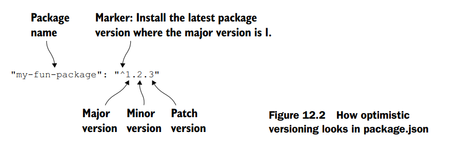

# Best practices
This chapter covers:

- [x] **Beneficios de la simplicidad en tu código**
- [x] **Estructurar los archivos de tu aplicación**
- [x] **Usar el comando `npm shrinkwrap` para fijar versiones de dependencias** por confiabilidad (y los beneficios de hacerlo)
- [x] **Evitar instalar módulos globalmente**

Es hora de cerrar este libro. Si fuera una tragedia, probablemente terminaríamos con una muerte dramática. Si fuera una comedia, tal vez tendríamos una boda romántica. Desafortunadamente, este es un libro sobre Express, un tema no conocido por su drama y romance. 

**Lo mejor que obtendrás es esto**: un conjunto de **mejores prácticas para aplicaciones Express grandes**. Haré lo posible por hacerlo romántico y dramático.

Con **aplicaciones pequeñas**, la organización no importa mucho. Puedes meter tu app en un solo archivo o unos pocos archivos pequeños. Pero a medida que tus apps se vuelven **más grandes**, estas consideraciones se vuelven **más importantes**.

**¿Cómo deberías organizar tus archivos** para que tu codebase sea fácil de trabajar? **¿Qué tipo de convenciones deberías seguir** para apoyar mejor a un equipo de desarrolladores?

En este capítulo final, haré lo posible por compartir mi experiencia. Muy poco de este capítulo será estrictamente factual; daré opiniones a la filosofía sin opiniones de Express respecto a lo que se necesita para construir una **aplicación mediana a grande** con ella.

Me aseguraré de repetir este descargo de responsabilidad, pero recuerda: **Este capítulo son principalmente opiniones y convenciones que he encontrado**. Puedes estar en desacuerdo o encontrar que tu aplicación no encaja en estos moldes. 

**Esa es la belleza de Express** —tienes **mucha flexibilidad**. Esto no será tan emocional como una comedia o una tragedia, pero haré lo posible.

## Simplicidad

En este capítulo de mis opiniones, permíteme ofrecer una idea general antes de entrar en detalles. Hay muchas buenas prácticas para mantener grandes bases de código, pero creo que todas se reducen a una sola cosa: la simplicidad.

Más específicamente, tu código debería ser fácil de seguir para otros desarrolladores y deberías minimizar la cantidad de contexto que una persona necesita mantener en su cabeza.

Para entender una aplicación de Express, ya tienes que saber bastante. Debes ser razonablemente competente en el lenguaje de programación JavaScript para leer el código; debes entender cómo funciona HTTP para comprender el enrutamiento; debes entender Node y su I/O basado en eventos; y debes entender todas las características de Express como routing, middleware, vistas y más. Cada una de estas cosas toma mucho tiempo en aprender y probablemente se apoya en experiencia previa de tu carrera. ¡Es una enorme pila de cosas que mantener en la cabeza!

Tus aplicaciones deberían intentar agregar lo menos posible a esa enorme pila de conocimiento requerido.

Creo que todos hemos escrito código (yo ciertamente lo he hecho) que es un caos entrelazado que solo nosotros podemos esperar entender. Me gusta imaginar uno de esos tableros de corcho llenos de fotos, todos conectados en una red de hilos rojos.

Aquí hay un par de formas de ver qué tan profundo es el “agujero del conejo” de tu código:

* Toma una parte de tu código —quizás un manejador de rutas o una función de middleware— y pregúntate cuántas otras cosas necesitarías saber para entenderlo. ¿Depende de un middleware anterior en la cadena? ¿Cuántos modelos de base de datos diferentes necesita? ¿Qué tan profundo estás en routers? ¿Cuántos archivos has tenido que revisar para llegar a este punto?

* ¿Qué tan confundidos están tus compañeros desarrolladores? ¿Qué tan rápido podrían añadir una nueva funcionalidad a tu app? Si están confundidos y no pueden trabajar rápido, eso puede significar que tu código está demasiado entrelazado.

Tienes que ser bastante riguroso con la simplicidad, especialmente porque Express es tan flexible y poco opinado.

Hablaremos de algunos de estos métodos (y otros) en este capítulo, pero mucho de esto es más abstracto, así que tenlo en cuenta.

Muy bien, ¡basta de teoría abstracta! Vamos a hablar de cosas específicas.


## Patrón de estructura de archivos

Las aplicaciones de Express pueden organizarse como tú quieras. Podrías poner todo en un solo archivo gigante si quisieras. Como puedes imaginar, esto podría no resultar en una aplicación fácil de mantener.

A pesar de que Express no es opinativo, la mayoría de las aplicaciones de Express con las que he trabajado tienen una estructura similar a la de la figura 12.1. (Esto es muy parecido a los tipos de aplicaciones que se generan con el generador oficial de express. ¡No es coincidencia!).

Aquí están todos los archivos comunes en una aplicación de Express con esta estructura:

- **package.json** no debería sorprender—está presente en todos los proyectos Node. Contiene todas las dependencias de la aplicación así como todos tus scripts de npm. Has visto diferentes versiones de este archivo a lo largo del libro y no es diferente en una aplicación grande.

- **app.js** es el código principal de la aplicación—el punto de entrada. Aquí es donde llamas a `express()` para instanciar una nueva aplicación de Express. También es donde colocas el middleware común a todas las rutas, como seguridad o middleware de archivos estáticos. Este archivo no inicia la aplicación, como verás—asigna la app a `module.exports`.

- **bin** es una carpeta que contiene scripts ejecutables relevantes para tu aplicación. A menudo hay solo uno (listado aquí), pero a veces se requieren más.

- **bin/www** es un script ejecutable de Node que requiere tu app (desde `app.js`) y la inicia. Ejecutar `npm start` debería correr este script.

- **config** es una carpeta que contendrá cualquier configuración de tu aplicación. A menudo está llena de archivos JSON que especifican cosas como números de puerto por defecto o cadenas de localización.

- **public** es una carpeta servida por middleware de archivos estáticos. Contendrá cualquier archivo estático—páginas HTML, archivos de texto, imágenes, videos, etc. El middleware de archivos estáticos también servirá cualquier subcarpeta dentro de `public`. El HTML5 Boilerplate en [https://html5boilerplate.com/](https://html5boilerplate.com/), por ejemplo, presenta una buena selección de archivos estáticos comunes que podrías añadir aquí.

- **routes** es una carpeta que contiene numerosos archivos JavaScript, cada uno exportando un router de Express. Puedes tener un router para todas las URLs que empiezan con `/users` y otro para las que empiezan con `/photos`. El capítulo 5 tiene todos los detalles sobre routers y enrutamiento—consulta la sección 5.3 para ejemplos de cómo funciona esto.

- **test** es una carpeta que contiene todo tu código de pruebas. El capítulo 9 tiene todos los detalles interesantes sobre esto.

- **views** es una carpeta que contiene todas tus vistas. Normalmente están escritas en EJS o Pug, como se muestra en el capítulo 7, pero hay muchos otros lenguajes de plantillas que puedes usar.

La mejor forma de ver una aplicación que sigue la mayoría de estas convenciones es usando el generador oficial de aplicaciones de Express. Puedes instalarlo con `npm install -g express-generator`. Una vez instalado, puedes ejecutar `express my-new-app` y esto creará una carpeta llamada `my-express-app` con una aplicación base configurada, como se muestra en la figura 12.1.

Aunque estas son solo patrones y convenciones, este tipo de estructuras tienden a aparecer en las aplicaciones de Express que he visto.

## Bloqueo de versiones de dependencias

Node está, sin lugar a dudas, en el mejor sistema de dependencias que he usado. Un compañero dijo, describiendo Node y npm: “Lo hicieron perfecto.”

npm usa **versionado semántico** (a veces abreviado como *semver*) para todos sus paquetes. Las versiones se dividen en tres números: mayor, menor y parche. Por ejemplo, la versión 1.2.3 es versión mayor 1, versión menor 2 y parche 3.

En las reglas del versionado semántico, una actualización de versión mayor puede incluir un cambio considerado “rompedor”. Un cambio rompedor es aquel en el que el código antiguo no es compatible con el nuevo. Por ejemplo, el código que funcionaba en la versión mayor 3 de Express no necesariamente funciona con la versión mayor 4. En contraste, los cambios de versión menor no son rompedores. Generalmente significan una nueva funcionalidad que no rompe el código existente. Las versiones de parche son, bueno, parches: están reservadas para correcciones de errores y mejoras de rendimiento. Los parches no deberían romper tu código; en general deberían mejorar las cosas.

---

### VERSIÓN MAYOR CERO

Hay una excepción: básicamente todo vale si la versión mayor es 0. En ese punto, el paquete se considera inestable.

---

Por defecto, cuando haces `npm install --save` de un paquete, se descarga la última versión desde el registro de npm y luego se coloca un número de versión “optimista” en tu archivo `package.json`. Esto significa que si otra persona de tu equipo ejecuta `npm install` en el proyecto (o si tú lo reinstalas), puede que obtenga una versión más nueva que la que descargaste originalmente. Esa nueva versión puede tener una versión menor más alta o una versión de parche más alta, pero no puede tener una versión mayor más alta. Eso significa que no descarga la versión absolutamente más reciente de un paquete; descarga la última versión que aún debería ser compatible. La figura 12.2 amplía esto.



Todo bien, ¿verdad? Si todos los paquetes siguieran correctamente el versionado semántico, siempre querrías obtener la última versión compatible para tener todas las nuevas funcionalidades y las correcciones de errores más recientes.

Pero aquí está el problema: no todos los paquetes cumplen perfectamente con el versionado semántico. Normalmente ocurre porque la gente usa los paquetes de formas que los desarrolladores originales no tenían previstas. Tal vez estás dependiendo de una función no probada o de un comportamiento extraño de la librería que pasó desapercibido para los desarrolladores. No se les puede culpar realmente: ningún programador tiene un historial limpio y libre de errores, especialmente cuando otros desarrolladores usan su código de maneras inesperadas.

Considero que el 99% de las veces esto no es un problema. Los módulos que uso suelen respetar bastante bien el versionado semántico, y el versionado optimista de npm funciona correctamente. Pero cuando estoy desplegando una aplicación crítica para el negocio (también conocido como el mundo real), me gusta bloquear las versiones de mis dependencias para minimizar cualquier posible problema. ¡No quiero que algo se rompa por una nueva versión de un paquete!

Hay dos formas de bloquear las versiones: una es simple pero menos completa, y la otra es mucho más estricta.

### La forma simple: evitando el versionado optimista

Una forma rápida de solucionar este problema es **eliminando el versionado optimista** en tu `package.json`. El **versionado optimista** en tu archivo `package.json` podría verse algo así como en el **listado siguiente**.

```json
"dependencies": {
 "express": "^5.0.0",
 "ejs": "~2.3.2"
}
```
El carácter ^ indica que se permite el versionado optimista. Recibirás todas las actualizaciones de parches y menores. El carácter ~ indica un versionado ligeramente menos optimista. Recibirás solo actualizaciones de parches.

Si estás editando tu package.json, puedes especificar la dependencia a una versión exacta. El ejemplo anterior se vería como en el siguiente listado.

```json
"dependencies": {
 "express": "5.0.0",
 "ejs": "2.3.2"
}
```
Eliminar los caracteres ^ y ~ del número de versión indica que solo se debe descargar y usar esa versión específica del paquete. Estos cambios son relativamente fáciles de hacer y pueden fijar un paquete a una versión concreta.

Si estás instalando nuevos paquetes, puedes desactivar el versionado optimista de npm cambiando la bandera `--save` por `--save-exact`. Por ejemplo, `npm install --save express` se convierte en `npm install --save-exact express`. Esto instalará la última versión de Express, como siempre, pero no la marcará de forma optimista en tu `package.json`; especificará una versión exacta.

Esta solución simple tiene un inconveniente: no fija la versión de las subdependencias (las dependencias de tus dependencias). El siguiente listado muestra el árbol de dependencias de Express.

```bash
Listado 12.3 Árbol de dependencias (¡enorme!) de Express

your-express-app@0.0.0
└─┬ express@5.0.0
 ├─┬ accepts@1.2.12
 │ ├─┬ mime-types@2.1.6
 │ │ └── mime-db@1.18.0
 │ └── negotiator@0.5.3
 ├── array-flatten@1.1.0
 ├── content-disposition@0.5.0
 ├── content-type@1.0.1
 ├── cookie@0.1.3
 ├── cookie-signature@1.0.6
 ├─┬ debug@2.2.0
 │ └── ms@0.7.1
 ├── depd@1.0.1
 ├── escape-html@1.0.2
 ├── etag@1.7.0
 ├─┬ finalhandler@0.4.0
 │ └── unpipe@1.0.0
 ├── fresh@0.3.0
 ├── merge-descriptors@1.0.0
 ├── methods@1.1.1
 ├─┬ on-finished@2.3.0
 │ └── ee-first@1.1.1
 ├── parseurl@1.3.0
 ├── path-is-absolute@1.0.0
 ├── path-to-regexp@0.1.6
 ├─┬ proxy-addr@1.0.8
 │ ├── forwarded@0.1.0
 │ └── ipaddr.js@1.0.1
 ├── qs@4.0.0
 ├── range-parser@1.0.2
 ├─┬ router@1.1.3
 │ ├── array-flatten@1.1.1
 │ ├── path-to-regexp@0.1.7
 │ └── setprototypeof@1.0.0
 ├─┬ send@0.13.0
 │ ├── destroy@1.0.3
 │ ├─┬ http-errors@1.3.1
 │ │ └── inherits@2.0.1
 │ ├── mime@1.3.4
 │ ├── ms@0.7.1
 │ └── statuses@1.2.1
 ├── serve-static@1.10.0
 ├─┬ type-is@1.6.8
 │ ├── media-typer@0.3.0
 │ └─┬ mime-types@2.1.6
 │ └── mime-db@1.18.0
 ├── utils-merge@1.0.0
└── vary@1.0.1

```

Tuve un problema al intentar usar la librería **Backbone.js**. Quería fijar una **versión exacta de Backbone**, lo cual fue fácil: especifiqué la versión. 

Pero en el `package.json` de **Backbone** (que está fuera de mi control) especificaba una versión de **Underscore.js** que estaba **versionada de forma optimista**. 

Eso significa que podía obtener una **nueva versión de Underscore** si reinstalaba mis paquetes, y **más peligrosamente**, podía obtener una nueva versión de Underscore al **desplegar mi código al mundo real**.

**Tu árbol de dependencias** podría verse así un día.

```bash
your-express-app@0.0.0
└─┬ backbone@1.2.3
 └── underscore@1.0.0
```
pero si Underscore se actualizara, podría verse así otro día:

```bash
your-express-app@0.0.0
└─┬ backbone@1.2.3
 └── underscore@1.1.0
Note the difference in Und
```

Nota la **diferencia en la versión de Underscore**. Con este método, **no hay forma de asegurar** que las versiones de tus **subdependencias** (o subsubdependencias, y así sucesivamente) estén **fijadas**. 

Esto **podría estar bien**, o **podría no estarlo**. Si no lo está, puedes usar una **agradable característica de npm llamada shrinkwrap**.

### La forma exhaustiva: el comando shrinkwrap de npm

El problema con la solución anterior es que **no fija las versiones de las subdependencias**. npm tiene un subcomando llamado **shrinkwrap** que resuelve este problema.

Supongamos que has ejecutado `npm install` y todo funciona perfectamente. Estás en un estado donde quieres **fijar tus dependencias**. En este punto, ejecuta un solo comando desde cualquier lugar de tu proyecto:

```
npm shrinkwrap
```

Puedes ejecutar esto en **cualquier proyecto Node** que tenga un archivo `package.json` y dependencias. Si todo va bien, verás una sola línea de salida:

```
wrote npm-shrinkwrap.json
```

(Si falla, probablemente sea porque estás ejecutando esto desde un directorio que no es un proyecto o te falta un archivo `package.json`.)

Mira el archivo en el **listado siguiente**. Verás que tiene una **lista de dependencias**, sus versiones, y luego las dependencias de esas dependencias, y así sucesivamente. El listado muestra un fragmento de un proyecto que solo tiene **Express** instalado.


Lo principal a notar es que todo el árbol de dependencias está especificado, no solo la capa superior como en package.json.

**Listado 12.4** Fragmento de un ejemplo de archivo npm-shrinkwrap.json

La próxima vez que ejecutes `npm install`, no mirará los paquetes en package.json; en su lugar, revisará los archivos en npm-shrinkwrap.json e instalará desde ahí. Cada vez que se ejecuta `npm install`, busca el archivo shrinkwrap e intenta instalar desde él. Si no tienes uno (como no hemos tenido en el resto del libro), entonces mirará package.json.

Al igual que con package.json, normalmente se incluye npm-shrinkwrap.json en el control de versiones. Esto permite que todos los desarrolladores del proyecto utilicen las mismas versiones de los paquetes, que es precisamente el objetivo de “shrinkwrapping”.

### Actualizando y agregando dependencias

Todo esto está bien una vez que has **fijado tus dependencias**, pero probablemente **no quieras congelar todas tus dependencias para siempre**. Podrías querer obtener **correcciones de bugs**, **parches** o **nuevas características** —solo quieres que suceda **en tus términos**.

Para actualizar o agregar una dependencia, necesitas ejecutar `npm install` con un **nombre de paquete** y una **versión de paquete**. Por ejemplo, si estás actualizando **Express** de `4.12.0` a `4.12.1`, ejecutarás:

```
npm install express@4.12.1
```

Si quieres instalar un **nuevo paquete** (Helmet, por ejemplo), ejecuta:

```
npm install helmet
```

Esto **actualizará la versión** o **agregará el paquete** en tu carpeta `node_modules`, y puedes comenzar a probar. Una vez que todo se vea bien para ti, puedes ejecutar **`npm shrinkwrap`** nuevamente para **fijar esa versión de dependencia**.

A veces, el **shrink-wrapping no es para ti**. Podrías querer obtener **todas las últimas y mejores características y parches** sin tener que actualizar manualmente. Sin embargo, a veces quieres la **seguridad de tener las mismas dependencias** en todas las instalaciones de tu proyecto.


## Dependencias localizadas

Sigamos hablando de **dependencias** pero desde un **ángulo diferente**. npm te permite instalar paquetes **globalmente** en tu sistema que se ejecutan como comandos. Hay varios populares, como **Bower**, **Grunt**, **Mocha** y más.

**No hay nada malo** en hacer esto; hay muchas herramientas que necesitas instalar globalmente en tu sistema. Esto significa que para ejecutar el comando **Grunt**, puedes escribir `grunt` desde cualquier lugar de tu computadora.

Pero puedes encontrar **desventajas** cuando alguien nuevo llega a tu proyecto. Toma **Grunt**, por ejemplo. Pueden ocurrir **dos problemas** al instalar Grunt globalmente:

- Un **nuevo desarrollador** no tiene **Grunt instalado** en su sistema en absoluto. Esto significa que tendrás que decirles que lo instalen en tu **Readme** o en otra documentación.
- ¿Y si tienen **Grunt instalado** pero es la **versión incorrecta**? Podrías imaginar que tienen una versión de Grunt que es **demasiado vieja** o **demasiado nueva**, lo que podría llevar a **errores extraños** que podrían ser difíciles de rastrear.

**Hay una solución bastante fácil** a estos dos problemas: instala **Grunt como una dependencia de tu proyecto**, **no globalmente**.

En el **capítulo 9**, usamos **Mocha** como framework de pruebas. Podríamos haberlo instalado globalmente, pero no lo hicimos —lo instalamos **localmente** en nuestro proyecto.

Cuando instalas **Mocha**, instala el comando ejecutable `mocha` en **`node_modules/.bin/mocha`**. Puedes acceder a él de **dos maneras**: ejecutándolo directamente o poniéndolo dentro de un **script de npm**.

### Invocando comandos directamente

La forma más simple es **invocar estos comandos directamente**. Es bastante fácil, aunque requiere un poco de escritura: escribe la ruta al comando.

Si estás intentando ejecutar **Mocha**, ejecuta:

```
node_modules/.bin/mocha
```

Si estás intentando ejecutar **Bower**, ejecuta:

```
node_modules/.bin/bower
```

(En **Windows**, ejecutar Mocha sería `node_modules\.bin\mocha`.)

**¡Conceptualmente no hay mucho que esto!**

### Ejecutando comandos desde scripts npm

La otra forma de hacer esto es **agregando el comando como un script npm**. Una vez más, supongamos que quieres ejecutar **Mocha**. El **listado siguiente** muestra cómo especificarías eso como un **script npm**.
```json
"scripts": {
 "test": "mocha"
},
```

Al escribir `npm test`, el comando `mocha` se ejecuta automáticamente. Retomemos un diagrama del capítulo 9 que explica cómo funciona esto; véase la figura 12.3.


Esto suele ser útil cuando se quiere ejecutar el mismo tipo de comando repetidamente. ¡Además, evita que las dependencias se incluyan en la lista global!

## Summary

- La **simplicidad** es un **objetivo de alto nivel** para el software en general. Debes ser **riguroso** al eliminar complejidad en tu software.
- Existe una **estructura de carpetas y archivos** que emerge para la mayoría de las **aplicaciones Express**.
- Para **máxima confiabilidad**, debes **fijar las versiones** de tus dependencias. Esto tiene algunas desventajas —específicamente, no ejecutarás automáticamente el código más reciente— pero tiene la ventaja de que tu código **no se actualizará automáticamente** sin tu conocimiento.
- Instalar **dependencias localmente** ayudará a mantener tu sistema limpio y tus proyectos **reproducibles**. Usarás **scripts npm** para esto.

**¡Ahora es tiempo de salir y construir cosas geniales con Express!**

## Apéndice: Otros módulos útiles

En este libro cubrí varios **módulos Node de terceros**, pero hay **muchísimos** que no pude incluir. Este apéndice es un **recorrido rápido** de un montón de módulos que encuentro útiles.

Esta lista **no es exhaustiva**, pero espero que te ayude a encontrar módulos que te gusten:

- **Sequelize** es un **ORM para SQL**. En este libro hablamos de **Mongoose**, que maneja MongoDB; **Sequelize** es el Mongoose de bases de datos SQL. Es un ORM que soporta **migraciones** e interfaces con varios SQL. Véalo en [http://sequelizejs.com/](http://sequelizejs.com/).
- **Lodash** es una **librería de utilidades**. Puede que hayas oído de **Underscore**; **Lodash** es muy similar. Presume de **mayor rendimiento** y algunas características extra. Más en [http://lodash.com/](http://lodash.com/).
- **Async** es una librería de utilidades que **facilita manejar patrones de programación asíncrona**. Véalo en [https://github.com/caolan/async](https://github.com/caolan/async).
- **Request** es casi lo opuesto de Express. Mientras **Express** te permite aceptar peticiones HTTP entrantes, **Request** te permite hacer peticiones HTTP salientes. Tiene una **API simple**. Más en [https://www.npmjs.com/package/request](https://www.npmjs.com/package/request).
- **Gulp** se llama a sí mismo el "**streaming build system**". Es una alternativa a herramientas como **Grunt**, y te permite compilar assets, minificar código, correr tests, etc. Usa **streams de Node** para mayor rendimiento. Véalo en [http://gulpjs.com/](http://gulpjs.com/).
- **node-canvas** porta la **HTML5 Canvas API** a Node, permitiéndote dibujar gráficos en el servidor. Docs en [https://github.com/Automattic/node-canvas](https://github.com/Automattic/node-canvas).
- **Sinon.JS** es útil en **testing**. A veces quieres probar que una función se llama y mucho más. **Sinon** te permite asegurarte de que una función se llame con argumentos específicos o un número específico de veces. Véalo en [http://sinonjs.org/](http://sinonjs.org/).

**Zombie.js** es un **headless browser**. Hay otras herramientas como **Selenium** y **PhantomJS** que levantan browsers reales. Cuando necesitas **100% compatibilidad**, son buena opción. Pero pueden ser lentos y engorrosos, ahí entra **Zombie**. Es un **headless browser muy rápido** que facilita testear tus apps en un navegador falso. Docs en [http://zombie.labnotes.org/](http://zombie.labnotes.org/).

**Supererror** sobreescribe `console.error`. Lo hace **mejor**, dándote números de línea, más info y mejor formato. Véalo en [https://github.com/nebulade/supererror](https://github.com/nebulade/supererror).

**Es una lista corta**, ¡pero amo estos módulos!

Para más recursos y módulos Node útiles, revisa estos sitios:
- **Awesome Node.js** por Sindre Sorhus (https://github.com/sindresorhus/awesome-nodejs)
- Lista del mismo nombre de Eduardo Rolim (https://github.com/vndmtrx/awesome-nodejs) 
- **Node Weekly** (http://nodeweekly.com/)